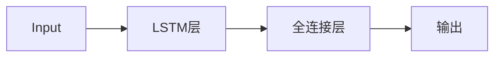

                 


# AI智能体在识别价值投资陷阱中的应用

> 关键词：AI智能体、价值投资陷阱、机器学习、金融数据分析、投资风险管理

> 摘要：本文深入探讨了AI智能体在识别价值投资陷阱中的应用，从数据分析、算法原理到系统架构，全面解析如何利用AI技术帮助投资者规避风险，实现稳健投资。

---

## 第一部分：价值投资陷阱的背景与挑战

### 第1章：价值投资陷阱的定义与特征

#### 1.1 价值投资陷阱的背景

##### 1.1.1 投资市场的基本概念
投资市场是一个充满不确定性和复杂性的领域，投资者在追求收益的同时，也面临着诸多风险。价值投资作为一种经典的策略，强调以低于内在价值的价格买入优质资产，但在实际操作中，识别真正的价值与市场泡沫往往困难重重。

##### 1.1.2 价值投资的核心理念
价值投资的核心在于寻找被市场低估的资产，通过长期持有实现收益。然而，市场的波动性和信息不对称使得识别真正具有投资价值的资产变得复杂，尤其是在市场过热或投机氛围浓厚时，许多看似具有吸引力的投资实际上隐藏着陷阱。

##### 1.1.3 价值投资陷阱的定义与分类
价值投资陷阱是指那些表面上看似具有投资价值，实则存在隐藏风险或不合理的投资机会。常见的陷阱包括基本面造假、行业周期性陷阱、市场操纵等。这些陷阱往往导致投资者蒙受损失，因此，识别和规避这些陷阱是投资成功的关键。

#### 1.2 价值投资陷阱的特征

##### 1.2.1 数据特征
- 数据的不完整性：许多陷阱涉及隐藏的信息，难以从公开数据中完全识别。
- 数据的波动性：陷阱往往出现在市场波动剧烈的时期，数据呈现出异常波动。
- 数据的关联性：陷阱通常与市场整体趋势或行业周期密切相关。

##### 1.2.2 行为特征
- 投资者行为的非理性：许多陷阱是由于投资者的贪婪或恐慌情绪导致的。
- 交易量的异常：在陷阱形成过程中，往往伴随着成交量的突然放大或萎缩。
- 市场参与度的集中：某些资产或行业的交易集中度异常，可能是陷阱的信号。

##### 1.2.3 时间特征
- 时间周期性：陷阱往往在特定的时间段内出现，例如市场周期的顶部或底部。
- 时间滞后性：陷阱的识别通常需要时间来验证，投资者需要具备耐心和纪律性。
- 时间敏感性：一旦陷阱被识别，投资者需要迅速采取行动以规避风险。

### 第2章：AI智能体的基本概念与技术基础

#### 2.1 AI智能体的定义与分类

##### 2.1.1 AI智能体的定义
AI智能体是一种能够感知环境、做出决策并采取行动的智能系统。在金融领域，AI智能体可以用于数据处理、模式识别、风险评估等任务，帮助投资者做出更明智的决策。

##### 2.1.2 基于规则的智能体
基于规则的智能体通过预定义的规则和逻辑来进行决策。这些规则通常基于专家经验或统计分析，适用于规则明确、场景简单的任务，例如简单的数据筛选或初步的市场分析。

##### 2.1.3 基于学习的智能体
基于学习的智能体通过机器学习算法从数据中学习，自动调整和优化决策策略。这种方法适用于复杂多变的市场环境，能够捕捉到数据中的非线性关系和隐含模式。

#### 2.2 机器学习与深度学习简介

##### 2.2.1 机器学习的基本概念
机器学习是一种通过数据训练模型的技术，使模型能够从数据中学习规律并进行预测或分类。在金融领域，机器学习被广泛应用于价格预测、风险评估等任务。

##### 2.2.2 深度学习的基本概念
深度学习是一种基于人工神经网络的机器学习技术，能够自动提取数据中的高层次特征。深度学习在处理非结构化数据（如文本和图像）方面表现尤为突出，因此在金融领域的自然语言处理和图像分析中具有重要应用。

##### 2.2.3 自然语言处理与图像识别
自然语言处理（NLP）用于分析文本数据，例如新闻、公司财报等，帮助识别潜在的市场信号。图像识别技术则用于分析图像数据，例如K线图中的价格走势。

### 第3章：AI智能体在金融领域的应用

#### 3.1 金融数据分析的挑战

##### 3.1.1 数据的复杂性
金融数据通常具有高维性、非线性和噪声多的特点，这使得传统的统计方法难以有效处理。

##### 3.1.2 数据的不完全性
许多重要的市场信息可能并未完全公开或难以获取，这给数据驱动的分析带来了困难。

##### 3.1.3 数据的动态性
市场环境不断变化，模型需要具备适应性和实时更新能力。

#### 3.2 AI智能体在金融中的应用案例

##### 3.2.1 股票价格预测
通过分析历史价格数据和市场情绪，AI智能体可以预测股票的未来走势，帮助投资者做出买卖决策。

##### 3.2.2 风险评估
利用机器学习模型，AI智能体可以评估投资组合的风险，帮助投资者规避潜在的市场波动。

##### 3.2.3 市场情绪分析
通过分析新闻、社交媒体等文本数据，AI智能体可以实时监控市场情绪，识别潜在的市场拐点。

---

## 第二部分：AI智能体识别价值投资陷阱的核心概念

### 第4章：数据预处理与特征提取

#### 4.1 数据清洗与预处理

##### 4.1.1 数据清洗的基本步骤
- 去除缺失值：处理数据中的缺失值，确保数据完整性。
- 处理异常值：识别并处理数据中的异常值，避免干扰模型训练。
- 标准化与归一化：对数据进行标准化或归一化处理，确保不同特征的可比性。

##### 4.1.2 数据增强技术
通过增加数据的多样性来提高模型的泛化能力，例如通过数据变换、数据合成等方法生成更多样化的数据。

#### 4.2 特征提取与选择

##### 4.2.1 基于统计的方法
通过统计分析（如相关性分析、主成分分析）来提取特征，减少数据维度。

##### 4.2.2 基于机器学习的方法
利用特征重要性评估（如随机森林、梯度提升树）来选择关键特征。

##### 4.2.3 基于深度学习的方法
通过自注意力机制（如Transformer模型）自动提取特征，捕捉数据中的复杂模式。

### 第5章：AI智能体的算法原理与实现

#### 5.1 时间序列分析

##### 5.1.1 时间序列的基本概念
时间序列是一种按时间顺序排列的数据，常用于分析股票价格、经济指标等金融数据。

##### 5.1.2 常见的时间序列模型
- ARIMA模型：一种经典的统计模型，适用于线性时间序列数据。
- LSTM模型：一种基于循环神经网络的深度学习模型，能够捕捉时间序列中的长期依赖关系。

##### 5.1.3 基于深度学习的时间序列预测模型
通过LSTM网络进行股票价格预测，模型结构如下：



##### 5.1.4 算法实现
股票价格预测的Python代码示例：

```python
import numpy as np
from tensorflow.keras.models import Sequential
from tensorflow.keras.layers import LSTM, Dense

# 数据准备
data = np.random.randn(1000, 1)
model = Sequential()
model.add(LSTM(50, input_shape=(None, 1)))
model.add(Dense(1))
model.compile(loss='mean_squared_error', optimizer='adam')
model.fit(data, data, epochs=50, batch_size=32)
```

#### 5.2 异常检测算法

##### 5.2.1 基于统计的异常检测
使用均值-标准差法检测数据中的异常值：

$$ z = \frac{x - \mu}{\sigma} $$

##### 5.2.2 基于机器学习的异常检测
使用Isolation Forest算法进行无监督异常检测：

```python
from sklearn.ensemble import IsolationForest

clf = IsolationForest(random_state=42)
clf.fit(X)
```

##### 5.2.3 基于深度学习的异常检测
使用变种自动编码器（AE）进行异常检测，模型结构如下：


---

## 第三部分：系统架构与项目实战

### 第6章：系统架构设计

#### 6.1 系统功能模块划分

##### 6.1.1 数据采集模块
负责从多种数据源（如API、数据库）获取金融数据。

##### 6.1.2 数据处理模块
进行数据清洗、特征提取和数据增强。

##### 6.1.3 模型训练模块
训练AI智能体模型，进行价值投资陷阱的识别。

##### 6.1.4 用户交互模块
提供用户友好的界面，展示分析结果并提供投资建议。

#### 6.2 系统架构设计

##### 6.2.1 系统功能设计
系统功能模块划分清晰，每个模块负责不同的任务，确保系统的高效运行。

##### 6.2.2 系统架构设计
采用微服务架构，各模块独立运行，通过API进行通信。系统架构图如下：


---

### 第7章：项目实战

#### 7.1 环境安装

##### 7.1.1 安装Python
安装Python 3.8或更高版本。

##### 7.1.2 安装依赖库
安装必要的库，如TensorFlow、Pandas、Scikit-learn等。

#### 7.2 核心实现

##### 7.2.1 数据预处理
编写代码进行数据清洗和特征提取：

```python
import pandas as pd

data = pd.read_csv('stock_data.csv')
data = data.dropna()
data = (data - data.mean()) / data.std()
```

##### 7.2.2 模型训练
训练价值投资陷阱识别模型：

```python
model = Sequential()
model.add(LSTM(50, input_shape=(None, 1)))
model.add(Dense(1, activation='sigmoid'))
model.compile(loss='binary_crossentropy', optimizer='adam', metrics=['accuracy'])
model.fit(X_train, y_train, epochs=50, batch_size=32)
```

#### 7.3 案例分析

##### 7.3.1 某公司财务造假识别
通过模型分析公司财务数据，识别潜在的财务造假行为。

##### 7.3.2 某行业周期性陷阱识别
通过分析行业数据，识别行业周期性变化带来的投资风险。

##### 7.3.3 某市场操纵行为识别
通过异常交易数据分析，识别潜在的市场操纵行为。

---

## 第四部分：总结与展望

### 第8章：总结与展望

#### 8.1 最佳实践
- 数据质量至关重要，确保数据的完整性和准确性。
- 模型的可解释性需要关注，避免“黑箱”模型带来的风险。
- 持续监控和更新模型，适应市场环境的变化。

#### 8.2 未来发展方向
- 提高模型的实时性和响应速度，满足高频交易的需求。
- 结合多模态数据（如文本、图像）进行综合分析，提高识别的准确性。
- 研究更先进的算法，如强化学习，提高决策的智能化水平。

---

## 作者

作者：AI天才研究院 & 禅与计算机程序设计艺术

---

**注：以上内容仅为示例，实际撰写时需根据具体需求调整内容和细节。**

