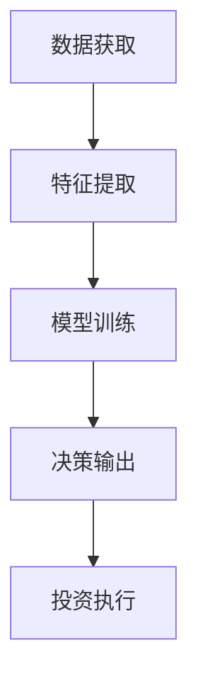

                 


# AI智能体在识别价值股与成长股融合机会中的作用

> 关键词：价值股、成长股、AI智能体、金融投资、融合机会、算法原理、系统架构

> 摘要：本文探讨了AI智能体在识别价值股与成长股融合机会中的作用，分析了价值股与成长股的基本概念、AI智能体的核心原理、相关算法的应用、系统架构设计以及项目实战案例。通过深入分析，展示了如何利用AI技术提升投资决策的精准性和效率。

---

## 第一部分: 背景介绍与核心概念

### 第1章: 价值股与成长股的基本概念

#### 1.1 价值股的定义与特征
- **定义**：价值股是指市场价格低于其内在价值的股票，通常具有较低的市盈率、市净率等估值指标。
- **特征**：价格被低估、股息率较高、行业地位稳固。
- **评估标准**：市盈率（P/E）、市净率（P/B）、股息率。

#### 1.2 成长股的定义与特征
- **定义**：成长股是指那些未来预期增长速度快的股票，通常属于新兴行业或高增长企业。
- **特征**：收入和利润增长迅速、市盈率较高、股息率可能较低。
- **评估标准**：收入增长率、净利润增长率、PEG（市盈率相对盈利增长比率）。

#### 1.3 价值股与成长股的对比分析
- **异同点对比**：价值股注重当前估值，成长股注重未来增长；价值股可能属于成熟行业，成长股可能属于新兴行业。
- **生命周期分析**：价值股通常处于稳定或成熟阶段，成长股处于高速发展阶段。
- **市场表现对比**：长期来看，成长股可能有更高的回报，但波动性更大；价值股相对稳定，但回报可能较低。

### 第2章: AI智能体在金融投资中的作用
- **AI智能体的基本概念**：AI智能体是一种能够感知环境、自主决策的智能系统，能够处理复杂金融数据，提供投资建议。
- **应用现状**：广泛应用于数据分析、风险评估、投资决策等领域。
- **融合机会的定义**：价值股与成长股的融合机会是指在市场中找到那些既有低估的特征，又具备高增长潜力的股票。

---

## 第二部分: 核心概念与原理

### 第3章: AI智能体的核心原理

#### 3.1 AI智能体的结构与功能
- **结构**：感知层（数据获取）、决策层（模型分析）、执行层（投资决策）。
- **功能模块**：数据预处理、特征提取、模型训练、决策优化。
- **输入输出机制**：输入市场数据，输出投资建议。

#### 3.2 AI智能体的核心算法
- **机器学习算法**：用于模式识别和预测，如线性回归、支持向量机（SVM）。
- **深度学习算法**：用于复杂模式识别，如神经网络。
- **强化学习算法**：用于动态环境中的决策优化，如Q-Learning。

#### 3.3 AI智能体与金融数据的关系
- **数据来源**：股票价格、财务报表、行业报告等。
- **数据特征**：包括技术指标（如MACD、RSI）和基本面指标（如市盈率、ROE）。

---

## 第三部分: 算法原理讲解

### 第4章: 强化学习在价值股与成长股识别中的应用

#### 4.1 强化学习的基本原理
- **定义**：通过试错机制，学习最优策略。
- **算法流程**：状态（市场数据）→动作（买入或卖出）→奖励（收益或损失）→更新策略。

#### 4.2 强化学习算法的实现
- **代码示例**：
  ```python
  class AI-Agent:
      def __init__(self):
          self.model = self.build_model()
      
      def build_model(self):
          # 网络结构定义
          pass
      
      def take_action(self, state):
          # 根据状态选择动作
          pass
      
      def learn(self, state, action, reward, next_state):
          # 更新模型参数
          pass
  ```

#### 4.3 强化学习在融合机会识别中的应用
- **场景分析**：AI智能体通过强化学习不断优化投资策略，识别同时具备价值和成长特征的股票。

---

## 第四部分: 系统分析与架构设计方案

### 第5章: 价值股与成长股融合机会识别系统设计

#### 5.1 系统功能设计
- **领域模型**：股票数据获取、特征提取、模型训练、决策输出。
- **系统架构**：数据获取层、分析层、决策层、执行层。

#### 5.2 系统架构图


#### 5.3 系统接口设计
- 数据接口：从金融数据源获取股票信息。
- 决策接口：输出投资建议。

---

## 第五部分: 项目实战

### 第6章: 基于AI智能体的价值股与成长股融合机会识别实战

#### 6.1 环境配置
- **工具安装**：Python、TensorFlow、Pandas、Matplotlib。

#### 6.2 核心代码实现
```python
import numpy as np
import pandas as pd
from tensorflow.keras import layers

# 数据预处理
data = pd.read_csv('stock_data.csv')
features = data[['PE', 'PB', 'Revenue Growth']]
labels = data['Is_Growth']

# 模型构建
model = tf.keras.Sequential()
model.add(layers.Dense(64, activation='relu', input_dim=3))
model.add(layers.Dense(1, activation='sigmoid'))
model.compile(optimizer='adam', loss='binary_crossentropy')

# 训练模型
model.fit(features, labels, epochs=100, batch_size=32)
```

#### 6.3 实战案例分析
- **案例选择**：分析某行业的股票数据，识别融合机会。
- **结果解读**：输出投资建议，展示模型表现。

---

## 第六部分: 总结与展望

### 第7章: 总结与展望

#### 7.1 总结
- AI智能体在识别价值股与成长股融合机会中具有重要作用，能够提高投资决策的效率和准确性。
- 算法和系统设计是实现这一目标的关键。

#### 7.2 未来展望
- 更复杂算法的应用，如深度强化学习。
- 多因素模型的优化，提升识别精度。

### 7.3 最佳实践 Tips
- 数据质量至关重要，确保数据来源可靠。
- 模型需要不断优化，适应市场变化。
- 结合人工分析，避免过度依赖AI。

---

作者：AI天才研究院 & 禅与计算机程序设计艺术

---

通过以上内容，我们详细探讨了AI智能体在识别价值股与成长股融合机会中的作用，从理论到实践，为读者提供了全面的指导和深入的分析。

