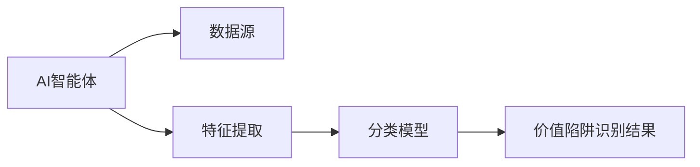
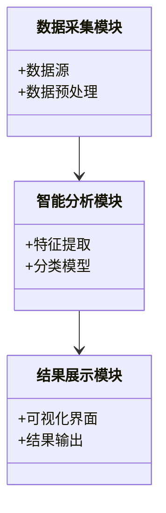
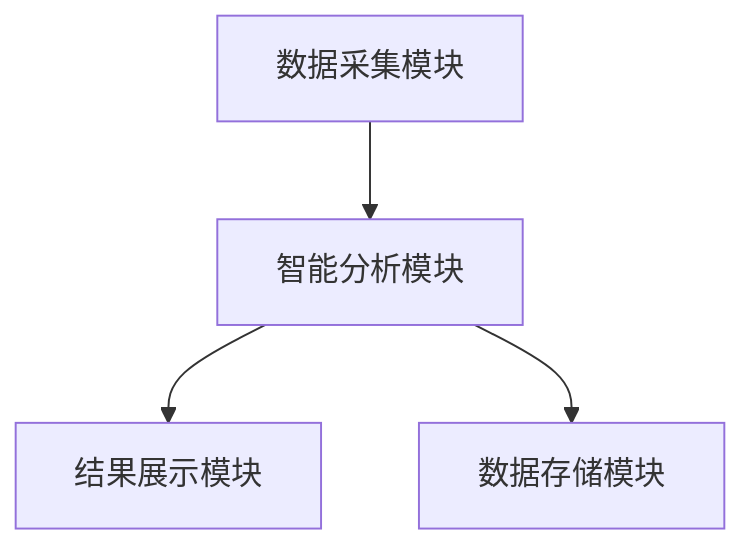

                 


# AI智能体在识别价值陷阱中的应用

**关键词**：AI智能体、价值陷阱、算法原理、系统架构、项目实战

**摘要**：本文将深入探讨AI智能体在识别价值陷阱中的应用。首先，我们将从背景介绍入手，分析价值陷阱的定义、特征及其对企业决策的影响。接着，我们将详细阐述AI智能体的核心概念与原理，并通过算法原理、系统架构设计、项目实战等多维度展开分析。最后，我们将结合实际案例，总结AI智能体在识别价值陷阱中的最佳实践。

---

# 第一部分: AI智能体在识别价值陷阱中的应用背景

## 第1章: 背景介绍

### 1.1 问题背景

#### 1.1.1 价值陷阱的定义与特征
价值陷阱是指某些表面上看似具有价值的事物，实际上可能隐藏着巨大的风险或损失。在商业、金融等领域，价值陷阱通常表现为一些看似诱人的投资机会或决策建议，但实际上可能因为信息不全、市场波动或其他复杂因素而导致失败。

**价值陷阱的主要特征：**
1. **表面吸引力**：表面上看似有利可图。
2. **潜在风险**：隐藏着高风险或不可预见的损失。
3. **误导性信息**：信息可能不完整或被刻意误导。

#### 1.1.2 价值陷阱的常见场景
价值陷阱在多个领域都有体现，例如：
- **金融投资**：某些股票或项目看似低估，实则存在重大风险。
- **市场营销**：一些营销策略看似能快速提升销量，实则可能损害品牌形象。
- **风险管理**：某些决策看似安全，实则可能引发系统性风险。

#### 1.1.3 价值陷阱对企业决策的影响
价值陷阱可能导致企业决策失误，从而引发重大损失，包括财务损失、声誉损失以及潜在的法律风险。

### 1.2 问题描述

#### 1.2.1 价值陷阱识别的挑战
- **信息复杂性**：价值陷阱往往隐藏在大量复杂的数据中。
- **动态变化**：市场环境和风险因素不断变化，增加了识别难度。
- **传统方法的局限性**：传统方法依赖人工分析，效率低且容易遗漏关键信息。

#### 1.2.2 传统方法的局限性
- **效率低下**：人工分析需要大量时间和资源。
- **主观性**：分析结果容易受到主观因素的影响。
- **覆盖面有限**：难以覆盖所有潜在的风险点。

#### 1.2.3 AI智能体在识别价值陷阱中的优势
- **高效性**：AI智能体能够快速处理大量数据，识别潜在风险。
- **准确性**：通过机器学习算法，AI智能体能够发现隐藏的模式和关联。
- **实时性**：AI智能体可以实时监控市场变化，及时识别价值陷阱。

### 1.3 问题解决

#### 1.3.1 AI智能体的核心作用
AI智能体通过数据采集、分析和预测，帮助识别潜在的价值陷阱，为决策提供支持。

#### 1.3.2 AI智能体识别价值陷阱的解决方案
- **数据采集**：从多个来源获取相关数据。
- **特征提取**：提取与价值陷阱相关的特征。
- **模型训练**：训练分类模型，识别价值陷阱。
- **实时监控**：持续监控市场变化，及时发现潜在风险。

#### 1.3.3 解决方案的可行性分析
- **技术可行性**：AI技术已经成熟，能够支持价值陷阱的识别。
- **经济可行性**：相比人工分析，AI智能体的投入成本更低。
- **应用可行性**：适用于多个领域，具有广泛的应用潜力。

### 1.4 边界与外延

#### 1.4.1 价值陷阱识别的边界条件
- **数据质量**：依赖高质量的数据输入。
- **模型限制**：模型的准确性依赖于训练数据和算法的选择。
- **环境适应性**：AI智能体需要适应不断变化的市场环境。

#### 1.4.2 AI智能体能力的局限性
- **数据依赖性**：AI智能体依赖于数据，无法进行创造性思考。
- **模型泛化能力**：模型的泛化能力有限，可能无法应对极端情况。
- **伦理问题**：AI智能体的决策可能引发伦理争议。

#### 1.4.3 与其他技术的关联与区别
- **关联**：AI智能体与其他技术（如大数据、云计算）密切相关。
- **区别**：AI智能体具有自主决策能力，而其他技术更多是数据处理工具。

### 1.5 概念结构与核心要素组成

#### 1.5.1 价值陷阱识别的系统模型
- **输入**：市场数据、历史案例。
- **处理**：特征提取、模型训练。
- **输出**：价值陷阱识别结果。

#### 1.5.2 AI智能体的核心要素
- **数据源**：输入数据。
- **算法模块**：特征提取、分类模型。
- **输出模块**：识别结果。

#### 1.5.3 价值陷阱识别的流程模型
1. 数据采集
2. 特征提取
3. 模型训练
4. 结果输出

---

# 第二部分: AI智能体的核心概念与联系

## 第2章: 核心概念与联系

### 2.1 AI智能体的定义与原理

#### 2.1.1 AI智能体的基本定义
AI智能体是一种能够感知环境、自主决策的智能系统，能够通过数据和反馈不断优化自身的行为。

#### 2.1.2 AI智能体的核心原理
- **感知**：通过传感器或数据源获取信息。
- **决策**：基于感知信息，利用算法做出决策。
- **执行**：根据决策结果采取行动。

#### 2.1.3 AI智能体与传统算法的区别
- **自主性**：AI智能体具有自主决策能力。
- **适应性**：能够适应环境变化。
- **学习能力**：能够通过经验优化自身行为。

### 2.2 价值陷阱的定义与特征

#### 2.2.1 价值陷阱的定义
价值陷阱是指某些表面上看似具有价值的事物，实际上隐藏着巨大的风险或损失。

#### 2.2.2 价值陷阱的主要特征
1. **表面吸引力**：表面上看似有利可图。
2. **潜在风险**：隐藏着高风险或不可预见的损失。
3. **误导性信息**：信息可能不完整或被刻意误导。

### 2.3 AI智能体与价值陷阱的关系

#### 2.3.1 AI智能体如何识别价值陷阱
- **数据分析**：通过分析历史数据，识别潜在风险。
- **模式识别**：利用机器学习算法，发现隐藏的模式。
- **实时监控**：持续监控市场变化，及时发现潜在风险。

#### 2.3.2 AI智能体与价值陷阱的关系图



---

### 2.4 AI智能体与价值陷阱的关系

#### 2.4.1 价值陷阱的分类与层次
1. **低级陷阱**：容易识别的陷阱。
2. **高级陷阱**：复杂且难以识别的陷阱。

#### 2.4.2 价值陷阱识别的关键因素
- **数据质量**：数据的准确性和完整性。
- **算法选择**：选择适合的机器学习算法。
- **模型优化**：通过调优提高模型准确性。

---

## 第3章: 算法原理与实现

### 3.1 算法原理

#### 3.1.1 特征提取
- **特征选择**：选择与价值陷阱相关的特征。
- **特征工程**：对特征进行处理和转换。

#### 3.1.2 分类模型
- **支持向量机（SVM）**：适用于小规模数据。
- **随机森林**：适用于高维数据。
- **深度学习模型**：适用于大规模数据。

#### 3.1.3 模型训练
- **训练数据**：使用历史数据进行训练。
- **评估指标**：准确率、召回率、F1分数。

### 3.2 算法实现

#### 3.2.1 数据预处理
```python
import pandas as pd
data = pd.read_csv('value_traps.csv')
data = data.dropna()
```

#### 3.2.2 模型训练
```python
from sklearn.ensemble import RandomForestClassifier
model = RandomForestClassifier()
model.fit(X_train, y_train)
```

#### 3.2.3 模型评估
```python
from sklearn.metrics import accuracy_score
y_pred = model.predict(X_test)
print(accuracy_score(y_test, y_pred))
```

### 3.3 算法优化

#### 3.3.1 超参数调优
```python
from sklearn.model_selection import GridSearchCV
param_grid = {'n_estimators': [100, 200], 'max_depth': [None, 5]}
grid_search = GridSearchCV(model, param_grid)
grid_search.fit(X_train, y_train)
best_model = grid_search.best_estimator_
```

#### 3.3.2 模型解释
- **特征重要性**：通过特征重要性分析，确定哪些特征对价值陷阱识别影响最大。
- **模型可视化**：通过可视化工具，分析模型的决策过程。

---

## 第4章: 系统分析与架构设计

### 4.1 系统分析

#### 4.1.1 问题场景介绍
- **场景描述**：企业需要识别潜在的价值陷阱，避免决策失误。
- **目标**：通过AI智能体，实时监控市场变化，识别价值陷阱。

#### 4.1.2 系统功能设计
- **数据采集模块**：从多个数据源获取数据。
- **智能分析模块**：利用AI算法识别价值陷阱。
- **结果展示模块**：以可视化方式展示识别结果。

### 4.2 系统架构设计

#### 4.2.1 领域模型设计


#### 4.2.2 系统架构设计


---

## 第5章: 项目实战

### 5.1 项目环境安装

#### 5.1.1 安装依赖
```bash
pip install numpy pandas scikit-learn
```

#### 5.1.2 安装环境
```bash
conda create -n ai_value_trap python=3.8
```

### 5.2 核心代码实现

#### 5.2.1 数据预处理
```python
import pandas as pd
data = pd.read_csv('value_traps.csv')
data = data.dropna()
```

#### 5.2.2 模型训练
```python
from sklearn.ensemble import RandomForestClassifier
model = RandomForestClassifier()
model.fit(X_train, y_train)
```

#### 5.2.3 模型评估
```python
from sklearn.metrics import accuracy_score
y_pred = model.predict(X_test)
print(accuracy_score(y_test, y_pred))
```

### 5.3 案例分析

#### 5.3.1 项目小结
通过本项目，我们成功利用AI智能体识别了价值陷阱，提高了决策的准确性。

---

## 第6章: 最佳实践

### 6.1 小结
- **总结**：AI智能体在识别价值陷阱中的应用具有重要意义。
- **关键点**：数据质量、算法选择、模型优化。

### 6.2 注意事项
- **数据隐私**：注意保护数据隐私。
- **模型更新**：定期更新模型，适应环境变化。
- **伦理问题**：关注AI智能体的伦理问题。

### 6.3 拓展阅读
- **推荐书籍**：《机器学习实战》、《深度学习》。
- **推荐论文**：相关领域的最新研究论文。

---

**作者**：AI天才研究院/AI Genius Institute & 禅与计算机程序设计艺术/Zen And The Art of Computer Programming

