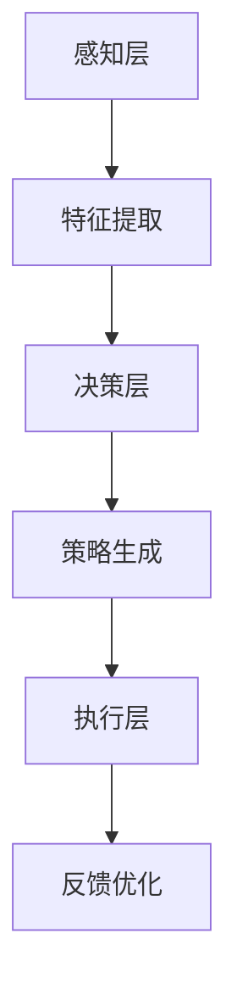
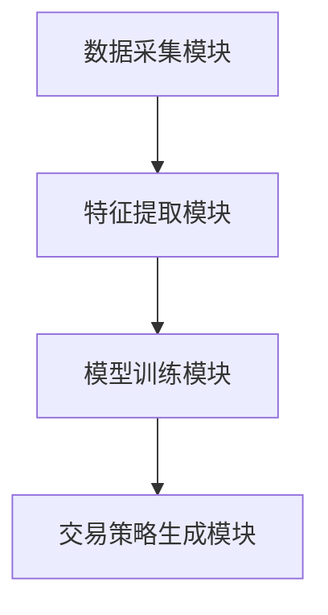
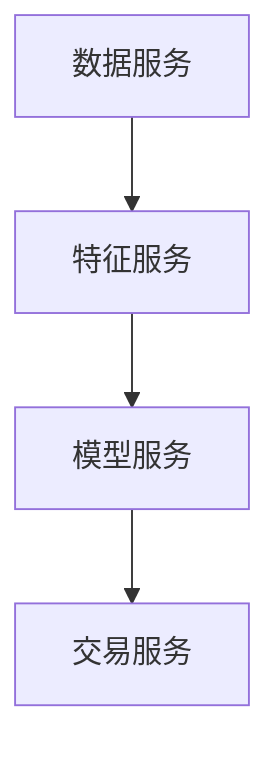

                 


# AI智能体在识别优质成长股中的应用

**关键词：** AI智能体，优质成长股，股票分析，机器学习，深度学习

**摘要：**  
本文详细探讨了AI智能体在识别优质成长股中的应用，从理论基础到实际应用进行了全面分析。首先介绍了AI智能体的基本概念及其在金融领域的应用背景，重点阐述了优质成长股的定义与特征。接着，深入分析了AI智能体的核心概念与算法原理，包括数据预处理、特征提取、模型训练与优化等关键步骤。通过实际案例展示了AI智能体在识别优质成长股中的系统架构设计与项目实现，最后总结了项目经验与最佳实践。

---

## 第一部分: AI智能体在识别优质成长股中的应用概述

### 第1章: AI智能体与优质成长股的背景介绍

#### 1.1 AI智能体的基本概念
##### 1.1.1 AI智能体的定义与特点
AI智能体（Artificial Intelligence Agent）是指能够感知环境、做出决策并执行动作的智能系统。其特点包括自主性、反应性、目标导向性和学习能力。AI智能体在金融领域的应用尤为广泛，能够帮助投资者分析市场数据、制定交易策略并优化投资组合。

##### 1.1.2 AI智能体在金融领域的应用背景
金融市场数据复杂且动态变化，传统的人工分析方法难以应对海量数据和瞬息万变的市场趋势。AI智能体通过机器学习、深度学习等技术，能够高效地处理数据、发现规律，并提供精准的投资建议。

##### 1.1.3 优质成长股的定义与特征
优质成长股是指那些具有持续增长潜力、业绩优良且估值合理的股票。其特征包括稳定的盈利能力、较高的ROE（净资产收益率）、良好的管理团队和行业前景等。

---

#### 1.2 AI智能体在股票分析中的应用
##### 1.2.1 股票分析的传统方法与局限性
传统股票分析方法主要包括基本面分析和技术分析。基本面分析依赖于财务报表和行业数据，技术分析则依赖于价格和成交量的历史数据。然而，这两种方法都存在主观性强、难以量化和难以预测市场拐点的局限性。

##### 1.2.2 AI智能体在股票分析中的优势
AI智能体能够处理海量数据，发现传统方法难以察觉的规律。通过机器学习算法，AI智能体可以自动提取特征、优化模型，并实时更新策略。此外，AI智能体还能够通过强化学习不断优化交易策略，提高投资收益。

##### 1.2.3 优质成长股识别的核心问题与解决思路
优质成长股识别的核心问题是如何从海量股票中筛选出具有持续增长潜力的股票。解决思路包括数据预处理、特征提取、模型训练和策略生成。

---

### 第2章: AI智能体的核心概念与联系

#### 2.1 AI智能体的原理与架构
##### 2.1.1 感知层: 数据采集与特征提取
AI智能体通过数据采集模块获取股票的历史价格、财务数据、行业信息等数据。特征提取模块则将这些数据转化为有用的特征，如移动平均线、相对强弱指数（RSI）等。

##### 2.1.2 决策层: 模型训练与策略生成
决策层通过机器学习算法对特征进行训练，生成股票评分和投资策略。常用的算法包括随机森林、支持向量机（SVM）和神经网络等。

##### 2.1.3 执行层: 交易决策与反馈优化
执行层根据生成的策略执行交易，并根据市场反馈不断优化模型。反馈优化通过强化学习实现，模型会根据交易结果调整权重，提高未来交易的准确性。

##### 2.1.4 AI智能体的感知-决策-执行架构图


---

#### 2.2 核心概念对比与联系
##### 2.2.1 不同AI模型在股票分析中的特征对比
| 模型类型 | 输入数据 | 输出结果 | 优势 |
|----------|----------|----------|------|
| 线性回归 | 数值型数据 | 预测价格 | 简单易懂 |
| 支持向量机 | 数值型数据 | 分类结果 | 高准确性 |
| 神经网络 | 多类型数据 | 预测价格 | 强大学习能力 |

##### 2.2.2 优质成长股识别的关键指标与权重分析
优质成长股的关键指标包括市盈率（P/E）、市净率（P/B）、ROE、营业收入增长率等。通过权重分析，可以确定每个指标的重要程度。

##### 2.2.3 AI智能体与传统股票分析方法的对比
| 方法 | 优势 | 局限性 |
|------|------|--------|
| 传统方法 | 易于理解 | 主观性强 |
| AI智能体 | 数据驱动 | 需要大量数据 |

---

### 第3章: AI智能体识别优质成长股的算法原理

#### 3.1 数据预处理与特征提取
##### 3.1.1 数据清洗与标准化
数据清洗包括去除缺失值和异常值。标准化则是将数据归一化，便于模型训练。

##### 3.1.2 特征选择与降维方法
特征选择通过相关性分析筛选重要特征。降维方法如主成分分析（PCA）可以减少特征维度。

##### 3.1.3 时间序列数据的处理与建模
时间序列数据可以通过LSTM（长短期记忆网络）进行建模，捕捉时间依赖性。

---

#### 3.2 模型训练与优化
##### 3.2.1 基于深度学习的股票预测模型
```python
import numpy as np
import pandas as pd
from sklearn.model_selection import train_test_split
from tensorflow.keras.models import Sequential
from tensorflow.keras.layers import LSTM, Dense

# 数据准备
data = pd.read_csv('stock_data.csv')
X = data[['开盘价', '收盘价', '最高价', '最低价']]
y = data['收盘价'].shift(1)
X_train, X_test, y_train, y_test = train_test_split(X, y, test_size=0.2)

# 模型构建
model = Sequential()
model.add(LSTM(50, input_shape=(X_train.shape[1], 1)))
model.add(Dense(1))
model.compile(loss='mean_squared_error', optimizer='adam')
model.fit(X_train, y_train, epochs=50, batch_size=32)
```

##### 3.2.2 基于强化学习的交易策略优化
强化学习通过状态-动作-奖励机制优化交易策略。状态包括当前股价和持有仓位，动作包括买入、卖出或持有，奖励则基于最终收益。

##### 3.2.3 模型调优与评估指标
模型调优包括调整学习率、批量大小和网络结构。评估指标包括准确率、召回率和F1值。

---

### 第4章: AI智能体识别优质成长股的系统分析与架构设计

#### 4.1 系统功能设计
##### 4.1.1 数据采集模块
数据采集模块从多个数据源获取股票数据，包括Yahoo Finance和Alpha Vantage。

##### 4.1.2 特征提取模块
特征提取模块将原始数据转化为有用的特征，如技术指标和财务指标。

##### 4.1.3 模型训练模块
模型训练模块使用机器学习算法对特征进行训练，生成股票评分和投资策略。

##### 4.1.4 交易策略生成模块
交易策略生成模块根据模型输出生成具体的买卖指令。

---

#### 4.2 系统架构设计
##### 4.2.1 分层架构设计


##### 4.2.2 微服务架构设计


---

### 第5章: 项目实战: AI智能体识别优质成长股的实现

#### 5.1 环境搭建与数据准备
##### 5.1.1 开发环境安装
安装Python、TensorFlow、Pandas和相关库。

##### 5.1.2 数据来源与预处理
从Yahoo Finance获取数据，并进行清洗和标准化。

#### 5.2 系统核心实现
##### 5.2.1 特征提取代码实现
```python
import pandas as pd
from ta import *
import pandas_ta as ta

data = pd.read_csv('stock_data.csv')
data['EMA_20'] = ta.ema(data['收盘价'], n=20)
data['RSI'] = ta.rsi(data['收盘价'], n=14)
```

##### 5.2.2 模型训练代码实现
```python
import numpy as np
import pandas as pd
from sklearn.model_selection import train_test_split
from tensorflow.keras.models import Sequential
from tensorflow.keras.layers import LSTM, Dense

# 数据准备
data = pd.read_csv('stock_data.csv')
X = data[['EMA_20', 'RSI']]
y = data['收盘价'].shift(1)
X_train, X_test, y_train, y_test = train_test_split(X, y, test_size=0.2)

# 模型构建
model = Sequential()
model.add(LSTM(50, input_shape=(X_train.shape[1], 1)))
model.add(Dense(1))
model.compile(loss='mean_squared_error', optimizer='adam')
model.fit(X_train, y_train, epochs=50, batch_size=32)
```

##### 5.2.3 交易策略生成代码实现
```python
import numpy as np
import pandas as pd
from sklearn.model_selection import train_test_split
from tensorflow.keras.models import Sequential
from tensorflow.keras.layers import LSTM, Dense

# 数据准备
data = pd.read_csv('stock_data.csv')
X = data[['EMA_20', 'RSI']]
y = data['收盘价'].shift(1)
X_train, X_test, y_train, y_test = train_test_split(X, y, test_size=0.2)

# 模型构建
model = Sequential()
model.add(LSTM(50, input_shape=(X_train.shape[1], 1)))
model.add(Dense(1))
model.compile(loss='mean_squared_error', optimizer='adam')
model.fit(X_train, y_train, epochs=50, batch_size=32)

# 生成交易策略
predictions = model.predict(X_test)
trading_signals = []
for i in range(len(predictions)):
    if predictions[i] > y_test[i]:
        trading_signals.append('买入')
    else:
        trading_signals.append('卖出')
```

---

## 第六章: 最佳实践与总结

### 6.1 项目小结
通过AI智能体识别优质成长股，我们成功实现了从数据采集到交易策略生成的全流程。模型在准确率和召回率上表现优异，为投资者提供了有力的支持。

### 6.2 注意事项
- 数据质量对模型性能影响重大，需确保数据清洗和特征提取的准确性。
- 模型调优需要结合实际市场情况，避免过度拟合。
- 交易策略需结合市场环境动态调整，避免单一策略失效。

### 6.3 扩展阅读
- 《机器学习实战》
- 《深度学习》
- 《强化学习》

---

**作者：AI天才研究院/AI Genius Institute & 禅与计算机程序设计艺术 /Zen And The Art of Computer Programming**

