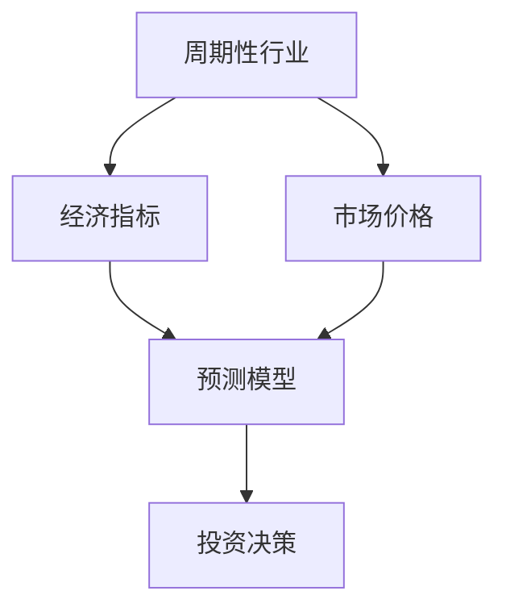
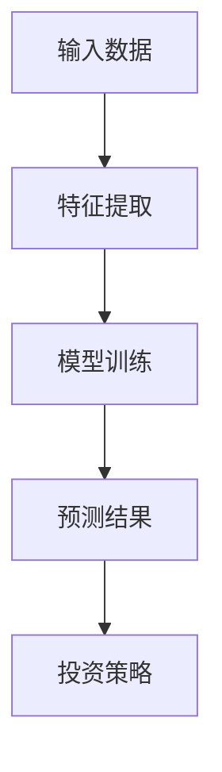
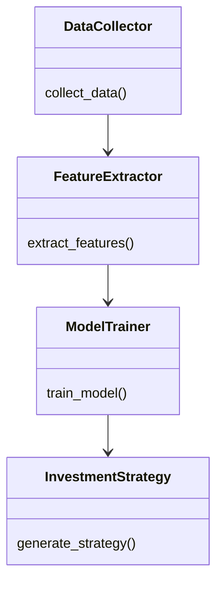
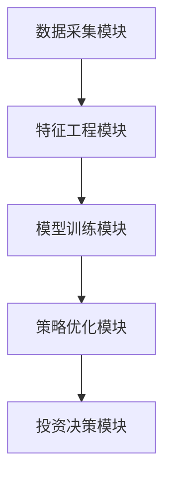

                 


# AI智能体在识别周期性行业投资机会中的应用

**关键词**：周期性行业、AI智能体、投资机会、数据分析、机器学习、深度学习

**摘要**：本文探讨了AI智能体在识别周期性行业投资机会中的应用。通过分析周期性行业的特点，结合AI技术，提出了一种基于机器学习和深度学习的解决方案，详细讲解了算法原理、系统架构设计和实际案例分析。

---

# 第一部分: 引言

## 第1章: 背景介绍

### 1.1 问题背景

#### 1.1.1 周期性行业的定义与特点
周期性行业是指其业务表现与经济周期紧密相关的行业，如能源、材料、工业制造等。这些行业的波动性较大，受宏观经济指标（如GDP增长率、利率、通货膨胀率）的影响显著。

#### 1.1.2 AI智能体的定义与核心要素
AI智能体是一种能够感知环境、执行任务并优化决策的智能系统，核心要素包括数据采集、特征提取、模型训练和策略优化。

#### 1.1.3 问题描述：周期性行业投资机会识别的挑战
周期性行业的投资机会识别具有高度不确定性，传统方法难以捕捉复杂市场变化，AI智能体的应用成为关键。

### 1.2 问题解决与边界

#### 1.2.1 AI智能体在投资机会识别中的作用
AI智能体通过实时数据处理、模式识别和预测分析，帮助投资者捕捉周期性行业的投资机会。

#### 1.2.2 问题解决的边界与外延
AI智能体的应用范围包括数据采集、特征工程、模型训练和策略优化，但不涉及实际交易执行。

#### 1.2.3 核心概念结构与要素组成
AI智能体由感知模块、决策模块和执行模块组成，结合周期性行业的数据特征进行投资机会识别。

---

# 第二部分: 核心概念与联系

## 第2章: AI智能体与周期性行业的核心概念

### 2.1 核心概念原理

#### 2.1.1 AI智能体的原理与机制
AI智能体通过数据采集、特征提取、模型训练和策略优化，实现对周期性行业的投资机会识别。

#### 2.1.2 周期性行业的核心特征
周期性行业受宏观经济影响大，波动性显著，投资机会往往出现在经济周期的特定阶段。

### 2.2 概念属性对比表

| 属性 | 非周期性行业 | 周期性行业 |
|------|-------------|------------|
| 波动性 | 低           | 高         |
| 关联性 | 低           | 高         |
| 投资机会 | 稳定         | 波动性大    |

### 2.3 ER实体关系图



---

# 第三部分: 算法原理讲解

## 第3章: AI智能体的算法原理

### 3.1 算法原理

#### 3.1.1 数据流图



### 3.2 数学模型与公式

#### 3.2.1 线性回归模型

$$ y = \beta_0 + \beta_1x + \epsilon $$

#### 3.2.2 随机森林模型

$$ y = \sum_{i=1}^{n} \text{Tree}_i(x) $$

### 3.3 代码实现

#### 3.3.1 数据预处理

```python
import pandas as pd

# 数据加载
data = pd.read_csv('periodic_data.csv')

# 数据清洗
data = data.dropna()
data = data.replace({-1: None})

# 特征工程
data['moving_avg'] = data['price'].rolling(3).mean()
```

#### 3.3.2 模型训练与预测

```python
from sklearn.ensemble import RandomForestRegressor

# 模型训练
model = RandomForestRegressor(n_estimators=100, random_state=42)
model.fit(X_train, y_train)

# 预测
y_pred = model.predict(X_test)
```

---

## 第4章: 系统分析与架构设计方案

### 4.1 问题场景介绍

周期性行业的投资机会识别涉及实时数据处理、预测模型构建和动态策略优化。

### 4.2 系统功能设计

#### 4.2.1 领域模型类图



#### 4.2.2 系统架构设计



---

## 第5章: 项目实战

### 5.1 环境搭建

安装所需库：

```bash
pip install numpy pandas scikit-learn
```

### 5.2 核心实现

#### 5.2.1 数据获取与处理

```python
import pandas as pd

# 数据加载
data = pd.read_csv('periodic_data.csv')

# 特征工程
data['moving_avg'] = data['price'].rolling(3).mean()
data['std_dev'] = data['price'].rolling(3).std()
```

#### 5.2.2 模型实现与优化

```python
from sklearn.ensemble import RandomForestRegressor
from sklearn.metrics import mean_squared_error

# 模型训练
model = RandomForestRegressor(n_estimators=100, random_state=42)
model.fit(X_train, y_train)

# 模型评估
mse = mean_squared_error(y_test, y_pred)
print(f"均方误差: {mse}")
```

---

## 第6章: 总结与展望

### 6.1 本章小结

本文详细探讨了AI智能体在周期性行业投资机会识别中的应用，提出了基于机器学习和深度学习的解决方案。

### 6.2 未来展望

未来，AI智能体将结合更复杂的数据源和模型结构，进一步提升投资机会识别的准确性和效率。

### 6.3 最佳实践 tips

- 数据清洗与特征工程是关键。
- 模型调参和评估指标的选择直接影响性能。
- 实际应用中需结合市场动态进行模型优化。

---

**作者：AI天才研究院/AI Genius Institute & 禅与计算机程序设计艺术 /Zen And The Art of Computer Programming**

