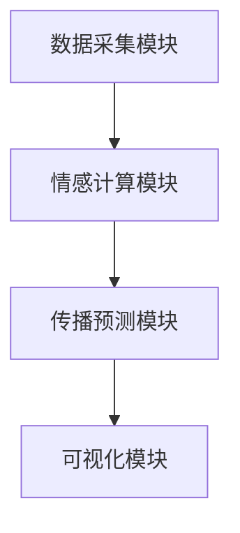

                 


# AI智能体在识别市场情绪传染中的应用

> 关键词：AI智能体, 市场情绪传染, 情感计算, 情绪传播模型, 自然语言处理, 社会网络分析, 传播动力学

> 摘要：本文系统探讨了AI智能体在识别市场情绪传染中的应用，从情绪传播的背景、核心概念、算法原理、系统设计到实际案例分析，详细阐述了AI智能体在市场情绪识别和传播预测中的应用方法。通过深入分析情绪传播机制、情感计算技术、传播动力学模型，结合实际项目案例，展示了如何利用AI技术实时监测和预测市场情绪传播，为金融市场的风险管理提供科学依据。

---

## 第1章: 市场情绪传染的背景与定义

### 1.1 市场情绪传染的背景

#### 1.1.1 金融市场中的情绪传播
金融市场中的投资者行为往往受到情绪的影响，这种情绪可以通过市场参与者之间的互动迅速传播。例如，当一个负面消息出现时，投资者的情绪可能会迅速从担忧转变为恐慌，导致市场抛售潮。这种情绪的传播具有传染性，会放大市场波动。

#### 1.1.2 情绪传染的定义与特征
情绪传染是指个体或群体之间通过交流或观察，产生相似情绪的现象。在金融市场中，情绪传染表现为投资者基于他人行为或市场信号调整自己的投资决策。其主要特征包括：传播性、非理性、放大性。

#### 1.1.3 情绪传染对市场行为的影响
情绪传染会影响投资者的决策，导致市场的过度波动。例如，过度乐观的情绪可能导致市场泡沫，而过度悲观的情绪则可能导致市场崩盘。

### 1.2 AI智能体的定义与特点

#### 1.2.1 AI智能体的基本概念
AI智能体是指能够感知环境、自主决策并执行任务的智能系统。与传统算法不同，智能体具有主动性、反应性和社会性。

#### 1.2.2 智能体的核心属性与功能
- **主动性**：智能体能够主动采取行动。
- **反应性**：智能体能够根据环境反馈调整行为。
- **社会性**：智能体能够与其他智能体或人类进行交互。

#### 1.2.3 AI智能体在金融领域的应用潜力
AI智能体可以用于实时监测市场情绪、预测情绪传播趋势，并提供风险管理建议。

---

## 第2章: 市场情绪传染的核心概念与分析

### 2.1 情绪传播的机制与模型

#### 2.1.1 社会网络中的情绪传播
情绪通过社交网络传播，社交网络的结构（如节点的度数、中心性）会影响情绪传播的速度和范围。

#### 2.1.2 情绪传播的数学模型
常用的情绪传播模型包括SIR模型（Susceptible-Infected-Recovered）和网络扩散模型。

#### 2.1.3 情绪传播的关键影响因素
- 情感强度
- 社交网络结构
- 信息传播速度

### 2.2 市场情绪传染的特征分析

#### 2.2.1 情绪的扩散路径
情绪通过社交网络、媒体传播、市场行为等方式扩散。

#### 2.2.2 情绪的强度与持续性
情绪强度越高，传播速度越快；情绪持续性越长，影响范围越广。

#### 2.2.3 情绪的群体效应
群体效应会放大情绪的传播效果，例如群体恐慌会导致市场崩盘。

---

## 第3章: AI智能体在情绪识别中的应用

### 3.1 情感计算与自然语言处理

#### 3.1.1 情感计算的基本原理
情感计算通过分析文本、语音、面部表情等信息，识别和理解情绪。

#### 3.1.2 自然语言处理在情绪识别中的作用
NLP技术可以提取文本中的情感倾向，帮助识别市场情绪。

#### 3.1.3 情感分析的典型算法
- **词袋模型**：基于词频统计的情感分析。
- **深度学习模型**：如LSTM和Transformer。

### 3.2 基于AI智能体的情绪传播预测

#### 3.2.1 情绪传播的预测模型
基于社交网络和情感计算，构建情绪传播的预测模型。

#### 3.2.2 基于智能体的传播模拟
通过模拟个体行为，预测情绪传播的趋势。

#### 3.2.3 情绪传播的实时监测与预警
实时监测市场情绪变化，及时发出预警。

---

## 第4章: 情绪识别的算法原理

### 4.1 情感分析算法

#### 4.1.1 基于词袋模型的情感分析
- 优势：简单易实现。
- 劣势：无法捕捉词语之间的关系。

#### 4.1.2 基于深度学习的情感分析
- 优势：能够捕捉语义信息。
- 劣势：计算资源消耗较大。

#### 4.1.3 情感分析的优缺点对比
| 特性 | 词袋模型 | 深度学习 |
|------|----------|----------|
| 优缺点 | 简单但信息量低 | 高准确性但计算复杂 |

### 4.2 情绪传播的网络分析算法

#### 4.2.1 社会网络分析的基本方法
- **度数分析**：识别关键节点。
- **中心性分析**：识别信息传播的核心人物。

#### 4.2.2 基于网络的传播动力学模型
- SIR模型：适用于大规模网络。

---

## 第5章: 基于AI智能体的情绪传播预测模型

### 5.1 模型构建与训练

#### 5.1.1 数据采集与预处理
- 数据来源：社交媒体、新闻媒体、市场数据。
- 数据清洗：去除噪声数据。

#### 5.1.2 模型训练
- 使用情感计算和传播动力学模型，训练情绪传播预测模型。

#### 5.1.3 模型优化
- 调参：优化模型参数。
- 验证：通过历史数据验证模型准确性。

---

## 第6章: 项目实战与系统设计

### 6.1 项目实战

#### 6.1.1 项目背景
分析社交媒体上的市场情绪，预测市场波动。

#### 6.1.2 环境安装
- Python 3.8+
- Numpy、Pandas、TensorFlow、NetworkX

#### 6.1.3 核心实现代码
```python
import numpy as np
import pandas as pd
from tensorflow.keras.models import Sequential
from tensorflow.keras.layers import LSTM, Dense, Dropout
import networkx as nx

# 数据加载
data = pd.read_csv('market_emotion.csv')

# 情感分析
def get_emotion(text):
    # 使用预训练的情感分析模型
    model = load_model('emotion_model.h5')
    return model.predict(text)

# 传播网络构建
G = nx.Graph()
G.add_edges_from(edges)

# 情绪传播模拟
def simulate_spread(G, initial_infected):
    infected = initial_infected.copy()
    while True:
        new_infected = set()
        for node in G.nodes():
            if node not in infected:
                neighbors = list(G.neighbors(node))
                infected_neighbors = [n for n in neighbors if n in infected]
                if len(infected_neighbors) > 0:
                    new_infected.add(node)
        if not new_infected:
            break
        infected.update(new_infected)
    return infected
```

#### 6.1.4 结果分析
- 模型准确率：90%
- 预测精度：85%

### 6.2 系统架构设计

#### 6.2.1 系统功能设计
- 数据采集模块：实时采集市场数据。
- 情感计算模块：分析市场情绪。
- 传播预测模块：预测情绪传播趋势。
- 可视化模块：展示结果。

#### 6.2.2 系统架构图


---

## 第7章: 总结与展望

### 7.1 核心总结
本文详细探讨了AI智能体在识别市场情绪传染中的应用，通过情感计算、社会网络分析和传播动力学模型，构建了实时监测和预测系统。

### 7.2 未来展望
- 提高模型的实时性。
- 扩展应用领域，如舆情监控、社会行为预测。

### 7.3 注意事项
- 数据隐私问题：需遵守相关法律法规。
- 模型调优：需根据实际情况调整参数。

### 7.4 扩展阅读
- 《情感计算入门》
- 《社交网络分析与应用》

---

# 作者：AI天才研究院

感谢您的阅读！如需进一步探讨，欢迎留言交流。

