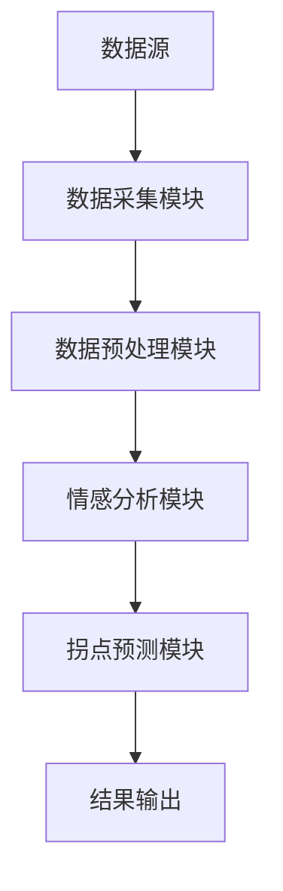

                 


# AI智能体在识别市场情绪拐点中的作用

> 关键词：AI智能体，市场情绪，拐点识别，自然语言处理，时间序列分析，机器学习

> 摘要：本文探讨AI智能体在识别市场情绪拐点中的应用，分析其原理、算法和系统架构设计，结合实际案例，展示AI技术在金融市场的优势与挑战。

---

## 第1章: 市场情绪拐点的定义与重要性

### 1.1 市场情绪拐点的定义

#### 1.1.1 市场情绪的基本概念

市场情绪描述了市场参与者对某种资产或市场的整体态度，通常反映在价格波动、成交量变化和相关媒体信息中。市场情绪可以分为乐观、中性和悲观三种状态。

#### 1.1.2 拐点的定义与特征

拐点是市场情绪从一种状态转向另一种状态的关键点。例如，市场情绪从上涨趋势转向下跌趋势，或从下跌趋势转向上涨趋势。

#### 1.1.3 拐点对投资者和市场的意义

识别拐点可以帮助投资者提前做出决策，避免重大损失或抓住投资机会。此外，拐点也是市场趋势变化的重要信号，对整体市场走势具有指导意义。

---

### 1.2 市场情绪分析的背景与现状

#### 1.2.1 传统市场分析方法的局限性

传统方法依赖于技术分析和基本面分析，存在主观性强、计算复杂、难以量化等问题。

#### 1.2.2 AI技术在金融领域的应用趋势

AI技术的快速发展为市场情绪分析提供了新的工具，尤其是在大数据处理和模式识别方面。

#### 1.2.3 当前市场情绪分析的技术挑战

数据来源多样化、噪声多、实时性要求高等问题亟待解决。

---

### 1.3 AI智能体在市场情绪分析中的作用

#### 1.3.1 AI智能体的基本概念

AI智能体是一种能够感知环境、处理信息并做出决策的智能系统，具备自适应和学习能力。

#### 1.3.2 智能体在市场情绪分析中的优势

AI智能体能够高效处理多源数据，实时分析市场情绪，并提供准确的拐点预测。

#### 1.3.3 智能体与传统算法的主要区别

AI智能体具备更强的自适应性和学习能力，能够根据市场变化动态调整分析策略。

---

## 第2章: 市场情绪数据的构成与来源

### 2.1 市场情绪数据的构成

#### 2.1.1 市场情绪的多维度特征

市场情绪数据可以从价格、成交量、新闻和社交媒体等多个维度获取。

#### 2.1.2 数据的时间序列特性

时间序列数据具有趋势、周期性、随机性等特征，需要使用专门的时间序列分析方法。

#### 2.1.3 数据的波动性与相关性

市场情绪数据波动性大，且与其他市场变量高度相关，如价格和成交量。

---

### 2.2 数据来源分析

#### 2.2.1 传统金融数据

包括股票价格、成交量、指数等，通常用于技术分析。

#### 2.2.2 社交媒体数据

社交媒体上的用户评论和帖子反映了市场参与者的实时情绪。

#### 2.2.3 新闻数据与情感分析

新闻标题和内容的情感倾向可以用于判断市场情绪。

---

## 第3章: AI智能体的基本原理

### 3.1 智能体的感知机制

#### 3.1.1 数据输入与特征提取

AI智能体通过多种数据源输入，提取关键特征，如均值、波动率、情感得分等。

#### 3.1.2 感知层的算法实现

使用特征提取算法，如主成分分析（PCA）来降低数据维度。

---

### 3.2 智能体的认知与决策机制

#### 3.2.1 认知模型的构建

认知层通过机器学习模型（如LSTM）分析数据，识别市场情绪变化。

#### 3.2.2 决策算法的选择与实现

决策层基于分析结果，预测拐点，并发出相应的信号。

---

## 第4章: 自然语言处理在市场情绪分析中的应用

### 4.1 NLP技术的基本原理

#### 4.1.1 词嵌入

使用Word2Vec或GloVe将词语转化为向量表示。

#### 4.1.2 句子表示

通过Transformer模型（如BERT）生成句子的向量表示。

#### 4.1.3 文本分类

使用情感分析模型对文本进行分类，判断整体情绪倾向。

---

### 4.2 情感分析算法实现

#### 4.2.1 基于LSTM的情感分析模型

代码示例：

```python
import keras
from keras.layers import LSTM, Dense, Dropout, Input
from keras.models import Model

input_shape = (max_len, 1)
input_layer = Input(shape=input_shape)
lstm_layer = LSTM(64)(input_layer)
dense_layer = Dense(1, activation='sigmoid')(lstm_layer)
model = Model(inputs=input_layer, outputs=dense_layer)
model.compile(optimizer='adam', loss='binary_crossentropy', metrics=['accuracy'])
```

---

## 第5章: 市场情绪拐点预测算法

### 5.1 时间序列分析

#### 5.1.1 ARIMA模型

公式：ARIMA(p, d, q)

#### 5.1.2 LSTM模型

代码示例：

```python
from keras.layers import LSTM, Dense, Dropout
from keras.models import Sequential

model = Sequential()
model.add(LSTM(50, return_sequences=True, input_shape=(timesteps, features)))
model.add(LSTM(50, return_sequences=False))
model.add(Dense(1))
model.compile(optimizer='adam', loss='mean_squared_error')
```

---

## 第6章: 系统架构设计

### 6.1 系统功能设计

#### 6.1.1 数据采集模块

从股票数据、社交媒体等多源数据获取输入。

#### 6.1.2 数据预处理模块

清洗、转换和标准化数据。

#### 6.1.3 情感分析模块

对文本数据进行情感分析，提取情绪特征。

#### 6.1.4 拐点预测模块

基于分析结果，预测市场情绪拐点。

---

### 6.2 系统架构图



---

## 第7章: 项目实战

### 7.1 环境配置

安装必要的库，如TensorFlow、Keras、Pandas等。

### 7.2 核心代码实现

```python
import pandas as pd
import numpy as np
from sklearn.preprocessing import MinMaxScaler
from keras.models import Sequential
from keras.layers import LSTM, Dense, Dropout

# 数据预处理
data = pd.read_csv('market_data.csv')
data = data['Close'].values
data = data.reshape(-1, 1)
scaler = MinMaxScaler()
scaled_data = scaler.fit_transform(data)

# 划分训练集和测试集
train_size = int(len(scaled_data) * 0.8)
train_data = scaled_data[:train_size]
test_data = scaled_data[train_size:]

# 构建LSTM模型
model = Sequential()
model.add(LSTM(50, return_sequences=True, input_shape=(None, 1)))
model.add(LSTM(50, return_sequences=False))
model.add(Dense(1))
model.compile(optimizer='adam', loss='mean_squared_error')

# 训练模型
model.fit(train_data, epochs=100, batch_size=32)

# 预测拐点
predicted = model.predict(test_data)
```

---

## 第8章: 总结与展望

### 8.1 总结

AI智能体在识别市场情绪拐点中具有显著优势，能够高效处理多源数据，提供准确的预测。

### 8.2 展望

未来研究可以进一步优化算法，结合更多数据源，提高预测精度和实时性。

---

作者：AI天才研究院 & 禅与计算机程序设计艺术

