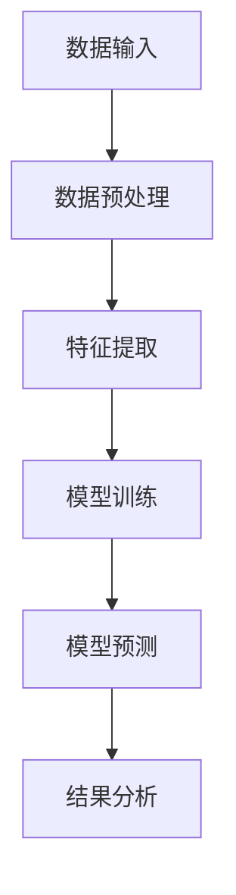
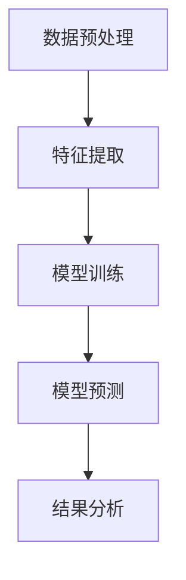
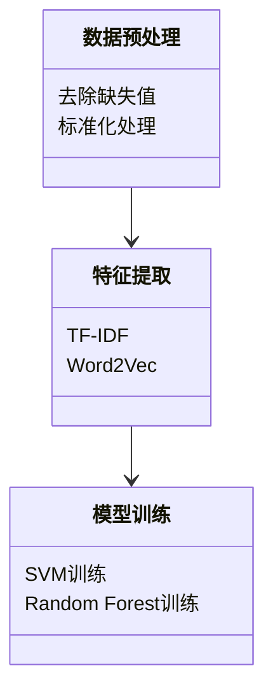
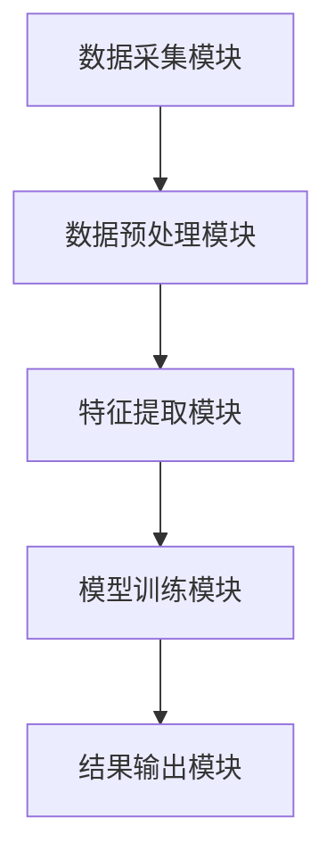
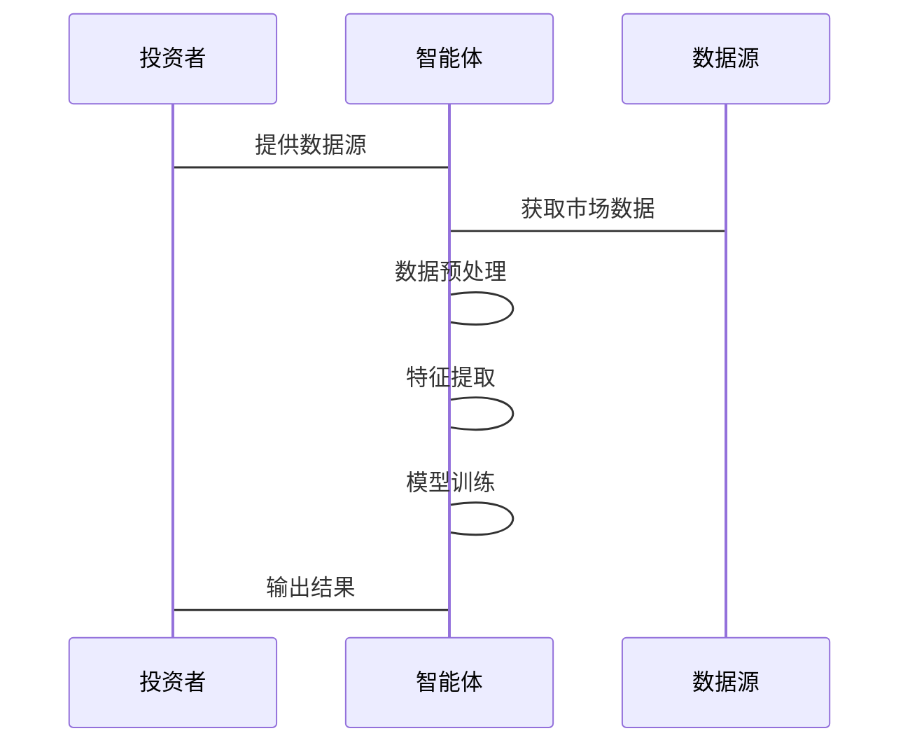

                 


# AI智能体在识别市场情绪极端值中的作用

> 关键词：市场情绪，极端值，人工智能，智能体，金融数据分析，机器学习

> 摘要：本文探讨了AI智能体在识别市场情绪极端值中的应用，分析了其在金融市场中的重要性，并详细介绍了相关的算法原理、数学模型、系统架构和项目实战。通过结合理论与实践，展示了如何利用AI技术帮助投资者做出更明智的决策。

---

## 第一章：问题背景与概念解析

### 1.1 市场情绪与极端值的定义

#### 1.1.1 市场情绪的基本概念
市场情绪指的是投资者在金融市场中的情感倾向，通常表现为乐观或悲观。这种情绪会影响股票、债券等金融资产的价格波动。市场情绪可以通过新闻、社交媒体、投资者行为等多种途径进行衡量。

#### 1.1.2 极端值的定义与特征
极端值指的是市场情绪中的异常波动，通常表现为剧烈波动或非理性行为。极端值的特征包括高波动性、非线性变化和突发性。

#### 1.1.3 市场情绪极端值的分类
市场情绪极端值可以分为两类：情绪过热（市场过度乐观）和情绪恐慌（市场过度悲观）。这两种极端值都可能导致市场崩盘或剧烈波动。

### 1.2 问题背景与研究意义

#### 1.2.1 当前金融市场面临的挑战
金融市场日益复杂，投资者行为受到多种因素影响，如经济指标、政策变化、国际局势等。如何准确捕捉市场情绪的变化，成为投资者和研究者关注的焦点。

#### 1.2.2 市场情绪极端值对投资决策的影响
极端市场情绪可能导致价格的剧烈波动，投资者在极端情绪下容易做出非理性决策，从而影响市场的稳定性。识别极端值有助于提前预警，减少潜在损失。

#### 1.2.3 AI智能体在金融领域的应用潜力
AI技术在金融领域的应用广泛，包括预测市场走势、风险评估、交易策略优化等。AI智能体能够实时分析大量数据，快速识别市场情绪变化，为投资决策提供支持。

### 1.3 AI智能体的核心概念

#### 1.3.1 AI智能体的基本定义
AI智能体是一种能够感知环境、做出决策并执行动作的智能系统。在金融市场中，智能体可以通过分析数据，识别市场情绪，提供投资建议。

#### 1.3.2 智能体在金融市场中的角色
智能体可以作为投资顾问，帮助投资者分析市场趋势，识别风险，优化投资组合。此外，智能体还可以用于高频交易，实时捕捉市场机会。

#### 1.3.3 智能体与市场情绪识别的结合
通过自然语言处理（NLP）和机器学习技术，AI智能体可以分析新闻、社交媒体等文本数据，提取市场情绪信息，进而识别极端值。

---

## 第二章：市场情绪极端值识别的核心概念与联系

### 2.1 市场情绪识别的关键要素

#### 2.1.1 影响市场情绪的因素
市场情绪受多种因素影响，包括经济指标、政策变化、公司公告、国际局势等。此外，投资者的心理预期也对市场情绪有重要影响。

#### 2.1.2 市场情绪的传播机制
市场情绪的传播是一个复杂的过程，通常通过社交媒体、新闻媒体等渠道扩散。情绪的传播可能导致市场波动加剧。

#### 2.1.3 极端值识别的数学模型
极端值识别需要借助统计学和机器学习模型，如支持向量机（SVM）、随机森林（Random Forest）等。这些模型可以帮助识别异常数据点。

### 2.2 核心概念的实体关系图

#### 2.2.1 ER实体关系图解析
```mermaid
erDiagram
++declarations
    actor 投资者
    actor 数据源
    actor 智能体
    entity 市场数据
    entity 市场情绪
    entity 极端值
++relationships
    投资者 --> 市场数据 : 获取
    数据源 --> 市场数据 : 提供
    智能体 --> 市场数据 : 分析
    智能体 --> 市场情绪 : 识别
    智能体 --> 极端值 : 检测
```

#### 2.2.2 智能体与市场数据的交互关系
```mermaid
graph TD
A[智能体] --> B[市场数据] : 分析
B --> C[市场情绪] : 生成
C --> D[极端值] : 识别
```

#### 2.2.3 极端值识别的流程图


### 2.3 本章小结

---

## 第三章：市场情绪识别的算法原理

### 3.1 基于机器学习的情绪分类算法

#### 3.1.1 常见的情绪分类算法
支持向量机（SVM）、随机森林（Random Forest）、朴素贝叶斯（Naive Bayes）等算法常用于情绪分类。

#### 3.1.2 支持向量机（SVM）的应用
SVM适用于小样本数据的分类问题，能够有效处理高维数据。

#### 3.1.3 随机森林（Random Forest）的实现
随机森林通过构建多个决策树，利用投票法进行分类，具有较高的准确性和鲁棒性。

### 3.2 极端值检测的深度学习方法

#### 3.2.1 基于神经网络的异常检测
使用卷积神经网络（CNN）或循环神经网络（RNN）进行异常检测。

#### 3.2.2 变量自编码器（VAE）的应用
VAE通过重构数据，识别异常点。

#### 3.2.3 Transformer模型在时间序列分析中的应用
Transformer模型能够捕捉时间序列中的长距离依赖关系，适用于极端值的预测。

### 3.3 算法流程图与代码实现

#### 3.3.1 算法流程图


#### 3.3.2 Python代码示例
```python
import numpy as np
from sklearn.svm import SVC

# 数据预处理
data = np.array([[1, 2], [3, 4], [5, 6]])
labels = np.array([0, 1, 0])

# 模型训练
model = SVC()
model.fit(data, labels)

# 模型预测
new_data = np.array([[2, 3]])
print(model.predict(new_data))
```

### 3.4 本章小结

---

## 第四章：市场情绪极端值识别的数学模型与公式

### 4.1 基于统计学的情绪强度计算

#### 4.1.1 方差与标准差的计算公式
$$ \text{方差} = \frac{1}{n}\sum_{i=1}^{n}(x_i - \mu)^2 $$
$$ \text{标准差} = \sqrt{\text{方差}} $$

#### 4.1.2 异常检测的统计模型
使用Z-score方法检测异常值：
$$ Z = \frac{x - \mu}{\sigma} $$
当$|Z| > 3$时，视为异常值。

### 4.2 基于机器学习的情绪分类模型

#### 4.2.1 支持向量机的数学模型
$$ \text{损失函数} = \sum_{i=1}^{n} \xi_i $$
$$ \text{约束条件} = y_i (w \cdot x_i + b) \geq 1 - \xi_i $$

#### 4.2.2 随机森林的分类公式
随机森林通过投票法进行分类：
$$ y = \text{多数投票}(y_1, y_2, ..., y_n) $$

### 4.3 案例分析与公式应用

#### 4.3.1 数据预处理公式
$$ x' = \frac{x - \mu}{\sigma} $$

#### 4.3.2 特征提取公式
使用主成分分析（PCA）进行特征提取：
$$ Y = X \cdot W $$

### 4.4 本章小结

---

## 第五章：系统分析与架构设计

### 5.1 项目场景介绍

#### 5.1.1 项目背景
本文基于Python和机器学习框架（如Scikit-learn、TensorFlow）实现市场情绪极端值识别系统。

#### 5.1.2 项目目标
通过构建AI智能体，实时分析市场数据，识别情绪极端值，提供投资建议。

### 5.2 系统功能设计

#### 5.2.1 领域模型类图


#### 5.2.2 系统架构图


#### 5.2.3 系统接口设计
API接口：提供数据输入接口和结果输出接口。

#### 5.2.4 系统交互流程图


### 5.3 本章小结

---

## 第六章：项目实战

### 6.1 环境安装与配置

#### 6.1.1 安装Python
安装Python 3.x版本，推荐使用Anaconda环境。

#### 6.1.2 安装机器学习库
安装Scikit-learn、TensorFlow、Keras等库。

### 6.2 系统核心实现

#### 6.2.1 数据预处理代码
```python
import pandas as pd
import numpy as np

# 读取数据
data = pd.read_csv('market_data.csv')

# 删除缺失值
data.dropna(inplace=True)

# 标准化处理
from sklearn.preprocessing import StandardScaler
scaler = StandardScaler()
data_scaled = scaler.fit_transform(data)
```

#### 6.2.2 特征提取代码
```python
from sklearn.feature_extraction.text import TfidfVectorizer

# 使用TF-IDF进行特征提取
vectorizer = TfidfVectorizer()
features = vectorizer.fit_transform(text_data)
```

#### 6.2.3 模型训练代码
```python
from sklearn.svm import SVC
from sklearn.model_selection import train_test_split

# 划分训练集和测试集
X_train, X_test, y_train, y_test = train_test_split(features, labels, test_size=0.2)

# 训练模型
model = SVC()
model.fit(X_train, y_train)

# 预测结果
y_pred = model.predict(X_test)
```

### 6.3 案例分析与结果解读

#### 6.3.1 案例分析
分析某次市场崩盘事件，利用构建的模型识别情绪极端值，验证模型的准确性。

#### 6.3.2 结果解读
模型识别的准确率、召回率等指标，评估模型的性能。

### 6.4 项目小结

---

## 第七章：总结与展望

### 7.1 最佳实践 tips

#### 7.1.1 数据质量的重要性
确保数据的完整性和准确性，避免噪声干扰模型。

#### 7.1.2 模型选择与调优
根据数据特点选择合适的算法，并通过参数调优提高模型性能。

#### 7.1.3 实时监控的必要性
建立实时监控机制，及时发现并处理异常情况。

### 7.2 小结

#### 7.2.1 核心内容回顾
总结本文的主要内容，强调AI智能体在市场情绪识别中的重要性。

### 7.3 注意事项

#### 7.3.1 模型的局限性
部分算法对数据敏感，可能在小样本数据下表现不佳。

#### 7.3.2 数据隐私问题
注意保护投资者数据隐私，遵守相关法律法规。

### 7.4 拓展阅读

#### 7.4.1 推荐书籍
《机器学习实战》、《深度学习》等。

#### 7.4.2 推荐博客与资源
推荐相关技术博客和开源项目，供读者进一步学习。

---

## 作者：AI天才研究院/AI Genius Institute & 禅与计算机程序设计艺术 /Zen And The Art of Computer Programming

---

以上就是《AI智能体在识别市场情绪极端值中的作用》的技术博客文章，涵盖了从理论到实践的详细内容，帮助读者全面理解AI智能体在金融市场中的应用。

