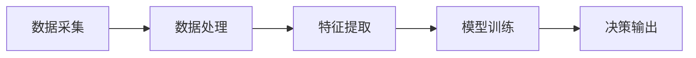

                 


```markdown
# AI智能体在识别市场结构性机会中的作用

> 关键词：AI智能体，市场结构性机会，强化学习，算法原理，系统架构

> 摘要：本文探讨了AI智能体在识别市场结构性机会中的应用，分析了其核心概念、算法原理、系统架构，并通过实战案例展示其在市场机会识别中的实际应用。

---

# 第一部分: AI智能体与市场结构性机会的背景介绍

## 第1章: AI智能体与市场结构性机会概述

### 1.1 AI智能体的基本概念
AI智能体（AI Agent）是指具备感知环境、做出决策并采取行动的智能系统。其核心特征包括自主性、反应性、目标导向和学习能力。AI智能体与传统算法的区别在于其能够动态适应环境变化，主动优化决策过程。

### 1.2 市场结构性机会的定义
市场结构性机会指在市场中因供需变化、技术进步或政策调整等因素产生的潜在收益点。这类机会通常具有长期性和系统性，能够为投资者或企业带来超额收益。市场结构性机会的识别具有挑战性，需要综合分析市场数据和趋势。

### 1.3 AI智能体在市场机会识别中的作用
AI智能体通过高效的数据处理和决策优化能力，在市场机会识别中发挥重要作用。其优势包括快速响应、高精度分析和自我优化能力。AI智能体与市场机会识别的结合，不仅提高了识别效率，还拓展了传统方法的局限性。

## 1.4 本章小结
本章介绍了AI智能体的基本概念和市场结构性机会的定义，分析了AI智能体在市场机会识别中的作用及其优势。

---

# 第二部分: AI智能体的核心概念与算法原理

## 第2章: AI智能体的核心概念与联系

### 2.1 AI智能体的核心原理
AI智能体通过感知环境、制定策略、执行动作和学习优化，实现市场机会的识别。其核心原理包括状态空间与动作空间的定义、奖励机制的设计以及策略与价值函数的优化。

### 2.2 AI智能体与市场机会识别的实体关系图


### 2.3 本章小结
本章详细阐述了AI智能体的核心原理，并通过实体关系图展示了其在市场机会识别中的作用。

## 第3章: AI智能体的算法原理与数学模型

### 3.1 强化学习算法原理
强化学习通过智能体与环境的交互，学习最优策略。环境提供奖励或惩罚，智能体通过不断试错优化决策过程。

### 3.2 Q-learning算法的数学模型
Q-learning算法通过更新Q值表实现策略优化。其公式如下：
$$ Q(s,a) = Q(s,a) + \alpha [r + \gamma \max Q(s',a') - Q(s,a)] $$

### 3.3 实例分析
通过模拟简单市场环境，展示AI智能体如何通过学习优化决策，识别市场机会。

---

# 第三部分: 系统分析与架构设计

## 第4章: 市场机会识别系统的架构设计

### 4.1 问题场景介绍
描述市场机会识别系统的需求，包括数据采集、特征提取、模型训练和决策输出等环节。

### 4.2 系统功能设计
系统功能包括数据处理模块、特征提取模块、模型训练模块和决策输出模块。

### 4.3 系统架构图


### 4.4 接口设计与交互序列图
展示系统各模块之间的接口和交互流程。

---

# 第四部分: 项目实战

## 第5章: 实战项目：市场机会识别系统开发

### 5.1 环境安装
介绍开发环境的安装步骤，包括Python、TensorFlow等工具的安装。

### 5.2 核心代码实现
展示Q-learning算法的Python实现，解释代码结构和功能。

### 5.3 案例分析
通过具体案例分析，展示系统在实际应用中的效果和优化过程。

## 5.4 项目小结
总结项目开发的经验和成果，分析系统的优缺点。

---

# 第五部分: 最佳实践与总结

## 第6章: 最佳实践与总结

### 6.1 小结
总结全文内容，强调AI智能体在市场机会识别中的重要性。

### 6.2 注意事项
提醒读者在实际应用中注意数据质量、模型优化和伦理风险等问题。

### 6.3 拓展阅读
推荐相关领域的书籍和资源，供读者深入学习。

---

# 作者：AI天才研究院/AI Genius Institute & 禅与计算机程序设计艺术 /Zen And The Art of Computer Programming
```

