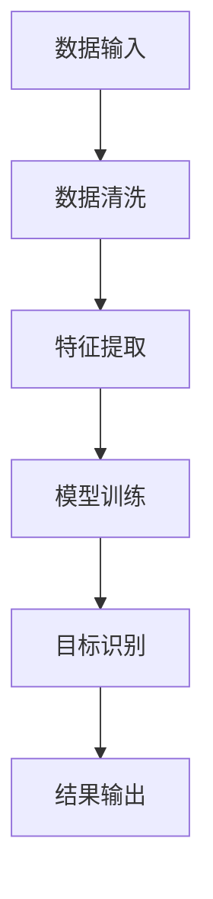
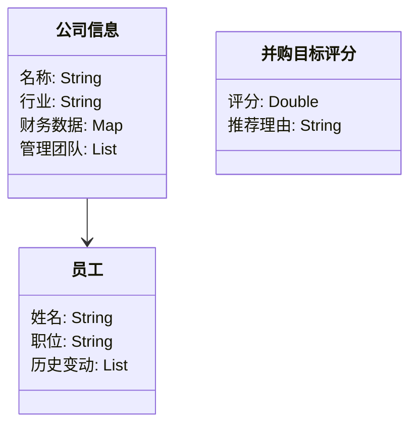
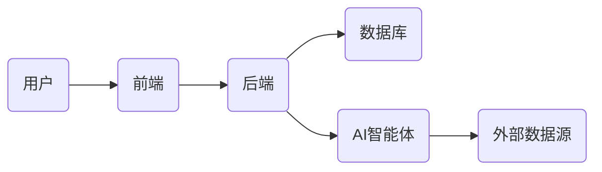
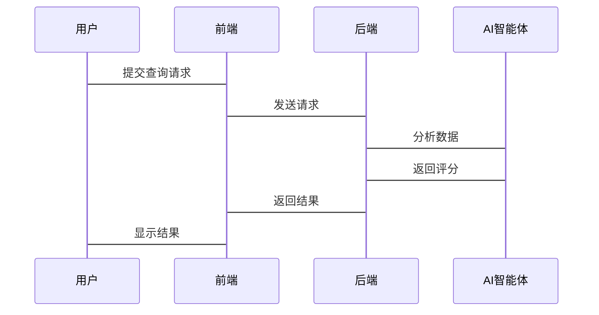

                 


# AI智能体在识别潜在并购目标中的应用

> **关键词**: AI智能体, 并购目标识别, 机器学习, 数据分析, 算法流程图, 系统架构设计, 项目实战

> **摘要**: 本文探讨了AI智能体在识别潜在并购目标中的应用，从问题背景、核心概念到算法原理、系统架构设计，再到项目实战和最佳实践，全面分析了如何利用AI技术优化并购目标识别过程。通过具体案例和系统实现，展示了AI智能体在企业并购中的巨大潜力。

---

## 第一部分: AI智能体在识别潜在并购目标中的应用概述

## 第1章: 问题背景与目标识别

### 1.1 并购战略与目标识别的重要性

#### 1.1.1 并购在企业战略中的地位
企业并购是企业扩展市场份额、获取新技术和新资源的重要手段。传统并购目标识别依赖于人工分析，存在效率低、覆盖面窄、主观性强等问题。

#### 1.1.2 传统并购目标识别的挑战
- 数据量大，难以全面分析。
- 信息不对称，难以发现潜在价值。
- 人工分析耗时，难以快速响应市场变化。

#### 1.1.3 AI智能体在并购中的潜在价值
AI智能体能够快速处理海量数据，提供精准的分析结果，显著提高并购目标识别的效率和准确性。

### 1.2 问题描述与解决思路

#### 1.2.1 并购目标识别的核心问题
- 如何从海量企业中筛选出符合并购战略的目标。
- 如何评估目标企业的财务状况、市场竞争力和管理团队。

#### 1.2.2 AI智能体如何解决这些问题
- 利用机器学习算法分析企业数据，识别潜在并购目标。
- 通过自然语言处理技术分析企业新闻和财报，提取关键信息。

#### 1.2.3 问题边界与外延
- 限定于企业公开数据的分析，不考虑非公开内部信息。
- 主要关注财务和市场数据，不涉及企业内部管理。

### 1.3 核心概念与概念结构

#### 1.3.1 核心概念
- **AI智能体**: 具备感知、决策和执行能力的智能系统。
- **并购目标识别**: 通过数据分析筛选出适合并购的企业。

#### 1.3.2 概念结构与核心要素
- **数据来源**: 公开企业数据、新闻报道、市场分析报告。
- **分析维度**: 财务状况、市场表现、管理团队稳定性。
- **决策机制**: 基于机器学习模型的评分系统。

---

## 第二部分: AI智能体的核心概念与原理

## 第2章: AI智能体的核心概念与原理

### 2.1 AI智能体的定义与特点

#### 2.1.1 AI智能体的定义
AI智能体是一个能够感知环境、处理信息并做出决策的智能系统。

#### 2.1.2 AI智能体的核心特点
- **自主性**: 能够独立执行任务。
- **反应性**: 能够实时响应环境变化。
- **目标导向**: 具备明确的目标识别能力。

### 2.2 并购目标识别的关键属性

#### 2.2.1 目标公司的财务指标分析
- **盈利能力**: 净利润、ROE等。
- **成长性**: 收入增长率、研发投入占比。

#### 2.2.2 市场表现与竞争分析
- **市场地位**: 市场占有率、品牌影响力。
- **竞争优势**: 核心技术和竞争优势。

#### 2.2.3 管理团队与企业文化的评估
- **管理团队稳定性**: 高层管理人员的变动情况。
- **企业文化匹配度**: 与并购方的企业文化是否兼容。

### 2.3 AI智能体与并购目标识别的关联

#### 2.3.1 AI智能体在数据处理中的优势
- **高效性**: 能够快速处理大量数据。
- **精准性**: 通过机器学习提高分析准确性。

#### 2.3.2 并购目标识别中的关键数据特征
- **财务数据**: 财务报表中的关键指标。
- **文本数据**: 企业新闻、财报中的关键词。

#### 2.3.3 AI智能体如何优化目标识别过程
- **自动化数据收集**: 实时抓取企业数据。
- **智能化分析**: 基于机器学习模型生成评分。

---

## 第三部分: AI智能体在并购目标识别中的算法原理

## 第3章: 算法原理与流程

### 3.1 算法原理概述

#### 3.1.1 数据预处理与特征提取
- 数据清洗: 处理缺失值和异常值。
- 特征提取: 从文本和数值数据中提取关键特征。

#### 3.1.2 智能体的决策机制
- **特征相似度计算**: 通过加权平均计算目标企业与潜在并购目标的相似度。
- **分类模型**: 使用机器学习模型对目标企业进行分类。

#### 3.1.3 目标识别的分类模型
- **监督学习**: 使用已标注数据训练分类器。
- **无监督学习**: 发现潜在的并购目标。

### 3.2 算法流程图



### 3.3 数学模型与公式

#### 3.3.1 特征相似度计算公式
$$ \text{相似度} = \frac{\sum_{i=1}^{n} w_i x_i}{\sum_{i=1}^{n} w_i} $$
其中，\( w_i \) 是特征 \( i \) 的权重，\( x_i \) 是特征 \( i \) 的值。

#### 3.3.2 分类模型的损失函数
$$ L = -\frac{1}{m} \sum_{i=1}^{m} y_i \log(p_i) + (1 - y_i) \log(1 - p_i) $$
其中，\( m \) 是样本数量，\( y_i \) 是标签，\( p_i \) 是预测概率。

---

## 第四部分: 系统分析与架构设计方案

## 第4章: 系统分析与架构设计

### 4.1 问题场景介绍
企业需要一个能够实时监控市场动态、自动识别潜在并购目标的系统。

### 4.2 项目介绍
开发一个基于AI智能体的并购目标识别系统，帮助企业在竞争激烈的市场中快速找到合适的并购目标。

### 4.3 系统功能设计

#### 4.3.1 领域模型


### 4.4 系统架构设计

#### 4.4.1 系统架构图


#### 4.4.2 系统接口设计
- 用户接口: 提交查询请求，接收并购目标评分。
- 后端接口: 处理数据请求，调用AI智能体进行分析。

#### 4.4.3 系统交互序列图


---

## 第五部分: 项目实战

## 第5章: 项目实战与案例分析

### 5.1 环境安装

#### 5.1.1 安装Python环境
```bash
python --version
pip install --upgrade pip
```

#### 5.1.2 安装依赖包
```bash
pip install numpy pandas scikit-learn
```

### 5.2 核心代码实现

#### 5.2.1 数据清洗代码
```python
import pandas as pd

# 加载数据
df = pd.read_csv('company_data.csv')

# 删除缺失值
df.dropna(inplace=True)

# 处理异常值
df = df[abs(df['profit'] - df['profit'].mean()) < 3 * df['profit'].std()]
```

#### 5.2.2 特征提取代码
```python
from sklearn.feature_extraction.text import TfidfVectorizer

vectorizer = TfidfVectorizer()
tfidf_matrix = vectorizer.fit_transform(df['description'])
```

#### 5.2.3 模型训练代码
```python
from sklearn.model_selection import train_test_split
from sklearn.linear_model import LogisticRegression

X_train, X_test, y_train, y_test = train_test_split(tfidf_matrix, df['target'], test_size=0.2)

model = LogisticRegression()
model.fit(X_train, y_train)
```

### 5.3 案例分析
以某科技公司为例，系统分析其财务数据和市场表现，生成并购目标评分。

### 5.4 项目小结
通过实际案例验证了AI智能体在并购目标识别中的有效性，提高了分析效率和准确性。

---

## 第六部分: 最佳实践与小结

## 第6章: 最佳实践与小结

### 6.1 最佳实践 tips

#### 6.1.1 数据处理
- 确保数据来源的多样性和准确性。
- 定期更新数据以保持分析的实时性。

#### 6.1.2 模型优化
- 使用更复杂的模型（如深度学习）提高准确性。
- 定期对模型进行再训练，适应市场变化。

### 6.2 小结
本文详细探讨了AI智能体在并购目标识别中的应用，从理论到实践，展示了如何利用AI技术优化企业并购决策。

### 6.3 注意事项
- 数据隐私问题需谨慎处理。
- 模型结果仅供参考，需结合人工判断。

### 6.4 拓展阅读
建议深入学习机器学习和自然语言处理技术，探索更多AI在企业战略中的应用。

---

# 作者：AI天才研究院/AI Genius Institute & 禅与计算机程序设计艺术 /Zen And The Art of Computer Programming

---

通过以上内容，您已经掌握了AI智能体在识别潜在并购目标中的应用的完整知识框架。希望本文对您有所帮助！

