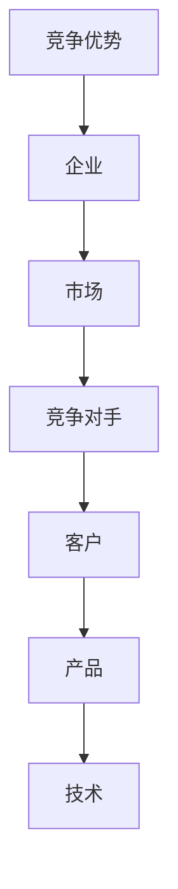
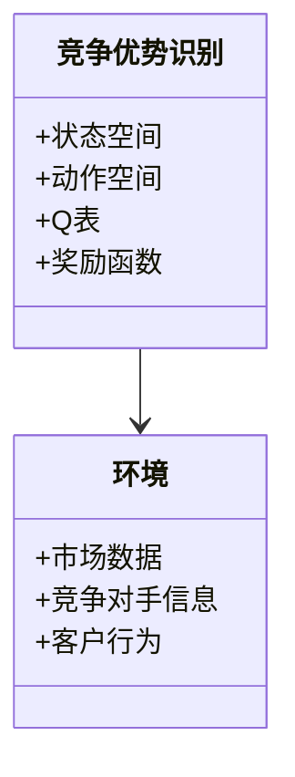
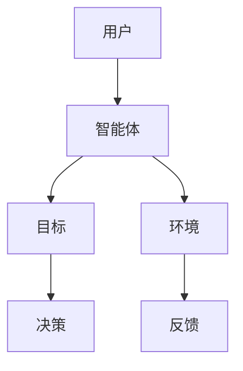
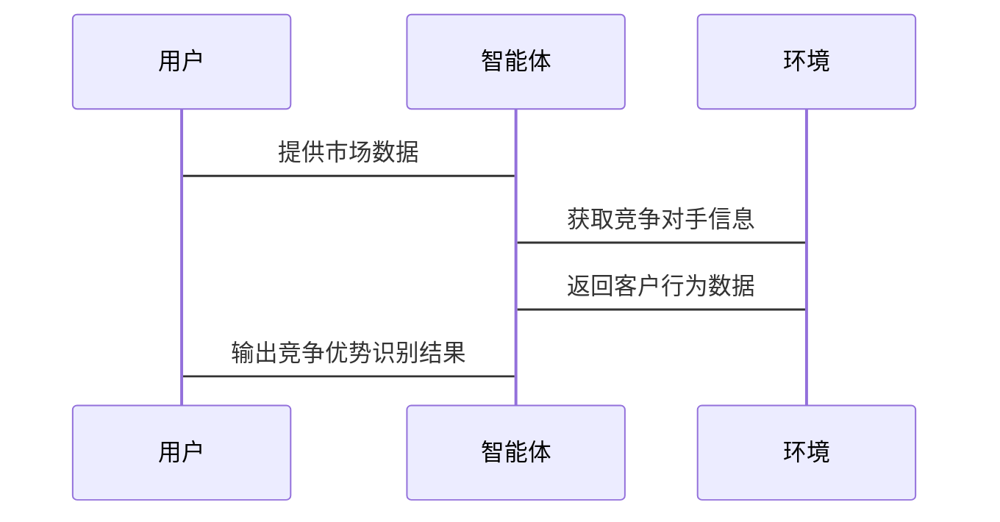

                 


# AI智能体在识别长期竞争优势中的作用

> 关键词：AI智能体，长期竞争优势，强化学习，企业战略，系统架构

> 摘要：本文探讨AI智能体在识别企业长期竞争优势中的作用，分析其核心概念、算法原理、系统架构及实际应用，为企业利用AI技术提升竞争力提供理论支持和实践指导。

---

## 第1章: 问题背景与概念解析

### 1.1 问题背景

#### 1.1.1 企业竞争优势的动态变化
在现代商业环境中，竞争优势并非静态，而是动态变化的。企业需要不断调整策略以应对市场变化、技术进步和消费者需求的变化。竞争优势的核心要素包括成本优势、技术优势、资源优势、品牌影响力和客户忠诚度等。

#### 1.1.2 AI技术对企业竞争优势的影响
AI技术的引入为企业带来了新的竞争优势。通过AI技术，企业可以更高效地分析市场数据、优化生产流程、提升客户体验和预测市场需求。AI技术的应用不仅提高了企业的运营效率，还为企业创造了新的价值点。

#### 1.1.3 AI智能体在竞争优势识别中的作用
AI智能体是一种能够自主决策和优化行为的智能系统，它能够实时分析环境数据，识别潜在的竞争优势，并制定相应的策略。AI智能体在竞争优势识别中的作用主要体现在数据处理、决策优化和动态调整等方面。

### 1.2 问题描述

#### 1.2.1 什么是长期竞争优势
长期竞争优势是指企业在长期经营中能够持续保持的竞争优势。这些优势通常源于企业的核心能力、创新能力和资源积累。长期竞争优势的核心在于企业的独特价值主张和持续改进的能力。

#### 1.2.2 企业竞争优势的核心要素
企业竞争优势的核心要素包括：
1. **资源**：企业拥有的资源，包括人力、技术和财务资源。
2. **能力**：企业的核心能力，包括技术创新能力、生产能力和市场拓展能力。
3. **品牌**：品牌影响力和客户忠诚度。
4. **成本**：成本控制能力。
5. **战略**：企业的战略规划和执行能力。

#### 1.2.3 AI智能体在竞争优势识别中的目标与范围
AI智能体在竞争优势识别中的目标是通过数据分析和机器学习算法，识别企业当前的竞争优势，并预测未来可能的竞争优势。其范围包括市场分析、竞争对手分析、客户行为分析和内部资源优化等方面。

---

## 第2章: AI智能体的核心概念与联系

### 2.1 AI智能体的定义与特点

#### 2.1.1 AI智能体的基本定义
AI智能体是一种能够感知环境、自主决策并采取行动的智能系统。它通过与环境的交互，不断优化自身的决策策略，以实现预定的目标。

#### 2.1.2 AI智能体的核心特点
1. **自主性**：AI智能体能够自主决策，无需人工干预。
2. **反应性**：能够实时感知环境变化并做出反应。
3. **学习能力**：通过机器学习算法不断优化决策策略。
4. **适应性**：能够根据环境变化调整自身行为。

#### 2.1.3 AI智能体与传统AI的区别
AI智能体与传统AI的主要区别在于其自主决策和行动能力。传统AI通常专注于特定任务，而AI智能体则具备自主性和适应性，能够在复杂环境中完成任务。

### 2.2 AI智能体的属性特征对比

#### 2.2.1 属性特征对比表格
以下是AI智能体与其他AI形式的对比：

| 属性 | AI智能体 | 传统AI系统 | 专家系统 |
|------|----------|------------|----------|
| 自主性 | 高       | 中         | 低       |
| 学习能力 | 强       | 弱         | 中       |
| 适应性 | 高       | 低         | 低       |

#### 2.2.2 ER实体关系图
以下是AI智能体识别竞争优势的ER实体关系图：



### 2.3 AI智能体与长期竞争优势的关系

#### 2.3.1 AI智能体如何识别竞争优势
AI智能体通过分析市场数据、竞争对手信息和客户行为，识别企业的核心竞争优势。它能够从大量数据中提取有价值的信息，帮助企业在复杂环境中找到潜在的竞争优势。

#### 2.3.2 竞争优势识别的AI智能体模型
竞争优势识别的AI智能体模型通常包括以下几个步骤：
1. **数据收集**：收集市场数据、竞争对手信息和客户反馈。
2. **数据分析**：通过机器学习算法分析数据，识别潜在的竞争优势。
3. **决策制定**：根据分析结果，制定相应的竞争策略。
4. **动态调整**：根据环境变化，实时调整决策策略。

#### 2.3.3 AI智能体在竞争优势识别中的优势
AI智能体在竞争优势识别中的优势在于其高效性、准确性和适应性。它能够快速处理大量数据，发现潜在的竞争优势，并根据环境变化动态调整策略。

---

## 第3章: AI智能体的算法原理

### 3.1 强化学习算法

#### 3.1.1 强化学习的基本原理
强化学习是一种机器学习范式，通过智能体与环境的交互，学习最优策略。智能体通过试错方法，逐步优化自身的决策策略，以最大化累积奖励。

#### 3.1.2 Q-learning算法
Q-learning是一种经典的强化学习算法，适用于离散状态和动作空间。其核心思想是通过Q表记录状态-动作对的期望奖励，逐步更新Q表以找到最优策略。

##### Q-learning算法步骤
1. 初始化Q表为零。
2. 选择当前状态下的动作。
3. 执行动作，观察新状态和获得的奖励。
4. 更新Q表：Q(当前状态, 动作) = Q(当前状态, 动作) + 学习率 * (奖励 + 折扣率 * max(Q(新状态, 动作)))

#### 3.1.3 Deep Q-Networks算法
Deep Q-Networks（DQN）是Q-learning的一种扩展，使用深度神经网络近似Q函数。DQN通过经验回放和目标网络提高学习效率和稳定性。

##### DQN算法步骤
1. 初始化经验回放池和目标网络。
2. 从经验回放池中随机采样一批经验。
3. 使用目标网络预测目标Q值。
4. 使用在线网络更新策略，最小化预测Q值与目标Q值之间的误差。

#### 3.1.4 算法实现的Python代码
以下是一个简单的Q-learning算法实现示例：

```python
import numpy as np

class AI智能体:
    def __init__(self, 状态空间, 动作空间):
        self.状态空间 = 状态空间
        self.动作空间 = 动作空间
        self.q_table = np.zeros((len(状态空间), len(动作空间)))

    def 选择动作(self, 状态):
        return np.argmax(self.q_table[状态])

    def 更新Q表(self, 状态, 动作, 奖励):
        self.q_table[状态][动作] += 奖励
```

---

## 第4章: AI智能体的数学模型

### 4.1 竞争优势识别的数学模型

#### 4.1.1 竞争优势识别的数学表达
竞争优势识别可以通过以下数学模型进行描述：
$$
\text{竞争优势} = \sum_{i=1}^{n} w_i \cdot x_i
$$
其中，\( w_i \) 是权重，\( x_i \) 是竞争优势的各个因素。

#### 4.1.2 奖励函数的数学表达
奖励函数是强化学习中的关键组成部分，用于衡量智能体的行为是否符合目标。奖励函数可以表示为：
$$
r(s, a) = \begin{cases}
1 & \text{如果行为是正确的} \\
0 & \text{否则}
\end{cases}
$$

#### 4.1.3 策略优化的数学模型
策略优化的目标是找到最优策略 \( \pi^* \)，使得智能体在长期运行中的累积奖励最大化。这可以通过以下公式表示：
$$
\pi^* = \arg\max_{\pi} \mathbb{E}\left[\sum_{t=0}^{\infty} \gamma^t r(s_t, a_t)\right]
$$
其中，\( \gamma \) 是折扣因子。

---

## 第5章: 系统分析与架构设计方案

### 5.1 问题场景介绍

#### 5.1.1 问题场景描述
假设我们是一家电商平台，希望通过AI智能体识别长期竞争优势，优化营销策略和客户体验。

#### 5.1.2 项目介绍
我们的目标是利用AI智能体分析市场数据、竞争对手信息和客户行为，识别企业的核心竞争优势，并制定相应的竞争策略。

### 5.2 系统功能设计

#### 5.2.1 领域模型
以下是竞争优势识别的领域模型：



### 5.3 系统架构设计

#### 5.3.1 系统架构图
以下是系统的整体架构图：



### 5.4 系统接口设计

#### 5.4.1 接口描述
1. **输入接口**：接收市场数据、竞争对手信息和客户行为数据。
2. **输出接口**：输出竞争优势识别结果和优化策略。

### 5.5 系统交互设计

#### 5.5.1 交互序列图
以下是系统的交互序列图：



---

## 第6章: 项目实战

### 6.1 环境安装

#### 6.1.1 安装Python
安装Python 3.x版本。

#### 6.1.2 安装依赖库
安装以下依赖库：
```bash
pip install numpy matplotlib
```

### 6.2 系统核心实现源代码

#### 6.2.1 竞争优势识别的代码实现
以下是竞争优势识别的Python代码示例：

```python
import numpy as np

class 竞争优势识别:
    def __init__(self, 状态空间, 动作空间):
        self.状态空间 = 状态空间
        self.动作空间 = 动作空间
        self.q_table = np.zeros((len(状态空间), len(动作空间)))

    def 选择动作(self, 状态):
        return np.argmax(self.q_table[状态])

    def 更新Q表(self, 状态, 动作, 奖励):
        self.q_table[状态][动作] += 奖励

if __name__ == "__main__":
    状态空间 = [0, 1, 2]
    动作空间 = [0, 1, 2]
    智能体 = 竞争优势识别(状态空间, 动作空间)
    状态 = 0
    动作 = 智能体.选择动作(状态)
    奖励 = 1
    智能体.更新Q表(状态, 动作, 奖励)
    print("Q表更新后为：")
    print(智能体.q_table)
```

### 6.3 代码应用解读与分析

#### 6.3.1 代码功能解读
上述代码实现了简单的Q-learning算法，用于识别竞争优势。智能体根据当前状态选择动作，并根据获得的奖励更新Q表。

#### 6.3.2 代码实现分析
1. **类定义**：定义了竞争优势识别类，初始化Q表。
2. **选择动作**：根据当前状态选择最优动作。
3. **更新Q表**：根据获得的奖励更新Q表。

### 6.4 实际案例分析

#### 6.4.1 案例介绍
假设我们是一家电商平台，希望通过AI智能体识别长期竞争优势，优化营销策略。

#### 6.4.2 数据收集
收集市场数据、竞争对手信息和客户行为数据。

#### 6.4.3 数据分析
使用Q-learning算法分析数据，识别竞争优势。

#### 6.4.4 策略制定
根据分析结果，制定相应的竞争策略。

### 6.5 项目小结

#### 6.5.1 项目总结
通过AI智能体识别长期竞争优势，企业能够更高效地优化自身策略，提升竞争力。

#### 6.5.2 经验总结
在项目实施过程中，需要注意数据质量、算法选择和系统优化等问题。

---

## 第7章: 最佳实践

### 7.1 小结与总结

#### 7.1.1 小结
本文探讨了AI智能体在识别长期竞争优势中的作用，分析了其核心概念、算法原理、系统架构及实际应用。

#### 7.1.2 总结
通过AI智能体，企业能够更高效地识别竞争优势，制定优化策略，提升竞争力。

### 7.2 注意事项

#### 7.2.1 数据质量
确保数据的准确性和完整性，以提高竞争优势识别的准确性。

#### 7.2.2 算法选择
根据具体场景选择合适的算法，以实现最佳效果。

#### 7.2.3 系统优化
优化系统架构和算法性能，以提高竞争优势识别的效率。

### 7.3 最佳实践

#### 7.3.1 数据预处理
在数据预处理阶段，进行数据清洗和特征提取，以提高分析效果。

#### 7.3.2 算法调优
通过参数调整和模型优化，提高AI智能体的性能。

#### 7.3.3 系统监控
实时监控系统运行状态，及时发现和解决问题。

---

## 作者：AI天才研究院/AI Genius Institute & 禅与计算机程序设计艺术 /Zen And The Art of Computer Programming

---

本文系统地探讨了AI智能体在识别长期竞争优势中的作用，通过理论分析和实践案例，为企业利用AI技术提升竞争力提供了有价值的参考。

