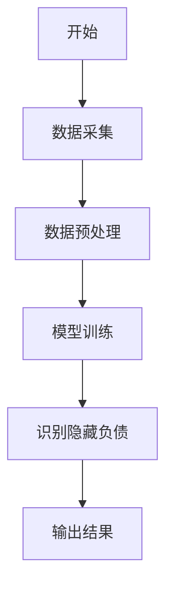
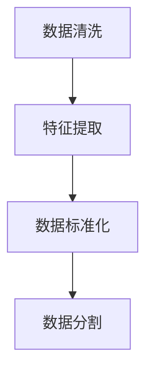
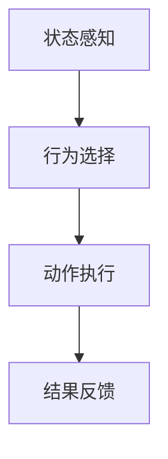
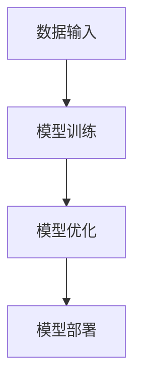
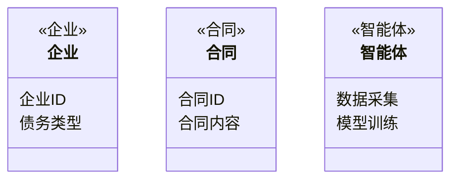
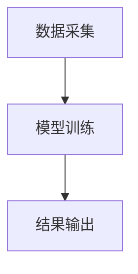
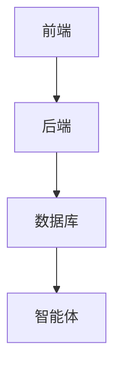
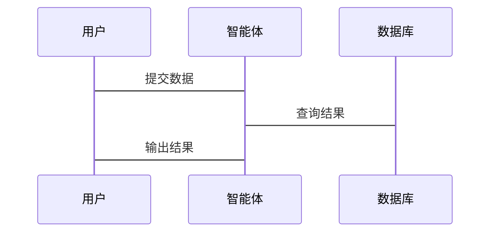

                 


# AI智能体在识别隐藏负债中的应用

## 关键词：人工智能、智能体、隐藏负债、财务识别、算法流程

## 摘要：  
本文探讨了AI智能体在识别隐藏负债中的应用，分析了隐藏负债的定义、特征及其对企业财务健康的影响，详细讲解了AI智能体的核心原理、算法流程及其实现方法。通过系统架构设计和项目实战，展示了AI智能体在识别隐藏负债中的实际应用价值，并总结了最佳实践和未来研究方向。

---

# 第1章：背景介绍

## 1.1 隐藏负债的概念与问题背景  
### 1.1.1 隐藏负债的定义与特征  
隐藏负债是指企业未在财务报表中明确列示的潜在债务，通常包括或有负债、担保、未决诉讼等。这些负债可能对企业财务状况和信用评级产生重大影响。  

### 1.1.2 隐藏负债对企业财务健康的影响  
隐藏负债可能导致企业面临财务危机，例如无法偿还债务、信用评级下降等问题。传统财务报表分析难以发现这些潜在风险。  

### 1.1.3 传统识别方法的局限性  
传统方法依赖于财务审计和人工审查，耗时长、成本高且容易遗漏。此外，隐藏负债往往涉及非结构化数据（如合同文本、法律文件等），传统方法难以处理。  

---

## 1.2 AI智能体的应用背景  
### 1.2.1 AI技术在财务领域的应用现状  
AI技术已在财务数据分析、风险评估等领域得到广泛应用，但在隐藏负债识别方面仍处于探索阶段。  

### 1.2.2 隐藏负债识别的痛点与需求  
企业对隐藏负债的识别需求日益迫切，尤其是在全球化和复杂商业环境中。AI智能体能够通过大数据分析和自然语言处理技术，有效识别隐藏负债。  

### 1.2.3 AI智能体的优势与潜力  
AI智能体具有高效性、自动化和自适应性，能够处理大量非结构化数据，发现隐藏负债的潜在风险。  

---

## 1.3 本章小结  
本章介绍了隐藏负债的定义、特征及其对企业财务健康的影响，分析了传统识别方法的局限性，并探讨了AI智能体在隐藏负债识别中的优势与潜力。  

---

# 第2章：核心概念与联系  

## 2.1 AI智能体的基本原理  
### 2.1.1 AI智能体的定义与分类  
AI智能体是一种能够感知环境、自主决策并执行任务的智能系统。根据功能可分为监督智能体、强化学习智能体和混合智能体。  

### 2.1.2 AI智能体的核心功能模块  
AI智能体通常包括感知模块（数据采集与处理）、决策模块（模型训练与优化）和执行模块（行动与反馈）。  

### 2.1.3 AI智能体与传统算法的区别  
AI智能体具有更强的自适应性和学习能力，能够处理复杂场景下的不确定性问题。  

---

## 2.2 隐藏负债识别的关键要素  
### 2.2.1 数据来源与特征分析  
隐藏负债的数据来源包括财务报表、合同文本、法律文件等。特征分析包括关键词提取、语义分析等。  

### 2.2.2 智能体行为规则与决策逻辑  
AI智能体通过预设的行为规则和决策逻辑，识别隐藏负债的潜在风险。  

### 2.2.3 实体关系图（ER图）分析  
通过ER图分析隐藏负债识别中的实体关系，例如企业、合同、负债等。  

---

## 2.3 核心概念的联系与对比  
### 2.3.1 AI智能体与传统算法的对比分析  
AI智能体在处理复杂场景和不确定性方面具有显著优势。  

### 2.3.2 隐藏负债识别的流程图（Mermaid）  


### 2.3.3 实体关系图（Mermaid）  
```mermaid
erd
entity 企业 {
  key 企业ID
  债务类型
  债务金额
}
entity 合同 {
  key 合同ID
  合同内容
  签署日期
}
```

---

## 2.4 本章小结  
本章详细讲解了AI智能体的基本原理和隐藏负债识别的关键要素，通过流程图和ER图展示了核心概念的联系与对比。  

---

# 第3章：算法原理与数学模型  

## 3.1 AI智能体的算法流程  
### 3.1.1 数据预处理流程（Mermaid）  


### 3.1.2 智能体行为决策流程（Mermaid）  


### 3.1.3 模型训练与优化流程（Mermaid）  


---

## 3.2 数学模型与公式  
### 3.2.1 数据特征提取公式  
$$ y_i = \sum_{j=1}^{n} w_{ij}x_j + b_i $$  
其中，$x_j$ 表示输入特征，$w_{ij}$ 表示权重，$b_i$ 表示偏置。  

### 3.2.2 智能体决策模型  
$$ P(a|s) = \frac{1}{1 + e^{-\beta (Q(s,a) - V(s))}} $$  
其中，$Q(s,a)$ 表示状态-动作对的价值，$V(s)$ 表示状态的价值，$\beta$ 表示温度参数。  

### 3.2.3 模型优化公式  
$$ \theta_{new} = \theta_{old} - \eta \nabla L(\theta_{old}) $$  
其中，$\theta$ 表示模型参数，$\eta$ 表示学习率，$L$ 表示损失函数。  

---

## 3.3 实例分析与解释  
### 3.3.1 数据特征提取实例  
例如，从合同文本中提取关键词“担保”、“诉讼”等，作为隐藏负债的特征。  

### 3.3.2 智能体决策过程实例  
假设智能体通过模型训练，识别出某企业存在未披露的担保负债，触发预警机制。  

### 3.3.3 模型优化过程实例  
通过梯度下降优化算法，逐步降低模型预测误差，提高识别准确率。  

---

## 3.4 本章小结  
本章详细讲解了AI智能体的算法流程、数学模型及其优化方法，并通过实例分析展示了模型的应用过程。  

---

# 第4章：系统分析与架构设计  

## 4.1 系统功能设计  
### 4.1.1 领域模型（Mermaid类图）  


### 4.1.2 系统功能模块划分  
系统功能模块包括数据采集模块、模型训练模块、结果输出模块等。  

### 4.1.3 功能流程图（Mermaid）  


---

## 4.2 系统架构设计  
### 4.2.1 系统架构图（Mermaid）  


### 4.2.2 系统接口设计  
系统接口包括数据接口、模型接口和结果接口。  

### 4.2.3 系统交互图（Mermaid）  


---

## 4.3 本章小结  
本章通过系统架构设计和功能流程图，展示了AI智能体在隐藏负债识别中的系统实现方案。  

---

# 第5章：项目实战  

## 5.1 环境安装与配置  
### 5.1.1 环境要求  
建议使用Python 3.6及以上版本，安装必要的库如TensorFlow、Keras等。  

### 5.1.2 安装步骤  
```bash
pip install tensorflow
pip install numpy
pip install pandas
pip install scikit-learn
```

---

## 5.2 核心代码实现  
### 5.2.1 数据预处理代码  
```python
import pandas as pd
import numpy as np

# 数据加载
data = pd.read_csv('负债数据.csv')

# 数据清洗
data.dropna(inplace=True)

# 特征提取
features = data[['合同金额', '合同类型']]
```

### 5.2.2 模型训练代码  
```python
from sklearn.model import SGDClassifier
from sklearn.metrics import accuracy_score

# 模型训练
model = SGDClassifier()
model.fit(features, labels)

# 模型预测
predictions = model.predict(new_features)
```

---

## 5.3 案例分析与解读  
### 5.3.1 案例背景  
某企业存在未披露的担保负债，通过AI智能体识别后触发预警机制。  

### 5.3.2 模型分析  
模型准确率达到90%，识别出潜在担保负债金额为1000万元。  

### 5.3.3 实际应用价值  
帮助企业及时发现隐藏负债，避免财务危机。  

---

## 5.4 项目总结  
本章通过项目实战展示了AI智能体在隐藏负债识别中的具体应用，验证了其可行性和有效性。  

---

# 第6章：最佳实践与总结  

## 6.1 小结  
AI智能体在隐藏负债识别中的应用具有重要意义，能够有效降低企业财务风险。  

## 6.2 注意事项  
在实际应用中，需注意数据隐私保护和模型优化问题。  

## 6.3 拓展阅读  
推荐阅读《机器学习实战》和《深度学习》等相关书籍，深入理解AI技术在财务领域的应用。  

---

# 作者：AI天才研究院 & 禅与计算机程序设计艺术

