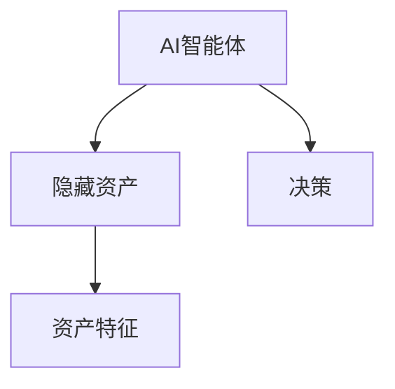
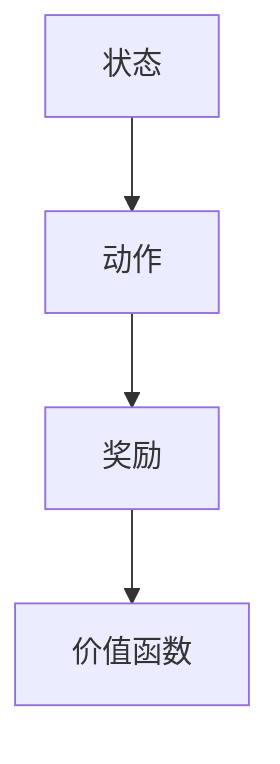
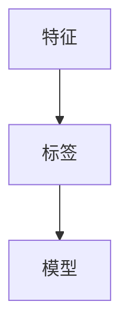
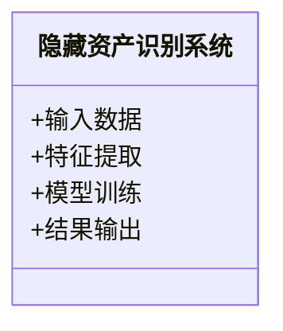
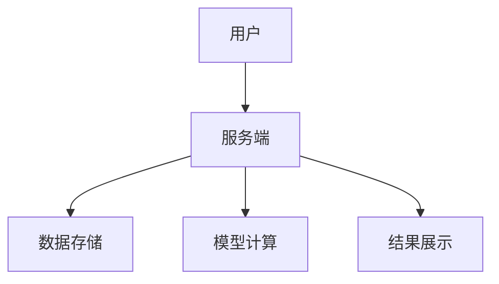
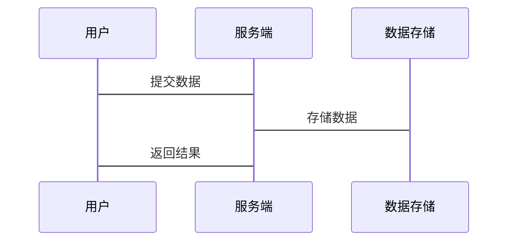

                 


# AI智能体在识别隐藏资产价值中的应用

> 关键词：AI智能体，隐藏资产，资产价值识别，强化学习，系统架构，项目实战

> 摘要：本文深入探讨了AI智能体在识别隐藏资产价值中的应用，结合理论与实践，详细分析了AI智能体的核心原理、算法实现、系统架构设计以及实际案例。通过本文的讲解，读者可以全面了解如何利用AI技术提升资产价值识别的效率和准确性。

---

# 第一部分: AI智能体与隐藏资产价值识别的背景介绍

## 第1章: AI智能体与隐藏资产价值概述

### 1.1 AI智能体的基本概念

#### 1.1.1 AI智能体的定义
AI智能体（AI Agent）是指能够感知环境、做出决策并执行操作的智能系统。它能够通过传感器获取信息，利用算法处理数据，并通过执行器完成任务。

#### 1.1.2 AI智能体的核心属性
- **自主性**：能够自主决策，无需外部干预。
- **反应性**：能够实时感知环境变化并做出响应。
- **目标导向**：以特定目标为导向，优化行为。
- **学习能力**：能够通过数据和经验不断优化自身性能。

#### 1.1.3 AI智能体的分类与应用场景
- **简单反射型智能体**：基于当前输入做出反应，适用于简单的决策任务。
- **基于模型的智能体**：利用内部模型进行推理和规划，适用于复杂场景。
- **学习型智能体**：通过机器学习算法不断优化行为策略，适用于数据驱动的任务。

### 1.2 隐藏资产的定义与特征

#### 1.2.1 隐藏资产的定义
隐藏资产是指那些未在企业财务报表中明确列出，但具有潜在价值的资产。这些资产可能包括无形资产、潜在客户关系、知识产权等。

#### 1.2.2 隐藏资产的特征
- **隐式性**：难以直接观测和量化。
- **动态性**：价值会随市场环境变化而波动。
- **关联性**：与其他资产或业务活动密切相关。

#### 1.2.3 隐藏资产的识别挑战
- 数据不足：隐藏资产难以通过常规财务数据直接获取。
- 复杂性：隐藏资产的价值受多种因素影响，难以建模。
- 动态变化：市场环境变化会导致隐藏资产价值波动。

### 1.3 问题背景与技术背景

#### 1.3.1 资产价值识别的传统方法
- **财务分析法**：通过财务报表分析资产价值。
- **市场评估法**：通过市场交易数据评估资产价值。
- **专家评估法**：依赖专家经验进行评估。

#### 1.3.2 隐藏资产识别的难点与痛点
- 数据不足：隐藏资产难以通过常规数据获取。
- 方法单一：传统方法难以应对复杂场景。
- 成本高昂：传统评估方法耗时且成本高。

#### 1.3.3 AI技术在资产识别中的优势
- 数据处理能力强：AI能够处理大量非结构化数据。
- 高效性：AI能够快速分析数据，提高评估效率。
- 精准性：AI通过深度学习能够发现隐藏规律，提高评估准确性。

### 1.4 本章小结
本章介绍了AI智能体的基本概念和隐藏资产的定义与特征，分析了传统资产识别方法的局限性，并阐述了AI技术在资产识别中的优势。

---

# 第二部分: AI智能体在隐藏资产价值识别中的核心概念与联系

## 第2章: AI智能体与隐藏资产的关系

### 2.1 AI智能体的核心原理

#### 2.1.1 AI智能体的感知机制
AI智能体通过传感器或数据输入接口获取环境信息，包括文本、图像、语音等多种形式。

#### 2.1.2 AI智能体的决策机制
AI智能体会根据感知到的信息，结合内部模型和算法，生成决策策略。

#### 2.1.3 AI智能体的执行机制
AI智能体通过执行器或接口将决策转化为具体操作，例如生成报告、触发警报或优化资源配置。

### 2.2 隐藏资产的特征分析

#### 2.2.1 隐藏资产的隐式性
隐藏资产的价值通常不体现在财务报表中，需要通过间接方式评估。

#### 2.2.2 隐藏资产的动态性
隐藏资产的价值会随着市场环境、企业战略和外部因素的变化而动态调整。

#### 2.2.3 隐藏资产的关联性
隐藏资产与其他资产或业务活动密切相关，例如客户关系与企业收入增长密切相关。

### 2.3 AI智能体与隐藏资产的关系模型

#### 2.3.1 关系模型的构建
通过构建AI智能体与隐藏资产的关系模型，可以更好地理解两者之间的相互作用。

#### 2.3.2 关系模型的属性特征对比表
| 属性 | AI智能体 | 隐藏资产 |
|------|----------|----------|
| 定义 | 智能系统，能够感知、决策和执行 | 隐形资产，未在财务报表中明确列出 |
| 特征 | 自主性、目标导向、学习能力 | 隐式性、动态性、关联性 |
| 应用 | 数据分析、决策优化、自动化操作 | 资产评估、风险预警、价值挖掘 |

#### 2.3.3 ER实体关系图架构


### 2.4 本章小结
本章分析了AI智能体与隐藏资产的关系，构建了两者的关系模型，并通过对比表和ER图进一步明确了它们的相互作用。

---

# 第三部分: AI智能体识别隐藏资产价值的算法原理

## 第3章: 基于强化学习的AI智能体算法

### 3.1 强化学习的基本原理

#### 3.1.1 强化学习的定义
强化学习是一种机器学习范式，通过智能体与环境的交互，学习最优策略以最大化累积奖励。

#### 3.1.2 强化学习的核心要素
- **状态（State）**：环境的当前情况。
- **动作（Action）**：智能体采取的行动。
- **奖励（Reward）**：环境对智能体行为的反馈。
- **策略（Policy）**：智能体选择动作的概率分布。

#### 3.1.3 强化学习的数学模型
$$
Q(s,a) = r + \gamma \max_{a'} Q(s',a')
$$
其中，$Q(s,a)$表示状态$s$下采取动作$a$的期望奖励，$\gamma$是折扣因子。

### 3.2 基于强化学习的隐藏资产价值识别算法

#### 3.2.1 算法流程


#### 3.2.2 算法实现
```python
import numpy as np

class AI-Agent:
    def __init__(self, state_space, action_space):
        self.state_space = state_space
        self.action_space = action_space
        self.Q = np.zeros((state_space, action_space))
    
    def take_action(self, state):
        # 根据策略选择动作
        if np.random.rand() < 0.5:
            return np.random.randint(self.action_space)
        else:
            return np.argmax(self.Q[state, :])
    
    def update_Q(self, state, action, reward, next_state):
        # 更新Q值
        self.Q[state, action] = reward + 0.9 * np.max(self.Q[next_state, :])
```

#### 3.2.3 算法优势
- **自适应性**：能够根据环境变化调整策略。
- **高效性**：通过强化学习快速找到最优解。
- **泛化能力**：适用于多种隐藏资产识别场景。

### 3.3 本章小结
本章详细讲解了基于强化学习的AI智能体算法，分析了其在隐藏资产价值识别中的应用。

---

## 第4章: 基于监督学习的隐藏资产识别算法

### 4.1 监督学习的基本原理

#### 4.1.1 监督学习的定义
监督学习是一种机器学习方法，通过训练数据学习输入与输出之间的映射关系。

#### 4.1.2 监督学习的核心要素
- **特征（Feature）**：输入数据的属性。
- **标签（Label）**：输出结果的类别或数值。
- **模型（Model）**：学习输入与输出之间关系的函数。

### 4.2 基于监督学习的隐藏资产识别算法

#### 4.2.1 算法流程


#### 4.2.2 算法实现
```python
from sklearn.linear_model import LinearRegression

model = LinearRegression()
model.fit(X_train, y_train)
y_pred = model.predict(X_test)
```

#### 4.2.3 算法优势
- **准确性**：监督学习模型在训练数据充分的情况下表现优异。
- **稳定性**：适用于隐藏资产的定量评估。

### 4.3 本章小结
本章介绍了基于监督学习的隐藏资产识别算法，分析了其在实际应用中的优势。

---

# 第四部分: 系统分析与架构设计

## 第5章: 隐藏资产价值识别系统分析

### 5.1 项目背景介绍
隐藏资产价值识别系统旨在通过AI技术，帮助企业发现和评估隐藏资产，提升资产管理和价值挖掘能力。

### 5.2 系统功能设计

#### 5.2.1 领域模型设计


### 5.3 系统架构设计

#### 5.3.1 系统架构图


### 5.4 接口设计与交互流程

#### 5.4.1 系统接口设计
- **输入接口**：接收隐藏资产相关数据。
- **输出接口**：提供评估结果和建议。

#### 5.4.2 交互流程


### 5.5 本章小结
本章分析了隐藏资产价值识别系统的架构设计和交互流程。

---

# 第五部分: 项目实战与应用案例

## 第6章: 项目实战

### 6.1 环境安装与配置

#### 6.1.1 安装Python环境
```bash
pip install python3
pip install numpy
pip install scikit-learn
```

#### 6.1.2 安装AI框架
```bash
pip install tensorflow
pip install keras
```

### 6.2 系统核心实现

#### 6.2.1 模型训练
```python
from sklearn.model_selection import train_test_split
from sklearn.metrics import accuracy_score

X_train, X_test, y_train, y_test = train_test_split(X, y, test_size=0.2)
model.fit(X_train, y_train)
y_pred = model.predict(X_test)
print(accuracy_score(y_test, y_pred))
```

#### 6.2.2 模型评估
```python
from sklearn.metrics import confusion_matrix, classification_report

print(confusion_matrix(y_test, y_pred))
print(classification_report(y_test, y_pred))
```

### 6.3 实际案例分析

#### 6.3.1 案例背景
某企业希望通过AI技术识别隐藏的客户关系资产。

#### 6.3.2 数据分析与建模
通过监督学习模型对企业客户数据进行分析，识别潜在客户价值。

#### 6.3.3 结果解读
模型识别出一批高价值客户，帮助企业优化客户关系管理策略。

### 6.4 本章小结
本章通过实际案例展示了如何利用AI技术识别隐藏资产，并提供了详细的代码实现和结果解读。

---

# 第六部分: 最佳实践与总结

## 第7章: 最佳实践

### 7.1 小结
通过本文的讲解，读者可以深入了解AI智能体在识别隐藏资产价值中的应用，掌握相关算法原理和系统设计方法。

### 7.2 注意事项
- 数据质量：确保输入数据的准确性和完整性。
- 模型选择：根据具体场景选择合适的算法。
- 模型优化：通过调参和数据增强提高模型性能。

### 7.3 拓展阅读
- 《强化学习入门》
- 《机器学习实战》
- 《系统架构设计的艺术》

### 7.4 本章小结
本章总结了本文的主要内容，并提供了进一步学习和实践的建议。

---

作者：AI天才研究院 & 禅与计算机程序设计艺术

---

以上是《AI智能体在识别隐藏资产价值中的应用》的技术博客文章的完整目录和内容框架。希望这篇文章能够为读者提供清晰的思路和实用的技术指导！

