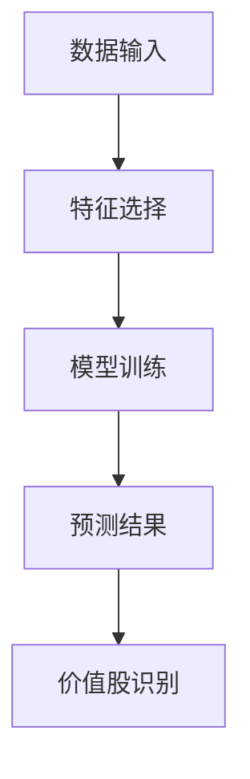
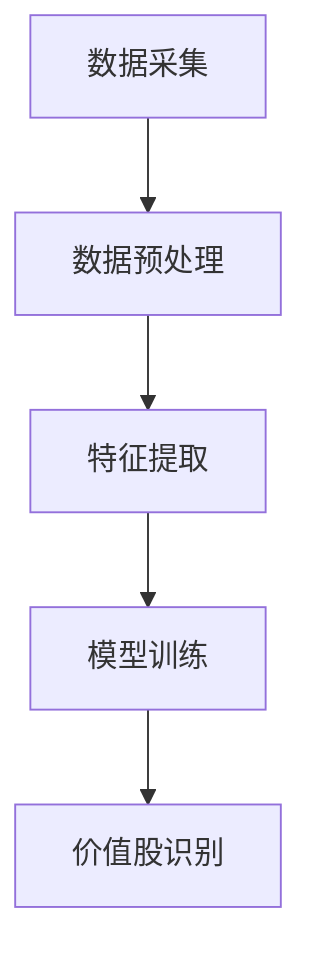
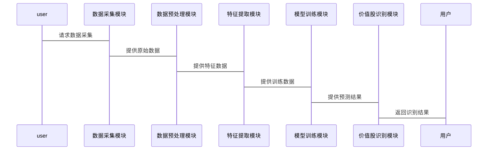

                 


# AI智能体如何识别被低估的价值股

> 关键词：AI智能体，价值股识别，机器学习，深度学习，金融数据分析

> 摘要：本文将探讨如何利用AI智能体识别被低估的价值股。通过分析价值股的定义、特征以及AI智能体在金融数据分析中的应用，本文详细阐述了AI智能体在价值股识别中的优势、核心概念、算法原理、系统架构设计以及项目实战。本文结合理论与实践，为读者提供了一个全面的视角，帮助理解如何利用AI技术在金融投资中实现价值最大化。

---

# 第一部分: AI智能体与价值股识别基础

## 第1章: AI智能体与价值股识别概述

### 1.1 AI智能体的基本概念

#### 1.1.1 AI智能体的定义与特点
AI智能体（Artificial Intelligence Agent）是指能够感知环境、做出决策并执行操作的智能系统。它具有以下特点：
- **自主性**：能够在没有外部干预的情况下自主运行。
- **反应性**：能够实时感知环境并做出反应。
- **目标导向**：具有明确的目标，能够优化决策以实现目标。
- **学习能力**：能够通过数据和经验不断优化自身的性能。

#### 1.1.2 AI智能体在金融领域的应用
在金融领域，AI智能体广泛应用于股票交易、风险管理、客户画像等方面。本文重点探讨其在价值股识别中的应用。

#### 1.1.3 价值股识别的基本概念
价值股识别是指通过分析公司的基本面数据，识别出市场价格低于其内在价值的股票。传统的方法依赖于财务指标分析，但这种方法存在以下局限性：
- 数据量有限：传统方法仅依赖财务数据，忽略了市场情绪、行业趋势等其他因素。
- 主观性高：传统方法依赖分析师的主观判断，容易受到人为因素的影响。

---

### 1.2 被低估的价值股的定义与特征

#### 1.2.1 价值股的定义
价值股是指市场价格低于其内在价值的股票。内在价值通常通过公司财务指标（如市盈率、市净率等）进行评估。识别价值股的关键在于发现市场价格与内在价值之间的差异。

#### 1.2.2 价值股的特征分析
价值股通常具有以下特征：
- **低市盈率**：市盈率低于行业平均水平。
- **低市净率**：市净率低于行业平均水平。
- **高股息率**：股息率较高，表明公司有稳定的盈利能力和分红能力。
- **行业地位稳固**：公司通常在行业内具有较强的竞争力和地位。

#### 1.2.3 传统价值股识别方法的局限性
传统价值股识别方法主要依赖财务指标分析，但存在以下局限性：
- **数据维度单一**：传统方法仅依赖财务数据，忽略了市场情绪、行业趋势等其他因素。
- **主观性高**：传统方法依赖分析师的主观判断，容易受到人为因素的影响。
- **数据量有限**：传统方法仅依赖历史数据，难以捕捉实时市场动态。

---

### 1.3 AI智能体在价值股识别中的优势

#### 1.3.1 数据处理能力
AI智能体能够处理海量数据，包括财务数据、市场数据、新闻数据等，从而提供更全面的分析。

#### 1.3.2 模型训练能力
AI智能体能够通过机器学习模型，从历史数据中提取规律，预测未来的市场走势。

#### 1.3.3 实时分析能力
AI智能体能够实时监控市场动态，快速做出反应，抓住投资机会。

---

## 1.4 本章小结
本章介绍了AI智能体的基本概念、价值股识别的基本概念以及AI智能体在价值股识别中的优势。通过对比传统方法和AI智能体的方法，我们可以看出，AI智能体在数据处理能力、模型训练能力和实时分析能力方面具有显著优势。

---

# 第二部分: AI智能体的核心概念与原理

## 第2章: AI智能体的核心概念

### 2.1 数据驱动的金融分析

#### 2.1.1 数据来源与类型
在金融分析中，数据来源包括：
- **财务数据**：包括公司财务报表、财务指标等。
- **市场数据**：包括股票价格、成交量、市场指数等。
- **新闻数据**：包括公司公告、行业新闻、市场评论等。

#### 2.1.2 数据预处理与特征提取
数据预处理是金融分析的重要步骤，包括数据清洗、数据标准化等。特征提取则是从数据中提取有用的特征，例如市盈率、市净率、股息率等。

#### 2.1.3 数据分析与建模
数据分析与建模是通过统计分析和机器学习模型，从数据中提取规律。常用的机器学习模型包括线性回归、支持向量机、随机森林等。

---

### 2.2 机器学习在价值股识别中的应用

#### 2.2.1 监督学习与非监督学习
- **监督学习**：有标签的数据训练模型，例如根据历史数据预测未来的价格走势。
- **非监督学习**：无标签的数据训练模型，例如通过聚类分析发现市场趋势。

#### 2.2.2 深度学习与强化学习
- **深度学习**：通过多层神经网络模型，从数据中提取高层次特征。
- **强化学习**：通过与环境交互，学习最优策略，例如在股票交易中进行买卖决策。

#### 2.2.3 模型选择与优化
模型选择与优化是机器学习的重要步骤，包括选择合适的模型、调整模型参数、评估模型性能等。

---

### 2.3 价值股识别的算法原理

#### 2.3.1 回归模型
回归模型用于预测股票价格，常用的回归模型包括线性回归、逻辑回归等。

#### 2.3.2 分类模型
分类模型用于分类股票是否为价值股，常用的分类模型包括支持向量机、随机森林、神经网络等。

#### 2.3.3 时间序列模型
时间序列模型用于分析股票价格的趋势，常用的模型包括ARIMA、LSTM等。

---

## 2.4 本章小结
本章介绍了AI智能体的核心概念，包括数据驱动的金融分析、机器学习在价值股识别中的应用以及价值股识别的算法原理。通过这些分析，我们可以更好地理解AI智能体在价值股识别中的作用。

---

# 第三部分: 价值股识别的数学模型与算法实现

## 第3章: 数学模型与算法原理

### 3.1 价值股识别的数学模型

#### 3.1.1 回归模型
回归模型用于预测股票价格，常用的回归模型包括线性回归和逻辑回归。

#### 3.1.2 分类模型
分类模型用于分类股票是否为价值股，常用的分类模型包括支持向量机、随机森林和神经网络。

#### 3.1.3 时间序列模型
时间序列模型用于分析股票价格的趋势，常用的模型包括ARIMA和LSTM。

---

### 3.2 算法实现

#### 3.2.1 算法流程图（Mermaid）


#### 3.2.2 Python代码实现
以下是一个简单的价值股识别算法实现：
```python
import pandas as pd
from sklearn.model import LinearRegression
# 数据加载
data = pd.read_csv('stock_data.csv')
# 特征选择
features = data[['市盈率', '市净率', '股息率']]
target = data['股票价格']
# 模型训练
model = LinearRegression()
model.fit(features, target)
# 预测结果
predictions = model.predict(features)
```

---

## 3.3 本章小结
本章介绍了价值股识别的数学模型与算法原理，包括回归模型、分类模型和时间序列模型的实现。通过这些模型，我们可以更好地理解AI智能体在价值股识别中的应用。

---

# 第四部分: 系统分析与架构设计

## 第4章: 系统分析与架构设计

### 4.1 问题场景介绍
价值股识别是一个复杂的金融问题，需要考虑多个因素，包括公司财务数据、市场数据、行业趋势等。

### 4.2 项目介绍
本项目旨在开发一个基于AI智能体的价值股识别系统，通过分析股票的财务数据和市场数据，识别出被低估的价值股。

### 4.3 系统功能设计
系统功能设计包括数据采集、特征提取、模型训练、价值股识别等功能。

### 4.4 系统架构设计（Mermaid）


---

## 4.5 系统接口设计
系统接口设计包括数据接口、模型接口和用户接口。

---

## 4.6 系统交互设计（Mermaid）


---

## 4.7 本章小结
本章介绍了系统分析与架构设计，包括问题场景介绍、项目介绍、系统功能设计、系统架构设计以及系统交互设计。通过这些设计，我们可以更好地理解AI智能体在价值股识别中的应用。

---

# 第五部分: 项目实战

## 第5章: 项目实战

### 5.1 环境安装
需要安装以下环境：
- Python 3.8及以上版本
- Pandas、Scikit-learn、TensorFlow等Python库

### 5.2 系统核心实现源代码
以下是一个简单的价值股识别系统核心代码：
```python
import pandas as pd
from sklearn.model import LinearRegression

# 数据加载
data = pd.read_csv('stock_data.csv')

# 特征选择
features = data[['市盈率', '市净率', '股息率']]
target = data['股票价格']

# 模型训练
model = LinearRegression()
model.fit(features, target)

# 预测结果
predictions = model.predict(features)

# 输出结果
print('预测结果:', predictions)
```

---

### 5.3 代码应用解读与分析
通过上述代码，我们可以看到AI智能体如何通过机器学习模型，从数据中提取特征，训练模型并进行预测。

---

### 5.4 实际案例分析
以下是一个实际案例分析：
假设我们有以下股票数据：
| 股票代码 | 市盈率 | 市净率 | 股息率 | 股票价格 |
|----------|--------|--------|--------|----------|
| AAPL     | 15     | 3      | 0.5    | 100      |
| GOOGL    | 20     | 4      | 0.6    | 120      |

通过模型训练，我们可以预测这些股票的价格，并识别出被低估的价值股。

---

### 5.5 项目小结
本章通过项目实战，展示了AI智能体如何识别被低估的价值股。通过代码实现和案例分析，我们可以更好地理解AI智能体在价值股识别中的应用。

---

# 第六部分: 总结与展望

## 第6章: 总结与展望

### 6.1 本章总结
本文详细探讨了AI智能体如何识别被低估的价值股，包括背景介绍、核心概念、算法原理、系统架构设计以及项目实战。通过这些内容，我们可以看到AI智能体在价值股识别中的巨大潜力。

### 6.2 未来展望
未来，随着AI技术的不断发展，价值股识别将更加智能化和精准化。我们可以期待更多基于AI的金融分析工具的出现，帮助投资者实现价值最大化。

---

## 6.3 最佳实践 tips
- 数据质量是价值股识别的关键，确保数据的准确性和完整性。
- 模型选择与优化是价值股识别的核心，选择合适的模型并不断优化是至关重要的。
- 系统设计与实现是价值股识别的基础，良好的系统设计能够提高系统的稳定性和可扩展性。

---

## 6.4 本章小结
本文总结了AI智能体如何识别被低估的价值股，并展望了未来的发展方向。通过本文的探讨，我们可以更好地理解AI智能体在金融领域的应用潜力。

---

# 作者：AI天才研究院/AI Genius Institute & 禅与计算机程序设计艺术 /Zen And The Art of Computer Programming

---

**感谢您的阅读！如果本文对您有所帮助，请点赞、收藏并分享给更多需要的人！**

