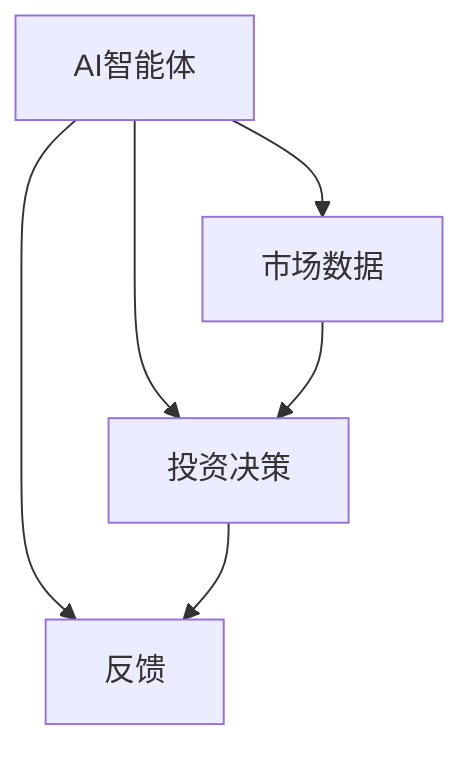
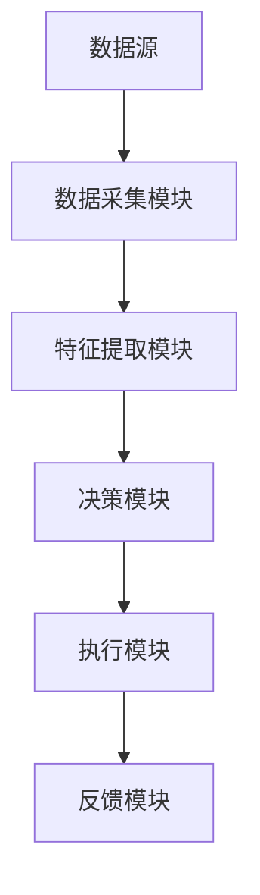

                 


# AI智能体实现巴菲特的焦点投资策略

## 关键词
- AI智能体、巴菲特投资策略、焦点投资、价值投资、强化学习、金融数据分析、自动化投资系统

## 摘要
本文探讨如何利用AI智能体实现巴菲特的经典焦点投资策略，通过分析价值投资的核心要素，结合AI技术，构建智能化的投资决策系统。文章从背景、概念、算法、系统设计到实战案例，全面解析AI在投资领域的应用，为投资者提供高效的投资工具和方法。

---

# 引言
巴菲特的投资策略以价值投资为核心，强调长期持有优质股票，追求长期稳定的收益。AI技术的发展为投资领域带来了新的可能性，AI智能体能够通过数据驱动和自动化决策，辅助投资者实现巴菲特的策略。本文将系统地探讨如何设计和实现这样的AI智能体。

---

## 第一部分：背景介绍

### 第1章：巴菲特投资策略概述

#### 1.1 巴菲特投资策略的核心理念
- **价值投资**：寻找被市场低估的公司，长期持有，等待其价值回归。
- **长期投资**：避免短期市场波动，关注公司基本面。
- **风险管理**：分散投资，避免过度集中在单一行业或公司。

#### 1.2 巴菲特投资策略的应用场景
- **行业分析**：识别具有竞争优势的行业。
- **公司选择**：评估财务状况、管理层素质、盈利能力。
- **市场波动**：在市场低迷时寻找投资机会。

### 第2章：AI在投资策略中的应用前景
- **数据处理能力**：AI能够快速分析大量数据，识别投资机会。
- **自动化决策**：通过强化学习优化投资组合。
- **风险管理**：实时监控市场变化，降低风险。

---

## 第二部分：核心概念与联系

### 第3章：AI智能体的核心概念

#### 3.1 AI智能体的定义与特点
- **定义**：AI智能体是一种能够感知环境、自主决策并执行任务的智能系统。
- **特点**：自主性、反应性、目标导向、学习能力。

#### 3.2 巴菲特策略与AI智能体的结合
- **数据驱动**：AI通过分析历史数据，识别巴菲特投资策略中的模式。
- **动态调整**：AI能够根据市场变化实时调整投资组合。

#### 3.3 对比分析
| **传统投资方法** | **AI驱动方法** |
|--------------------|------------------|
| 依赖人工分析       | 数据驱动决策     |
| 反应较慢           | 实时调整         |
| 依赖经验           | 基于算法优化     |

#### 3.4 实体关系图


---

## 第三部分：算法原理

### 第4章：强化学习在投资策略中的应用

#### 4.1 强化学习算法
- **Q-learning算法**：通过状态-动作-奖励的循环优化决策。
  $$ Q(s, a) = Q(s, a) + \alpha (r + \gamma \max Q(s', a') - Q(s, a)) $$
- **策略梯度法**：直接优化策略，最大化预期收益。

#### 4.2 算法实现步骤
1. 初始化Q表。
2. 接收市场状态。
3. 选择动作（投资或不投资）。
4. 执行动作，获得奖励。
5. 更新Q表。

#### 4.3 Python代码实现
```python
import numpy as np

# 初始化Q表
Q = np.zeros((state_space, action_space))

# Q-learning算法
def q_learning(state, action):
    learning_rate = 0.1
    discount_factor = 0.9
    next_state = get_next_state(state, action)
    Q[state][action] += learning_rate * (reward + discount_factor * np.max(Q[next_state])) - Q[state][action]
    return Q
```

#### 4.4 数学模型与公式
- **Q-learning公式**：$$ Q(s, a) = Q(s, a) + \alpha (r + \gamma \max Q(s', a') - Q(s, a)) $$
- **策略优化**：最大化期望收益，$$ \max_{\theta} \mathbb{E}[R] $$

---

## 第四部分：系统分析与架构设计

### 第5章：系统设计

#### 5.1 系统功能模块
- **数据采集**：获取市场数据。
- **特征提取**：分析财务指标、市场趋势。
- **决策模块**：基于强化学习做出投资决策。

#### 5.2 系统架构图


#### 5.3 接口设计
- 数据接口：与数据源交互，获取实时数据。
- 决策接口：输出投资指令，如买入或卖出。

---

## 第五部分：项目实战

### 第6章：案例分析

#### 6.1 环境配置
- **工具安装**：安装Python、TensorFlow、Pandas。
- **数据获取**：从Yahoo Finance获取股票数据。

#### 6.2 核心代码实现
```python
import pandas as pd
import numpy as np
from tensorflow.keras import layers

# 加载数据
data = pd.read_csv('stock_data.csv')

# 构建模型
model = layers.Sequential([
    layers.Dense(64, activation='relu'),
    layers.Dense(1, activation='linear')
])

# 编译模型
model.compile(optimizer='adam', loss='mse')

# 训练模型
model.fit(data[['open', 'high', 'low']], data['close'], epochs=100)
```

#### 6.3 案例分析
- **训练结果**：模型预测股票价格，与实际价格对比。
- **策略评估**：计算收益、风险调整后的收益。

---

## 第六部分：总结与展望

### 第7章：总结
- **主要内容回顾**：AI智能体如何实现巴菲特策略。
- **技术优势**：数据处理能力强、决策效率高。

### 第8章：未来展望
- **技术改进**：结合NLP分析公司新闻。
- **扩展应用**：与其他投资策略结合，如趋势跟踪。

---

## 结语
通过本文的探讨，AI智能体在实现巴菲特投资策略中展现了巨大潜力。未来，随着技术进步，AI将为投资领域带来更多创新和效率提升。

---

## 作者
作者：AI天才研究院 & 禅与计算机程序设计艺术

