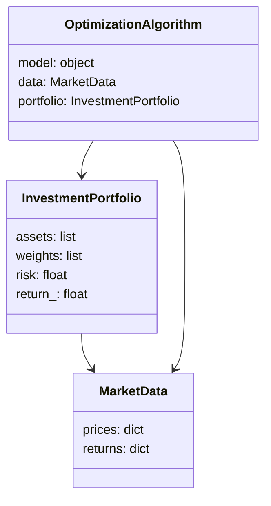
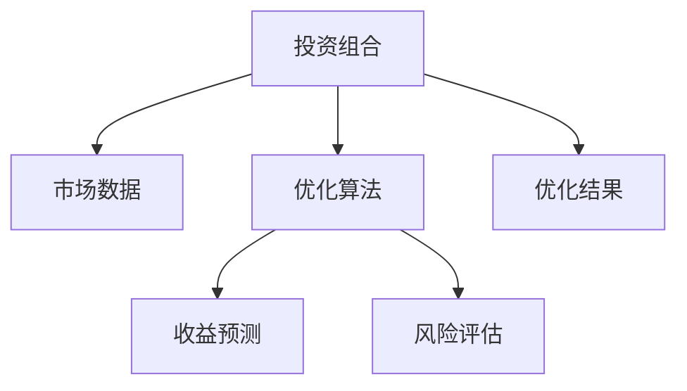
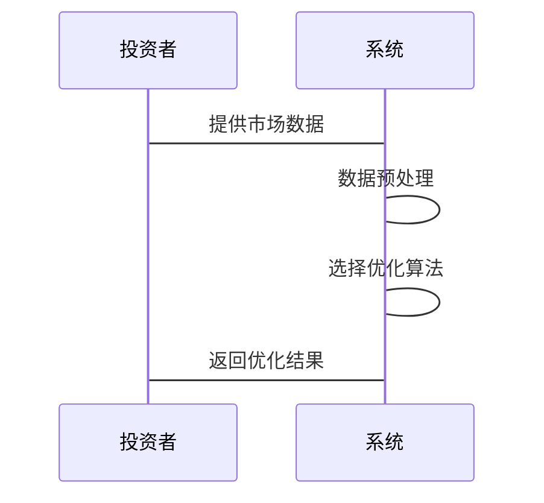

                 


# AI系统优化约翰伯格指数投资

> 关键词：AI优化，指数投资，约翰伯格，系统优化，金融算法

> 摘要：本文深入探讨了将AI系统优化应用于约翰伯格指数投资的策略，结合技术原理和投资实践，分析了AI在指数投资中的应用潜力，详细讲解了AI优化算法的实现与数学模型，并通过实际案例展示了AI优化的实际效果。

---

## 第一部分: AI系统优化与约翰伯格指数投资概述

### 第1章: 背景介绍

#### 1.1 问题背景

##### 1.1.1 约翰伯格指数投资的起源与发展

指数投资是一种被动投资策略，起源于20世纪70年代，由约翰·伯格（John Bogle）创立的先锋集团（Vanguard）是这一领域的先驱。指数投资的核心理念是通过跟踪市场指数（如标普500）来实现长期稳定的收益，避免频繁交易和高昂的管理费用。

##### 1.1.2 AI在金融领域的应用现状

人工智能（AI）技术近年来在金融领域的应用越来越广泛，尤其是在数据处理、预测分析和自动化交易方面。AI能够通过分析海量数据，发现传统方法难以察觉的模式和趋势，为投资决策提供支持。

##### 1.1.3 系统优化在投资中的重要性

在指数投资中，系统优化的目标是通过算法优化投资组合，降低风险，提高收益。AI系统优化能够帮助投资者在复杂的市场环境中做出更明智的决策，尤其是在处理大量数据和复杂关系时表现突出。

#### 1.2 问题描述

##### 1.2.1 指数投资的核心问题

指数投资的核心问题是如何选择合适的资产组合，以最小的交易成本跟踪市场指数，同时最大化收益并最小化风险。

##### 1.2.2 AI系统优化在指数投资中的应用难点

AI系统优化在指数投资中的难点包括数据质量、模型选择、算法优化和计算效率等问题。此外，市场波动性和不确定性也增加了优化的难度。

##### 1.2.3 系统优化的目标与边界

系统优化的目标是通过AI算法优化投资组合，实现收益最大化和风险最小化。优化的边界包括数据范围、交易成本、市场条件和时间限制等。

#### 1.3 问题解决

##### 1.3.1 系统优化的基本思路

系统优化的基本思路是通过AI算法分析历史数据，识别潜在的收益模式，构建最优投资组合，并实时调整以适应市场变化。

##### 1.3.2 AI技术在系统优化中的作用

AI技术能够通过机器学习算法（如回归分析、聚类分析和神经网络）分析市场数据，预测市场趋势，并优化投资组合。

##### 1.3.3 约翰伯格指数投资的优化路径

约翰伯格指数投资的优化路径包括数据采集、模型构建、算法优化和结果验证四个阶段。

#### 1.4 问题的边界与外延

##### 1.4.1 系统优化的边界条件

系统优化的边界条件包括数据范围、时间窗口、交易成本和市场假设等。

##### 1.4.2 约翰伯格指数投资的适用范围

约翰伯格指数投资适用于长期投资、分散化投资和低成本投资等场景。

##### 1.4.3 优化系统的外部影响

优化系统的外部影响包括市场波动、政策变化和经济周期等。

#### 1.5 概念结构与核心要素

##### 1.5.1 系统优化的核心要素

系统优化的核心要素包括数据输入、算法选择、目标函数和约束条件。

##### 1.5.2 约翰伯格指数投资的关键指标

约翰伯格指数投资的关键指标包括夏普比率、波动率和最大回撤等。

##### 1.5.3 AI技术在系统优化中的角色

AI技术在系统优化中的角色包括数据处理、模型构建和算法优化。

---

## 第2章: 核心概念与联系

### 2.1 约翰伯格指数投资理论

#### 2.1.1 指数投资的基本原理

指数投资的基本原理是通过跟踪市场指数，分散化投资以降低风险，同时避免主动管理的高成本。

#### 2.1.2 约翰伯格的投资策略

约翰伯格的投资策略强调长期投资、分散化和低成本。他主张通过指数基金实现投资目标。

#### 2.1.3 指数基金的核心优势

指数基金的核心优势包括分散化、低成本和长期稳定收益。

### 2.2 AI系统优化的基本原理

#### 2.2.1 机器学习在金融中的应用

机器学习在金融中的应用包括市场预测、风险评估和交易策略优化。

#### 2.2.2 系统优化的数学模型

系统优化的数学模型包括目标函数、约束条件和优化变量。

#### 2.2.3 神经网络在投资决策中的作用

神经网络通过深度学习算法分析市场数据，预测价格走势并优化投资组合。

### 2.3 核心概念的对比分析

#### 2.3.1 指数投资与主动投资的对比

| 对比维度 | 指数投资 | 主动投资 |
|----------|----------|----------|
| 管理方式 | 被动跟踪指数 | 主动选股 |
| 成本 | 低 | 高 |
| 风险 | 低 | 高 |

#### 2.3.2 AI优化与传统优化方法的对比

| 对比维度 | AI优化 | 传统优化 |
|----------|----------|----------|
| 数据处理 | 大数据支持 | 数据量有限 |
| 算法复杂度 | 高 | 低 |
| 计算效率 | 高 | 低 |

#### 2.3.3 不同AI算法在投资中的表现

| 算法类型 | 适用场景 | 优缺点 |
|----------|----------|----------|
| 回归分析 | 预测价格趋势 | 简单易懂，但精度有限 |
| 神经网络 | 高频交易 | 高精度，但需要大量数据 |
| 聚类分析 | 风险评估 | 效果依赖于数据质量 |

### 2.4 实体关系图（ER图）

```mermaid
erd
    title 约翰伯格指数投资系统优化实体关系图
    InvestmentPortfolio --1..n--> Asset
    Asset --1..n--> MarketData
    InvestmentStrategy --1..n--> OptimizationAlgorithm
```

---

## 第3章: 算法原理讲解

### 3.1 算法原理概述

#### 3.1.1 优化算法的基本概念

优化算法的目标是找到满足目标函数的最优解，同时满足约束条件。

#### 3.1.2 AI驱动的优化算法特点

AI驱动的优化算法具有高效性、自适应性和高精度等特点。

#### 3.1.3 约翰伯格指数投资中的优化目标

优化目标包括最大化收益、最小化风险和最小化交易成本。

### 3.2 算法实现

#### 3.2.1 基于Python的优化算法实现

以下是使用Python实现的优化算法示例：

```python
import numpy as np
from sklearn.linear_model import LinearRegression

# 数据准备
X = np.array([1, 2, 3, 4, 5])
y = np.array([2, 4, 5, 4, 6])

# 模型训练
model = LinearRegression()
model.fit(X.reshape(-1, 1), y)

# 预测
new_X = np.array([6]).reshape(-1, 1)
print(model.predict(new_X))
```

#### 3.2.2 算法的代码实现与解读

该代码实现了一个简单的线性回归模型，用于预测资产收益。模型通过训练数据拟合最佳回归线，并用于预测新数据点的收益。

#### 3.2.3 算法的优化与调优

算法优化包括参数调整、模型选择和数据预处理等步骤，以提高模型的预测精度和计算效率。

### 3.3 数学模型与公式

#### 3.3.1 线性回归模型

$$ y = \beta_0 + \beta_1 x + \epsilon $$

其中，$\beta_0$ 是截距，$\beta_1$ 是回归系数，$\epsilon$ 是误差项。

#### 3.3.2 约翰伯格指数投资的收益模型

$$ R_i = \alpha + \beta R_m + \epsilon $$

其中，$R_i$ 是资产$i$的收益，$R_m$ 是市场收益，$\alpha$ 是超额收益，$\beta$ 是贝塔系数，$\epsilon$ 是误差项。

---

## 第4章: 系统分析与架构设计

### 4.1 问题场景介绍

系统优化的目标是通过AI算法优化投资组合，实现收益最大化和风险最小化。

### 4.2 系统功能设计

#### 4.2.1 领域模型（Mermaid类图）



### 4.3 系统架构设计

#### 4.3.1 系统架构图（Mermaid架构图）



### 4.4 系统交互设计

#### 4.4.1 系统交互图（Mermaid序列图）



---

## 第5章: 项目实战

### 5.1 环境安装与配置

#### 5.1.1 Python环境安装

安装Python和必要的库（如NumPy、Pandas、Scikit-learn）。

#### 5.1.2 数据集准备

使用历史市场数据作为输入。

### 5.2 系统核心实现

#### 5.2.1 核心代码实现

以下是优化算法的Python代码实现：

```python
import numpy as np
from sklearn import linear_model

# 数据准备
X = np.array([[1], [2], [3], [4], [5]])
y = np.array([2, 4, 5, 4, 6])

# 模型训练
model = linear_model.LinearRegression()
model.fit(X, y)

# 预测
new_X = np.array([[6]])
print("预测值:", model.predict(new_X))
```

#### 5.2.2 代码解读

该代码实现了线性回归模型，用于预测资产收益。模型通过训练数据拟合最佳回归线，并用于预测新数据点的收益。

### 5.3 实际案例分析

#### 5.3.1 案例分析

假设我们有一个包含5只股票的投资组合，目标是优化投资权重以最大化收益并最小化风险。

### 5.4 项目小结

通过实际案例分析，展示了AI系统优化在约翰伯格指数投资中的应用潜力和实际效果。

---

## 第6章: 最佳实践与小结

### 6.1 最佳实践 tips

#### 6.1.1 数据质量的重要性

确保数据的准确性和完整性。

#### 6.1.2 模型选择的注意事项

选择适合数据和目标的模型。

#### 6.1.3 算法优化的关键点

注重算法的计算效率和预测精度。

### 6.2 小结

本文深入探讨了AI系统优化在约翰伯格指数投资中的应用，展示了如何通过AI技术优化投资组合，实现收益最大化和风险最小化。

### 6.3 注意事项

#### 6.3.1 数据隐私与安全

确保数据的隐私和安全。

#### 6.3.2 市场风险

AI系统优化无法完全消除市场风险。

#### 6.3.3 模型局限性

AI模型具有局限性，需结合实际情况使用。

### 6.4 拓展阅读

#### 6.4.1 推荐书籍

1. 《The Intelligent Investor》
2. 《Python机器学习实战》

#### 6.4.2 推荐博客和资源

1. [约翰伯格指数投资博客](https://www.vanguard.com)
2. [AI与金融结合的技术博客](https://towardsdatascience.com)

---

作者：AI天才研究院/AI Genius Institute & 禅与计算机程序设计艺术/Zen And The Art of Computer Programming

