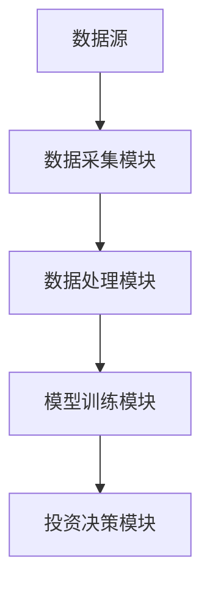

                 


# AI系统如何平衡质量与价格在价值投资中的作用

## 关键词：AI系统，价值投资，质量与价格平衡，机器学习，深度学习，金融分析

## 摘要：本文探讨了AI系统如何在价值投资中平衡质量与价格。通过分析AI技术在数据处理、模型构建和投资决策中的应用，详细阐述了质量与价格的动态关系，并通过实际案例展示了AI在价值投资中的优势与挑战。

---

## 第1章: 价值投资与AI的结合概述

### 1.1 价值投资的核心概念

#### 1.1.1 价值投资的定义与历史发展
价值投资是一种以基本面分析为基础的投资策略，强调购买被市场低估的优质资产。其核心思想是通过深入分析公司的财务状况、行业地位和竞争优势，寻找具有长期增长潜力的企业。价值投资的理念起源于本杰明·格雷厄姆和戴维·多德的工作，经过数十年的发展，已成为投资领域的重要流派。

#### 1.1.2 价值投资的核心要素
- **公司基本面**：包括财务报表分析（如利润表、资产负债表、现金流量表）和财务指标（如市盈率、市净率、股息率等）。
- **行业地位**：公司所在行业的竞争地位，包括市场占有率、行业壁垒等。
- **竞争优势**：公司是否具备可持续的竞争优势，如专利、品牌、技术壁垒等。

#### 1.1.3 价值投资与AI技术的结合背景
随着大数据和人工智能技术的发展，传统价值投资方法逐渐与AI技术结合，以提高投资决策的效率和准确性。AI技术可以通过处理海量数据、识别复杂模式和提供实时反馈，帮助投资者更精准地评估公司质量和市场价格之间的关系。

---

### 1.2 AI在金融领域的应用现状

#### 1.2.1 AI在金融分析中的应用
AI技术广泛应用于金融市场的数据分析、风险评估和投资组合优化等领域。例如，自然语言处理（NLP）技术可以分析公司财报和新闻，提取情感和关键词，帮助投资者评估市场情绪。

#### 1.2.2 AI在投资决策中的作用
AI系统可以通过机器学习模型预测股票价格走势，识别市场趋势，并辅助投资决策。例如，基于强化学习的算法可以在模拟交易环境中优化投资策略。

#### 1.2.3 当前AI在价值投资中的挑战与机遇
- **挑战**：AI模型的黑箱特性使得其决策过程难以解释；数据质量和噪声可能影响模型的准确性。
- **机遇**：AI技术可以处理海量数据，发现传统方法难以识别的投资机会。

---

## 第2章: 质量与价格的定义与关联

### 2.1 价值投资中的质量维度

#### 2.1.1 公司基本面分析
公司基本面分析是评估公司质量的重要方法。以下是几个关键的财务指标：

- **市盈率（P/E）**：股价与每股收益的比率，反映市场对公司盈利能力的预期。
- **市净率（P/B）**：股价与每股净资产的比率，衡量公司股价相对于账面价值的高低。
- **股息率**：公司股息与股价的比率，反映公司分红能力。

#### 2.1.2 财务指标与公司质量评估
通过分析财务指标，可以评估公司的盈利能力、成长性和偿债能力。例如，ROE（净资产收益率）高且稳定的公司通常被视为优质投资标的。

#### 2.1.3 行业地位与竞争优势
公司是否在行业内具有领先地位，是否具备独特的竞争优势，是评估公司质量的重要因素。例如，苹果公司在科技行业具有强大的品牌和技术壁垒。

---

### 2.2 价格与市场的动态关系

#### 2.2.1 市场定价机制
股票价格由市场供求关系决定，反映了市场参与者对公司的未来预期。然而，市场情绪和短期波动可能导致价格偏离其内在价值。

#### 2.2.2 市场情绪与价格波动
市场情绪是影响价格波动的重要因素。例如，投资者的恐慌情绪可能导致市场抛售，从而压低股价。

#### 2.2.3 价格与价值的偏离与回归
价值投资的核心理念是寻找价格低于内在价值的股票。当价格低于价值时，股票具有投资潜力；当价格回归其价值时，投资者可以实现收益。

---

### 2.3 质量与价格的平衡点

#### 2.3.1 质量与价格的动态平衡
质量与价格的关系并非固定，而是随着市场环境的变化而动态调整。例如，在市场低迷时期，优质公司的股票可能被低估，提供了较高的投资价值。

#### 2.3.2 不同市场环境下的平衡策略
在牛市中，投资者可能更关注短期价格波动；在熊市中，优质公司的长期价值可能更受关注。

#### 2.3.3 AI在平衡过程中的角色
AI系统可以通过分析历史数据和市场趋势，帮助投资者找到质量与价格的平衡点。例如，AI可以预测公司未来盈利能力的变化，并结合当前股价，评估其投资价值。

---

## 第3章: AI算法在价值投资中的应用

### 3.1 数据收集与特征提取

#### 3.1.1 数据来源与处理
AI系统需要收集多源数据，包括市场数据、公司财报、新闻媒体等。数据处理步骤包括清洗、转换和标准化。

#### 3.1.2 特征提取与选择
特征提取是将数据转化为有助于模型分析的特征。例如，从公司财报中提取ROE、毛利率等财务指标。

---

### 3.2 AI算法原理与实现

#### 3.2.1 机器学习算法在价值投资中的应用
- **监督学习**：用于预测股票价格，分类股票是否具有投资价值。
- **无监督学习**：用于聚类分析，识别具有相似特征的股票群体。

#### 3.2.2 深度学习模型在价值投资中的优势
- **神经网络**：用于处理非结构化数据，如新闻文本的情感分析。
- **Transformer模型**：用于时间序列分析，预测股票价格走势。

#### 3.2.3 算法实现与优化
算法优化包括参数调优和模型评估。例如，使用交叉验证评估模型的准确性和稳定性。

---

## 第4章: 系统架构与项目实战

### 4.1 系统架构设计

#### 4.1.1 系统功能模块划分
- **数据采集模块**：负责获取市场数据和公司财报。
- **数据处理模块**：对数据进行清洗和特征提取。
- **模型训练模块**：训练机器学习或深度学习模型。
- **投资决策模块**：根据模型输出生成投资建议。

#### 4.1.2 系统架构图


---

## 第5章: 项目实战与代码实现

### 5.1 项目实战

#### 5.1.1 环境搭建
安装必要的库，如Python的pandas、numpy、scikit-learn等。

#### 5.1.2 代码实现
以下是一个简单的机器学习模型实现代码，用于预测股票价格：

```python
import pandas as pd
import numpy as np
from sklearn.model_selection import train_test_split
from sklearn.linear_model import LinearRegression

# 加载数据
data = pd.read_csv('stock_data.csv')

# 特征选择
features = ['PE', 'PB', 'ROE']
target = 'Price'

# 数据分割
X = data[features]
y = data[target]
X_train, X_test, y_train, y_test = train_test_split(X, y, test_size=0.2, random_state=42)

# 模型训练
model = LinearRegression()
model.fit(X_train, y_train)

# 模型预测
y_pred = model.predict(X_test)

# 模型评估
from sklearn.metrics import mean_squared_error
mse = mean_squared_error(y_test, y_pred)
print(f'均方误差：{mse}')
```

---

## 第6章: 案例分析与总结

### 6.1 案例分析
通过实际案例分析，展示AI系统如何在价值投资中平衡质量和价格。例如，分析某公司的基本面和股价走势，评估AI模型的投资建议是否准确。

### 6.2 总结
总结AI系统在价值投资中的应用前景和挑战，强调AI技术的优势和局限性，并提出未来研究方向。

---

## 作者：AI天才研究院/AI Genius Institute & 禅与计算机程序设计艺术 /Zen And The Art of Computer Programming

---

这篇文章系统地介绍了AI系统如何在价值投资中平衡质量与价格，从理论到实践，为读者提供了全面的指导和深入的分析。

