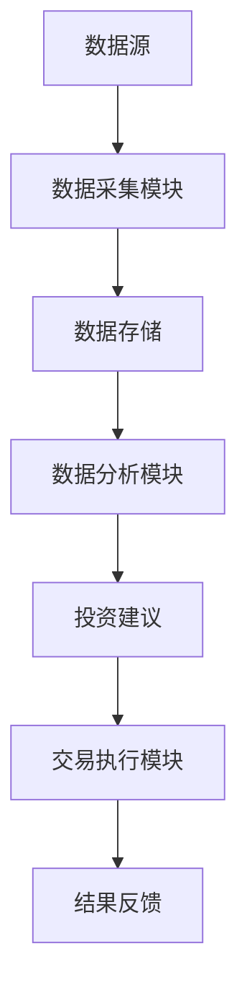

                 


# AI系统如何应用约翰·伯格的低成本投资策略

## 关键词：
- AI系统，约翰·伯格，低成本投资策略，机器学习，投资模型

## 摘要：
本文探讨如何将AI技术应用于约翰·伯格的低成本投资策略。通过分析低成本投资的核心理念，结合机器学习算法，构建智能投资系统，优化投资决策，降低成本，提高收益。

---

# 引言：AI驱动的低成本投资新时代

## 1.1 低成本投资策略的背景
- 约翰·伯格的低成本指数基金策略，强调长期持有和分散投资，避免高额交易费用。
- 传统投资中的高成本问题，如管理费、交易佣金等，影响投资者收益。
- 低成本投资策略的核心是通过指数基金实现市场平均收益，降低主动管理成本。

## 1.2 AI技术在金融领域的应用
- 数据分析：处理海量市场数据，发现潜在投资机会。
- 预测模型：利用机器学习预测市场趋势，优化投资组合。
- 自动化交易：基于算法快速决策，减少人为干预误差。

## 1.3 结合AI与低成本投资策略的意义
- 提高投资决策的科学性，降低人为判断失误。
- 优化投资组合，降低成本，提升收益。
- 实现个性化投资建议，满足不同投资者需求。

---

## 第一部分：低成本投资策略的核心原理

## 2.1 约翰·伯格投资哲学
- 长期投资：相信市场会趋向平均收益，避免频繁交易。
- 分散投资：通过指数基金降低风险。
- 成本控制：降低各项费用，提升净收益。

## 2.2 低成本投资策略的特点
- 低管理费用：指数基金的管理费低于主动管理型基金。
- 高流动性：投资者可以随时买卖基金份额。
- 风险分散：通过投资市场指数降低个股风险。

---

## 第二部分：AI技术在投资中的应用潜力

## 3.1 数据分析与市场预测
- 利用机器学习处理非结构化数据，如新闻、社交媒体，预测市场趋势。
- 通过时间序列分析模型，如ARIMA，预测股票价格。

## 3.2 个性化投资建议
- 基于投资者风险承受能力和财务目标，构建个性化投资组合。
- 利用协同过滤算法，推荐适合投资者的基金产品。

## 3.3 自动化交易系统
- 基于算法自动执行买卖指令，减少人为决策延迟。
- 通过高频交易策略，在短时间内捕捉微小价格波动。

---

## 第三部分：AI驱动的投资模型构建

## 4.1 数据预处理
- 清洗数据：处理缺失值、异常值，确保数据质量。
- 特征提取：从市场数据中提取有用的特征，如市盈率、市净率等。

## 4.2 机器学习模型训练
- 使用回归模型预测股票价格：线性回归模型。
- 使用分类模型判断市场趋势：随机森林模型。

## 4.3 模型评估与优化
- 使用交叉验证评估模型性能。
- 调整超参数，优化模型表现。

---

## 第四部分：系统架构设计

## 5.1 系统功能设计
- 数据采集模块：实时采集市场数据。
- 数据分析模块：处理数据，生成投资建议。
- 交易执行模块：根据模型预测执行交易。

## 5.2 系统架构图


---

## 第五部分：项目实战与代码实现

## 6.1 环境安装
- Python环境：安装NumPy、Pandas、Scikit-learn等库。
- 数据源：获取历史股价数据，如AAPL股票。

## 6.2 代码实现
```python
import numpy as np
import pandas as pd
from sklearn.linear_model import LinearRegression
from sklearn.metrics import mean_squared_error

# 数据加载
data = pd.read_csv('aapl.csv')

# 数据预处理
X = data[['open', 'high', 'low', 'volume']]
y = data['close']

# 模型训练
model = LinearRegression()
model.fit(X, y)

# 模型预测
y_pred = model.predict(X)

# 模型评估
mse = mean_squared_error(y, y_pred)
print(f"均方误差：{mse}")
```

---

## 第六部分：总结与展望

## 7.1 总结
- AI技术能够显著提升投资决策的科学性，优化投资组合。
- 低成本投资策略与AI结合，降低投资成本，提升收益。

## 7.2 注意事项
- 数据质量影响模型性能，需谨慎处理数据。
- 模型有局限性，需结合市场实际情况进行调整。

## 7.3 未来展望
- 更多数据源的整合，提升模型预测能力。
- AI在风险管理中的深度应用，降低投资风险。

---

## 作者：AI天才研究院 & 禅与计算机程序设计艺术

---

通过将AI技术应用于约翰·伯格的低成本投资策略，投资者能够以更低的成本实现更优的投资效果。未来，随着AI技术的不断发展，投资领域将更加智能化和高效化。

