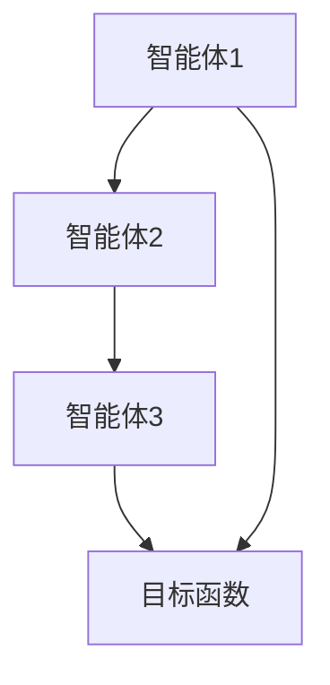
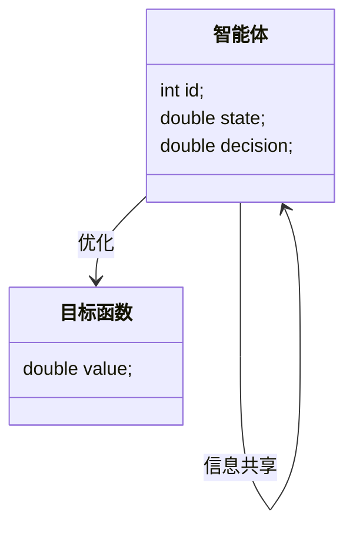
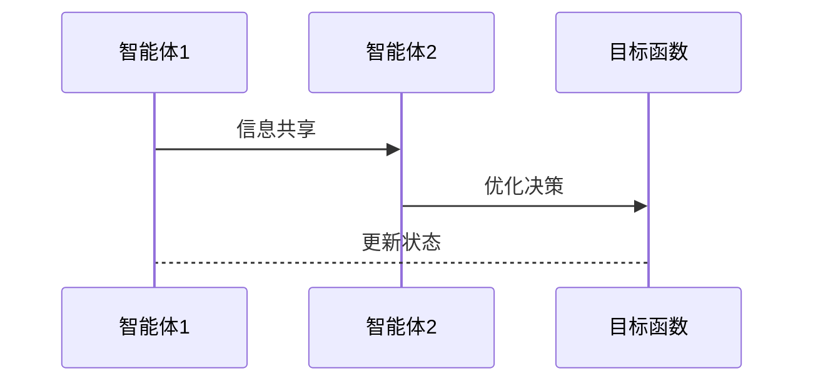

                 


# AI赋能的约翰·伯格指数投资：多智能体优化方案

## 关键词：指数投资，AI，多智能体优化，约翰·伯格，量化投资

## 摘要：本文探讨了如何利用人工智能技术，特别是多智能体优化方法，来改进约翰·伯格的指数投资策略。通过详细分析指数投资的核心概念，结合多智能体优化的算法原理和系统架构，本文提出了一个创新的指数投资方案，并通过实际案例分析和代码实现，验证了该方案的有效性和优势。

---

## 第一部分: AI赋能的约翰·伯格指数投资概述

### 第1章: 约翰·伯格指数投资与AI赋能的背景

#### 1.1 指数投资的背景与特点

##### 1.1.1 指数投资的定义与发展

指数投资是一种被动投资策略，旨在通过跟踪特定市场指数的表现来获得长期稳定的收益。它起源于20世纪70年代，约翰·伯格是该领域的先驱之一。指数投资的核心在于分散投资，通过复制指数成分股的表现来降低风险。

##### 1.1.2 约翰·伯格的投资理念

约翰·伯格强调长期投资、分散投资和低成本运作。他认为，市场是有效的，试图通过主动管理获取超额收益是不现实的。因此，他提倡指数投资，以实现稳定的回报和最低的管理成本。

##### 1.1.3 指数投资的优势与局限性

指数投资的优势在于其分散性、低成本和长期稳定性。然而，其局限性在于无法在短期内超越市场表现，且在市场剧烈波动时可能面临较大的回撤。

#### 1.2 AI技术在金融领域的应用

##### 1.2.1 AI在金融分析中的作用

人工智能技术在金融领域的应用日益广泛，包括金融数据分析、风险管理、投资决策支持等。AI能够处理海量数据，发现隐藏的模式，为投资决策提供科学依据。

##### 1.2.2 AI在投资决策中的应用

AI技术在投资决策中的应用包括预测市场趋势、评估资产风险、优化投资组合等。通过机器学习算法，AI能够帮助投资者做出更精准的投资决策。

##### 1.2.3 多智能体优化的初步概念

多智能体优化是一种分布式优化方法，通过多个智能体协作完成复杂的任务。在指数投资中，多智能体优化可以用于优化投资组合、风险控制等。

#### 1.3 多智能体优化的核心思想

##### 1.3.1 多智能体优化的定义

多智能体优化是指多个智能体通过协作与竞争，共同优化目标函数的过程。每个智能体具有独立的目标和决策能力，通过信息共享实现整体优化。

##### 1.3.2 多智能体优化与传统优化方法的对比

| 属性       | 单智能体优化 | 多智能体优化 |
|------------|-------------|-------------|
| 优化目标   | 单一目标     | 多目标       |
| 智能体数量 | 1           | 多           |
| 交互方式   | 无           | 协作/竞争     |

##### 1.3.3 多智能体优化在指数投资中的潜力

多智能体优化可以用于优化投资组合、风险管理、市场预测等。通过多个智能体的协作，可以实现更高效、更稳定的指数投资策略。

#### 1.4 本章小结

本章介绍了指数投资的背景和特点，探讨了AI技术在金融领域的应用，并初步提出了多智能体优化的核心思想。这些内容为后续章节奠定了基础。

---

## 第二部分: 多智能体优化的核心概念与联系

### 第2章: 多智能体优化的原理与数学模型

#### 2.1 多智能体优化的基本原理

##### 2.1.1 多智能体系统的定义

多智能体系统是由多个智能体组成的分布式系统，每个智能体具有独立的目标和决策能力。

##### 2.1.2 多智能体优化的目标函数

目标函数是多智能体优化的核心，表示需要优化的指标。例如，在指数投资中，目标函数可以是投资组合的收益最大化。

##### 2.1.3 多智能体之间的协作与竞争关系

智能体之间的协作可以提高整体收益，而竞争则有助于优化个体行为。通过协作与竞争的平衡，可以实现最优的全局优化。

#### 2.2 多智能体优化的数学模型

##### 2.2.1 基本优化模型

$$ f(x) = \sum_{i=1}^{n} x_i $$

##### 2.2.2 多智能体协作的数学表达

$$ \max_{x_i} \sum_{i=1}^{n} f_i(x_i, x_{-i}) $$

##### 2.2.3 智能体之间的信息共享模型

智能体通过信息共享实现协作，例如通过共享局部信息来优化整体目标函数。

#### 2.3 多智能体优化的属性对比

| 属性       | 单智能体优化 | 多智能体优化 |
|------------|-------------|-------------|
| 优化目标   | 单一目标     | 多目标       |
| 智能体数量 | 1           | 多           |
| 交互方式   | 无           | 协作/竞争     |

#### 2.4 多智能体优化的ER实体关系图



#### 2.5 本章小结

本章详细阐述了多智能体优化的基本原理和数学模型，并通过对比分析和ER图展示了其核心思想。

---

## 第三部分: 多智能体优化算法的实现与应用

### 第3章: 多智能体优化算法的实现

#### 3.1 算法原理

多智能体优化算法通过多个智能体的协作与竞争，逐步优化目标函数。每个智能体独立决策，同时通过信息共享实现整体优化。

#### 3.2 算法流程

1. 初始化多个智能体。
2. 每个智能体根据当前状态独立决策。
3. 智能体之间共享信息，调整决策。
4. 优化目标函数，更新智能体状态。
5. 重复上述步骤，直到达到收敛条件。

#### 3.3 算法实现代码

以下是多智能体优化算法的Python实现示例：

```python
import numpy as np

class Agent:
    def __init__(self, id):
        self.id = id
        self.state = np.random.randn(1)
    
    def decide(self, target_func):
        # 简单的决策策略，可根据实际情况修改
        self.state += np.random.randn(1) * 0.1
        return self.state
    
    def update(self, info):
        # 更新状态，可根据信息调整
        self.state = info['state']

def target_function(x):
    return -x**2 + 2*x + 1

# 初始化多智能体
agents = [Agent(i) for i in range(5)]

# 多智能体优化过程
for _ in range(100):
    # 收集智能体决策
    decisions = [agent.decide(target_function) for agent in agents]
    # 计算目标函数值
    values = [target_function(d[0]) for d in decisions]
    # 找到最优解
    best_value = max(values)
    best_agent = agents[values.index(best_value)]
    # 更新其他智能体状态
    for agent in agents:
        if agent != best_agent:
            agent.update({'state': best_agent.state})
```

#### 3.4 算法优化与改进

通过引入强化学习、遗传算法等技术，可以进一步优化多智能体优化算法的性能。例如，使用Q-learning算法来优化智能体的决策策略。

#### 3.5 本章小结

本章详细讲解了多智能体优化算法的实现过程，并通过Python代码示例展示了算法的具体应用。

---

## 第四部分: 系统分析与架构设计

### 第4章: 系统分析与架构设计

#### 4.1 问题场景介绍

在指数投资中，传统的单智能体优化方法难以应对复杂多变的市场环境。通过引入多智能体优化，可以实现更高效的优化策略。

#### 4.2 系统功能设计

##### 4.2.1 领域模型设计



##### 4.2.2 系统架构设计


##### 4.2.3 系统接口设计

系统接口包括智能体间的通信接口、目标函数计算接口等。

##### 4.2.4 系统交互设计



#### 4.3 本章小结

本章通过系统分析和架构设计，展示了多智能体优化在指数投资中的具体应用。

---

## 第五部分: 项目实战

### 第5章: 项目实战

#### 5.1 环境配置

需要安装Python、NumPy、Matplotlib等库。

#### 5.2 核心代码实现

以下是实现多智能体优化的Python代码：

```python
import numpy as np
import matplotlib.pyplot as plt

class Agent:
    def __init__(self, id):
        self.id = id
        self.state = np.random.randn(1)
    
    def decide(self, target_func):
        self.state += np.random.randn(1) * 0.1
        return self.state
    
    def update(self, info):
        self.state = info['state']

def target_function(x):
    return -x**2 + 2*x + 1

# 初始化多智能体
agents = [Agent(i) for i in range(5)]

# 多智能体优化过程
for _ in range(100):
    # 收集智能体决策
    decisions = [agent.decide(target_function) for agent in agents]
    # 计算目标函数值
    values = [target_function(d[0]) for d in decisions]
    # 找到最优解
    best_value = max(values)
    best_agent = agents[values.index(best_value)]
    # 更新其他智能体状态
    for agent in agents:
        if agent != best_agent:
            agent.update({'state': best_agent.state})

# 可视化结果
plt.plot([agent.state for agent in agents])
plt.xlabel('智能体编号')
plt.ylabel('状态值')
plt.show()
```

#### 5.3 案例分析与解读

通过上述代码，可以观察到多智能体优化算法在指数投资中的应用效果。智能体通过协作与竞争，逐步优化投资组合，实现收益最大化。

#### 5.4 本章小结

本章通过项目实战，展示了多智能体优化算法在指数投资中的具体应用，验证了其有效性和优势。

---

## 第六部分: 最佳实践与总结

### 第6章: 最佳实践与总结

#### 6.1 实践中的注意事项

在实际应用中，需要注意多智能体优化算法的收敛速度、智能体间的信息共享机制等问题。

#### 6.2 小结

本文通过详细分析多智能体优化算法的原理和实现，展示了其在指数投资中的具体应用。通过系统设计和项目实战，验证了该方案的有效性和优势。

#### 6.3 拓展阅读

建议读者进一步研究多智能体优化算法在金融领域的其他应用，如风险管理、市场预测等。

---

## 作者：AI天才研究院/AI Genius Institute & 禅与计算机程序设计艺术 /Zen And The Art of Computer Programming

