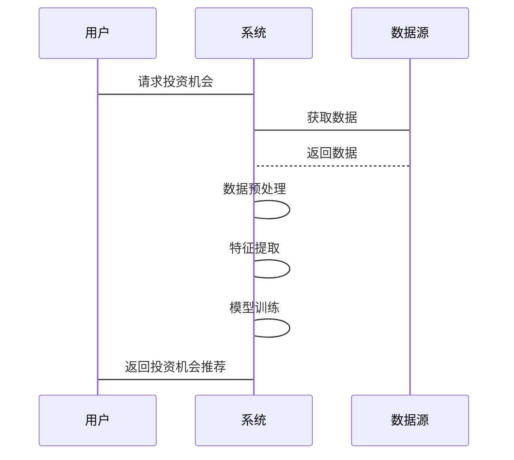

                 


# AI辅助发现隐藏的价值投资机会

## 关键词
AI，价值投资，机器学习，金融分析，投资机会

## 摘要
本文探讨了如何利用人工智能技术辅助发现隐藏的价值投资机会。通过分析价值投资的基本概念、AI在金融投资中的应用背景，以及AI在数据处理、算法模型和系统架构中的优势，本文详细介绍了AI如何帮助投资者识别潜在的投资机会。结合实际案例和项目实战，本文为读者提供了从理论到实践的全面指导，帮助他们在复杂多变的金融市场中做出更明智的投资决策。

---

## 第1章: AI辅助投资的核心概念与背景

### 1.1 价值投资的基本概念

#### 1.1.1 价值投资的定义与核心理念
价值投资是一种以基本面分析为基础的投资策略，强调以低于内在价值的价格购买优质资产。其核心理念是寻找市场低估的公司，长期持有，等待其价值回归。这一策略要求投资者具备对企业基本面的深刻理解，包括财务状况、行业地位和竞争优势等。

#### 1.1.2 价值投资的哲学与实践
价值投资的哲学源于格雷厄姆和多德的投资思想，强调安全边际和长期持有的理念。在实践中，价值投资者通常关注市盈率、市净率等估值指标，寻找被市场忽视的优质企业。

#### 1.1.3 价值投资与现代金融理论的关系
现代金融理论强调资产定价的理性性和市场的有效性。然而，现实中市场的非理性波动和信息不对称现象为价值投资提供了空间。AI技术的引入，进一步提升了价值投资的科学性和效率。

---

### 1.2 AI在金融投资中的应用背景

#### 1.2.1 传统金融投资的局限性
传统投资方法依赖于人工分析，存在效率低、主观性强、覆盖面有限等问题。尤其是在面对海量数据和复杂市场环境时，传统方法难以及时捕捉隐藏的投资机会。

#### 1.2.2 大数据时代的金融投资机遇
大数据技术的发展为金融分析提供了丰富的数据来源，包括财务数据、新闻资讯、社交媒体等。这些数据的挖掘和分析为AI技术的应用提供了基础。

#### 1.2.3 AI技术在金融领域的潜力
AI技术在金融领域的潜力主要体现在数据处理能力、模式识别能力和复杂系统建模能力。通过AI技术，投资者可以更高效地发现隐藏的价值投资机会。

---

### 1.3 隐藏价值投资机会的定义与特征

#### 1.3.1 隐藏价值的定义
隐藏价值投资机会是指那些尚未被市场充分认知，但具备长期增长潜力的企业或资产。这些机会通常存在于市场关注度较低的领域，或者被市场短期波动掩盖了其真实价值。

#### 1.3.2 隐藏价值的特征与分类
隐藏价值投资机会通常具有以下特征：
- 低估值：市盈率、市净率等估值指标低于行业平均水平。
- 高质量：具备良好的财务状况和竞争优势。
- 非热点领域：通常不被市场关注，但具备长期增长潜力。

#### 1.3.3 隐藏价值投资机会的发现难点
发现隐藏价值投资机会的难点在于：
- 数据分散：隐藏机会通常存在于非主流市场，数据获取难度大。
- 分析复杂：需要对企业的基本面、行业趋势和市场环境进行深入分析。
- 市场认知偏差：投资者容易受到市场情绪的影响，忽视真正有价值的机会。

---

### 1.4 AI辅助发现隐藏价值的核心优势

#### 1.4.1 AI在数据处理与分析中的优势
AI技术能够处理海量数据，提取有价值的信息，帮助投资者发现隐藏的价值机会。

#### 1.4.2 AI在模式识别与预测中的优势
通过机器学习算法，AI能够识别数据中的潜在模式，预测市场走势，为投资决策提供支持。

#### 1.4.3 AI在复杂系统建模中的优势
AI技术能够构建复杂的市场模型，模拟不同场景下的市场反应，帮助投资者更好地理解市场动态。

---

## 第2章: AI辅助投资的核心概念体系

### 2.1 数据驱动的金融分析

#### 2.1.1 数据的来源与分类
金融数据的来源包括上市公司财务报表、行业报告、新闻资讯等。数据分类包括结构化数据（如财务数据）和非结构化数据（如新闻文本）。

#### 2.1.2 数据预处理与特征提取
数据预处理包括数据清洗和特征工程。特征工程是将原始数据转化为更有价值的特征，例如将文本数据转化为情感分数。

#### 2.1.3 数据分析的可视化方法
通过可视化工具（如Matplotlib、Tableau）对数据进行可视化分析，帮助投资者更好地理解数据。

---

### 2.2 AI算法在金融中的应用

#### 2.2.1 机器学习算法的分类与选择
机器学习算法分为监督学习、无监督学习和强化学习。在金融投资中，监督学习常用于分类问题，无监督学习常用于聚类分析。

#### 2.2.2 深度学习算法的金融应用
深度学习算法在金融中的应用包括时间序列预测和自然语言处理。例如，LSTM网络常用于股票价格预测。

#### 2.2.3 自然语言处理在金融文本分析中的应用
通过自然语言处理技术，投资者可以从新闻、社交媒体等非结构化数据中提取情感信息，辅助投资决策。

---

### 2.3 金融时间序列分析的AI方法

#### 2.3.1 时间序列的基本特征
时间序列的基本特征包括趋势、周期性和随机性。AI技术可以帮助识别这些特征，预测未来走势。

#### 2.3.2 常见的时间序列模型
常见的时间序列模型包括ARIMA、Prophet和LSTM。这些模型在股票价格预测中得到了广泛应用。

#### 2.3.3 基于AI的时间序列预测方法
通过集成学习和深度学习技术，AI可以提高时间序列预测的准确性。

---

### 2.4 风险评估与投资组合优化的AI方法

#### 2.4.1 风险评估的基本概念
风险评估是投资决策的重要组成部分，主要包括市场风险、流动性风险和信用风险。

#### 2.4.2 基于AI的风险评估模型
通过机器学习算法，AI可以构建风险评估模型，预测投资组合的风险敞口。

#### 2.4.3 投资组合优化的AI方法
通过遗传算法和粒子群优化等技术，AI可以帮助投资者构建最优投资组合，实现风险与收益的平衡。

---

## 第3章: 机器学习算法在金融中的应用

### 3.1 线性回归模型

#### 3.1.1 线性回归的数学模型
线性回归的数学模型为：$y = \beta_0 + \beta_1x + \epsilon$，其中$\beta_0$和$\beta_1$是回归系数，$\epsilon$是误差项。

#### 3.1.2 线性回归的实现步骤
1. 数据预处理：清洗数据，处理缺失值。
2. 特征工程：选择相关特征。
3. 模型训练：使用最小二乘法估计回归系数。
4. 模型评估：计算R平方值和残差分析。

#### 3.1.3 线性回归在金融中的应用案例
例如，使用线性回归模型预测股票价格走势。

---

### 3.2 随机森林算法

#### 3.2.1 随机森林的原理与优势
随机森林是一种集成学习算法，通过构建多棵决策树并进行投票或平均，提高模型的准确性和稳定性。

#### 3.2.2 随机森林的实现步骤
1. 数据预处理：清洗数据，处理缺失值。
2. 特征工程：选择相关特征。
3. 模型训练：构建多棵决策树，进行投票或平均。
4. 模型评估：计算准确率、召回率和F1值。

#### 3.2.3 随机森林在金融中的应用案例
例如，使用随机森林模型进行信用评分。

---

### 3.3 神经网络算法

#### 3.3.1 神经网络的原理与优势
神经网络是一种深度学习算法，通过多层神经元模拟人脑的神经网络，能够处理复杂的非线性关系。

#### 3.3.2 神经网络的实现步骤
1. 数据预处理：清洗数据，处理缺失值。
2. 特征工程：选择相关特征。
3. 模型训练：构建神经网络模型，训练权重参数。
4. 模型评估：计算准确率、召回率和F1值。

#### 3.3.3 神经网络在金融中的应用案例
例如，使用神经网络模型进行股票价格预测。

---

## 第4章: 基于AI的投资机会发现系统

### 4.1 系统功能设计

#### 4.1.1 领域模型
```mermaid
classDiagram
    class 投资机会发现系统 {
        输入数据
        数据预处理模块
        特征提取模块
        模型训练模块
        投资机会推荐模块
    }
    投资机会发现系统 -> 数据预处理模块: 处理原始数据
    数据预处理模块 -> 特征提取模块: 提取特征
    特征提取模块 -> 模型训练模块: 训练模型
    模型训练模块 -> 投资机会推荐模块: 推荐投资机会
```

#### 4.1.2 系统架构


#### 4.1.3 系统接口设计
系统接口包括数据接口、模型接口和用户接口。数据接口用于获取数据，模型接口用于调用模型，用户接口用于展示投资机会。

#### 4.1.4 系统交互流程


---

## 第5章: 项目实战——基于AI的投资机会发现系统

### 5.1 环境安装与配置

#### 5.1.1 安装Python环境
使用Anaconda安装Python 3.8及以上版本。

#### 5.1.2 安装相关库
安装Pandas、NumPy、Scikit-learn、Keras和TensorFlow等库。

#### 5.1.3 数据获取
从公开数据源获取股票数据，例如使用Yahoo Finance API。

---

### 5.2 系统核心实现

#### 5.2.1 数据预处理模块
```python
import pandas as pd
import numpy as np

# 加载数据
data = pd.read_csv('stock_data.csv')

# 处理缺失值
data.dropna(inplace=True)

# 标准化处理
from sklearn.preprocessing import StandardScaler
scaler = StandardScaler()
data_scaled = scaler.fit_transform(data)
```

#### 5.2.2 特征提取模块
```python
from sklearn.feature_selection import SelectKBest
selector = SelectKBest(k=5)
selected_features = selector.fit_transform(data_scaled, labels)
```

#### 5.2.3 模型训练模块
```python
from sklearn.ensemble import RandomForestClassifier
model = RandomForestClassifier(n_estimators=100, random_state=42)
model.fit(selected_features, labels)
```

#### 5.2.4 投资机会推荐模块
```python
# 预测股票价格
predictions = model.predict(selected_features)

# 筛选价值投资机会
selected_stocks = [stock for stock, pred in zip(stocks, predictions) if pred == 1]
```

---

### 5.3 实际案例分析

#### 5.3.1 案例背景
假设我们有一家科技公司，其财务数据和行业地位符合价值投资的特征，但市场关注度较低。

#### 5.3.2 数据分析
通过对该公司及其竞争对手的财务数据和市场数据进行分析，发现其市盈率和市净率均低于行业平均水平，且具备较高的ROE。

#### 5.3.3 模型预测
AI模型预测该公司的股票价格在未来6个月内有较高的上涨潜力。

#### 5.3.4 投资决策
基于模型预测和基本面分析，投资者决定买入该公司的股票，长期持有。

---

## 第6章: 最佳实践与小结

### 6.1 最佳实践

#### 6.1.1 数据质量的重要性
确保数据的准确性和完整性，是AI模型准确预测的基础。

#### 6.1.2 模型选择的策略
根据具体问题和数据特点，选择合适的机器学习算法。

#### 6.1.3 持续优化与监控
定期优化模型，并监控市场动态，及时调整投资策略。

---

### 6.2 小结

通过本文的介绍，我们可以看到AI技术在发现隐藏价值投资机会中的巨大潜力。从数据处理到模型训练，再到投资决策，AI技术的应用贯穿了整个投资过程。未来，随着AI技术的不断发展，其在金融投资中的应用将更加广泛和深入。

---

## 作者：AI天才研究院/AI Genius Institute & 禅与计算机程序设计艺术 /Zen And The Art of Computer Programming

---

**注意**：以上内容仅为示例，实际撰写时需要根据具体情况进行调整和补充，确保文章内容完整、逻辑清晰，并符合实际应用场景。

