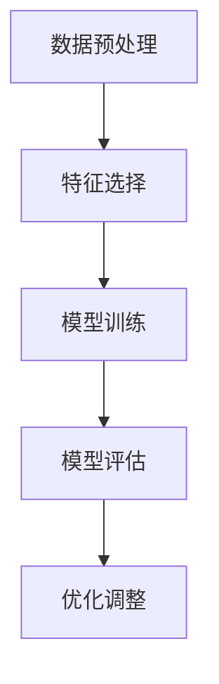
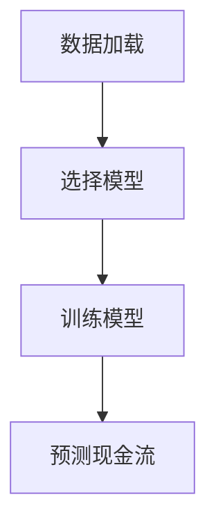
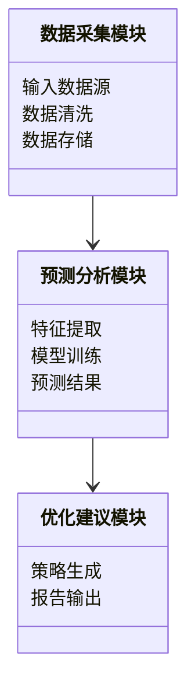
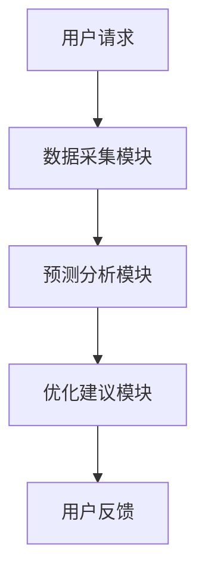
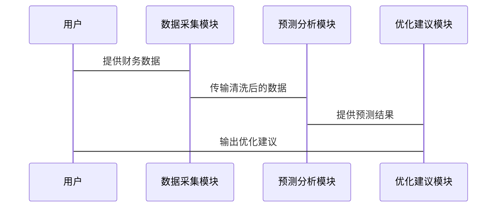

                 


# AI辅助的企业Working Capital优化

> 关键词：AI，企业财务，Working Capital，优化，算法

> 摘要：本文探讨了人工智能在优化企业运营资本（Working Capital）中的应用，分析了AI技术的核心算法、数学模型、系统架构，并通过实际案例展示了如何利用AI技术提升企业财务管理效率和优化资本运作。文章详细讲解了AI辅助优化Working Capital的背景、原理、实现方法以及实际应用，并总结了最佳实践和未来趋势。

---

## 第一部分: AI辅助的企业Working Capital优化背景介绍

### 第1章: 企业Working Capital概述

#### 1.1 Working Capital的基本概念
##### 1.1.1 企业运营资本的定义与组成
- Working Capital的定义
- 组成部分：流动资产与流动负债
- 重要性：企业短期偿债能力和运营效率的关键指标

##### 1.1.2 Working Capital在企业运营中的重要性
- 保障企业日常运营
- 支持企业扩张和应对突发事件
- 优化Working Capital可以提升企业财务健康度

##### 1.1.3 传统Working Capital管理方法的局限性
- 依赖人工分析，效率低下
- 数据处理能力有限，难以捕捉复杂市场变化
- 缺乏动态优化能力，难以应对实时需求

#### 1.2 AI在企业财务管理中的应用背景
##### 1.2.1 AI技术对企业财务管理的影响
- 数据处理能力的提升
- 智能预测和决策支持
- 自动化流程优化

##### 1.2.2 当前企业Working Capital管理面临的挑战
- 数据复杂性增加
- 市场波动加快，需要实时响应
- 传统方法难以实现精准预测和优化

##### 1.2.3 AI辅助优化Working Capital的潜力与价值
- 提高预测准确性
- 实现动态优化
- 降低管理成本

---

### 第2章: AI辅助优化Working Capital的核心概念

#### 2.1 AI与Working Capital优化的关系
##### 2.1.1 AI在Working Capital管理中的核心作用
- 数据分析与预测
- 自动化决策支持
- 实时监控与优化

##### 2.1.2 AI优化Working Capital的实现路径
- 数据收集与清洗
- 模型训练与部署
- 结果分析与反馈

##### 2.1.3 AI优化Working Capital的边界与外延
- 应用场景的边界
- 与其他财务管理模块的关联
- 技术实现的局限性

#### 2.2 核心概念的结构与组成
##### 2.2.1 Working Capital优化的目标与指标
- 目标：最大化流动资产使用效率，最小化流动负债风险
- 关键指标：净营运资本、流动比率、速动比率

##### 2.2.2 AI优化的核心算法与技术
- 机器学习算法
- 自然语言处理
- 数据可视化技术

##### 2.2.3 系统架构与功能模块
- 数据采集模块
- 预测分析模块
- 优化建议模块

---

## 第二部分: AI优化Working Capital的核心算法与技术

### 第3章: 算法原理讲解

#### 3.1 基于机器学习的Working Capital预测模型
##### 3.1.1 算法选择与训练流程
- 数据预处理：特征选择、缺失值处理
- 模型选择：线性回归、随机森林、神经网络
- 模型训练与评估

##### 3.1.2 算法流程图


##### 3.1.3 代码实现示例
```python
import pandas as pd
from sklearn.model import LinearRegression
from sklearn.metrics import mean_squared_error

# 数据加载与预处理
data = pd.read_csv('working_capital.csv')
features = data[['revenue', 'expenses', 'assets']]
labels = data['net_capital']

# 模型训练
model = LinearRegression()
model.fit(features, labels)

# 模型评估
预测 = model.predict(features)
mse = mean_squared_error(标签, 预测)
print(f"均方误差: {mse}")
```

#### 3.2 基于时间序列的现金流预测算法
##### 3.2.1 时间序列分析方法
- ARIMA模型
- LSTM网络

##### 3.2.2 算法实现步骤


##### 3.2.3 代码示例
```python
from statsmodels.tsa.arima.model import ARIMA

# 数据加载
data = pd.read_csv('cash_flow.csv')
train_data = data['cash_flow'][:80]
test_data = data['cash_flow'][80:]

# 模型训练
model = ARIMA(train_data, order=(5,1,0))
model_fit = model.fit()

# 预测
预测 = model_fit.forecast(steps=len(test_data))
print(预测)
```

---

### 第4章: 数学模型与公式

#### 4.1 线性回归模型
##### 4.1.1 普通最小二乘法
$$ \text{最小化} \sum (y_i - \hat{y}_i)^2 $$

##### 4.1.2 系数解释
$$ \hat{y} = \beta_0 + \beta_1 x_1 + \beta_2 x_2 + \dots + \beta_n x_n $$

#### 4.2 时间序列模型
##### 4.2.1 ARIMA模型公式
$$ \phi(B)(1 - B)^d X_t = \theta(B) \epsilon_t $$

##### 4.2.2 LSTM网络结构
$$ \text{门控机制：遗忘门、输入门、输出门} $$

---

## 第三部分: 系统架构与设计

### 第5章: 系统分析与架构设计

#### 5.1 问题场景介绍
- 企业财务数据管理现状
- 现有系统的痛点与不足

#### 5.2 系统功能设计
##### 5.2.1 领域模型设计


#### 5.3 系统架构设计
##### 5.3.1 总体架构


##### 5.3.2 关键模块交互


---

## 第四部分: 项目实战与案例分析

### 第6章: 项目实战

#### 6.1 环境配置与数据准备
- 安装必要的库：Pandas、Scikit-learn、TensorFlow
- 数据来源：企业财务报表、市场数据

#### 6.2 核心代码实现
##### 6.2.1 数据采集模块
```python
import pandas as pd

def load_data(file_path):
    data = pd.read_csv(file_path)
    return data
```

##### 6.2.2 模型训练模块
```python
from sklearn.linear_model import LinearRegression

def train_model(features, labels):
    model = LinearRegression()
    model.fit(features, labels)
    return model
```

##### 6.2.3 预测与优化模块
```python
def generate_recommendations(model, features):
    predictions = model.predict(features)
    return predictions
```

#### 6.3 系统功能展示
- 数据可视化：折线图、柱状图
- 预测结果展示：仪表盘、报告生成

#### 6.4 实际案例分析
- 某企业案例：通过AI优化降低流动负债15%
- 数据分析与结果解读

---

### 第7章: 总结与展望

#### 7.1 总结
- AI在优化Working Capital中的价值
- 本文的主要贡献与不足

#### 7.2 展望
- 技术进步带来的新机会
- 未来研究方向与应用潜力

---

## 第五部分: 最佳实践与注意事项

### 第8章: 最佳实践

#### 8.1 项目实施中的注意事项
- 数据质量的重要性
- 模型选择与调优
- 系统集成与维护

#### 8.2 小结
- AI优化Working Capital的优势
- 企业实施AI优化的建议

---

## 作者

作者：AI天才研究院 & 禅与计算机程序设计艺术

---

希望这篇文章能够为您提供清晰的思路和详细的指导。如果需要进一步扩展或调整，请随时告知！

