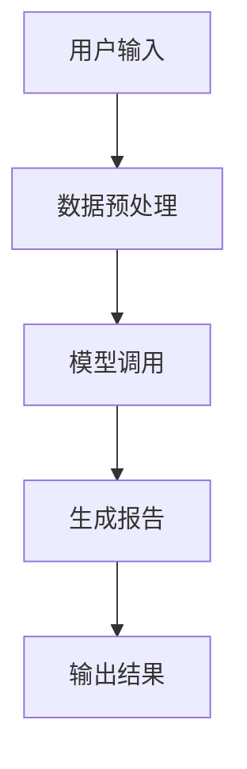

                 


# AI辅助的企业估值报告自动生成与分析

> 关键词：AI辅助、企业估值、报告生成、机器学习、自然语言处理、数据分析

> 摘要：本文深入探讨了如何利用人工智能技术辅助企业估值报告的自动生成与分析。通过结合自然语言处理（NLP）和机器学习算法，我们提出了一种高效的企业估值解决方案。文章从企业估值的基本概念出发，详细分析了AI在其中的应用，提出了基于NLP的报告生成算法和机器学习的估值预测模型，最后通过系统架构设计和实际案例分析，展示了该方案的可行性和优势。

---

# 第一部分：企业估值与AI辅助概述

## 第1章：企业估值的基本概念

### 1.1 问题背景与描述
企业估值是企业管理和投资决策中的核心问题，传统的估值方法依赖于人工分析和经验判断，存在效率低、主观性强、结果不够准确等问题。随着人工智能技术的快速发展，如何利用AI技术提高企业估值的效率和准确性成为一个重要研究方向。

### 1.2 AI辅助企业估值的核心问题
- 如何利用AI技术生成结构化的估值报告？
- 如何通过机器学习模型实现企业估值的自动化分析？
- 如何确保AI生成的报告内容准确、逻辑清晰且符合行业规范？

### 1.3 AI辅助企业估值的边界与外延
- 边界：AI辅助企业估值不替代人类的专业判断，而是作为辅助工具提高效率和准确性。
- 外延：涵盖从数据采集、报告生成到结果分析的整个流程。

### 1.4 核心概念框架
- 数据输入：财务数据、市场数据、竞争数据。
- 中间处理：NLP文本生成、机器学习模型预测。
- 输出结果：结构化估值报告、可视化分析结果。

---

## 第2章：AI在企业估值中的应用场景与优势

### 2.1 传统企业估值方法的局限性
- 人工分析耗时耗力，效率低下。
- 依赖个人经验，结果可能存在主观偏差。
- 数据处理复杂，难以快速获取和整合多源数据。

### 2.2 AI辅助企业估值的优势
- 提高数据处理效率，快速生成分析报告。
- 通过机器学习模型实现自动化预测，降低人为误差。
- 支持大规模数据处理和多维度分析。

### 2.3 企业估值报告自动生成的目标
- 快速整合企业数据，生成结构化报告。
- 提供多维度分析结果，辅助决策者制定策略。

---

# 第二部分：AI辅助企业估值的核心算法与系统架构

## 第3章：基于NLP的报告生成算法

### 3.1 NLP在报告生成中的应用
- 文本摘要：从企业财务报表和市场报告中提取关键信息。
- 自动写作：生成结构化的估值报告内容。
- 多轮对话：支持用户与系统交互，动态调整报告内容。

### 3.2 基于GPT的报告生成模型
- 模型选择：使用GPT-3等大语言模型。
- 数据预处理：清洗和格式化企业数据。
- 模型训练：微调模型以适应企业估值报告的生成任务。

### 3.3 报告生成流程图


### 3.4 生成报告的示例
- 示例1：财务状况分析。
- 示例2：市场竞争力评估。
- 示例3：成长性预测。

---

## 第4章：基于机器学习的估值预测模型

### 4.1 机器学习在估值预测中的应用
- 线性回归：预测企业未来价值。
- 逻辑回归：评估企业风险等级。
- 时间序列分析：预测企业未来的财务指标。

### 4.2 机器学习模型的实现步骤
1. 数据收集：获取企业的财务数据、市场数据和竞争数据。
2. 数据清洗：处理缺失值和异常值。
3. 特征提取：选择关键特征变量。
4. 模型训练：使用训练数据训练模型。
5. 模型预测：对目标企业进行估值预测。

### 4.3 估值预测的数学模型
- 线性回归模型：
$$ y = \beta_0 + \beta_1x + \epsilon $$
- 逻辑回归模型：
$$ P(Y=1|X) = \frac{e^{\beta X}}{1 + e^{\beta X}} $$

---

## 第5章：系统架构设计与实现

### 5.1 系统功能模块
- 数据采集模块：从企业公开数据源获取数据。
- 数据处理模块：清洗和格式化数据。
- 模型预测模块：运行机器学习模型进行估值预测。
- 报告生成模块：自动生成结构化报告。
- 可视化分析模块：提供直观的数据可视化结果。

### 5.2 系统架构设计


### 5.3 系统接口设计
- 输入接口：接收企业ID和查询条件。
- 输出接口：返回结构化报告和可视化结果。
- 数据接口：与数据源（如财务数据库）对接。

---

# 第三部分：项目实战与最佳实践

## 第6章：项目实战

### 6.1 环境安装与配置
- 安装Python环境。
- 安装必要的库：pandas、numpy、scikit-learn、transformers。

### 6.2 核心代码实现

#### 数据预处理代码
```python
import pandas as pd

def data_preprocessing(df):
    # 处理缺失值
    df.dropna(inplace=True)
    # 标准化处理
    df['revenue'] = (df['revenue'] - df['revenue'].mean()) / df['revenue'].std()
    return df
```

#### 模型训练代码
```python
from sklearn.linear_model import LinearRegression

def train_model(X, y):
    model = LinearRegression()
    model.fit(X, y)
    return model
```

#### 报告生成代码
```python
import transformers

def generate_report(company_info):
    model = transformers.AutoModelForMaskedLM.from_pretrained("gpt2")
    tokenizer = transformers.AutoTokenizer.from_pretrained("gpt2")
    # 调用API生成报告
    report = transformers.generate_report(model, tokenizer, company_info)
    return report
```

### 6.3 实际案例分析
- 案例1：某科技公司估值报告生成。
- 案例2：某制造企业市场竞争力分析。

---

## 第7章：最佳实践与总结

### 7.1 小结
- AI辅助企业估值的优势：提高效率、降低误差、支持大规模分析。
- 系统架构设计的关键点：模块化设计、数据安全、接口标准化。

### 7.2 注意事项
- 数据质量对模型准确性的影响。
- 模型的可解释性问题。
- 遵守行业规范和数据隐私保护。

### 7.3 拓展阅读
- 《Deep Learning for NLP》
- 《Hands-on Machine Learning with Scikit-Learn》

---

# 结语

AI辅助的企业估值报告自动生成与分析不仅提高了工作效率，还为决策者提供了更准确的数据支持。通过结合NLP和机器学习技术，我们能够实现从数据到报告的全自动流程，为企业的估值分析提供了新的可能性。

作者：AI天才研究院/AI Genius Institute  
禅与计算机程序设计艺术/Zen And The Art of Computer Programming

