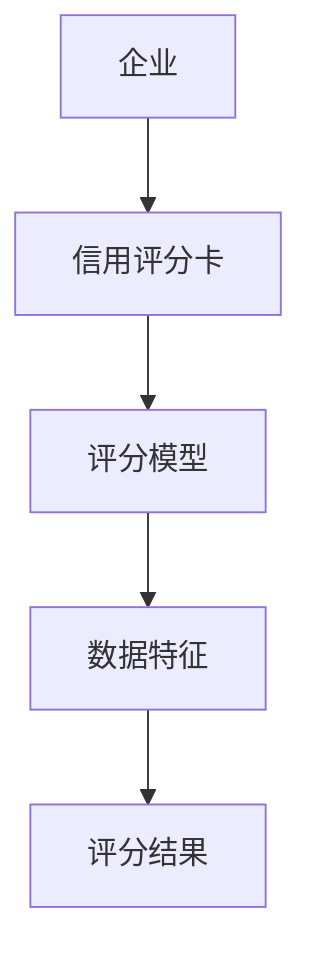
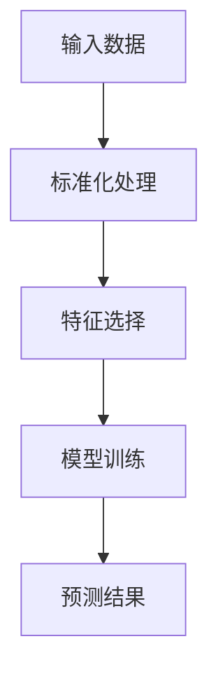
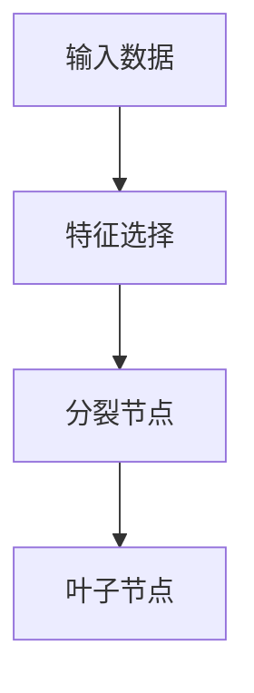
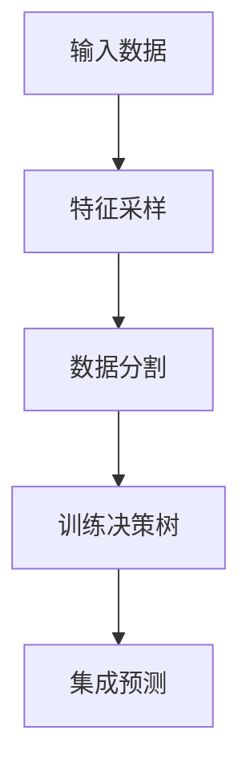
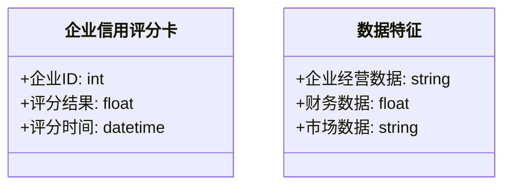
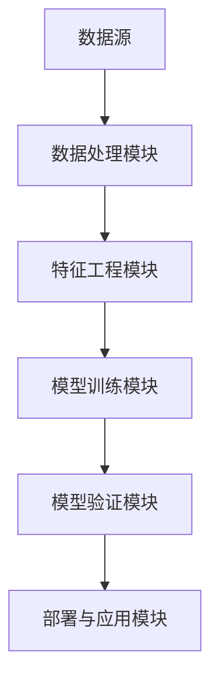
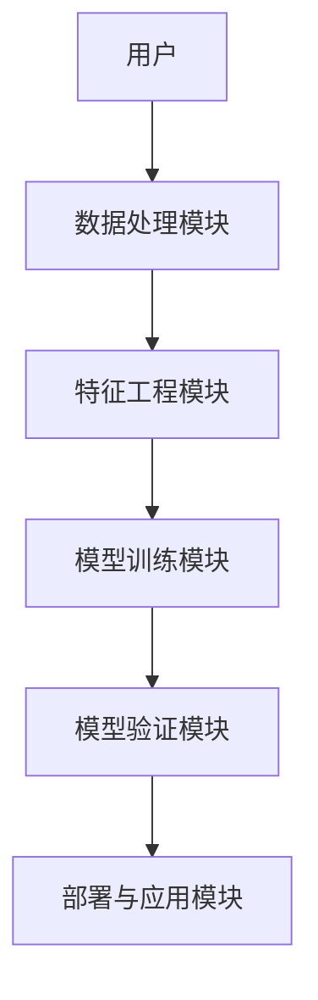

                 


# AI辅助的企业信用评分卡开发与验证平台

> 关键词：企业信用评分卡、人工智能、机器学习、评分模型、系统架构

> 摘要：本文详细探讨了AI辅助的企业信用评分卡开发与验证平台的核心技术与实现方案。从问题背景到核心概念，从算法原理到系统架构，从项目实战到总结与展望，系统地介绍了如何利用AI技术提升企业信用评分卡的开发效率与准确性。

---

# 第1章: 企业信用评分卡的背景与问题背景

## 1.1 问题背景

### 1.1.1 企业信用评分卡的定义与作用
企业信用评分卡是一种用于评估企业信用状况的工具，通过对企业经营数据、财务数据、市场表现等多维度信息的分析，生成一个综合评分，帮助银行、投资机构等金融机构评估企业的信用风险。

### 1.1.2 传统信用评分卡的局限性
传统的信用评分卡主要依赖于简单的统计分析和经验判断，存在以下问题：
- 数据维度有限，难以捕捉企业的全貌。
- 模型复杂度低，难以应对复杂的信用风险。
- 人工干预较多，效率低下且主观性强。

### 1.1.3 AI技术在信用评分中的应用潜力
AI技术（如机器学习、深度学习）能够处理海量数据，提取复杂特征，构建高精度的评分模型，显著提升信用评分的准确性和效率。

## 1.2 问题描述

### 1.2.1 信用评分卡开发的核心问题
- 如何高效采集和处理多源异构数据。
- 如何构建高精度的评分模型。
- 如何对模型进行有效验证与优化。

### 1.2.2 数据特征与评分模型的构建挑战
- 数据特征的筛选与优化。
- 多目标优化问题的处理。
- 模型的泛化能力与鲁棒性。

### 1.2.3 模型验证与优化的难点
- 评估指标的选择与优化。
- 模型的调参与优化。
- 模型的实时更新与维护。

## 1.3 问题解决与边界

### 1.3.1 AI辅助的解决方案
通过引入AI技术，构建端到端的信用评分卡开发与验证平台，实现数据采集、特征工程、模型训练、验证评估、部署应用的全流程自动化。

### 1.3.2 系统的边界与适用范围
- 系统适用于企业信用评分的全流程开发。
- 支持多种数据源和数据格式。
- 适用于不同规模的企业信用评估。

### 1.3.3 核心要素与组成结构
- 数据采集模块。
- 特征工程模块。
- 模型训练模块。
- 模型验证模块。
- 部署与应用模块。

## 1.4 本章小结
本章从企业信用评分卡的背景出发，分析了传统评分卡的局限性，提出了AI辅助的解决方案，并详细阐述了系统的边界与核心要素。

---

# 第2章: 核心概念与联系

## 2.1 核心概念原理

### 2.1.1 企业信用评分卡的构成要素
- **数据特征**：包括企业经营数据、财务数据、市场数据等。
- **评分模型**：包括逻辑回归、随机森林、XGBoost等。
- **评分标准**：基于行业经验的评分规则。

### 2.1.2 AI辅助的核心算法原理
- **特征提取**：利用自然语言处理（NLP）提取文本数据特征。
- **模型训练**：基于机器学习算法构建评分模型。
- **模型优化**：通过超参数调优提升模型性能。

### 2.1.3 数据特征与评分模型的关系
数据特征是模型训练的基础，评分模型通过对特征的分析，生成评分结果。

## 2.2 核心概念对比表

| 比较维度 | 传统评分模型 | AI辅助评分模型 |
|----------|--------------|----------------|
| 数据来源 | 结构化数据    | 结构化+非结构化数据 |
| 模型复杂度 | 简单         | 高复杂度         |
| 准确性   | 较低         | 较高             |

## 2.3 实体关系图



## 2.4 本章小结
本章通过对比分析，阐述了AI辅助评分模型的核心概念及其优势。

---

# 第3章: 算法原理讲解

## 3.1 逻辑回归算法

### 3.1.1 算法原理
逻辑回归是一种用于分类的经典算法，通过构建对数几率函数，将线性回归的结果映射到概率空间。

$$ P(y=1|x) = \frac{e^{\beta x}}{1+e^{\beta x}} $$

### 3.1.2 算法流程



### 3.1.3 代码实现

```python
from sklearn.linear_model import LogisticRegression
from sklearn.metrics import accuracy_score

# 训练模型
model = LogisticRegression()
model.fit(X_train, y_train)

# 预测结果
y_pred = model.predict(X_test)
print("准确率:", accuracy_score(y_test, y_pred))
```

---

## 3.2 决策树算法

### 3.2.1 算法原理
决策树是一种基于树状结构的分类算法，通过特征分裂构建决策树，实现数据分类。

### 3.2.2 算法流程



### 3.2.3 代码实现

```python
from sklearn.tree import DecisionTreeClassifier

# 训练模型
model = DecisionTreeClassifier()
model.fit(X_train, y_train)

# 预测结果
y_pred = model.predict(X_test)
print("准确率:", accuracy_score(y_test, y_pred))
```

---

## 3.3 随机森林算法

### 3.3.1 算法原理
随机森林是一种基于决策树的集成算法，通过构建多棵决策树并进行投票或平均，提升模型的准确性和鲁棒性。

### 3.3.2 算法流程



### 3.3.3 代码实现

```python
from sklearn.ensemble import RandomForestClassifier

# 训练模型
model = RandomForestClassifier()
model.fit(X_train, y_train)

# 预测结果
y_pred = model.predict(X_test)
print("准确率:", accuracy_score(y_test, y_pred))
```

---

# 第4章: 系统分析与架构设计

## 4.1 问题场景介绍
企业信用评分卡的开发需要一个高效的平台，支持数据采集、特征工程、模型训练、验证评估和部署应用的全流程。

## 4.2 项目介绍

### 4.2.1 系统功能设计
- **数据采集**：支持多种数据源的接入。
- **特征工程**：包括特征提取、特征选择和特征变换。
- **模型训练**：支持多种机器学习算法的训练。
- **模型验证**：包括模型评估和模型调优。
- **部署应用**：支持模型的部署和实时预测。

### 4.2.2 领域模型图



### 4.2.3 系统架构图



### 4.2.4 系统接口设计
- **数据接口**：提供REST API，支持数据的上传和下载。
- **模型接口**：提供API接口，支持模型的训练和预测。
- **用户接口**：提供Web界面，支持用户的交互操作。

### 4.2.5 系统交互图



---

# 第5章: 项目实战

## 5.1 环境安装

### 5.1.1 安装Python
```bash
python --version
pip install --upgrade pip
```

### 5.1.2 安装依赖库
```bash
pip install numpy
pip install pandas
pip install scikit-learn
```

## 5.2 核心代码实现

### 5.2.1 数据采集与预处理
```python
import pandas as pd

# 数据加载
data = pd.read_csv('enterprise_credit.csv')

# 数据清洗
data.dropna(inplace=True)
data = data[~data['label'].isnull()]
```

### 5.2.2 特征工程
```python
from sklearn.preprocessing import StandardScaler

# 标准化处理
scaler = StandardScaler()
X_scaled = scaler.fit_transform(data.drop('label', axis=1))
```

### 5.2.3 模型训练与验证
```python
from sklearn.model_selection import train_test_split
from sklearn.ensemble import RandomForestClassifier

# 数据分割
X_train, X_test, y_train, y_test = train_test_split(X_scaled, data['label'], test_size=0.2)

# 模型训练
model = RandomForestClassifier()
model.fit(X_train, y_train)

# 模型验证
y_pred = model.predict(X_test)
print("准确率:", accuracy_score(y_test, y_pred))
```

### 5.2.4 模型部署与应用
```python
import joblib

# 模型保存
joblib.dump(model, 'credit_score_model.pkl')

# 模型加载与预测
model = joblib.load('credit_score_model.pkl')
new_data = pd.read_csv('new_enterprise.csv')
new_data_scaled = scaler.transform(new_data.drop('label', axis=1))
predictions = model.predict(new_data_scaled)
```

## 5.3 案例分析与解读
以某企业为例，通过平台生成信用评分，展示模型的预测结果和评分解读。

## 5.4 项目总结
本项目通过AI技术构建了一个高效的企业信用评分卡开发与验证平台，显著提升了信用评分的准确性和效率。

---

# 第6章: 总结与展望

## 6.1 系统优势
- **高效性**：全流程自动化，显著提升开发效率。
- **准确性**：基于AI技术，模型精度高。
- **可扩展性**：支持多种数据源和模型算法。

## 6.2 系统局限性
- **数据依赖**：需要高质量的数据支持。
- **模型解释性**：部分模型的可解释性较差。

## 6.3 未来展望
- **模型优化**：进一步提升模型的准确性和鲁棒性。
- **功能扩展**：增加实时监控、风险预警等功能。
- **多模态数据**：支持更多数据类型的接入与分析。

---

# 作者

作者：AI天才研究院 & 禅与计算机程序设计艺术

---

通过以上目录和内容，您可以开始撰写完整的文章。每个章节和小节需要详细展开，结合实际案例和代码示例，深入讲解技术细节和实现方案。

