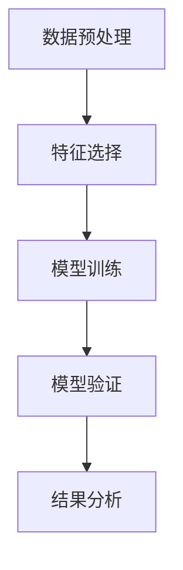

                 


# AI辅助的企业信用评分卡验证

> 关键词：企业信用评分卡、人工智能、机器学习、信用风险、数据分析

> 摘要：本文探讨了AI技术在企业信用评分卡验证中的应用，详细分析了AI如何提升信用评估的准确性和效率。文章从企业信用评分卡的核心概念出发，结合机器学习算法、系统架构设计和实际案例，全面解析AI辅助验证的实现过程及优势。

---

## 第一部分: AI辅助的企业信用评分卡验证概述

### 第1章: 企业信用评分卡与AI辅助验证的背景

#### 1.1 企业信用评分卡的基本概念

企业信用评分卡是一种用于评估企业信用风险的工具，通过对企业财务数据、经营状况等多维度信息的分析，生成一个综合评分，帮助企业做出信贷决策。传统信用评分卡依赖人工分析，存在效率低、主观性强等问题。

#### 1.2 AI辅助信用评分卡验证的背景

随着企业信用评估需求的增加，传统方法难以应对海量数据和复杂场景。AI技术的引入，尤其是机器学习和大数据分析，为信用评分卡的验证提供了新的解决方案。AI能够快速处理大量数据，发现传统方法难以察觉的模式和风险点，显著提升了信用评估的准确性和效率。

#### 1.3 本章小结

企业信用评分卡是信用评估的重要工具，而AI技术的应用为信用评估带来了革命性的变化，尤其是在数据处理和模型优化方面。

---

## 第二部分: 企业信用评分卡的核心概念与AI技术的结合

### 第2章: 企业信用评分卡的核心要素

#### 2.1 信用评分卡的构成要素

企业信用评分卡的核心要素包括：

- **企业基本信息**：如注册资本、成立时间、行业类型等。
- **财务数据**：如资产负债表、利润表、现金流量表等。
- **偿债能力指标**：如流动比率、速动比率、负债率等。
- **经营状况指标**：如收入增长率、利润率、市场占有率等。

#### 2.2 AI技术在信用评分中的应用

AI技术通过以下方式提升信用评分卡的验证效果：

- **数据预处理**：利用自然语言处理（NLP）技术提取文本数据中的关键信息。
- **特征选择**：通过主成分分析（PCA）等方法优化特征集。
- **模型训练与优化**：使用随机森林、梯度提升树（如XGBoost）等算法构建预测模型。
- **结果解释**：通过可解释性AI（XAI）技术提供模型决策的透明性。

#### 2.3 核心概念的ER实体关系图

以下是一个简单的ER图，展示了企业信用评分卡验证系统的核心实体关系：

```mermaid
erDiagram
    CUSTOMER[CUSTOMER] {
        +int id
        +string name
        +float score
    }
    CREDIT_CARD[CREDIT_CARD] {
        +int id
        +int customer_id
        +float limit
        +date issue_date
    }
    TRANSACTION[TRANSACTION] {
        +int id
        +int customer_id
        +float amount
        +date transaction_date
    }
    CUSTOMER "1--N" CREDIT_CARD
    CUSTOMER "1--N" TRANSACTION
```

---

## 第三部分: AI辅助信用评分卡验证的算法原理

### 第3章: 常见的信用评分模型

#### 3.1 逻辑回归模型

逻辑回归是一种广泛应用于信用评分的分类算法。其核心思想是通过sigmoid函数将线性回归的结果映射到0到1之间，表示事件发生的概率。

##### 3.1.1 模型原理

逻辑回归的数学公式为：

$$ P(y=1|x) = \frac{1}{1 + e^{- (w \cdot x + b)}} $$

其中：
- \( y \) 是目标变量（0表示违约，1表示正常）。
- \( x \) 是输入特征向量。
- \( w \) 是权重向量。
- \( b \) 是偏置项。

##### 3.1.2 模型优缺点

- **优点**：简单易懂，计算效率高。
- **缺点**：假设数据分布为线性可分，对非线性关系的拟合能力有限。

#### 3.2 XGBoost模型

XGBoost是一种基于树的集成算法，通过构建多个弱预测器（如决策树）并将其结果加权求和，显著提升模型的预测性能。

##### 3.2.1 模型原理

XGBoost的核心思想是通过正则化和损失函数优化，构建一棵棵决策树，并在每一步中选择最优的分裂方式。其损失函数可以表示为：

$$ L = -\frac{1}{m} \sum_{i=1}^{m} \left[ y_i \log(p_i) + (1 - y_i) \log(1 - p_i) \right] $$

其中：
- \( m \) 是样本数量。
- \( y_i \) 是真实标签。
- \( p_i \) 是预测概率。

##### 3.2.2 模型优缺点

- **优点**：对噪声数据的鲁棒性较强，能够捕捉复杂的数据模式。
- **缺点**：计算复杂度较高，对参数的敏感性较强。

#### 3.3 神经网络模型

神经网络是一种模拟人脑神经元结构的深度学习模型，通过多层非线性变换，能够捕捉高度复杂的模式。

##### 3.3.1 模型原理

神经网络的结构通常包括输入层、隐藏层和输出层。其数学表达式为：

$$ y = f(Wx + b) $$

其中：
- \( W \) 是权重矩阵。
- \( x \) 是输入向量。
- \( b \) 是偏置向量。
- \( f \) 是激活函数（如ReLU、sigmoid等）。

#### 3.4 算法流程图

以下是一个典型的信用评分模型训练流程图：



---

## 第四部分: 系统分析与架构设计

### 第4章: 系统架构设计

#### 4.1 问题场景介绍

企业信用评分卡验证系统需要处理海量的金融数据，包括企业的财务报表、交易记录等。系统需要具备高并发处理能力，确保在短时间内完成大量数据的分析和评分。

#### 4.2 系统功能设计

系统功能模块包括：

- **数据采集**：从数据库中读取企业信息和交易记录。
- **数据预处理**：清洗数据，处理缺失值和异常值。
- **特征提取**：从原始数据中提取有用的特征。
- **模型训练**：基于机器学习算法构建信用评分模型。
- **模型验证**：通过测试数据验证模型的准确性。
- **结果输出**：生成企业信用评分报告。

#### 4.3 系统架构设计

以下是系统的架构图：

```mermaid
container 系统架构 {
    前端界面 --> 后端服务
    后端服务 --> 数据库
    后端服务 --> 模型训练模块
    模型训练模块 --> 数据预处理模块
}
```

---

## 第五部分: 项目实战

### 第5章: 项目实战

#### 5.1 环境安装

以下是Python环境的安装步骤：

```bash
# 安装Python和相关库
pip install numpy pandas scikit-learn xgboost
```

#### 5.2 核心代码实现

以下是一个基于XGBoost的信用评分模型实现代码：

```python
import numpy as np
import pandas as pd
from xgboost import XGBClassifier
from sklearn.metrics import accuracy_score

# 加载数据
data = pd.read_csv('credit_data.csv')

# 分割特征与标签
X = data.drop('label', axis=1)
y = data['label']

# 模型训练
model = XGBClassifier()
model.fit(X, y)

# 模型预测
y_pred = model.predict(X)

# 计算准确率
accuracy = accuracy_score(y, y_pred)
print(f'模型准确率: {accuracy}')
```

#### 5.3 实际案例分析

以下是一个实际案例的分析过程：

1. **数据准备**：从企业数据库中提取相关数据。
2. **特征工程**：对特征进行标准化处理。
3. **模型训练**：使用训练数据训练XGBoost模型。
4. **模型验证**：通过测试数据验证模型性能。
5. **结果输出**：生成企业信用评分报告。

---

## 第六部分: 总结与展望

### 第6章: 总结与展望

#### 6.1 总结

AI技术的引入显著提升了企业信用评分卡验证的效率和准确性。通过机器学习算法和大数据分析，企业能够更快速、更准确地评估信用风险。

#### 6.2 展望

未来，随着AI技术的不断发展，企业信用评分卡验证将更加智能化和自动化。同时，模型的解释性和可扩展性也将进一步提升，为企业提供更强大的信用评估工具。

---

## 作者：AI天才研究院/AI Genius Institute & 禅与计算机程序设计艺术 /Zen And The Art of Computer Programming

