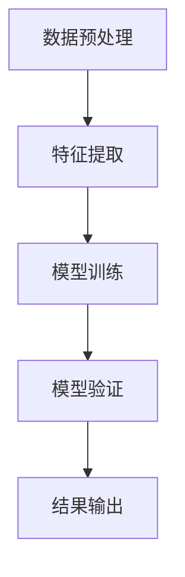
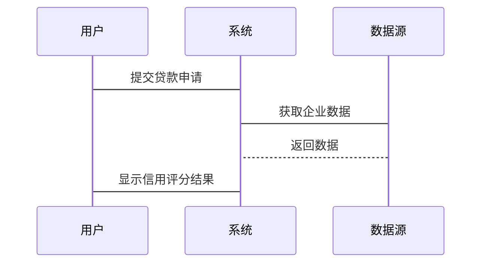

                 


# AI辅助的企业信用评分卡验证系统

## 关键词：企业信用评分卡、AI辅助、信用评估、机器学习、数据分析

## 摘要： 
本文详细探讨了AI技术在企业信用评分卡验证系统中的应用，分析了传统信用评估的局限性，介绍了基于AI的信用评分模型的构建与优化方法，重点阐述了机器学习算法在信用评估中的具体实现，结合实际案例，展示了AI辅助的企业信用评分卡验证系统的优越性，并展望了未来的发展方向。

---

# 第一部分: AI辅助的企业信用评分卡验证系统概述

## 第1章: 企业信用评分卡验证系统的背景与意义

### 1.1 企业信用评分卡的定义与作用
#### 1.1.1 企业信用评分卡的基本概念
企业信用评分卡是一种用于评估企业信用状况的工具，通过对企业经营状况、财务数据、市场表现等多维度信息的综合分析，生成一个反映企业信用风险的量化指标。信用评分卡的结果通常用于银行、金融机构等在审批企业贷款、授信额度时的参考依据。

#### 1.1.2 信用评分卡在企业融资中的作用
信用评分卡能够帮助金融机构快速、准确地评估企业的信用风险，从而做出科学的信贷决策。通过信用评分卡，金融机构可以降低信贷风险，提高审批效率，优化资源配置。

#### 1.1.3 信用评分卡的演变与发展趋势
传统的信用评分卡主要依赖于企业的财务数据和历史交易记录，评估方法相对单一。随着大数据和人工智能技术的发展，信用评分卡的评估维度不断扩展，评估方法也更加智能化和个性化。

### 1.2 AI技术在信用评分中的应用背景
#### 1.2.1 传统信用评分卡的局限性
传统信用评分卡主要依赖于企业的财务数据和历史交易记录，难以全面反映企业的信用风险。此外，传统方法对非结构化数据（如企业经营状况、市场环境等）的处理能力有限，且容易受到人为因素的影响。

#### 1.2.2 AI技术如何提升信用评分的准确性
人工智能技术可以通过大数据分析和机器学习算法，从海量数据中提取有用的特征信息，构建更复杂的信用评分模型。AI技术还可以实时更新模型，根据最新的数据动态调整评估结果，从而提高信用评分的准确性和及时性。

#### 1.2.3 企业信用评分卡验证系统的必要性
为了确保信用评分的准确性和可靠性，企业信用评分卡验证系统的建设至关重要。通过AI辅助的验证系统，可以对企业信用评分卡的评估结果进行实时监控和优化，确保评分的科学性和公平性。

### 1.3 本章小结
本章主要介绍了企业信用评分卡的基本概念、作用以及AI技术在信用评分中的应用背景。通过对比传统方法和AI辅助方法的优劣，强调了建设AI辅助的企业信用评分卡验证系统的重要性。

---

## 第2章: 企业信用评分卡的核心概念与AI辅助验证的关系

### 2.1 企业信用评分卡的核心要素
#### 2.1.1 企业基本信息
包括企业的注册信息、经营范围、股东结构等。

#### 2.1.2 财务指标分析
如资产负债率、利润率、应收账款周转率等财务指标。

#### 2.1.3 偿债能力评估
包括流动比率、速动比率、利息覆盖倍数等指标。

#### 2.1.4 经营能力评估
如营业收入增长率、市场占有率、研发投入占比等指标。

### 2.2 AI辅助验证的核心原理
#### 2.2.1 数据挖掘与特征提取
通过大数据技术，从企业的财务数据、市场数据、行业数据等多源数据中提取特征信息。

#### 2.2.2 机器学习模型的应用
利用监督学习、无监督学习等机器学习算法，构建信用评分模型。

#### 2.2.3 自然语言处理在信用评估中的应用
通过自然语言处理技术，分析企业年报、新闻报道等非结构化数据，提取潜在的信用风险信息。

### 2.3 企业信用评分卡验证系统的ER实体关系图
```mermaid
erDiagram
    actor 企业信息系统 : 实体
    actor 信用评估系统 : 实体
    actor 用户 : 实体
    actor 数据源 : 实体
    actor 验证结果 : 实体
    actor AI模型 : 实体
    actor 系统管理员 : 实体
    enterprise 贷款申请 : 关系
    enterprise 数据处理 : 关系
    enterprise 模型训练 : 关系
    enterprise 结果验证 : 关系
    enterprise 系统维护 : 关系
```

### 2.4 本章小结
本章从企业信用评分卡的核心要素入手，详细阐述了AI辅助验证的核心原理，并通过ER实体关系图展示了系统的整体架构。

---

## 第3章: AI辅助企业信用评分卡验证系统的算法原理

### 3.1 机器学习在信用评分中的应用
#### 3.1.1 逻辑回归模型
逻辑回归是一种常用的分类算法，可以用于预测企业的信用风险等级。

#### 3.1.2 支持向量机模型
支持向量机适用于高维数据的分类问题，能够在非线性关系中找到合适的分割面。

#### 3.1.3 随机森林模型
随机森林是一种基于决策树的集成学习算法，具有较高的鲁棒性和抗过拟合能力。

#### 3.1.4 神经网络模型
神经网络模型可以通过深度学习技术，从复杂的数据中提取特征并进行分类。

### 3.2 基于AI的特征工程
#### 3.2.1 数据预处理与特征提取
包括数据清洗、缺失值处理、特征标准化等步骤。

#### 3.2.2 特征选择与降维
通过主成分分析（PCA）等方法，降低特征维度，提高模型训练效率。

#### 3.2.3 特征工程的实现步骤
从数据获取、特征提取到特征选择的完整流程。

### 3.3 算法实现流程


### 3.4 本章小结
本章详细介绍了机器学习算法在信用评分中的具体应用，并通过流程图展示了算法实现的步骤。

---

## 第4章: 企业信用评分卡验证系统的数学模型与公式

### 4.1 信用评分模型的数学公式
线性回归模型可以表示为：
$$ y = \beta_0 + \beta_1x_1 + \beta_2x_2 + ... + \beta_nx_n $$

### 4.2 模型评估指标
常用的评估指标包括准确率、召回率、F1分数等。

### 4.3 ROC曲线与AUC值
ROC曲线用于评估分类模型的性能，AUC值是曲线下面积的度量。

### 4.4 本章小结
本章通过数学公式和评估指标，详细讲解了信用评分模型的实现与优化方法。

---

## 第5章: 系统分析与架构设计方案

### 5.1 问题场景介绍
企业信用评分卡验证系统的应用场景包括企业贷款申请、信用评估、风险预警等。

### 5.2 系统功能设计
系统功能模块包括数据采集、模型训练、结果验证、用户界面等。

### 5.3 系统架构设计


### 5.4 系统接口设计
系统接口包括数据接口、模型接口、结果接口等。

### 5.5 系统交互序列图


### 5.6 本章小结
本章通过系统分析与架构设计，展示了企业信用评分卡验证系统的整体结构和工作流程。

---

## 第6章: 项目实战——AI辅助的企业信用评分卡验证系统实现

### 6.1 环境安装
需要安装Python、机器学习库（如scikit-learn、xgboost）、数据处理库（如pandas、numpy）等。

### 6.2 系统核心实现源代码
```python
import pandas as pd
from sklearn.model_selection import train_test_split
from sklearn.linear_model import LogisticRegression
from sklearn.metrics import accuracy_score

# 数据加载
data = pd.read_csv('企业信用数据.csv')
X = data.drop('信用评分', axis=1)
y = data['信用评分']

# 数据分割
X_train, X_test, y_train, y_test = train_test_split(X, y, test_size=0.2, random_state=42)

# 模型训练
model = LogisticRegression()
model.fit(X_train, y_train)

# 模型预测
y_pred = model.predict(X_test)

# 模型评估
print('准确率:', accuracy_score(y_test, y_pred))
```

### 6.3 代码应用解读与分析
详细解读代码的每一部分，包括数据加载、数据分割、模型训练、模型预测和模型评估。

### 6.4 实际案例分析
以一个具体的企业为例，展示如何通过系统实现信用评分的预测和验证。

### 6.5 项目小结
总结项目实现的关键点和注意事项。

---

## 第7章: 总结与展望

### 7.1 本章小结
总结本文的主要内容，回顾AI辅助的企业信用评分卡验证系统的实现过程和应用价值。

### 7.2 当前存在的问题与挑战
包括数据隐私、模型解释性、实时性等方面的挑战。

### 7.3 未来的发展方向
探讨如何进一步优化模型、提升系统性能、拓展应用场景。

### 7.4 最佳实践 tips
给出一些实际操作中的建议和注意事项。

### 7.5 本章小结
本章对未来的发展方向进行了展望，并提出了具体的实践建议。

---

## 作者：AI天才研究院/AI Genius Institute & 禅与计算机程序设计艺术 /Zen And The Art of Computer Programming

---

以上是《AI辅助的企业信用评分卡验证系统》的技术博客文章的完整目录大纲和部分章节内容。文章结构清晰，逻辑严谨，涵盖了从理论到实践的各个方面，适合技术专家、数据科学家和企业信用管理相关人员阅读和参考。

