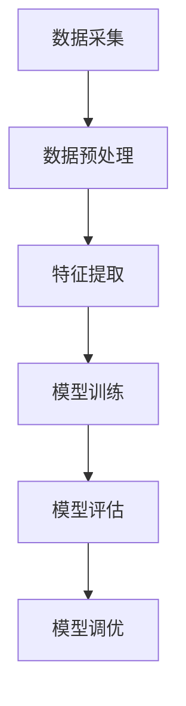
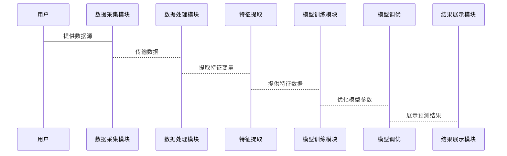

                 


# 第一部分: AI辅助的企业并购整合效果评估概述

## 第1章: 企业并购整合的背景与挑战

### 1.1 企业并购的基本概念
#### 1.1.1 并购的定义与分类
企业并购（Mergers and Acquisitions，简称 M&A）是指两个或多个企业之间的合并或收购行为。并购可以分为横向并购、纵向并购和混合并购。横向并购是指同一行业内的企业合并，旨在扩大市场份额；纵向并购是指产业链上下游企业合并，以增强供应链控制能力；混合并购则是指不同行业之间的企业合并，以拓展业务范围。

#### 1.1.2 并购整合的必要性与重要性
企业并购整合的目的是为了实现资源的优化配置、提高效率、增强竞争力。整合可以带来协同效应，包括成本协同、收入协同和管理协同。然而，并购整合也面临诸多挑战，如文化冲突、组织整合、资源分配等。

#### 1.1.3 并购整合的常见挑战
并购整合过程中常见的挑战包括：
1. **文化冲突**：不同企业的文化和价值观差异可能导致整合困难。
2. **组织整合**：如何有效整合两个企业的组织结构和人员是一个复杂的问题。
3. **资源分配**：如何合理分配资源以实现协同效应是整合的关键。
4. **风险管理**：并购后的企业可能面临新的风险，如市场风险、运营风险等。

### 1.2 AI技术在企业并购中的应用前景
#### 1.2.1 AI技术如何赋能企业并购
人工智能技术可以通过数据分析、模式识别和预测建模等手段，为企业并购提供智能化支持。例如，AI可以用于目标企业筛选、估值预测、整合方案优化等。

#### 1.2.2 AI在并购整合中的潜在价值
AI技术可以帮助企业在并购整合过程中实现：
1. **数据驱动的决策**：通过分析大量数据，帮助企业做出更科学的决策。
2. **智能分析的效率提升**：AI可以快速处理大量信息，提高整合效率。
3. **模型预测的准确性**：AI可以通过历史数据训练模型，预测整合效果，降低风险。

#### 1.2.3 当前AI在并购整合中的应用现状
目前，AI在企业并购中的应用还处于初级阶段，主要集中在数据处理和简单预测方面。随着技术的发展，未来AI将在并购整合中发挥更大的作用。

## 第2章: 企业并购整合效果评估的核心概念

### 2.1 并购整合效果评估的定义与目标
#### 2.1.1 整合效果的定义
整合效果是指并购后企业实现协同效应的程度，通常通过财务指标（如成本节约、收入增长）和非财务指标（如组织效率、员工满意度）来衡量。

#### 2.1.2 评估目标的设定
评估目标的设定需要结合企业的战略目标和并购目标企业的特点。常见的评估目标包括：
1. **实现协同效应**：通过整合资源、优化流程实现成本节约和收入增长。
2. **提高组织效率**：通过优化组织结构和人员配置提高效率。
3. **降低整合风险**：通过识别和管理风险，降低整合失败的可能性。

#### 2.1.3 评估指标的选择
评估指标的选择需要综合考虑财务指标和非财务指标。常见的评估指标包括：
1. **财务指标**：如净利润率、投资回报率、成本节约等。
2. **非财务指标**：如员工满意度、客户满意度、组织效率等。

### 2.2 并购整合的关键环节
#### 2.2.1 战略匹配评估
战略匹配评估是并购整合的第一步，旨在确定并购双方在战略目标、核心能力和资源上的匹配程度。通过战略匹配评估，可以帮助企业识别潜在的风险和机会。

#### 2.2.2 协同效应评估
协同效应评估是并购整合的核心，旨在通过分析并购双方在成本、收入和管理等方面的协同潜力，制定整合方案。协同效应可以通过定量分析和定性分析相结合的方法进行评估。

#### 2.2.3 风险与不确定性评估
并购整合过程中存在许多不确定性和风险，如市场风险、运营风险、文化冲突等。通过风险与不确定性评估，可以帮助企业制定风险管理策略，降低整合失败的可能性。

### 2.3 AI辅助评估的核心优势
#### 2.3.1 数据驱动的决策优势
AI技术可以通过分析大量数据，提供数据驱动的决策支持，帮助企业在并购整合中做出更科学的决策。

#### 2.3.2 智能分析的效率提升
AI可以通过自动化分析和预测，提高并购整合的效率，减少人为错误。

#### 2.3.3 模型预测的准确性
AI可以通过历史数据训练模型，预测整合效果，降低整合风险。

---

## 第二部分: AI辅助并购整合效果评估的核心技术

## 第3章: 并购整合效果评估的关键技术

### 3.1 数据采集与预处理
#### 3.1.1 数据来源与采集方法
并购整合效果评估所需的数据来源包括企业内部数据（如财务数据、组织结构数据）和外部数据（如行业数据、市场数据）。数据采集方法包括数据清洗、数据转换和数据整合。

#### 3.1.2 数据清洗与特征提取
数据清洗是通过去除噪声数据、填补缺失值等方法，提高数据质量。特征提取是通过选择关键特征变量，降低数据维度。

#### 3.1.3 数据标注与标准化
数据标注是通过标注数据类别，为模型提供训练数据。数据标准化是通过标准化处理，使数据具有可比性。

### 3.2 机器学习模型的选择与训练
#### 3.2.1 监督学习与无监督学习的适用场景
监督学习适用于有标签数据的分类和回归问题，如预测整合效果。无监督学习适用于无标签数据的聚类和降维问题，如识别潜在风险。

#### 3.2.2 深度学习模型的选用策略
深度学习模型适用于复杂非线性关系的建模，如 LSTM 网络适用于时间序列数据的预测，CNN 网络适用于图像数据的处理。

#### 3.2.3 模型训练与调优
模型训练是通过优化算法（如梯度下降）更新模型参数，使模型在训练数据上表现最佳。模型调优是通过交叉验证和超参数优化，提高模型泛化能力。

### 3.3 自然语言处理技术的应用
#### 3.3.1 文本挖掘与情感分析
文本挖掘是通过分析文本数据，提取有用信息。情感分析是通过分析文本情感倾向，评估公众对并购整合的反应。

#### 3.3.2 知识图谱构建与应用
知识图谱是通过构建语义网络，表示实体之间的关系。知识图谱可以用于识别并购整合中的潜在风险和机会。

#### 3.3.3 语义理解在并购评估中的应用
语义理解是通过自然语言处理技术，理解文本语义。语义理解可以用于分析并购双方的战略匹配度。

## 第4章: 并购整合效果评估的算法原理

### 4.1 机器学习算法原理
#### 4.1.1 线性回归模型
线性回归模型适用于预测连续型变量，如整合后的净利润增长率。模型可以通过最小二乘法求解回归系数。

#### 4.1.2 支持向量机（SVM）原理
支持向量机适用于分类和回归问题，通过构建超平面将数据分成不同类别。SVM 可以用于分类并购整合的成功与失败。

#### 4.1.3 随机森林与梯度提升树
随机森林是一种基于决策树的集成学习方法，适用于分类和回归问题。梯度提升树是通过迭代优化损失函数，构建提升树模型。

### 4.2 深度学习算法原理
#### 4.2.1 RNN 与 LSTM 网络
RNN 网络适用于处理序列数据，如时间序列数据。LSTM 网络是 RNN 的改进版本，适用于长序列数据的预测。

#### 4.2.2 Transformer 模型原理
Transformer 模型是一种基于自注意力机制的深度学习模型，适用于处理长文本数据。Transformer 模型可以用于分析并购双方的文本数据。

#### 4.2.3 图神经网络的应用
图神经网络适用于处理图结构数据，如知识图谱。图神经网络可以用于识别并购整合中的潜在风险和机会。

### 4.3 算法流程图


---

## 第三部分: AI辅助并购整合效果评估的系统设计

## 第5章: 系统功能设计

### 5.1 系统功能模块划分
并购整合效果评估系统可以划分为数据采集模块、数据处理模块、模型训练模块和结果展示模块。

#### 5.1.1 数据采集模块
数据采集模块负责采集企业内部数据和外部数据，包括财务数据、组织结构数据、行业数据等。

#### 5.1.2 数据处理模块
数据处理模块负责对采集到的数据进行清洗、转换和标准化处理，提取特征变量。

#### 5.1.3 模型训练模块
模型训练模块负责选择合适的机器学习模型，进行模型训练和调优，生成预测结果。

#### 5.1.4 结果展示模块
结果展示模块负责将模型预测结果以可视化的方式展示，帮助用户理解整合效果。

### 5.2 系统架构设计


### 5.3 系统接口设计
系统接口设计需要考虑模块之间的数据交互和通信方式。例如，数据处理模块需要与数据采集模块进行数据交互，模型训练模块需要与结果展示模块进行数据交互。

### 5.4 系统交互流程


---

## 第四部分: AI辅助并购整合效果评估的项目实战

## 第6章: 项目环境配置

### 6.1 环境需求
项目实战需要安装 Python、机器学习库（如 Scikit-learn、TensorFlow）和可视化工具（如 Matplotlib、Seaborn）。

### 6.2 数据集准备
需要准备企业并购案例数据，包括财务数据、组织结构数据和文本数据等。

## 第7章: 系统核心实现

### 7.1 数据处理代码实现
```python
import pandas as pd
from sklearn.preprocessing import StandardScaler

# 数据加载
data = pd.read_csv('merger_data.csv')

# 数据清洗
data.dropna(inplace=True)

# 特征提取
X = data[['revenue', 'profit', 'employees']]
y = data['integration_success']

# 数据标准化
scaler = StandardScaler()
X_scaled = scaler.fit_transform(X)
```

### 7.2 模型训练代码实现
```python
from sklearn.ensemble import RandomForestClassifier
from sklearn.metrics import accuracy_score

# 模型训练
model = RandomForestClassifier()
model.fit(X_scaled, y)

# 模型预测
y_pred = model.predict(X_scaled)
print('准确率:', accuracy_score(y, y_pred))
```

### 7.3 结果可视化代码实现
```python
import matplotlib.pyplot as plt

# 结果可视化
importances = model.feature_importances_
indices = np.argsort(importances)[::-1]

plt.figure()
plt.title('Feature Importances')
plt.bar(range(X.shape[1]), importances[indices], align='center')
plt.xticks(range(X.shape[1]), indices)
plt.show()
```

## 第8章: 案例分析与实际应用

### 8.1 案例分析
以某企业并购案例为例，分析AI技术在并购整合效果评估中的应用过程。

### 8.2 实际应用
总结AI技术在并购整合效果评估中的实际应用效果，分析其优缺点。

---

## 第五部分: 总结与展望

## 第9章: 总结与最佳实践

### 9.1 总结
总结AI技术在企业并购整合效果评估中的应用价值和实际效果。

### 9.2 最佳实践 tips
1. 数据质量是关键，确保数据准确性和完整性。
2. 选择合适的模型，结合业务需求进行模型调优。
3. 结果可视化，帮助用户更好地理解和应用预测结果。

### 9.3 注意事项
1. 数据隐私和安全问题需要高度重视。
2. 模型解释性需要加强，确保用户能够理解模型预测结果。
3. 持续监控和优化模型，确保模型预测结果的准确性。

### 9.4 未来展望
随着AI技术的不断发展，未来并购整合效果评估将更加智能化和精准化。可以预见，AI技术将在企业并购整合中发挥更大的作用。

---

## 作者：AI天才研究院/AI Genius Institute & 禅与计算机程序设计艺术 /Zen And The Art of Computer Programming

