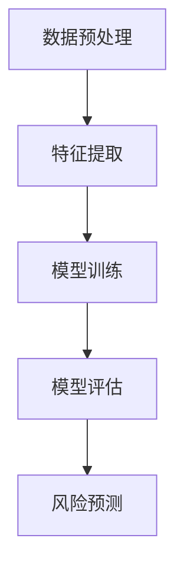
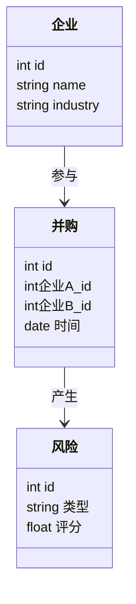
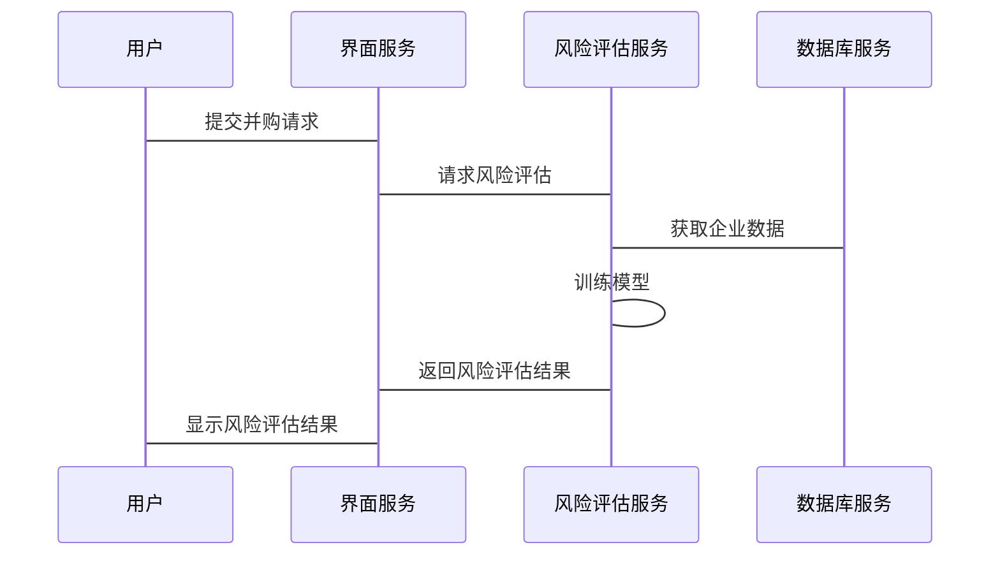

                 


# AI辅助的企业并购整合风险评估模型

## 关键词：企业并购、风险评估、人工智能、图神经网络、知识图谱

## 摘要：  
本文介绍了一种基于人工智能技术的企业并购整合风险评估模型，通过分析企业并购整合中的关键风险因素，构建了基于图神经网络的知识图谱模型，结合机器学习算法，实现了对企业并购整合风险的智能化评估。该模型能够有效识别和预测并购整合中的潜在风险，为企业决策提供数据支持。

---

# 第1章：企业并购整合风险评估的背景与基础

## 1.1 企业并购的基本概念

企业并购是指企业之间的合并或收购行为，通常涉及战略调整、资源整合和价值创造。并购整合是并购后对双方的业务、组织、文化和资源进行整合的过程，是企业实现增长和优化的重要手段。然而，并购整合过程中常常面临诸多风险，如财务风险、市场风险、运营风险和法律风险等。

### 1.1.1 企业并购的定义与类型
企业并购可以分为吸收合并、新设合并、控股合并等多种形式。每种并购类型都有其特点和适用场景。

### 1.1.2 并购整合的必要性与挑战
整合是并购成功的关键，但整合过程中可能遇到文化冲突、组织协调不畅等问题，导致整合失败。

### 1.1.3 并购整合中的风险类型
- **财务风险**：包括债务负担、资产减值等。
- **市场风险**：包括市场竞争加剧、客户需求变化等。
- **运营风险**：包括生产效率低下、供应链中断等。
- **法律风险**：包括合规性问题、知识产权纠纷等。

---

## 1.2 传统企业并购风险评估方法

传统的并购风险评估方法主要包括财务指标分析、尽职调查和专家判断等。然而，这些方法存在以下问题：

- **数据依赖性强**：传统方法依赖于历史数据和主观判断，难以预测未来的不确定性。
- **维度有限**：传统方法通常只考虑财务和市场因素，忽视了组织文化和人力资源等软性因素。
- **效率低下**：传统方法需要大量人工参与，耗时且成本高。

---

## 1.3 AI技术在企业并购中的应用潜力

人工智能技术可以通过大数据分析、模式识别和自动化学习，提高并购整合风险评估的效率和准确性。AI技术可以处理海量数据，识别潜在风险，并提供实时监控和预警。

---

# 第2章：企业并购整合风险评估的核心概念

## 2.1 风险评估的关键要素

企业并购整合风险评估的关键要素包括：

- **战略一致性**：并购双方的业务战略是否一致。
- **文化兼容性**：并购双方的企业文化是否能够融合。
- **财务稳定性**：并购双方的财务状况是否健康。
- **管理协调性**：并购后的管理层是否能够有效协调。

---

## 2.2 并购整合风险的分类体系

### 2.2.1 风险的多维度分类

企业并购整合风险可以分为以下几类：

- **财务风险**：包括债务负担、资产减值等。
- **市场风险**：包括市场竞争加剧、客户需求变化等。
- **运营风险**：包括生产效率低下、供应链中断等。
- **法律风险**：包括合规性问题、知识产权纠纷等。
- **文化风险**：包括企业文化的冲突和整合困难。

### 2.2.2 风险的相互作用与影响

企业并购整合风险并不是孤立存在的，它们之间存在相互作用。例如，财务风险可能影响企业的运营能力，从而进一步加剧市场风险。

---

## 2.3 AI辅助评估的可行性分析

### 2.3.1 数据来源与处理的可行性

AI技术可以通过对企业内部数据（如财务数据、业务数据）和外部数据（如市场数据、新闻数据）进行分析，提取关键风险指标。

### 2.3.2 AI模型在风险预测中的优势

- **自动化学习**：AI模型可以自动从数据中学习风险特征。
- **实时监控**：AI模型可以实时监控风险变化，提供预警。
- **高精度预测**：AI模型可以通过历史数据训练，提高风险预测的准确性。

---

# 第3章：AI辅助企业并购整合风险评估模型的核心概念

## 3.1 模型的理论基础

### 3.1.1 机器学习与深度学习在风险评估中的应用

机器学习是一种数据驱动的算法，能够通过数据训练模型，预测风险。深度学习则可以通过多层神经网络，提取复杂的特征，提高预测精度。

### 3.1.2 图神经网络在处理复杂关系中的优势

图神经网络可以处理复杂的关系数据，如企业之间的关系、供应链关系等，能够更好地捕捉企业并购中的隐含风险。

---

## 3.2 实体关系与知识图谱构建

### 3.2.1 实体关系的定义与建模

企业并购涉及多个实体，包括企业、投资者、供应商、客户等。实体之间的关系可以通过知识图谱进行建模。

### 3.2.2 知识图谱的构建方法与流程

知识图谱的构建流程包括数据采集、数据清洗、实体识别、关系抽取和图谱构建。

---

## 3.3 概念属性特征对比分析

### 3.3.1 各类风险的特征对比

以下表格对比了各类风险的特征：

| 风险类型 | 描述 | 主要影响 |
|----------|------|----------|
| 财务风险 | 债务负担、资产减值 | 影响企业财务稳定性 |
| 市场风险 | 竞争加剧、需求变化 | 影响企业市场地位 |
| 运营风险 | 生产效率、供应链 | 影响企业运营能力 |
| 法律风险 | 合规性问题、知识产权 | 影响企业合规性 |

### 3.3.2 ER实体关系图架构

以下是一个简单的ER实体关系图：

```mermaid
erDiagram
    customer[顾客] {
        +int id
        +string name
        +string email
    }
    product[产品] {
        +int id
        +string name
        +float price
    }
    order[订单] {
        +int id
        +int customerId
        +int productId
        +date orderDate
    }
    customer --> order : 下单
    product --> order : 订单包含的产品
```

---

## 3.4 深度学习模型的选择

### 3.4.1 Transformer与GCN模型的对比

- **Transformer**：适用于处理序列数据，如文本数据。
- **GCN**：适用于处理图结构数据，如企业关系图。

### 3.4.2 模型选择的依据与优化策略

模型选择的依据包括数据类型、任务需求和计算资源。优化策略包括参数调整、模型集成和数据增强。

---

## 3.5 算法流程图

以下是一个算法流程图：



---

# 第4章：系统架构与设计

## 4.1 系统功能模块划分

### 4.1.1 数据采集模块

- 从企业内部和外部数据源采集数据。
- 数据格式包括结构化数据（如财务数据）和非结构化数据（如文本数据）。

### 4.1.2 模型训练模块

- 使用机器学习和深度学习算法训练模型。
- 模型训练包括数据预处理、特征提取、模型训练和模型评估。

### 4.1.3 风险评估模块

- 对企业并购整合风险进行评估。
- 输出风险评分和风险类型。

### 4.1.4 可视化模块

- 可视化风险评估结果。
- 提供风险分布图和风险趋势图。

---

## 4.2 系统功能设计

### 4.2.1 领域模型设计

以下是一个领域模型的类图：



---

## 4.3 系统架构设计

### 4.3.1 分层架构设计

系统架构采用分层架构，包括数据层、业务逻辑层和表现层。

### 4.3.2 系统架构图

以下是一个系统架构图：

```mermaid
containerDiagram
    container 数据层 {
        service 数据库服务
        service 数据采集服务
    }
    container 业务逻辑层 {
        service 风险评估服务
        service 模型训练服务
    }
    container 表现层 {
        service 界面服务
        service 报告生成服务
    }
```

---

## 4.4 系统交互设计

### 4.4.1 系统接口设计

- 数据层接口：提供数据查询和数据插入功能。
- 业务逻辑层接口：提供风险评估和模型训练功能。
- 表现层接口：提供用户界面和报告生成功能。

### 4.4.2 系统交互图

以下是一个系统交互图：



---

# 第5章：项目实战

## 5.1 环境安装

### 5.1.1 安装Python

安装Python 3.8或更高版本。

### 5.1.2 安装深度学习框架

安装TensorFlow或PyTorch。

### 5.1.3 安装其他依赖库

安装numpy、pandas、scikit-learn等。

---

## 5.2 系统核心实现

### 5.2.1 数据预处理代码

```python
import pandas as pd
import numpy as np

# 加载数据
data = pd.read_csv('并购数据.csv')

# 数据清洗
data.dropna()
data = data.drop_duplicates()

# 数据标准化
from sklearn.preprocessing import StandardScaler
scaler = StandardScaler()
scaled_data = scaler.fit_transform(data)
```

### 5.2.2 模型训练代码

```python
import tensorflow as tf
from tensorflow.keras import layers

# 构建模型
model = tf.keras.Sequential([
    layers.Dense(64, activation='relu'),
    layers.Dense(1, activation='sigmoid')
])

# 编译模型
model.compile(optimizer='adam', loss='binary_crossentropy', metrics=['accuracy'])

# 训练模型
model.fit(x_train, y_train, epochs=10, batch_size=32)
```

---

## 5.3 代码应用解读与分析

### 5.3.1 数据预处理

数据预处理包括数据清洗和数据标准化，目的是提高模型的训练效率和准确性。

### 5.3.2 模型训练

模型训练包括构建神经网络模型、编译模型和训练模型。神经网络模型通过反向传播算法优化权重，提高预测精度。

---

## 5.4 实际案例分析

### 5.4.1 案例背景

某企业计划并购另一家企业，需要评估并购整合中的风险。

### 5.4.2 模型应用

使用训练好的模型对企业并购整合风险进行评估，输出风险评分和风险类型。

---

## 5.5 项目小结

通过实际案例分析，验证了模型的可行性和有效性。模型可以准确识别和预测企业并购整合中的潜在风险。

---

# 第6章：最佳实践、小结与注意事项

## 6.1 最佳实践 tips

- 数据质量是模型性能的关键，需要确保数据的准确性和完整性。
- 模型训练需要选择合适的算法和超参数，提高模型的泛化能力。
- 模型部署需要考虑计算资源和数据隐私，确保系统的稳定性和安全性。

## 6.2 小结

本文介绍了一种基于人工智能技术的企业并购整合风险评估模型，通过分析企业并购整合中的关键风险因素，构建了基于图神经网络的知识图谱模型，结合机器学习算法，实现了对企业并购整合风险的智能化评估。

## 6.3 注意事项

- 数据隐私和合规性是企业并购中的重要问题，需要遵守相关法律法规。
- 模型的可解释性是企业决策的关键，需要提供清晰的风险解释和建议。

## 6.4 拓展阅读

建议读者进一步阅读以下内容：

- 图神经网络在企业风险评估中的应用。
- 深度学习在并购整合中的其他应用。

---

# 作者：AI天才研究院/AI Genius Institute & 禅与计算机程序设计艺术 /Zen And The Art of Computer Programming

