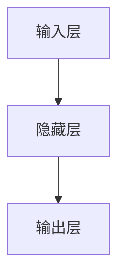
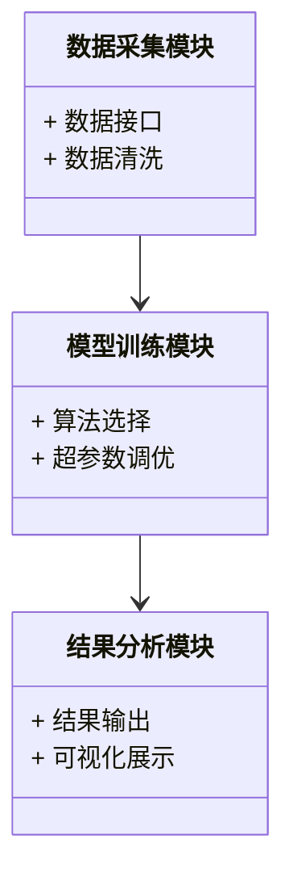

                 


# AI辅助的公司估值模型比较

> 关键词：AI, 公司估值, 机器学习, 财务模型, 深度学习

> 摘要：本文探讨了AI技术在公司估值中的应用，通过比较传统估值模型与AI辅助模型的优劣，分析了AI如何优化估值过程。文章从背景、核心概念、算法原理、系统架构到项目实战，全面解析了AI在公司估值中的潜力与实现方法。

---

# 第1章: 公司估值模型的背景与挑战

## 1.1 公司估值的基本概念

### 1.1.1 什么是公司估值
公司估值是通过对公司财务状况、市场表现、行业地位等多方面因素的分析，估算其市场价值的过程。常见的估值方法包括财务指标法、市盈率法和现金流折现法等。

### 1.1.2 传统公司估值方法的优缺点
- **优点**：传统方法基于财务数据，具有一定的可操作性和可解释性。
- **缺点**：仅依赖财务数据，忽视了市场情绪、管理层决策等非财务因素；计算复杂，难以快速响应市场变化。

### 1.1.3 公司估值的重要性和应用场景
- 企业并购：估值是并购交易中的核心环节。
- 投资决策：帮助投资者评估股票的价值。
- 融资活动：公司估值影响融资成本和结构。

## 1.2 传统公司估值方法的局限性

### 1.2.1 财务指标法的局限性
财务指标法依赖历史数据，难以预测未来变化，且忽略了市场动态和管理层能力。

### 1.2.2 市盈率法的局限性
市盈率法受市场波动影响较大，且不同行业之间的市盈率差异显著，难以统一标准。

### 1.2.3 现金流折现法的局限性
现金流折现法计算复杂，且对未来的现金流预测依赖性强，容易受到假设偏差的影响。

## 1.3 AI技术如何改变公司估值

### 1.3.1 AI在公司估值中的潜力
AI可以通过分析海量数据，捕捉传统方法难以察觉的市场信号，提高估值的准确性和效率。

### 1.3.2 AI辅助公司估值的优势
- **数据处理能力**：AI能够处理多维度数据，包括财务数据、市场数据和新闻数据。
- **实时更新**：AI模型可以实时更新，快速响应市场变化。
- **非线性关系捕捉**：AI能够发现传统模型难以捕捉的非线性关系。

### 1.3.3 当前AI在公司估值中的应用现状
AI技术已经在股票预测、风险评估等领域得到广泛应用，但在公司整体估值方面仍处于探索阶段。

## 1.4 本章小结
本章介绍了公司估值的基本概念和传统方法的优缺点，分析了AI技术在公司估值中的潜力和优势，并总结了当前的应用现状。

---

# 第2章: 公司估值模型的核心概念与联系

## 2.1 公司估值模型的分类

### 2.1.1 财务模型
基于财务数据的估值方法，如DCF模型（现金流折现法）。

### 2.1.2 市场模型
基于市场数据的估值方法，如市盈率法和市净率法。

### 2.1.3 综合模型
结合财务和市场数据的综合估值方法，如指数加权模型。

## 2.2 AI辅助估值的核心概念

### 2.2.1 数据特征
- **财务数据**：收入、利润、现金流等。
- **市场数据**：股价、成交量、市场指数等。
- **文本数据**：新闻、财报等文本信息。

### 2.2.2 模型特征
- **输入特征**：影响公司估值的关键因素。
- **输出目标**：预测的公司估值。
- **模型类型**：回归模型、分类模型、深度学习模型。

### 2.2.3 评价指标
- **均方误差（MSE）**：衡量预测值与真实值的差距。
- **R²值**：衡量模型的拟合优度。
- **ROC曲线**：衡量分类模型的区分能力。

## 2.3 模型比较框架

### 2.3.1 模型选择标准
- **准确性**：预测值与真实值的差距。
- **解释性**：模型的可解释性。
- **计算效率**：模型的训练和推理速度。

### 2.3.2 模型比较维度
- **复杂度**：模型的复杂程度。
- **计算资源**：模型对计算资源的需求。
- **适用场景**：模型适用的业务场景。

### 2.3.3 模型优化策略
- **数据预处理**：清洗、归一化、特征选择。
- **超参数调优**：通过网格搜索或随机搜索优化模型参数。
- **模型集成**：通过集成学习提高模型的准确性和稳定性。

## 2.4 本章小结
本章从公司估值模型的分类入手，详细介绍了AI辅助估值的核心概念和模型比较框架，为后续的算法设计和系统实现奠定了基础。

---

# 第3章: AI辅助公司估值的核心算法原理

## 3.1 常见的AI算法及其在估值中的应用

### 3.1.1 回归算法
回归算法通过建立变量之间的线性关系，预测公司估值。

### 3.1.2 聚类算法
聚类算法通过将相似的公司分组，帮助投资者发现潜在的投资机会。

### 3.1.3 神经网络
神经网络能够捕捉数据中的非线性关系，适用于复杂的估值场景。

## 3.2 算法原理详解

### 3.2.1 线性回归的数学模型
$$ y = \beta_0 + \beta_1x + \epsilon $$

### 3.2.2 神经网络的结构


## 3.3 算法实现与优化

### 3.3.1 算法实现步骤
1. 数据预处理：清洗、归一化、特征选择。
2. 模型训练：选择算法、调整超参数。
3. 模型评估：计算误差、优化模型。

### 3.3.2 算法优化方法
- **正则化**：L1正则化、L2正则化。
- **早停法**：防止过拟合。
- **批量归一化**：加速训练、提高稳定性。

## 3.4 本章小结
本章详细介绍了AI算法在公司估值中的应用，通过数学公式和流程图，展示了回归和神经网络算法的实现过程。

---

# 第4章: AI辅助公司估值的系统架构设计

## 4.1 系统功能模块

### 4.1.1 数据采集模块
- **数据来源**：财务数据、市场数据、文本数据。
- **数据格式**：结构化数据和非结构化数据。

### 4.1.2 模型训练模块
- **算法选择**：回归、聚类、神经网络。
- **训练流程**：数据预处理、模型训练、模型评估。

### 4.1.3 结果分析模块
- **结果输出**：预测估值、误差分析。
- **可视化**：图表展示、趋势分析。

## 4.2 系统架构

### 4.2.1 系统功能设计


## 4.3 本章小结
本章从系统架构的角度，详细介绍了AI辅助公司估值的模块设计和功能实现。

---

# 第5章: 项目实战——基于AI的公司估值系统开发

## 5.1 项目介绍
本项目旨在开发一个基于AI的公司估值系统，结合财务数据和市场数据，实现对公司估值的精准预测。

## 5.2 系统功能设计

### 5.2.1 数据采集
- **数据接口**：通过API获取财务数据和市场数据。
- **数据清洗**：去除异常值、填充缺失值。

### 5.2.2 模型训练
- **算法选择**：选择线性回归或神经网络模型。
- **超参数调优**：通过网格搜索优化模型参数。

### 5.2.3 结果分析
- **结果输出**：输出预测估值和误差分析。
- **可视化展示**：生成图表展示预测结果。

## 5.3 系统实现

### 5.3.1 环境配置
- **Python版本**：Python 3.8及以上。
- **依赖库安装**：pandas、numpy、scikit-learn、keras。

### 5.3.2 核心代码实现

```python
import pandas as pd
from sklearn.linear_model import LinearRegression
from sklearn.metrics import mean_squared_error

# 数据加载
data = pd.read_csv('company_valuation.csv')

# 数据分割
X = data[['revenue', 'profit', 'market_cap']]
y = data['estimated_value']

# 模型训练
model = LinearRegression()
model.fit(X, y)

# 预测结果
y_pred = model.predict(X)

# 误差分析
mse = mean_squared_error(y, y_pred)
print(f'Mean Squared Error: {mse}')
```

### 5.3.3 代码解读与分析
- **数据加载**：使用pandas加载CSV文件。
- **数据分割**：将数据分为特征变量和目标变量。
- **模型训练**：使用线性回归模型训练数据。
- **预测结果**：利用训练好的模型预测公司估值。
- **误差分析**：计算均方误差，评估模型的准确性。

## 5.4 实际案例分析
以某公司为例，利用训练好的模型预测其估值，并与实际估值进行对比分析。

## 5.5 项目小结
本章通过一个实际项目，详细展示了AI辅助公司估值系统的开发过程，包括环境配置、代码实现和结果分析。

---

# 第6章: 最佳实践与总结

## 6.1 最佳实践

### 6.1.1 数据处理
- 数据清洗：去除异常值、填充缺失值。
- 特征选择：选择对估值影响较大的特征。

### 6.1.2 模型选择
- 根据数据特征选择合适的算法。
- 通过交叉验证优化模型。

### 6.1.3 结果分析
- 通过误差分析评估模型的准确性。
- 可视化展示预测结果。

## 6.2 本章小结
本章总结了AI辅助公司估值的最佳实践，包括数据处理、模型选择和结果分析等方面。

---

# 作者信息

作者：AI天才研究院/AI Genius Institute & 禅与计算机程序设计艺术 /Zen And The Art of Computer Programming

---

# 拓展阅读
1. 《机器学习实战》
2. 《深度学习入门：基于Python的理论与实现》
3. 《公司财务与估值分析》

---

这篇文章详细探讨了AI技术在公司估值中的应用，通过理论分析和实际案例，展示了如何利用AI优化公司估值过程。希望对读者在AI辅助公司估值领域有所帮助！

