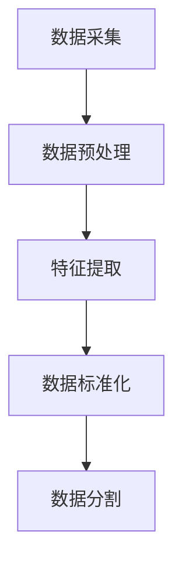
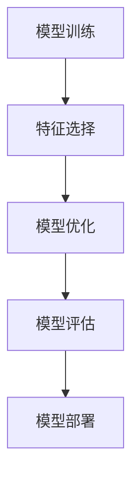

                 


# AI辅助的公司治理评分系统

## 关键词：AI，公司治理，评分系统，算法，系统架构，数据分析

## 摘要：  
《AI辅助的公司治理评分系统》系统地介绍了如何利用人工智能技术来辅助公司治理的评分过程。通过对公司治理的核心要素、评分模型、算法实现、系统架构等方面的深入分析，本书为读者提供了从理论到实践的全面指导。书中不仅探讨了AI在公司治理中的优势与挑战，还通过具体案例展示了如何构建和优化AI辅助的评分系统，帮助企业在数字化转型中提升治理效率和决策能力。

---

# 第一部分: AI辅助的公司治理评分系统背景与概念

## 第1章: 公司治理的基本概念与挑战

### 1.1 公司治理的定义与核心要素

#### 1.1.1 公司治理的定义  
公司治理是通过一系列制度、流程和机制来确保公司战略目标的实现、股东利益的保护以及公司运营的合规性。它涉及董事会、管理层、股东、员工以及其他利益相关者之间的关系和责任分配。

#### 1.1.2 公司治理的核心要素  
公司治理的核心要素包括：  
1. **治理结构**：董事会、监事会、管理层的组织架构。  
2. **决策机制**：战略决策、风险管理、内部控制。  
3. **透明度与披露**：财务报告、信息披露、合规性。  
4. **利益相关者关系**：股东、员工、客户、供应商的权益保护。  
5. **绩效评估**：公司运营效率、财务状况、社会责任的评估。

#### 1.1.3 公司治理的边界与外延  
公司治理的边界主要集中在公司内部管理与外部利益相关者的互动上。外延则扩展到企业社会责任（CSR）、可持续发展、数字化转型等领域。

### 1.2 AI在公司治理中的作用

#### 1.2.1 AI技术如何辅助公司治理  
AI技术可以通过数据分析、模式识别和自动化流程优化公司治理。例如：  
- 利用自然语言处理（NLP）分析公司财报和新闻，识别潜在风险。  
- 使用机器学习模型预测公司绩效，优化决策流程。  
- 通过自动化工具生成合规性报告，提升管理效率。

#### 1.2.2 AI在公司治理中的优势与劣势  
**优势**：  
- 数据处理能力强，能够快速分析大量非结构化数据。  
- 提高决策的准确性和前瞻性。  
- 降低人为错误，提升合规性。  

**劣势**：  
- 数据隐私和安全风险。  
- 系统的复杂性和维护成本较高。  
- 依赖数据质量和算法的准确性。

#### 1.2.3 AI在公司治理中的应用场景  
- **风险预警**：通过AI分析财务数据，识别潜在的财务风险。  
- **决策支持**：利用AI生成的预测模型，辅助战略决策。  
- **合规监控**：通过AI实时监控公司运营，确保符合相关法规。

### 1.3 公司治理评分系统的基本框架

#### 1.3.1 评分系统的定义  
公司治理评分系统是一种通过量化指标对公司的治理能力进行评估的系统，旨在帮助企业识别改进点并提升整体治理水平。

#### 1.3.2 评分系统的组成部分  
- **数据输入模块**：收集公司治理相关的数据，如财务数据、管理数据、市场数据等。  
- **指标权重模块**：根据公司治理的核心要素，确定各指标的权重。  
- **评分计算模块**：基于输入数据和权重，计算出公司的治理评分。  
- **结果输出模块**：将评分结果以可视化形式呈现，并提供改进建议。

#### 1.3.3 评分系统的实现方式  
评分系统可以通过以下步骤实现：  
1. 数据采集：从公司内部系统、公开数据源等渠道获取相关数据。  
2. 数据预处理：清洗数据，去除噪声，确保数据质量。  
3. 指标选择：根据公司治理的核心要素，选择关键指标。  
4. 权重分配：根据指标的重要程度，确定各指标的权重。  
5. 评分计算：根据公式计算评分，并生成结果报告。

---

## 第2章: AI辅助的公司治理评分系统的核心概念

### 2.1 公司治理评分的核心原理

#### 2.1.1 数据采集与处理  
数据采集是评分系统的第一步，主要包括以下内容：  
- **内部数据**：公司财务数据、管理数据、员工数据等。  
- **外部数据**：市场数据、行业基准、法规要求等。  
- 数据预处理：去重、插值、标准化等操作。

#### 2.1.2 指标权重的确定  
指标权重的确定是评分系统的核心，通常采用以下方法：  
- **主观赋权法**：根据专家意见确定权重。  
- **客观赋权法**：基于数据的方差、相关性等统计特性确定权重。  
- **混合赋权法**：结合主观和客观因素确定权重。

#### 2.1.3 评分计算与输出  
评分计算需要结合指标权重和实际数据，常用的方法包括：  
- **线性加权法**：$$ S = \sum_{i=1}^{n} w_i \times v_i $$
  其中，$S$ 是最终评分，$w_i$ 是第i个指标的权重，$v_i$ 是第i个指标的评估值。  
- **非线性加权法**：根据评分分布的非线性关系进行调整。

### 2.2 核心概念的属性对比

#### 2.2.1 公司治理评分系统的属性特征  
- **输入数据类型**：结构化数据与非结构化数据的结合。  
- **评分模型的复杂性**：从简单线性模型到复杂的深度学习模型。  
- **应用场景的多样性**：适用于不同行业和规模的公司。

#### 2.2.2 不同评分模型的对比分析  
| 模型类型       | 优点                               | 缺点                               |
|----------------|------------------------------------|------------------------------------|
| 线性回归模型     | 简单易懂，计算速度快               | 表现力有限，难以捕捉复杂关系       |
| 支持向量机（SVM）| 分类能力强，适合小样本数据         | 对高维数据处理能力较弱             |
| 神经网络模型     | 表现力强，适合复杂数据             | 训练时间长，需要大量数据             |

#### 2.2.3 实体关系图的构建与分析  


---

## 第3章: 评分模型与算法原理

### 3.1 评分模型的数学模型

#### 3.1.1 指标权重的计算公式  
$$ w_i = \frac{f_i}{\sum_{j=1}^{n} f_j} $$
其中，$w_i$ 表示第i个指标的权重，$f_i$ 表示第i个指标的重要性评分，$n$ 表示指标总数。

#### 3.1.2 评分计算公式  
$$ S = \sum_{i=1}^{n} w_i \times v_i $$
其中，$S$ 表示最终评分，$w_i$ 表示第i个指标的权重，$v_i$ 表示第i个指标的评估值。

### 3.2 算法实现流程

#### 3.2.1 数据预处理流程  


#### 3.2.2 评分模型训练流程  


#### 3.2.3 模型优化策略  
- **超参数调优**：使用网格搜索或随机搜索优化模型参数。  
- **特征工程**：通过特征组合、降维等技术提升模型表现。  
- **集成学习**：结合多个模型的结果，提高预测准确性。

---

## 第4章: 系统设计与实现

### 4.1 系统架构设计

#### 4.1.1 系统功能模块  
- **数据采集模块**：负责采集公司治理相关的数据。  
- **数据处理模块**：对数据进行清洗、转换和预处理。  
- **评分计算模块**：根据模型计算公司治理评分。  
- **结果展示模块**：以可视化形式呈现评分结果。  

#### 4.1.2 系统架构图  


### 4.2 系统功能设计

#### 4.2.1 数据采集与处理  
- 数据源：公司内部数据库、公开数据源。  
- 数据预处理：去重、插值、标准化。  

#### 4.2.2 指标权重与评分计算  
- 指标权重：根据专家意见或数据统计确定权重。  
- 评分计算：使用线性回归或机器学习模型计算最终评分。  

#### 4.2.3 结果展示与分析  
- 可视化展示：柱状图、折线图、雷达图。  
- 改进建议：基于评分结果，提供具体的优化建议。  

---

## 第5章: 项目实战

### 5.1 项目背景与目标

#### 5.1.1 项目背景  
假设我们是一家中型制造企业，希望通过AI技术优化公司治理评分系统。  

#### 5.1.2 项目目标  
- 实现公司治理评分系统的核心功能。  
- 提供直观的评分结果和改进建议。  
- 提升公司治理的透明度和效率。

### 5.2 核心代码实现

#### 5.2.1 数据预处理代码  
```python
import pandas as pd
import numpy as np

# 数据加载
data = pd.read_csv('governance_data.csv')

# 数据清洗
data.dropna(inplace=True)
data = data[~data.duplicated()]
```

#### 5.2.2 指标权重计算代码  
```python
from sklearn.preprocessing import MinMaxScaler

# 特征选择
features = data[['revenue', 'profit', 'employees']]

# 数据标准化
scaler = MinMaxScaler()
features_scaled = scaler.fit_transform(features)

# 计算权重
weights = np.array([0.4, 0.3, 0.3])  # 假设的权重分配
```

#### 5.2.3 评分计算代码  
```python
def calculate_score(weights, features_scaled):
    return np.sum(weights * features_scaled, axis=1)

scores = calculate_score(weights, features_scaled)
```

### 5.3 测试与优化

#### 5.3.1 测试数据集  
```python
test_data = pd.read_csv('test_governance_data.csv')
test_features = test_data[['revenue', 'profit', 'employees']]
test_features_scaled = scaler.transform(test_features)
```

#### 5.3.2 模型优化  
- 增加更多的特征变量。  
- 调整模型参数，优化评分结果。  

### 5.4 案例分析与总结

#### 5.4.1 实际案例分析  
通过具体案例分析，展示评分系统的实际应用效果。  

#### 5.4.2 项目总结  
总结项目实施的经验与教训，提出改进建议。

---

## 第6章: 高级主题与未来趋势

### 6.1 模型优化与调优

#### 6.1.1 深度学习的应用  
- 使用神经网络模型提高评分系统的准确性。  

#### 6.1.2 超参数优化  
- 使用自动化工具（如HyperOpt）进行超参数调优。  

### 6.2 用户界面与交互设计

#### 6.2.1 可视化界面设计  
- 使用图表展示评分结果，提升用户体验。  

#### 6.2.2 交互设计优化  
- 提供个性化的评分报告和改进建议。  

### 6.3 合规性与安全性

#### 6.3.1 数据隐私保护  
- 采用加密技术保护敏感数据。  

#### 6.3.2 系统安全性设计  
- 防止数据泄露和恶意攻击。  

### 6.4 未来发展趋势

#### 6.4.1 技术融合  
- 将AI技术与区块链等新兴技术结合，提升公司治理的透明度。  

#### 6.4.2 行业应用拓展  
- 将评分系统推广到更多行业和领域。  

---

## 第7章: 总结与展望

### 7.1 全文总结  
通过本文的介绍，读者可以全面了解AI辅助的公司治理评分系统的核心概念、技术原理和实现方法。评分系统不仅可以提高公司治理的效率，还能为企业提供科学的决策支持。

### 7.2 未来展望  
随着AI技术的不断发展，公司治理评分系统将变得更加智能化和个性化。未来，评分系统将深度融合其他先进技术，为企业治理带来更多的创新和突破。

---

## 作者：AI天才研究院/AI Genius Institute & 禅与计算机程序设计艺术 /Zen And The Art of Computer Programming

