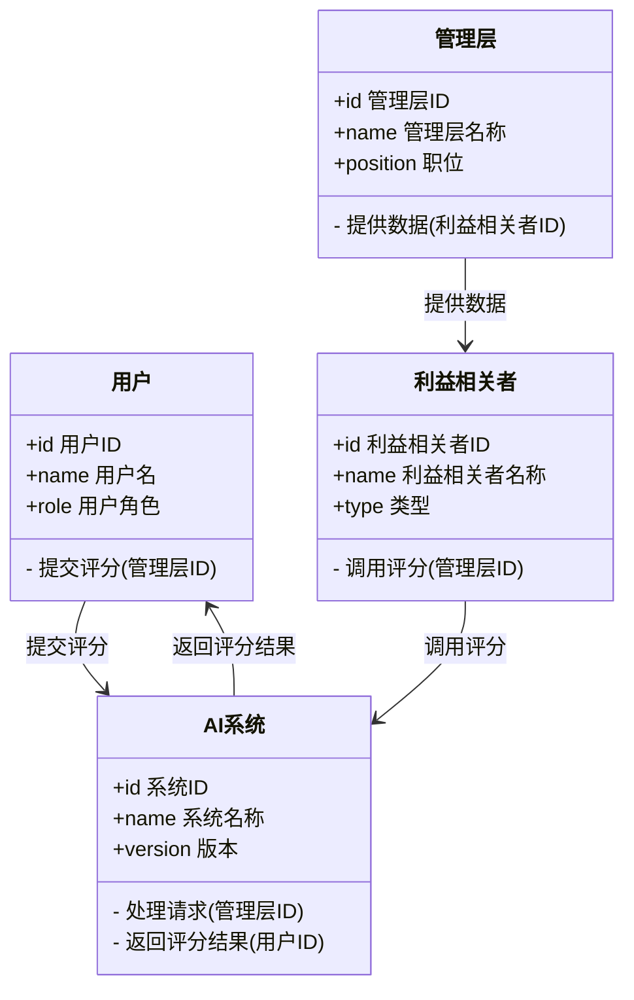
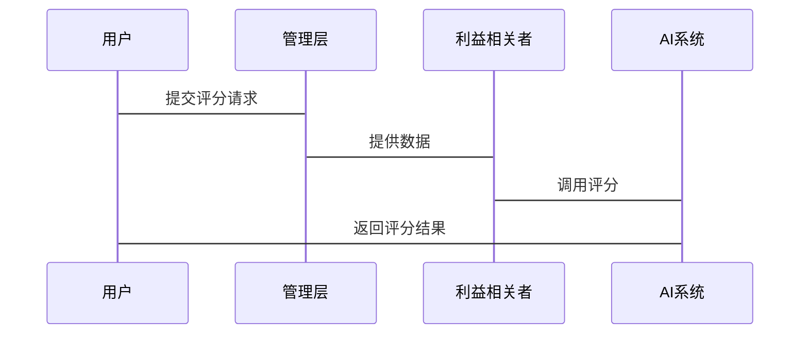

                 


## 目录大纲：AI辅助的公司治理评分系统与改善建议

### 第一部分：背景介绍

#### 第1章：公司治理的基本概念与挑战

##### 1.1 公司治理的定义与核心要素
- 1.1.1 公司治理的定义
- 1.1.2 公司治理的核心要素：股东、董事会、管理层、利益相关者
- 1.1.3 公司治理的目标与原则

##### 1.2 公司治理中的常见问题
- 1.2.1 代理问题
- 1.2.2 透明度不足
- 1.2.3 风险管理不善
- 1.2.4 利益相关者冲突

##### 1.3 AI辅助公司治理的必要性
- 1.3.1 数据驱动决策的优势
- 1.3.2 提高透明度与合规性
- 1.3.3 优化风险管理能力

### 第二部分：核心概念与联系

#### 第2章：AI辅助公司治理评分系统的核心概念

##### 2.1 AI辅助公司治理评分系统的定义
- 2.1.1 系统定义
- 2.1.2 系统目标

##### 2.2 核心概念的属性特征对比
- 2.2.1 数据来源的特征对比
- 2.2.2 评分算法的特征对比
- 2.2.3 系统输出的特征对比

##### 2.3 ER实体关系图
```mermaid
erDiagram
    actor 用户 {
        +id 用户ID
        +name 用户名
        +role 用户角色
    }
    actor 管理层 {
        +id 管理层ID
        +name 管理层名称
        +position 职位
    }
    actor 利益相关者 {
        +id 利益相关者ID
        +name 利益相关者名称
        +type 类型
    }
    actor AI系统 {
        +id 系统ID
        +name 系统名称
        +version 版本
    }
    用户 --> 管理层 : 提交评分
    管理层 --> 利益相关者 : 提供数据
    利益相关者 --> AI系统 : 调用评分
    AI系统 --> 用户 : 返回评分结果
```

### 第三部分：算法原理讲解

#### 第3章：评分系统背后的算法原理

##### 3.1 评分模型的构建
- 3.1.1 数据预处理：清洗、转换、特征提取
- 3.1.2 模型选择：线性回归、决策树、随机森林
- 3.1.3 模型训练与优化

##### 3.2 算法实现步骤
- 数据清洗与特征工程
- 模型训练与调参
- 模型评估与部署

##### 3.3 评分系统的数学模型
- 线性回归模型
  $$ y = \beta_0 + \beta_1x_1 + \beta_2x_2 + ... + \beta_nx_n $$
- 随机森林模型
  $$ y = \text{多数投票} $$

##### 3.4 代码实现
```python
import pandas as pd
from sklearn.ensemble import RandomForestRegressor
from sklearn.model_selection import train_test_split
from sklearn.metrics import mean_squared_error

# 数据加载与预处理
data = pd.read_csv('company_governance.csv')
X = data[['transparency', 'risk_management', 'stakeholder_alignment']]
y = data['score']

# 数据分割
X_train, X_test, y_train, y_test = train_test_split(X, y, test_size=0.2, random_state=42)

# 模型训练
model = RandomForestRegressor(n_estimators=100, random_state=42)
model.fit(X_train, y_train)

# 模型预测
y_pred = model.predict(X_test)

# 模型评估
print(mean_squared_error(y_test, y_pred))
```

### 第四部分：系统分析与架构设计方案

#### 第4章：系统架构设计

##### 4.1 问题场景介绍
- 系统目标：提供实时公司治理评分
- 业务场景：利益相关者提交数据，AI系统生成评分

##### 4.2 领域模型设计


##### 4.3 系统架构图


##### 4.4 接口设计与交互流程


### 第五部分：项目实战

#### 第5章：系统实现与案例分析

##### 5.1 环境安装
- 安装Python与必要的库
  ```bash
  pip install pandas scikit-learn mermaid
  ```

##### 5.2 核心代码实现
```python
import pandas as pd
from sklearn.ensemble import RandomForestRegressor
from sklearn.model_selection import train_test_split
from sklearn.metrics import mean_squared_error

# 数据加载与预处理
data = pd.read_csv('company_governance.csv')
X = data[['transparency', 'risk_management', 'stakeholder_alignment']]
y = data['score']

# 数据分割
X_train, X_test, y_train, y_test = train_test_split(X, y, test_size=0.2, random_state=42)

# 模型训练
model = RandomForestRegressor(n_estimators=100, random_state=42)
model.fit(X_train, y_train)

# 模型预测
y_pred = model.predict(X_test)

# 模型评估
print(mean_squared_error(y_test, y_pred))
```

##### 5.3 代码解读与分析
- 数据预处理：清洗和特征提取
- 模型选择：随机森林算法
- 训练与预测：数据分割与模型训练
- 评估：均方误差评估模型性能

##### 5.4 实际案例分析
- 数据来源：公司治理相关数据集
- 案例分析：某公司治理评分过程

### 第六部分：最佳实践与总结

#### 第6章：系统优化与改进建议

##### 6.1 最佳实践
- 数据质量管理
- 模型持续优化
- 系统安全性与隐私保护

##### 6.2 小结
- 总结系统设计与实现过程
- 强调AI在公司治理中的作用

##### 6.3 注意事项
- 数据隐私保护
- 系统可扩展性
- 模型解释性

##### 6.4 拓展阅读
- 推荐相关书籍与论文
- 提供进一步学习的资源

---

## 作者：AI天才研究院/AI Genius Institute & 禅与计算机程序设计艺术 /Zen And The Art of Computer Programming

---

通过以上目录大纲，我们可以清晰地看到文章的结构和内容安排。每个章节都涵盖了必要的内容，从背景介绍到系统实现，再到案例分析和总结，逻辑清晰，内容详实。

