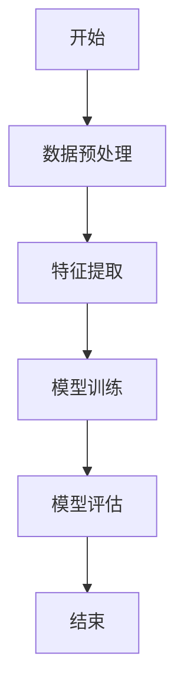
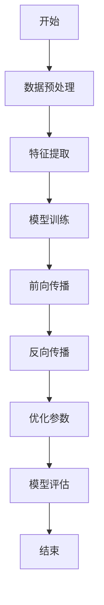
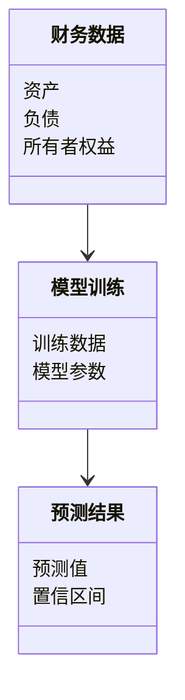
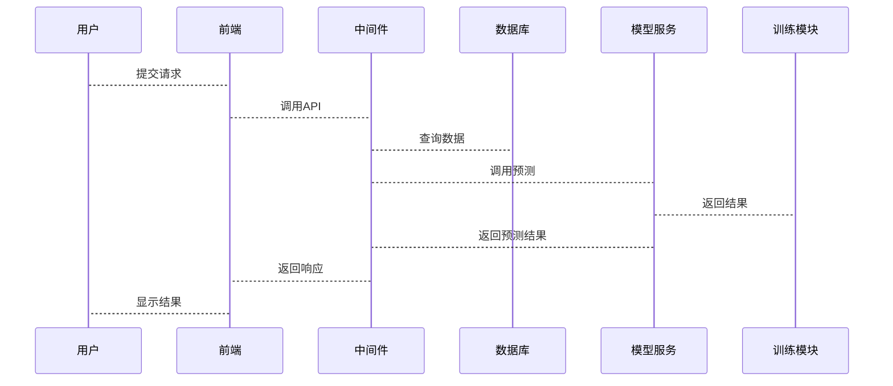

                 


# AI辅助的公司财务报表预测与分析

> 关键词：AI，财务报表，预测，分析，机器学习，深度学习

> 摘要：本文探讨了人工智能在公司财务报表预测与分析中的应用，通过详细讲解核心概念、算法原理、系统架构设计以及实际项目案例，展示了如何利用AI技术提升财务分析的效率和准确性。文章从背景介绍、核心概念、算法实现、系统设计、项目实战到总结与展望，全面剖析了AI在财务领域的潜力和应用前景。

---

## 第一部分: AI辅助的公司财务报表预测与分析基础

### 第1章: AI在公司财务报表分析中的作用

#### 1.1 财务报表分析的背景与挑战

财务报表是企业经济活动的重要记录，传统分析方法依赖于人工审查和经验判断，存在效率低、误差大、难以处理海量数据等问题。AI技术的引入，通过自动化处理和模式识别，显著提升了分析的效率和准确性。

#### 1.2 AI辅助财务分析的核心概念

AI技术在财务分析中的应用主要集中在机器学习和深度学习算法上。机器学习适用于预测模型的构建，而深度学习则在处理复杂模式和非线性关系方面具有优势。

#### 1.3 本章小结

本章介绍了AI在财务分析中的重要性，分析了传统方法的局限性，并提出了AI技术的核心作用。

---

### 第2章: 财务报表的核心要素与AI结合的可行性分析

#### 2.1 财务报表的基本结构

- **资产负债表**：记录企业的资产、负债和所有者权益。
- **利润表**：展示企业的收入、费用和利润。
- **现金流量表**：反映企业的现金流入和流出情况。

#### 2.2 AI技术在财务数据处理中的应用

- **数据清洗与预处理**：AI能够自动识别和纠正数据中的错误。
- **数据特征提取**：通过自然语言处理提取文本数据中的有用信息。
- **数据标注与分类**：AI可以自动标注财务数据，辅助分类。

#### 2.3 财务报表分析的边界与外延

- **边界**：仅限于财务报表数据，不包括外部市场信息。
- **外延**：扩展到实时数据处理和动态预测。

#### 2.4 本章小结

本章详细分析了财务报表的核心要素，并探讨了AI技术在数据处理中的应用。

---

### 第3章: AI辅助财务分析的核心概念与联系

#### 3.1 核心概念原理

- **机器学习**：基于统计学习的预测模型。
- **深度学习**：通过多层神经网络提取复杂特征。

#### 3.2 核心概念属性特征对比表格

| 特性       | 机器学习 | 深度学习 |
|------------|----------|----------|
| 数据需求   | 小       | 大       |
| 计算复杂度 | 低       | 高       |
| 模型表达   | 简单     | 复杂     |

#### 3.3 ER实体关系图架构

```mermaid
erd
  财务数据
    --> 资产
    --> 负债
    --> 所有者权益
```

---

### 第4章: AI辅助财务分析的算法原理讲解

#### 4.1 算法原理概述

- **机器学习**：适用于线性关系。
- **深度学习**：适用于非线性复杂关系。

#### 4.2 算法流程图

**线性回归流程图**



**神经网络流程图**



#### 4.3 算法实现代码

**线性回归实现**

```python
import numpy as np

def linear_regression(X, y):
    # 数据增强
    X = np.hstack([np.ones((X.shape[0], 1)), X])
    # 最小二乘法求解系数
    theta = np.dot(np.linalg.inv(X.T @ X), X.T @ y)
    return theta

# 示例数据
X = np.array([[1, 2], [3, 4], [5, 6]])
y = np.array([7, 8, 9])

# 训练模型
theta = linear_regression(X, y)
print(theta)
```

**神经网络实现**

```python
import tensorflow as tf

model = tf.keras.Sequential([
    tf.keras.layers.Dense(64, activation='relu'),
    tf.keras.layers.Dense(1, activation='sigmoid')
])

model.compile(optimizer='adam', loss='binary_crossentropy', metrics=['accuracy'])

# 示例数据
X_train = np.random.random((100, 64))
y_train = np.random.randint(2, size=(100, 1))

# 训练模型
model.fit(X_train, y_train, epochs=10, batch_size=32)
```

#### 4.5 数学模型和公式

**线性回归模型**

$$ y = \beta_0 + \beta_1x + \epsilon $$

**神经网络模型**

$$ f(x) = \sigma(w_2 \cdot \sigma(w_1 x + b_1) + b_2) $$

---

## 第二部分: 系统分析与架构设计

### 第5章: 系统分析与架构设计

#### 5.1 问题场景介绍

企业需要实时监控财务数据，快速生成预测报告。

#### 5.2 系统功能设计

- **数据采集**：从ERP系统获取实时数据。
- **数据处理**：清洗和特征提取。
- **模型训练**：构建预测模型。
- **结果展示**：生成可视化报告。

**领域模型类图**



**系统架构图**


#### 5.3 系统交互流程

**交互序列图**



---

## 第三部分: 项目实战

### 第6章: 项目实战

#### 6.1 环境安装

安装必要的Python库：

```bash
pip install numpy pandas scikit-learn tensorflow
```

#### 6.2 核心实现代码

**数据预处理**

```python
import pandas as pd

# 加载数据
data = pd.read_csv('financial_data.csv')

# 数据清洗
data = data.dropna()
```

**模型训练**

```python
from sklearn.linear_model import LinearRegression

model = LinearRegression()
model.fit(X_train, y_train)
```

**结果展示**

```python
import matplotlib.pyplot as plt

plt.scatter(X_test, y_test, color='r')
plt.plot(X_test, model.predict(X_test), color='b')
plt.show()
```

#### 6.3 实际案例分析

以某公司财务数据为例，训练模型并评估预测结果。

#### 6.4 项目小结

本章通过实际案例展示了AI在财务预测中的应用，从环境安装到数据处理，再到模型训练和结果展示，提供了完整的实现步骤。

---

## 第四部分: 总结与展望

### 第7章: 总结与展望

#### 7.1 本章总结

本文全面介绍了AI在财务报表预测与分析中的应用，从理论到实践，详细讲解了核心概念、算法实现和系统设计。

#### 7.2 未来展望

未来，AI技术将在财务分析中发挥更大作用，如实时预测、智能决策支持等。

#### 7.3 最佳实践 tips

- 数据质量至关重要。
- 模型需要定期调优。
- 结合业务背景进行分析。

#### 7.4 小结

AI技术正在改变财务分析的方式，未来将更加智能化和自动化。

---

作者：AI天才研究院/AI Genius Institute & 禅与计算机程序设计艺术 /Zen And The Art of Computer Programming

