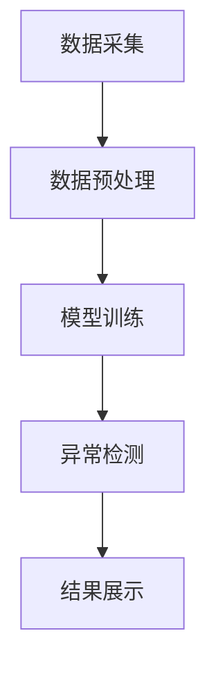

                 


# AI辅助的公司财务比率异常检测

> 关键词：AI技术，财务比率，异常检测，机器学习，企业风险管理

> 摘要：本文深入探讨了如何利用人工智能技术辅助公司财务比率异常检测。通过分析财务比率的基本概念、异常检测的重要性以及AI技术在财务分析中的应用，结合机器学习算法和系统架构设计，提出了一种高效的财务比率异常检测方案。本文还详细介绍了算法原理、系统设计、项目实战和最佳实践，为读者提供了全面的技术指导。

---

## 第一部分: AI辅助的公司财务比率异常检测基础

### 第1章: 财务比率异常检测的背景与意义

#### 1.1 财务比率的基本概念

财务比率是衡量企业财务状况的重要指标，通过分析企业的财务数据，可以评估企业的偿债能力、运营效率和盈利能力。常见的财务比率包括：

- **流动性比率**：衡量企业偿还短期债务的能力，例如速动比率（Quick Ratio）和流动比率（Current Ratio）。
- **杠杆比率**：衡量企业债务与股东权益的比例，例如资产负债率（Debt-to-Assets Ratio）和利息保障倍数（Interest Coverage Ratio）。
- **营运效率比率**：衡量企业利用资产效率的能力，例如存货周转率（Inventory Turnover Ratio）和应收账款周转率（Accounts Receivable Turnover Ratio）。
- **盈利能力比率**：衡量企业创造利润的能力，例如净利率（Net Profit Margin）和ROE（Return on Equity）。

#### 1.2 异常检测的重要性

在企业财务管理中，及时发现财务比率的异常变化至关重要。异常可能表明企业在财务健康方面存在问题，例如潜在的偿债风险、运营效率下降或盈利能力减弱。通过异常检测，企业可以提前采取措施，避免财务危机的发生。

#### 1.3 AI技术在财务异常检测中的应用

AI技术，特别是机器学习和深度学习，为财务异常检测提供了强大的工具。通过分析大量的财务数据，AI模型可以识别出隐藏在数据中的异常模式，从而帮助财务分析师更快地发现潜在问题。

---

### 第2章: AI辅助财务异常检测的核心概念

#### 2.1 异常检测的基本原理

异常检测是一种通过分析数据集，识别出与正常数据显著不同的样本或数据点的技术。在财务比率异常检测中，异常检测可以帮助识别出那些偏离正常范围的财务指标，从而提示潜在的财务问题。

#### 2.2 AI技术在异常检测中的应用

机器学习算法，例如随机森林（Random Forest）和神经网络（Neural Networks），可以被用来训练模型，识别财务比率中的异常值。这些算法通过学习正常数据的特征，可以有效地识别出异常数据。

#### 2.3 异常检测与企业价值评估的关系

异常检测不仅有助于识别财务风险，还可以帮助评估企业的整体价值。例如，异常的财务比率可能表明企业存在潜在的财务问题，这可能影响企业的估值。

---

### 第3章: 财务比率异常检测的核心概念与联系

#### 3.1 财务比率异常检测的核心概念

财务比率异常检测是指通过分析企业的财务数据，识别出那些偏离正常范围的财务比率。这些异常比率可能表明企业在财务健康方面存在问题。

#### 3.2 核心概念的原理与联系

财务比率异常检测的核心在于识别数据中的异常值。通过机器学习算法，可以将财务数据映射到一个低维空间，从而更容易地识别出异常值。

---

## 第二部分: AI辅助财务比率异常检测的核心原理

### 第4章: 异常检测算法原理

#### 4.1 常用异常检测算法

在财务比率异常检测中，常用的异常检测算法包括：

- **基于统计的异常检测**：例如Z-score方法，通过计算数据点与均值的距离来识别异常值。
- **基于机器学习的异常检测**：例如Isolation Forest算法，通过随机选择特征和分割数据来识别异常值。
- **基于深度学习的异常检测**：例如变种自动编码器（VAE），通过重建数据来识别异常值。

#### 4.2 异常检测算法的数学模型

以Z-score方法为例，其数学公式为：

$$ z = \frac{x - \mu}{\sigma} $$

其中，\( x \) 是数据点，\( \mu \) 是数据的均值，\( \sigma \) 是数据的标准差。当 \( |z| \) 超过一定阈值时，数据点被认为是异常值。

---

## 第三部分: 系统架构设计与实现

### 第5章: 系统架构设计

#### 5.1 问题场景介绍

本系统旨在通过AI技术辅助财务分析师检测公司财务比率中的异常值。系统需要处理大量的财务数据，包括收入、支出、资产、负债等指标。

#### 5.2 系统功能设计

- **数据采集模块**：从企业的财务报表中提取数据，包括收入、支出、资产、负债等指标。
- **数据预处理模块**：对数据进行清洗、标准化和归一化处理，确保数据适合后续分析。
- **模型训练模块**：使用机器学习算法训练异常检测模型，例如Isolation Forest算法。
- **异常检测模块**：利用训练好的模型，识别出财务比率中的异常值。
- **结果展示模块**：将检测结果以可视化的方式呈现，帮助财务分析师快速识别问题。

#### 5.3 系统架构设计



---

## 第四部分: 项目实战与案例分析

### 第6章: 项目实战

#### 6.1 环境搭建

- **Python版本**：建议使用Python 3.8及以上版本。
- **依赖库安装**：安装numpy、pandas、scikit-learn等库。

#### 6.2 核心代码实现

```python
import numpy as np
from sklearn.ensemble import IsolationForest

# 生成模拟数据
X = np.random.normal(loc=0, scale=1, size=(100, 2))
outliers = np.random.uniform(low=-4, high=4, size=(10, 2))
X = np.vstack([X, outliers])

# 训练Isolation Forest模型
model = IsolationForest(contamination=0.1)
model.fit(X)

# 预测异常值
y_pred = model.predict(X)
print(y_pred)
```

#### 6.3 案例分析

通过上述代码，我们可以训练一个Isolation Forest模型，并识别出数据中的异常值。在财务比率异常检测中，类似的方法可以被用来识别企业的财务健康问题。

---

## 第五部分: 扩展与最佳实践

### 第7章: 扩展与最佳实践

#### 7.1 模型优化与调优

- **超参数调整**：通过网格搜索（Grid Search）优化模型的参数，例如调整Isolation Forest的contamination参数。
- **特征选择**：通过特征重要性分析，选择对异常检测影响最大的特征。

#### 7.2 结果可视化与解释

- **可视化工具**：使用Matplotlib或Seaborn对异常检测结果进行可视化。
- **结果解释**：结合业务背景，解释异常值的含义，例如某个企业的某项财务指标异常可能表明其存在偿债风险。

#### 7.3 法律合规与数据隐私

在实际应用中，需要注意数据隐私和合规性问题，确保数据的合法使用和保护。

---

## 第六部分: 结语

### 第8章: 结语

AI技术为财务比率异常检测提供了强大的工具，通过机器学习算法和系统架构设计，我们可以更高效地识别财务数据中的异常值，从而帮助企业及时发现潜在的财务问题，提升企业的风险管理能力。

---

作者：AI天才研究院 & 禅与计算机程序设计艺术

