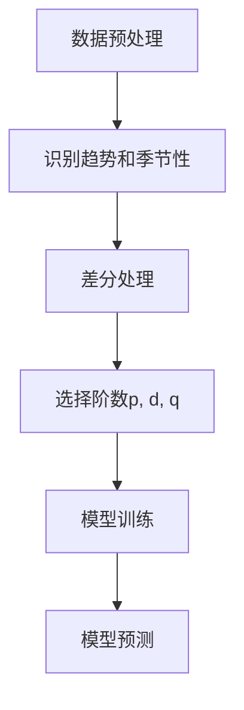
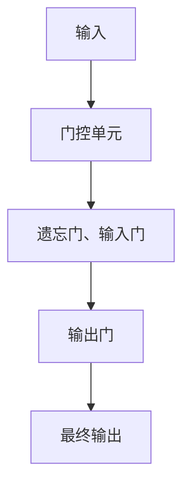
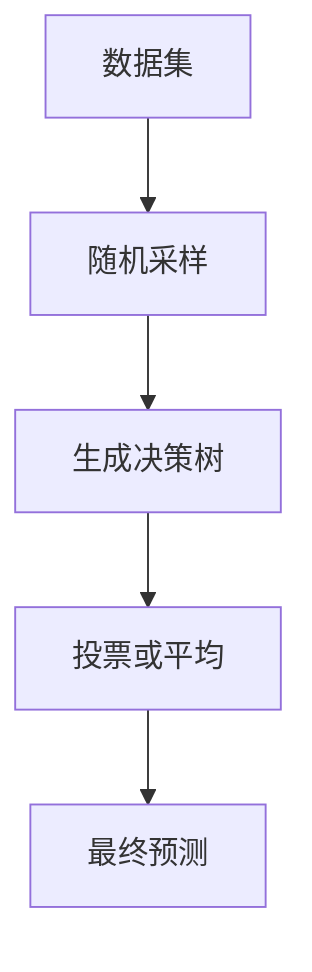
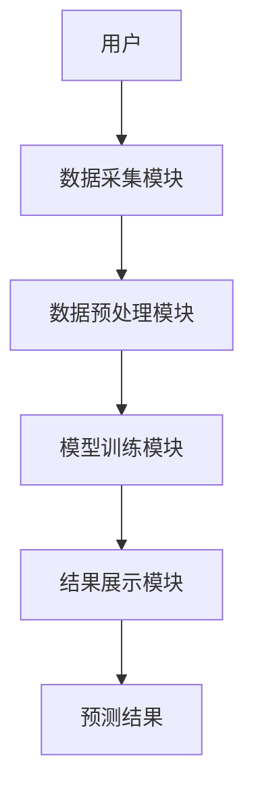
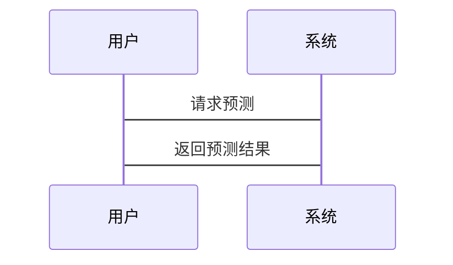

                 


# AI辅助的宏观经济指标预测模型

**关键词：** 宏观经济指标，人工智能，预测模型，机器学习，时间序列分析

**摘要：**  
本文探讨了如何利用人工智能技术构建宏观经济指标预测模型，分析了宏观经济指标的基本概念、AI在预测中的作用、现有模型的优缺点，以及基于AI的预测模型的算法原理和系统设计。文章还通过实际案例展示了如何将AI技术应用于宏观经济预测，并总结了相关经验与未来发展方向。

---

# 第1章 宏观经济指标与AI预测概述

## 1.1 宏观经济指标的基本概念

### 1.1.1 宏观经济指标的定义与分类

宏观经济指标是衡量一个国家或地区经济运行状态的重要工具，通常分为总量指标、结构指标和价格指标三类。

- **总量指标**：如国内生产总值（GDP）、国民收入等，反映整体经济规模。
- **结构指标**：如失业率、产业构成，反映经济结构。
- **价格指标**：如通货膨胀率、消费价格指数（CPI），反映价格水平。

这些指标为政策制定者、企业和个人提供了重要的经济参考。

### 1.1.2 宏观经济指标的重要性

宏观经济指标是经济研究和政策制定的基础，它们能够帮助我们理解经济趋势、评估政策效果，并预测未来的经济走向。

### 1.1.3 宏观经济预测的挑战与意义

宏观经济预测面临数据复杂性高、变量之间相互作用强、外部冲击难以预测等挑战。然而，准确的预测能够帮助政府制定更有效的政策，企业和个人做出更明智的决策。

---

## 1.2 AI在宏观经济预测中的作用

### 1.2.1 AI技术的基本原理

人工智能通过模拟人脑的神经网络，利用大量数据进行学习和推理，能够处理复杂的数据模式。

### 1.2.2 AI在宏观经济分析中的优势

- **数据处理能力**：AI能够处理海量数据，发现传统方法难以察觉的模式。
- **实时性**：AI可以实时更新模型，适应经济变化。
- **准确性**：通过机器学习算法，AI能够提高预测的准确性。

### 1.2.3 宏观经济预测的AI化趋势

随着计算能力的提升和数据的丰富，AI在宏观经济预测中的应用越来越广泛。

---

## 1.3 宏观经济指标预测模型的现状与挑战

### 1.3.1 现有模型的分类与特点

- **时间序列模型**：如ARIMA，适合处理具有趋势和周期性的数据。
- **统计回归模型**：如多元回归，适合因果关系分析。
- **机器学习模型**：如随机森林、神经网络，适合复杂非线性关系。

### 1.3.2 AI辅助预测的局限性

- 数据质量要求高
- 模型解释性差
- 过度拟合风险

### 1.3.3 宏观经济预测的未来发展方向

- 更多领域数据的整合
- 深度学习模型的应用
- 多模型融合

---

# 第2章 宏观经济指标预测模型的核心概念与联系

## 2.1 宏观经济指标预测模型的构成

### 2.1.1 数据来源与特征

数据来源包括政府统计数据、行业报告、市场数据等。特征工程是关键，需要选择合适的变量和处理方法。

### 2.1.2 模型结构与参数

模型结构包括输入层、隐藏层和输出层，参数包括权重和偏置。

### 2.1.3 预测目标与评估指标

预测目标是具体的经济指标，评估指标如均方误差（MSE）、R²值。

## 2.2 宏观经济指标预测模型的分类

### 2.2.1 时间序列模型

- ARIMA：自回归积分滑动模型
- LSTM：长短期记忆网络

### 2.2.2 统计回归模型

- 多元线性回归
- logistic回归

### 2.2.3 机器学习模型

- 随机森林
- 支持向量机（SVM）

## 2.3 AI辅助模型的核心概念

### 2.3.1 数据预处理与特征工程

- 数据清洗：处理缺失值、异常值
- 特征选择：选择重要变量
- 数据变换：标准化、归一化

### 2.3.2 模型训练与优化

- 参数调优：网格搜索、随机搜索
- 正则化：L1、L2正则化
- 交叉验证：K折交叉验证

### 2.3.3 模型部署与应用

- API接口开发
- 可视化展示
- 实时预测

## 2.4 核心概念对比分析

### 2.4.1 宏观经济指标预测模型的特征对比表格

| 模型类型 | 数据类型 | 优缺点 | 适用场景 |
|----------|----------|--------|----------|
| ARIMA    | 时间序列 | 易解释，适合线性趋势 | 单变量预测 |
| LSTM     | 时间序列 | 长期依赖，非线性 | 多变量预测 |
| 随机森林 | 多元数据 | 高准确性，非线性 | 多变量预测 |

### 2.4.2 宏观经济指标预测模型的ER实体关系图

```mermaid
erDiagram
    nation[Nation] {
        id
        name
    }
    indicator[Indicator] {
        id
        name
        value
        time_stamp
    }
    prediction[Prediction] {
        id
        predicted_value
        timestamp
    }
    nation --> indicator : "belongs to"
    indicator --> prediction : "generates"
```

---

# 第3章 宏观经济指标预测模型的算法原理

## 3.1 时间序列模型

### 3.1.1 ARIMA模型

ARIMA模型由自回归（AR）和移动平均（MA）部分组成。

#### ARIMA算法步骤



#### ARIMA数学公式

$$ ARIMA(p, d, q) = y_t - \sum_{i=1}^p \theta_i y_{t-i} - \epsilon_t $$

### 3.1.2 LSTM模型

LSTM通过门控机制处理长期依赖关系。

#### LSTM算法步骤



#### LSTM数学公式

$$ f_t = \sigma(W_f \cdot [h_{t-1}, x_t]) $$
$$ i_t = \sigma(W_i \cdot [h_{t-1}, x_t]) $$
$$ o_t = \sigma(W_o \cdot [h_{t-1}, x_t]) $$
$$ c_t = f_t \cdot c_{t-1} + i_t \cdot tanh(W_c \cdot [h_{t-1}, x_t]) $$
$$ h_t = o_t \cdot tanh(c_t) $$

---

## 3.2 统计回归模型

### 3.2.1 多元线性回归

多元线性回归通过多个自变量预测因变量。

#### 多元线性回归公式

$$ y = \beta_0 + \beta_1 x_1 + \beta_2 x_2 + \ldots + \beta_n x_n + \epsilon $$

### 3.2.2 logistic回归

用于分类问题，如判断是否进入经济衰退。

#### logistic回归公式

$$ P(y=1|x) = \frac{e^{\beta_0 + \beta_1 x}}{1 + e^{\beta_0 + \beta_1 x}} $$

---

## 3.3 机器学习模型

### 3.3.1 随机森林

随机森林通过集成学习提高预测准确性。

#### 随机森林算法步骤



### 3.3.2 支持向量机（SVM）

SVM通过寻找最优超平面进行分类或回归。

#### SVM数学公式

$$ y = \text{sign}(\sum_{i=1}^n \alpha_i y_i x_i \cdot x + b) $$

---

# 第4章 宏观经济指标预测模型的系统设计

## 4.1 系统功能设计

### 4.1.1 数据采集模块

- 从政府数据库、API接口获取数据
- 数据清洗和预处理

### 4.1.2 模型训练模块

- 选择模型算法
- 调参优化

### 4.1.3 结果展示模块

- 可视化预测结果
- 模型评估报告

## 4.2 系统架构设计



## 4.3 接口设计与交互

### 4.3.1 API接口

- 输入：指标名称、时间范围
- 输出：预测值、置信区间

### 4.3.2 交互流程图



---

# 第5章 项目实战

## 5.1 环境安装

- Python 3.8+
- 安装库：numpy、pandas、sklearn、keras、tensorflow

## 5.2 核心代码实现

### 5.2.1 数据预处理

```python
import pandas as pd
import numpy as np

data = pd.read_csv('macroeconomic.csv')
data = data.dropna()
data = (data - data.mean()) / data.std()
```

### 5.2.2 模型训练

```python
from sklearn.ensemble import RandomForestRegressor
from sklearn.metrics import mean_squared_error

model = RandomForestRegressor(n_estimators=100, random_state=42)
model.fit(X_train, y_train)
```

### 5.2.3 模型评估

```python
y_pred = model.predict(X_test)
mse = mean_squared_error(y_test, y_pred)
print(f'MSE: {mse}')
```

## 5.3 案例分析

以预测GDP为例，展示模型的训练和预测过程，并分析结果的准确性。

---

# 第6章 最佳实践与小结

## 6.1 经验总结

- 数据预处理至关重要
- 模型选择影响预测效果
- 结果验证不可忽视

## 6.2 注意事项

- 数据质量影响预测准确性
- 模型解释性需考虑
- 避免过度拟合

## 6.3 未来展望

- 更多数据源的整合
- 更复杂模型的应用
- 实时预测的实现

---

# 作者：AI天才研究院 & 禅与计算机程序设计艺术

---

通过以上结构，文章详细讲解了AI辅助的宏观经济指标预测模型的各个方面，从理论到实践，为读者提供了全面的指导和深入的分析。

