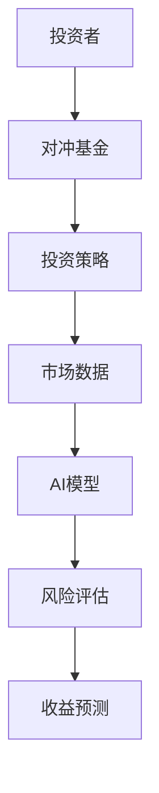
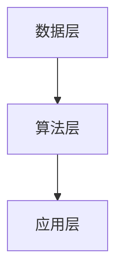

                 


# AI辅助的对冲基金策略分析

## 关键词：对冲基金、AI、策略分析、金融建模、风险管理、机器学习

## 摘要：
本文深入探讨了人工智能技术在对冲基金策略分析中的应用，从基础概念到算法原理，再到系统架构和项目实战，全面解析如何利用AI优化对冲基金策略。文章不仅介绍了AI在金融领域的核心作用，还详细分析了各类算法和数学模型在策略优化中的具体应用，为读者提供了从理论到实践的全面指导。

---

# 第1章: AI与对冲基金策略分析概述

## 1.1 对冲基金的基本概念
对冲基金是一种通过做多和做空多种金融工具来实现收益的投资基金。其核心目标是通过市场中性策略降低市场风险，同时捕捉alpha收益。对冲基金的策略多样化，包括配对交易、市场中性策略、统计套利等，每种策略都有其独特的市场适应性和风险特征。

## 1.2 AI技术在金融领域的应用
人工智能在金融领域的应用广泛，包括股票预测、风险评估、交易策略优化等。AI技术能够处理海量数据，发现复杂模式，帮助投资者做出更明智的决策。在对冲基金领域，AI主要用于策略优化、市场预测和风险控制。

## 1.3 对冲基金与AI的结合
通过对冲基金与AI的结合，可以显著提升策略分析的效率和准确性。AI能够快速处理复杂数据，识别潜在的市场机会，优化投资组合，并实时监控风险。这种结合不仅提高了投资回报率，还降低了传统对冲基金的交易成本和人为错误。

---

# 第2章: 对冲基金策略分析的核心概念

## 2.1 对冲基金策略的分类
对冲基金策略主要分为以下几类：
1. **配对交易策略**：基于相关资产价格差异的套利。
2. **市场中性策略**：通过做多和做空平衡市场风险。
3. **统计套利策略**：利用统计模型寻找价格偏差。
4. **事件驱动策略**：基于公司事件（如并购）进行投资。

## 2.2 AI辅助对冲基金策略的核心要素
1. **数据特征提取**：从市场数据中提取有用的特征，如波动率、相关性等。
2. **模型选择与优化**：选择合适的AI模型，并进行参数调优。
3. **风险控制机制**：通过AI实时监控和调整投资组合的风险。

## 2.3 对冲基金策略分析的边界与外延
对冲基金策略分析的边界包括数据的可用性、模型的泛化能力以及市场环境的变化。外延则涉及AI在金融领域的其他应用，如智能投顾和量化交易。

---

# 第3章: AI辅助对冲基金策略的核心概念联系

## 3.1 核心概念原理
1. **数据驱动的策略优化**：通过AI分析市场数据，识别潜在的alpha信号。
2. **AI算法在风险控制中的应用**：利用机器学习模型预测市场风险，优化投资组合。
3. **多因子模型的构建与优化**：通过AI技术自动筛选和优化影响资产收益的关键因子。

## 3.2 核心概念属性特征对比
| 策略类型 | 数据特征 | 模型选择 | 风险控制 |
|----------|----------|----------|----------|
| 配对交易 | 股价相关性 | 线性回归 | VaR模型 |
| 市场中性 | 行业暴露 | 随机森林 | CVaR模型 |
| 统计套利 | 均值回归 | 神经网络 | 马科维茨优化 |

## 3.3 ER实体关系图架构


---

# 第4章: AI辅助对冲基金策略的算法原理

## 4.1 常见AI算法及其在对冲基金中的应用
1. **机器学习算法**：如随机森林用于分类和回归问题。
2. **深度学习算法**：如LSTM用于时间序列预测。
3. **自然语言处理算法**：用于分析新闻和社交媒体情绪。

## 4.2 算法原理详解
### 4.2.1 随机森林算法
随机森林是一种基于决策树的集成学习算法，通过组合多个决策树的结果来提高预测准确性和鲁棒性。其核心步骤包括：
1. 从训练数据中随机抽取样本。
2. 在每个样本上训练一棵决策树。
3. 对所有决策树进行投票或平均，得到最终预测结果。

### 4.2.2 LSTM算法
LSTM（长短期记忆网络）用于处理时间序列数据，能够捕捉长期依赖关系。其主要组成部分包括输入门、遗忘门和输出门。

---

# 第5章: AI辅助对冲基金策略的数学模型与公式

## 5.1 时间序列分析
时间序列分析用于预测资产价格的变化。常用模型包括ARIMA和LSTM。

### ARIMA模型
ARIMA（自回归积分滑动平均）模型用于分析和预测时间序列数据。其数学表达式为：
$$ ARIMA(p, d, q) $$
其中，p为自回归阶数，d为差分阶数，q为滑动平均阶数。

## 5.2 回归模型
回归模型用于预测资产收益与多个因子之间的关系。线性回归的数学公式为：
$$ y = \beta_0 + \beta_1x_1 + \beta_2x_2 + \dots + \beta_nx_n + \epsilon $$

---

# 第6章: AI辅助对冲基金策略的系统架构设计

## 6.1 系统架构设计
系统架构分为数据层、算法层和应用层。数据层负责数据存储和预处理，算法层实现AI模型训练，应用层提供用户界面和结果展示。



## 6.2 系统接口设计
系统接口包括数据接口、模型接口和用户接口。数据接口负责与数据源交互，模型接口实现AI模型的调用，用户接口提供交互界面。

---

# 第7章: AI辅助对冲基金策略的项目实战

## 7.1 环境搭建
安装必要的Python库，如pandas、numpy、scikit-learn和keras。

## 7.2 核心实现
实现一个简单的配对交易策略，使用随机森林模型预测价格差异。

```python
from sklearn.ensemble import RandomForestRegressor
import pandas as pd

# 数据预处理
data = pd.read_csv('data.csv')
X = data[['close', 'open', 'high', 'low']]
y = data['target']

# 模型训练
model = RandomForestRegressor()
model.fit(X, y)

# 预测
y_pred = model.predict(X)
```

## 7.3 案例分析
通过具体案例分析模型的预测效果，评估其在实际交易中的表现。

---

# 作者信息
作者：AI天才研究院 & 禅与计算机程序设计艺术

---

通过以上内容，读者可以全面了解AI在对冲基金策略分析中的应用，从理论到实践，逐步掌握如何利用AI技术优化投资策略。

