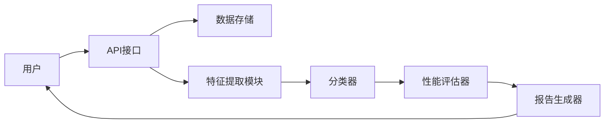

                 


# AI辅助的对冲基金策略分类与性能评估

> 关键词：AI，对冲基金，策略分类，性能评估，机器学习，深度学习

> 摘要：随着人工智能技术的迅速发展，对冲基金行业也在积极引入AI技术以提升策略分类和性能评估的效率与准确性。本文将深入探讨AI在对冲基金策略分类中的应用，分析常见分类算法的原理与实现，并结合实际案例展示如何通过AI技术优化策略分类与性能评估过程。文章内容涵盖背景介绍、核心概念、算法原理、系统架构设计、项目实战以及总结等部分，旨在为读者提供一个全面且深入的技术指南。

---

## 第1章 AI辅助的对冲基金策略分类与性能评估背景

### 1.1 对冲基金的基本概念

#### 1.1.1 对冲基金的定义
对冲基金是一种通过做多和做空多种金融资产来对冲市场风险，追求绝对收益的投资工具。其核心目标是通过多样化的投资策略在不同市场条件下实现稳定收益。

#### 1.1.2 对冲基金的运作模式
对冲基金通常采用量化交易策略，利用数学模型和算法进行高频交易，能够在复杂多变的市场环境中快速捕捉套利机会。

#### 1.1.3 对冲基金的分类与特点
对冲基金可以根据投资策略、资产类别、风险敞口等多种维度进行分类。常见的分类包括：
1. **股票多空策略**：同时做多和做空股票。
2. **配对交易策略**：利用相关资产的价格差异进行套利。
3. **统计套利策略**：基于统计模型寻找市场中的定价偏差。
4. **CTA策略**：利用商品期货和衍生品进行交易。

### 1.2 AI在金融领域的应用背景

#### 1.2.1 人工智能在金融领域的应用现状
AI技术已经在金融领域的多个方面得到了广泛应用，包括风险管理、信用评分、股价预测、交易策略优化等。

#### 1.2.2 对冲基金策略中的AI技术应用
AI技术的应用使对冲基金能够更快速地识别市场机会，优化交易策略，并提高风险管理能力。例如：
1. **市场数据处理**：利用自然语言处理技术分析新闻和社交媒体数据，预测市场情绪。
2. **交易信号生成**：通过机器学习模型预测资产价格走势，生成交易信号。
3. **风险控制**：利用AI进行实时监控和风险预警。

#### 1.2.3 AI辅助对冲基金策略的优势与挑战
**优势**：
- 数据处理能力强，能够快速分析海量数据。
- 能够发现传统方法难以察觉的模式和规律。
- 提高交易效率，降低人工成本。

**挑战**：
- 数据质量和完整性对模型性能有直接影响。
- 模型的可解释性问题，影响风险管理和决策。
- 市场环境的复杂性和不确定性可能导致模型失效。

### 1.3 对冲基金策略分类与性能评估的核心问题

#### 1.3.1 策略分类的必要性
对冲基金策略分类是策略管理和优化的基础。通过分类，可以更好地理解不同策略的特点，制定相应的风险管理措施。

#### 1.3.2 策略性能评估的关键指标
常用的策略性能评估指标包括：
1. **夏普比率**：衡量投资组合的风险调整后收益。
2. **最大回撤**：衡量投资组合在一定时间段内的最大亏损幅度。
3. **收益波动率**：衡量收益的稳定性。

#### 1.3.3 AI辅助在策略分类与评估中的作用
AI技术可以通过数据挖掘和模式识别，帮助发现潜在的策略模式，优化策略分类和性能评估的过程。

---

## 第2章 AI辅助对冲基金策略分类的核心概念与联系

### 2.1 核心概念与原理

#### 2.1.1 对冲基金策略分类的定义
对冲基金策略分类是指根据特定的特征（如收益来源、风险敞口、交易频率等）将不同的策略划分到不同的类别中，以便进行更有效的管理和优化。

#### 2.1.2 AI辅助分类的基本原理
AI辅助分类基于机器学习算法，通过训练模型识别数据中的特征模式，实现对策略的自动分类。

#### 2.1.3 分类算法的选择与优化
选择合适的分类算法需要考虑数据特征、样本数量、分类目标等因素。常见的分类算法包括支持向量机（SVM）、随机森林、神经网络等。

### 2.2 AI分类算法与传统分类方法的对比

#### 2.2.1 传统分类方法的优缺点
传统分类方法（如k近邻、决策树）具有简单易懂、易于实现的优点，但在处理高维数据和非线性关系时表现较弱。

#### 2.2.2 常见AI分类算法的对比
- **支持向量机（SVM）**：适用于小样本数据，能够处理非线性分类问题。
- **随机森林**：适用于高维数据，具有较强的抗过拟合能力。
- **神经网络**：适用于复杂非线性关系，但需要处理模型过拟合和计算复杂度高的问题。

#### 2.2.3 选择合适算法的策略
选择算法时需要综合考虑数据特征、样本数量、计算资源和模型解释性等多方面因素。

### 2.3 策略分类与性能评估的实体关系图


---

## 第3章 AI辅助对冲基金策略分类的算法原理

### 3.1 常见AI分类算法概述

#### 3.1.1 支持向量机（SVM）
SVM是一种监督学习算法，适用于小样本、高维数据的分类问题。

#### 3.1.2 随机森林
随机森林是一种基于决策树的集成学习算法，具有较高的准确性和鲁棒性。

#### 3.1.3 神经网络
神经网络是一种模仿人脑结构的深度学习算法，适用于复杂非线性关系的分类问题。

### 3.2 基于机器学习的分类算法实现

#### 3.2.1 数据预处理与特征提取
数据预处理包括数据清洗、特征选择和标准化等步骤。特征提取需要根据业务需求选择相关性高的特征。

#### 3.2.2 算法实现步骤
1. 数据预处理与特征提取。
2. 选择合适的分类算法。
3. 训练模型并进行交叉验证。
4. 模型评估与优化。

#### 3.2.3 代码实现示例
```python
from sklearn.ensemble import RandomForestClassifier
from sklearn.metrics import accuracy_score
from sklearn.model_selection import train_test_split

# 数据准备
X_train, X_test, y_train, y_test = train_test_split(features, labels, test_size=0.2)

# 模型训练
model = RandomForestClassifier(n_estimators=100)
model.fit(X_train, y_train)

# 模型预测
y_pred = model.predict(X_test)

# 模型评估
print("Accuracy:", accuracy_score(y_test, y_pred))
```

### 3.3 算法原理的数学模型与公式

#### 3.3.1 线性回归模型
$$y = \beta_0 + \beta_1x + \epsilon$$

#### 3.3.2 神经网络的前向传播
$$a^{(l+1)} = \sigma(w^{(l)}a^{(l)} + b^{(l)})$$
其中，$\sigma$ 是激活函数，$w$ 是权重矩阵，$b$ 是偏置项。

---

## 第4章 对冲基金策略分类的系统分析与架构设计

### 4.1 系统功能设计

#### 4.1.1 数据采集模块
数据采集模块负责从多种数据源（如市场数据、新闻、社交媒体）获取相关数据。

#### 4.1.2 特征提取模块
特征提取模块对采集到的数据进行清洗、转换和特征提取，生成可供模型训练的特征向量。

#### 4.1.3 分类算法模块
分类算法模块负责对提取的特征进行分类，生成策略分类结果。

#### 4.1.4 性能评估模块
性能评估模块根据预设的评估指标，对分类结果进行评估，并生成评估报告。

### 4.2 系统架构设计

#### 4.2.1 系统功能模块图


#### 4.2.2 系统架构图


#### 4.2.3 系统接口设计
系统接口设计包括数据接口、模型接口和报告接口，确保各模块之间的数据交互和功能调用。

### 4.3 本章小结

---

## 第5章 项目实战：AI辅助的对冲基金策略分类与性能评估

### 5.1 项目背景与目标
本项目旨在利用AI技术实现对冲基金策略的自动分类和性能评估，优化投资决策过程。

### 5.2 环境安装与数据准备
1. 安装必要的Python库（如Pandas、Scikit-learn、TensorFlow）。
2. 收集和整理相关市场数据和策略表现数据。

### 5.3 系统核心实现

#### 5.3.1 数据预处理与特征提取
```python
import pandas as pd
import numpy as np

# 数据加载
data = pd.read_csv('strategies.csv')

# 特征选择
features = data[['return', 'volatility', 'max_drawdown']]
labels = data['strategy_type']
```

#### 5.3.2 模型训练与优化
```python
from sklearn.ensemble import RandomForestClassifier
from sklearn.model_selection import GridSearchCV

# 参数调优
param_grid = {
    'n_estimators': [100, 200],
    'max_depth': [None, 10, 20],
    'min_samples_split': [2, 5]
}

grid_search = GridSearchCV(RandomForestClassifier(), param_grid, cv=5)
grid_search.fit(X_train, y_train)

# 最佳模型
best_model = grid_search.best_estimator_
```

#### 5.3.3 性能评估与结果分析
```python
y_pred = best_model.predict(X_test)
print("Best Accuracy:", grid_search.best_score_)
print("Confusion Matrix:")
print(pd.crosstab(y_test, y_pred))
```

### 5.4 案例分析与详细解读
通过实际案例分析，展示AI辅助策略分类和性能评估的具体实现过程和结果。

### 5.5 本章小结

---

## 第6章 总结与展望

### 6.1 本章总结
本文详细探讨了AI辅助对冲基金策略分类与性能评估的核心概念、算法原理和系统设计，并通过实际案例展示了AI技术在对冲基金中的应用。

### 6.2 未来展望
未来，随着AI技术的不断发展，对冲基金策略分类和性能评估将更加智能化和自动化。可能的发展方向包括：
- 更加复杂的深度学习模型的应用。
- 多模态数据的融合与分析。
- 实时策略调整与动态风险控制。

---

## 作者：AI天才研究院 & 禅与计算机程序设计艺术

---

通过以上结构，您可以根据需要逐步深入每个章节的内容，完成一篇详细的技术博客文章。

