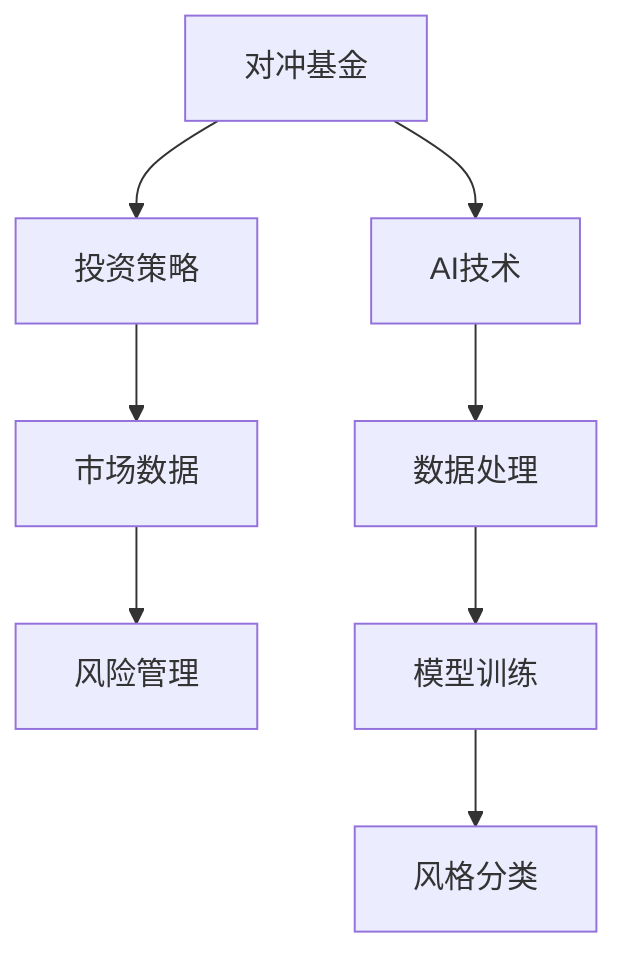
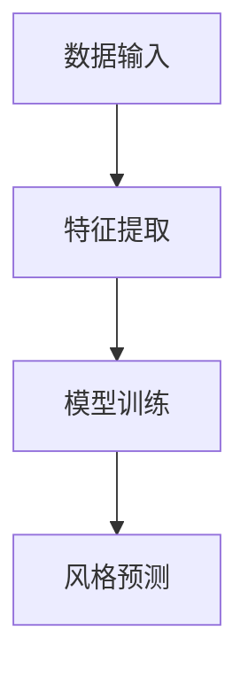
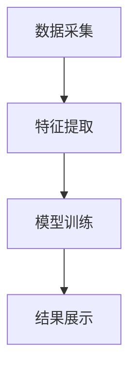
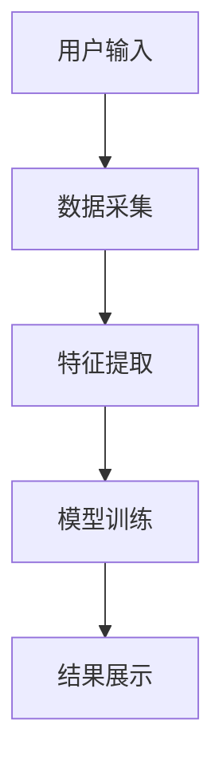

                 


# AI辅助的对冲基金风格分析

> 关键词：对冲基金，AI技术，风格分析，机器学习，深度学习

> 摘要：本文系统介绍了AI技术在对冲基金风格分析中的应用，从背景、核心概念、算法原理到系统架构设计和项目实战，深入剖析了AI辅助对冲基金风格分析的理论基础与实践方法。通过本文的讲解，读者将能够理解如何利用AI技术来提升对冲基金的风格分析能力，并在实际应用中取得更好的效果。

---

## 第1章 对冲基金与AI辅助分析的背景介绍

### 1.1 对冲基金的基本概念

#### 1.1.1 对冲基金的定义与特点

对冲基金是一种通过利用市场中不同资产或资产组合之间的价格差异进行套利交易的投资基金。其核心目标是通过多种投资策略在不同市场环境下实现超额收益。对冲基金的特点包括：

- **多样化策略**：采用多空双向投资，通过多种策略（如股票多空、套利、量化交易等）进行投资。
- **杠杆效应**：为了放大收益，对冲基金通常会使用杠杆。
- **风险控制**：对冲基金注重风险管理，通过严格的投资策略和组合管理来降低风险。

#### 1.1.2 对冲基金的主要策略类型

对冲基金的策略多种多样，常见的策略包括：

1. **股票多空策略**：通过买入低估股票，卖出高估股票获利。
2. **套利策略**：利用市场中的价格差异进行无风险或低风险套利。
3. **量化交易策略**：通过数学模型和算法进行高频交易，捕捉市场中的短期价格波动。
4. **事件驱动策略**：利用公司并购、重组等事件带来的股价波动获利。

#### 1.1.3 对冲基金在金融市场的角色与影响

对冲基金在金融市场中扮演着重要的角色，既是市场参与者，也是市场的流动性提供者。通过复杂的交易策略和风险控制，对冲基金在市场中起到了价格发现和市场稳定的作用。然而，由于其高杠杆和复杂的交易策略，对冲基金也常常被认为是市场风险的放大器。

### 1.2 AI技术在金融领域的应用背景

#### 1.2.1 AI技术的基本概念与特点

人工智能（AI）是指模拟人类智能的计算机系统，具有学习、推理、决策等能力。AI技术的核心包括机器学习、自然语言处理、计算机视觉等。其特点包括：

- **数据驱动**：AI技术依赖大量数据进行模型训练。
- **自动化**：AI系统能够自动完成任务，减少人工干预。
- **适应性**：AI系统能够根据数据反馈不断优化模型。

#### 1.2.2 AI在金融领域的典型应用

AI技术在金融领域的应用广泛，包括：

1. **股票预测**：通过机器学习模型预测股票价格走势。
2. **风险管理**：利用AI技术识别和评估市场风险。
3. **量化交易**：通过算法交易捕捉市场机会。
4. **客户画像**：通过自然语言处理技术分析客户行为，提供个性化服务。

#### 1.2.3 对冲基金与AI技术的结合趋势

随着AI技术的不断发展，越来越多的对冲基金开始采用AI技术来提升投资效率和收益。AI技术在对冲基金中的应用趋势包括：

- **智能化投资决策**：通过AI模型进行投资决策，提高决策的科学性和效率。
- **自动化交易**：利用算法交易快速捕捉市场机会。
- **实时数据分析**：通过AI技术实时分析市场数据，提供及时的投资建议。

---

## 第2章 对冲基金风格分析的核心概念与联系

### 2.1 对冲基金风格分析的定义与目标

#### 2.1.1 风格分析的定义

对冲基金风格分析是指通过对对冲基金的投资策略、交易行为和风险特征进行分析，从而识别和分类对冲基金的风格类型。通过对冲基金风格分析，投资者可以更好地理解基金的风险收益特征，制定更科学的投资决策。

#### 2.1.2 风格分析的目标与意义

风格分析的目标是通过对冲基金的风格分类，揭示其投资策略、风险特征和收益来源。风格分析的意义在于：

- **优化投资组合**：通过风格分析，投资者可以更好地配置资产，优化投资组合的风险收益比。
- **风险预警**：通过分析对冲基金的风格特征，投资者可以及时发现潜在风险。
- **提升透明度**：通过风格分析，投资者可以更好地理解对冲基金的投资行为。

### 2.2 对冲基金风格分析的关键要素

#### 2.2.1 投资策略的多样性

对冲基金的投资策略多种多样，包括股票多空、套利、量化交易等。不同的投资策略具有不同的风险收益特征，因此在风格分析中需要对策略进行分类。

#### 2.2.2 市场数据的复杂性

对冲基金风格分析需要依赖大量的市场数据，包括股票价格、成交量、市场指数等。这些数据具有复杂性，需要通过数据清洗、特征提取等步骤进行处理。

#### 2.2.3 风险管理的重要性

对冲基金风格分析的核心目标之一是识别和管理风险。通过分析对冲基金的风格特征，投资者可以更好地理解其风险来源，并制定相应的风险管理策略。

### 2.3 对冲基金风格与AI技术的结合

#### 2.3.1 AI技术在风格分析中的优势

AI技术在对冲基金风格分析中的优势包括：

- **数据处理能力**：AI技术能够处理海量数据，提取有用信息。
- **模式识别能力**：AI技术能够识别数据中的模式和规律，帮助发现潜在的投资机会。
- **自动化分析**：AI技术能够自动化完成数据分析任务，提高分析效率。

#### 2.3.2 AI技术与传统分析方法的对比

与传统分析方法相比，AI技术在对冲基金风格分析中的优势体现在：

- **数据处理能力**：AI技术能够处理更大规模的数据。
- **分析效率**：AI技术能够快速完成数据分析任务。
- **自适应能力**：AI技术能够根据市场变化自适应调整分析模型。

### 2.4 核心概念与联系的Mermaid流程图



---

## 第3章 对冲基金风格分析的算法原理

### 3.1 机器学习在风格分析中的应用

#### 3.1.1 机器学习的基本原理

机器学习是一种通过数据训练模型，使其能够进行预测或分类的技术。机器学习的基本原理包括：

- **数据输入**：输入数据进行训练。
- **特征提取**：从数据中提取特征。
- **模型训练**：通过训练数据调整模型参数。
- **预测输出**：模型对新数据进行预测。

#### 3.1.2 常见机器学习算法在风格分析中的应用

常见的机器学习算法在对冲基金风格分析中的应用包括：

1. **线性回归**：用于预测对冲基金的收益。
2. **支持向量机（SVM）**：用于对冲基金风格分类。
3. **随机森林**：用于对冲基金风格分类和特征选择。

#### 3.1.3 机器学习算法的数学模型

线性回归的数学模型如下：

$$
y = \beta_0 + \beta_1x + \epsilon
$$

其中，$y$ 是目标变量，$\beta_0$ 是截距，$\beta_1$ 是回归系数，$x$ 是自变量，$\epsilon$ 是误差项。

### 3.2 深度学习在风格分析中的应用

#### 3.2.1 深度学习的基本原理

深度学习是一种基于人工神经网络的机器学习技术，通过多层神经网络提取数据特征。

#### 3.2.2 基于深度学习的风格分析模型

常见的深度学习模型在对冲基金风格分析中的应用包括：

1. **卷积神经网络（CNN）**：用于图像识别和特征提取。
2. **循环神经网络（RNN）**：用于时间序列分析。
3. **长短期记忆网络（LSTM）**：用于时间序列预测。

#### 3.2.3 深度学习模型的数学公式

LSTM的数学公式如下：

$$
f_t = \sigma(g_t) \\
i_t = \sigma(h_t)
$$

其中，$f_t$ 是遗忘门，$i_t$ 是输入门，$g_t$ 和 $h_t$ 是门控函数。

### 3.3 算法原理的Mermaid流程图



---

## 第4章 对冲基金风格分析的系统架构设计

### 4.1 系统功能设计

#### 4.1.1 数据采集模块

数据采集模块负责采集对冲基金的相关数据，包括股票价格、成交量、市场指数等。

#### 4.1.2 特征提取模块

特征提取模块通过对原始数据进行处理，提取有用的特征，如均值、方差、自相关性等。

#### 4.1.3 模型训练模块

模型训练模块负责训练机器学习或深度学习模型，完成对冲基金的风格分类。

#### 4.1.4 结果展示模块

结果展示模块将分析结果以可视化的方式呈现，帮助用户更好地理解对冲基金的风格特征。

### 4.2 系统架构设计

#### 4.2.1 系统架构图



#### 4.2.2 系统接口设计

系统接口设计包括数据接口、模型接口和用户接口。

#### 4.2.3 系统交互流程图



---

## 第5章 对冲基金风格分析的项目实战

### 5.1 项目环境安装

#### 5.1.1 安装Python

```bash
python --version
```

#### 5.1.2 安装相关库

```bash
pip install numpy pandas scikit-learn
```

### 5.2 核心代码实现

#### 5.2.1 数据预处理代码

```python
import pandas as pd
import numpy as np

data = pd.read_csv('fund_data.csv')
data = data.dropna()
```

#### 5.2.2 模型训练代码

```python
from sklearn.ensemble import RandomForestClassifier

model = RandomForestClassifier()
model.fit(X_train, y_train)
```

#### 5.2.3 结果展示代码

```python
import matplotlib.pyplot as plt

plt.scatter(y_true, y_pred)
plt.xlabel('True Values')
plt.ylabel('Predicted Values')
plt.show()
```

### 5.3 项目小结

通过对冲基金风格分析项目的实战，我们能够更好地理解AI技术在对冲基金分析中的应用。通过数据采集、特征提取、模型训练和结果展示，我们可以实现对冲基金的风格分类，为投资者提供科学的投资决策依据。

---

## 第6章 最佳实践与总结

### 6.1 小结

通过对冲基金风格分析的理论与实践，我们能够看到AI技术在金融领域的巨大潜力。通过对冲基金风格分析，投资者可以更好地理解基金的风险收益特征，优化投资组合，提升投资效率。

### 6.2 注意事项

在实际应用中，需要注意以下几点：

1. **数据质量**：数据的质量直接影响分析结果，需确保数据的准确性和完整性。
2. **模型选择**：不同模型适用于不同的场景，需根据实际需求选择合适的模型。
3. **风险管理**：对冲基金风格分析的目标之一是风险管理，需注重模型的稳健性。

### 6.3 拓展阅读

1. 《机器学习实战》
2. 《深度学习》
3. 《对冲基金实务》

---

## 作者：AI天才研究院/AI Genius Institute & 禅与计算机程序设计艺术 /Zen And The Art of Computer Programming

---

通过以上内容，我们系统地介绍了AI技术在对冲基金风格分析中的应用，从背景、核心概念、算法原理到系统架构设计和项目实战，深入剖析了AI辅助对冲基金风格分析的理论基础与实践方法。希望本文能够为读者提供有价值的参考，帮助读者更好地理解AI技术在对冲基金分析中的应用。

