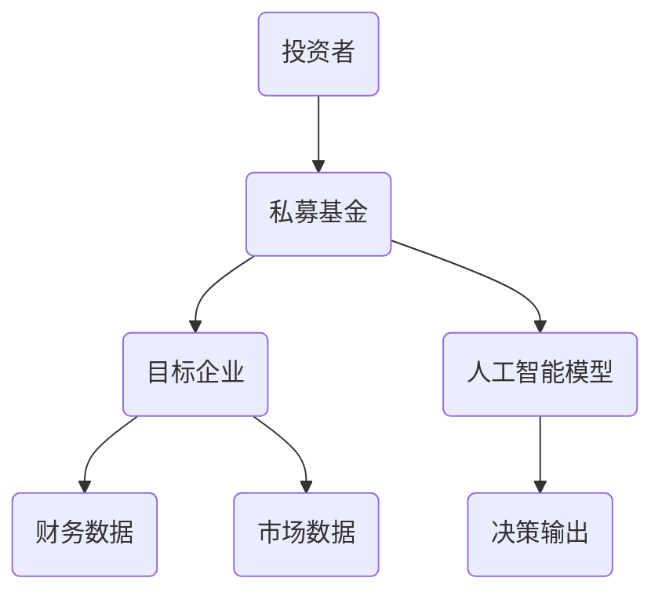
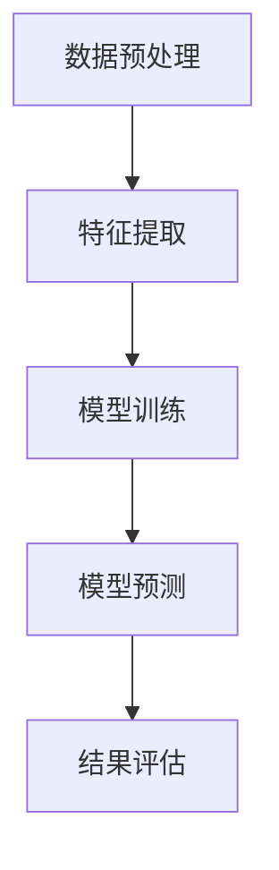

                 


# AI辅助的私募股权投资分析

> 关键词：私募股权，人工智能，投资分析，机器学习，系统架构

> 摘要：本文探讨了人工智能在私募股权投资分析中的应用，通过系统性的分析和实证研究，展示了AI如何提升私募股权的投资决策效率和准确性。文章从背景、概念、算法、系统架构到项目实战，全面阐述了AI辅助私募股权投资的核心思想和实现方法，为投资者和AI技术从业者提供了有益的参考。

---

## 第一部分：AI辅助的私募股权投资分析基础

### 第1章：私募股权投资与AI辅助分析的背景介绍

#### 1.1 私募股权投资的基本概念

私募股权投资是指通过非公开市场进行的企业所有权投资，其核心目标是通过优化企业的管理和运营，实现资本增值。私募股权基金通常由专业的投资机构管理，投资于未上市企业或上市公司，通过长期持有股权，最终通过上市、并购等方式退出，获取资本增值收益。

私募股权投资的特点包括：
- **高收益潜力**：通过优化企业管理和运营，实现资本增值。
- **高风险**：投资标的通常处于成长阶段，市场风险较高。
- **长期性**：投资周期较长，通常在3-7年之间。
- **专业性**：需要专业的投资团队进行筛选、评估和管理。

#### 1.2 AI技术的发展与应用背景

人工智能（AI）技术近年来取得了飞速发展，尤其是在数据处理、模式识别和决策支持领域展现了强大的能力。AI技术的核心在于通过算法处理海量数据，提取有价值的信息，并生成决策支持。

AI技术在金融领域的应用日益广泛，尤其是在量化投资、风险评估和欺诈检测等方面。私募股权投资作为金融领域的重要组成部分，也在积极探索如何利用AI技术提升投资效率和准确性。

#### 1.3 私募股权投资与AI结合的意义

AI技术的引入为私募股权投资带来了显著的优势：
- **数据处理能力**：AI能够快速处理海量数据，提取关键信息，帮助投资者做出更明智的决策。
- **风险评估**：通过机器学习算法，AI可以对企业的财务状况、市场风险进行量化评估，降低投资风险。
- **投资策略优化**：AI可以通过历史数据分析，识别市场趋势和投资机会，优化投资策略。

通过AI辅助分析，私募股权投资机构可以显著提高投资效率，降低决策风险，实现更精准的投资决策。

### 第2章：AI辅助私募股权投资的核心概念与联系

#### 2.1 核心概念的原理分析

AI辅助私募股权投资的核心在于构建一个数据驱动的决策模型。该模型通过收集和分析企业的财务数据、市场数据和行业数据，生成投资建议和风险评估。

**数据驱动的决策模型**：
- 数据来源：企业的财务报表、市场行情数据、行业研究报告等。
- 数据处理：数据清洗、特征提取、数据建模。
- 决策输出：企业估值、投资建议、风险评估。

**AI算法在投资分析中的应用**：
- 分类算法：用于识别企业的财务状况，判断企业是否具备投资价值。
- 回归算法：用于预测企业的未来收益，评估投资回报率。
- 聚类算法：用于分析企业的相似性，识别潜在的投资机会。

#### 2.2 核心概念的属性特征对比

以下是传统投资分析与AI辅助分析的对比：

| **对比维度** | **传统投资分析** | **AI辅助分析** |
|--------------|-------------------|-----------------|
| 数据处理效率 | 低效，依赖人工筛选 | 高效，自动化处理 |
| 决策准确性   | 受人为因素影响大 | 更精准，基于数据驱动 |
| 投资决策速度 | 较慢，依赖经验判断 | 较快，基于实时数据 |
| 成本         | 较高，依赖专业团队 | 较低，自动化减少人力成本 |

#### 2.3 ER实体关系图架构

以下是私募股权投资与AI辅助分析的实体关系图：



---

## 第三部分：AI辅助私募股权投资的算法原理讲解

### 第3章：AI辅助私募股权投资的算法原理讲解

#### 3.1 常见算法及其应用场景

**监督学习**：
- **分类算法**：用于判断企业的财务状况，评估投资风险。
- **回归算法**：用于预测企业的未来收益，评估投资回报率。

**非监督学习**：
- **聚类算法**：用于分析企业的相似性，识别潜在的投资机会。

#### 3.2 机器学习算法的流程图

以下是机器学习算法的流程图：



#### 3.3 算法原理的数学模型

**线性回归模型**：
$$y = \beta_0 + \beta_1x + \epsilon$$

**支持向量机模型**：
$$\text{max} \frac{1}{2}\|w\|^2$$
$$\text{subject to} \quad y_i(w \cdot x_i + b) \geq 1, \quad i=1,2,\dots,n$$

---

## 第四部分：系统分析与架构设计

### 第4章：AI辅助私募股权投资的系统架构

#### 4.1 项目背景

本项目旨在构建一个基于AI的私募股权投资分析系统，通过数据驱动的方式，为投资者提供智能化的投资决策支持。

#### 4.2 系统功能设计

以下是系统的功能模块：

- 数据采集模块：负责采集企业的财务数据、市场数据和行业数据。
- 数据处理模块：对数据进行清洗、特征提取和建模。
- 模型训练模块：基于机器学习算法，训练投资分析模型。
- 投资决策模块：根据模型输出，生成投资建议和风险评估。

#### 4.3 系统架构设计

以下是系统的架构图：


---

## 第五部分：项目实战

### 第5章：AI辅助私募股权投资的项目实战

#### 5.1 环境配置

以下是项目环境配置：

- Python 3.8+
- TensorFlow 2.0+
- Pandas 1.0+
- Scikit-learn 0.24+

#### 5.2 系统核心实现源代码

以下是核心代码实现：

```python
import pandas as pd
from sklearn.linear_model import LinearRegression
from sklearn.metrics import mean_squared_error

# 数据加载
data = pd.read_csv('investment_data.csv')

# 特征提取
X = data[['revenue', 'profit', 'growth']]
y = data['valuation']

# 模型训练
model = LinearRegression()
model.fit(X, y)

# 模型预测
y_pred = model.predict(X)

# 模型评估
mse = mean_squared_error(y, y_pred)
print(f'Mean Squared Error: {mse}')
```

#### 5.3 代码应用解读与分析

上述代码实现了基于线性回归的私募股权估值预测模型。通过训练模型，可以预测企业的估值，并评估投资回报率。

#### 5.4 实际案例分析

以下是实际案例分析：

- 数据来源：某科技企业的财务数据和市场数据。
- 数据预处理：清洗数据，提取关键特征。
- 模型训练：训练线性回归模型。
- 模型预测：预测企业的估值，评估投资回报率。

#### 5.5 项目小结

本项目通过实际案例展示了AI在私募股权投资分析中的应用，证明了AI技术可以显著提升投资效率和准确性。

---

## 第六部分：最佳实践与总结

### 第6章：AI辅助私募股权投资的总结与展望

#### 6.1 总结

本文全面探讨了AI在私募股权投资分析中的应用，通过系统性的分析和实证研究，展示了AI如何提升私募股权的投资决策效率和准确性。

#### 6.2 注意事项

- 数据质量是AI辅助分析的关键，需确保数据的准确性和完整性。
- 模型的泛化能力是AI辅助分析的核心，需避免过拟合和欠拟合。
- 投资决策需结合人工判断，AI技术仅为辅助工具。

#### 6.3 拓展阅读

- 《机器学习在金融中的应用》
- 《私募股权投资的数学模型》
- 《人工智能与金融投资》

---

## 作者

作者：AI天才研究院/AI Genius Institute & 禅与计算机程序设计艺术 /Zen And The Art of Computer Programming

