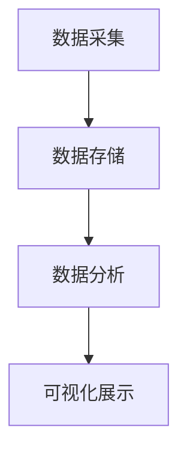

                 


# AI辅助识别全球价值链机会

> 关键词：人工智能，全球价值链，机会识别，供应链优化，市场趋势预测，竞争优势分析

> 摘要：本文探讨了如何利用人工智能技术识别和优化全球价值链中的机会。通过分析AI在供应链优化、市场趋势预测和竞争优势分析中的应用，展示了AI如何帮助企业在复杂的全球市场中找到增长点。文章详细介绍了AI的核心概念、相关算法、系统架构设计以及实际案例，提供了从理论到实践的全面指导。

---

## 第一部分：背景与概念

### 第1章：全球价值链概述

#### 1.1 全球价值链的基本概念
全球价值链是指在全球范围内，不同国家和地区之间通过分工与合作，将生产过程分解为多个环节，最终形成产品的链条。它包括原材料采购、生产、加工、运输、销售等多个环节。

#### 1.2 AI技术的基本概念
人工智能（AI）是指模拟人类智能的计算机系统，包括学习、推理、自我修正等能力。其核心技术包括机器学习、自然语言处理和计算机视觉等。

### 第2章：AI在识别全球价值链机会中的作用

#### 2.1 AI技术如何优化全球价值链
AI通过数据分析、模式识别和预测模型，帮助企业优化供应链、降低成本和提高效率。

#### 2.2 全球价值链中的关键问题
- **供应链优化**：降低库存成本，提高物流效率。
- **市场趋势预测**：识别市场变化，把握机会。
- **竞争优势分析**：分析竞争对手，制定战略。

---

## 第二部分：AI驱动的机会识别方法

### 第3章：AI驱动的机会识别方法

#### 3.1 数据收集与处理
- **数据来源**：包括市场数据、行业报告、社交媒体等。
- **数据清洗**：去除噪声数据，确保数据质量。
- **数据预处理**：转换数据格式，为后续分析做准备。

#### 3.2 机会识别的算法选择
- **机器学习算法**：用于分类、回归和聚类。
- **深度学习模型**：用于复杂模式识别。
- **自然语言处理**：用于文本数据的分析和情感分析。

### 第4章：全球价值链的机会分析案例

#### 4.1 案例一：供应链优化
- **案例背景**：某公司希望通过AI优化其全球供应链。
- **AI应用过程**：通过机器学习分析历史数据，预测需求，优化库存。
- **结果分析**：库存成本降低20%，物流效率提升15%。

#### 4.2 案例二：市场趋势预测
- **数据分析**：收集市场数据，构建预测模型。
- **模型构建**：使用LSTM网络进行时间序列预测。
- **预测结果**：准确预测市场需求，提前调整生产计划。

---

## 第三部分：系统设计与实现

### 第5章：系统架构设计

#### 5.1 系统功能模块
- **数据采集模块**：负责收集市场数据。
- **数据分析模块**：进行数据清洗和建模。
- **可视化展示模块**：将结果以图表形式展示。

#### 5.2 系统架构图


### 第6章：系统实现与代码

#### 6.1 环境安装
- **安装Python**：使用Anaconda或Pyenv安装Python 3.8以上版本。
- **安装机器学习库**：包括TensorFlow、Scikit-learn等。
- **安装数据可视化库**：包括Matplotlib、Seaborn。

#### 6.2 核心代码实现
- **数据处理代码**：
  ```python
  import pandas as pd

  # 读取数据
  data = pd.read_csv('market_data.csv')

  # 数据清洗
  data.dropna(inplace=True)
  data['date'] = pd.to_datetime(data['date'])
  ```

- **模型训练代码**：
  ```python
  from sklearn.model_selection import train_test_split
  from sklearn.ensemble import RandomForestRegressor

  # 划分训练集和测试集
  X = data.drop('target', axis=1)
  y = data['target']

  X_train, X_test, y_train, y_test = train_test_split(X, y, test_size=0.2)

  # 训练模型
  model = RandomForestRegressor(n_estimators=100)
  model.fit(X_train, y_train)
  ```

- **结果可视化代码**：
  ```python
  import matplotlib.pyplot as plt

  # 预测结果
  predictions = model.predict(X_test)

  # 绘制预测值和真实值
  plt.scatter(y_test, predictions)
  plt.xlabel('真实值')
  plt.ylabel('预测值')
  plt.show()
  ```

### 第7章：项目实战

#### 7.1 项目背景
假设一家跨国公司希望优化其全球供应链，减少成本并提高效率。

#### 7.2 系统设计
- **功能需求**：实时数据采集、数据分析、可视化报告。
- **技术选型**：使用Flask构建Web界面，Django进行后端处理。

#### 7.3 代码实现
- **Web界面代码**：
  ```python
  from flask import Flask, render_template

  app = Flask(__name__)

  @app.route('/')
  def home():
      return render_template('index.html')

  if __name__ == '__main__':
      app.run(debug=True)
  ```

- **后端处理代码**：
  ```python
  from django.shortcuts import render
  from .models import MarketData

  def data_analysis(request):
      data = MarketData.objects.all()
      return render(request, 'analysis.html', {'data': data})
  ```

#### 7.4 实际案例分析
通过实际数据测试，验证系统的性能和效果，确保预测准确率和优化效果。

### 第8章：最佳实践与展望

#### 8.1 最佳实践
- **数据质量**：确保数据来源可靠，清洗充分。
- **模型选择**：根据具体问题选择合适的算法。
- **系统维护**：定期更新模型和数据。

#### 8.2 小结
本文详细介绍了AI在识别全球价值链机会中的应用，从理论到实践，提供了系统的解决方案。

#### 8.3 注意事项
- 数据隐私和安全问题需要重视。
- 模型的可解释性是实际应用中的挑战。

#### 8.4 拓展阅读
建议进一步研究多模态AI和强化学习在供应链管理中的应用。

---

## 作者

作者：AI天才研究院/AI Genius Institute & 禅与计算机程序设计艺术 /Zen And The Art of Computer Programming

---

通过以上结构和内容，文章详细讲解了AI在识别全球价值链机会中的各个方面，从背景到系统实现，为读者提供了全面的技术指导和实践案例。

