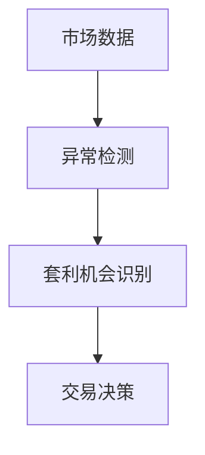
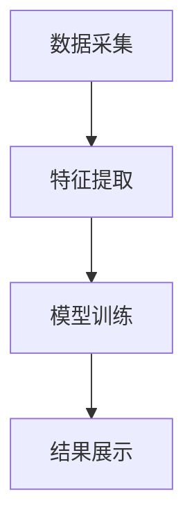

                 


```markdown
# AI辅助识别市场异常与套利机会

## 关键词：人工智能，金融市场，异常检测，套利机会，算法原理，系统架构

## 摘要：本文深入探讨了如何利用人工智能技术识别金融市场中的异常现象和套利机会。通过分析市场数据，结合先进的算法和系统架构设计，展示了AI在金融分析中的强大能力。文章从理论到实践，详细讲解了AI辅助识别的原理、方法和实现方案。

---

## 第一章：问题背景与核心概念

### 1.1 问题背景
金融市场中的价格波动、交易行为和市场结构复杂多变，传统的金融分析方法在面对高频交易、大数据量和非线性关系时显得力不从心。异常市场现象和套利机会往往隐藏在海量数据中，难以被人工及时发现。AI技术的引入，为识别这些复杂模式提供了新的可能性。

### 1.2 核心概念与定义
- **市场异常**：指市场数据偏离正常波动范围的情况，可能是由于突发事件、市场操纵或技术故障引起的。
- **套利机会**：利用价格差异或市场 inefficiencies 进行无风险或低风险获利的机会。
- **AI辅助识别**：通过机器学习算法分析历史数据，识别潜在的异常和套利信号。

---

## 第二章：核心概念与联系

### 2.1 AI辅助识别的原理
- **数据驱动**：AI通过分析历史市场数据，提取特征并训练模型，识别潜在的异常和套利模式。
- **异常检测**：使用统计学和机器学习方法，识别数据中的异常点。
- **套利机会识别**：基于模型预测，寻找市场中的价格差异或 inefficiencies。

### 2.2 核心概念的属性特征对比
| 特性       | 市场异常       | 套利机会       |
|------------|---------------|---------------|
| 数据特征   | 突发性、离群值 | 价格差异、时间窗口 |
| 时间特征   | 短暂性、突发性 | 瞬时性、持续性   |
| 风险特征   | 高风险、不确定性 | 低风险、可操作性 |

### 2.3 ER实体关系图


---

## 第三章：算法原理讲解

### 3.1 异常检测算法
- **时间序列分析**：使用ARIMA模型预测未来价格，检测异常。
- **基于深度学习的异常检测**：使用LSTM网络捕捉时间依赖关系。

#### ARIMA模型
$$ ARIMA(p, d, q) $$
其中，p为自回归阶数，d为差分阶数，q为移动平均阶数。

#### LSTM网络
```python
class LSTMModel(nn.Module):
    def __init__(self, input_size, hidden_size):
        super(LSTMModel, self).__init__()
        self.lstm = nn.LSTM(input_size, hidden_size)
        self.linear = nn.Linear(hidden_size, 1)
    
    def forward(self, x):
        out, _ = self.lstm(x)
        out = self.linear(out[-1])
        return out
```

### 3.2 套利机会识别算法
- **基于价差的套利识别**：比较同一资产在不同市场的价格，寻找套利机会。
- **基于统计套利的算法**：使用均值回归模型，寻找价格偏差。

---

## 第四章：系统分析与架构设计方案

### 4.1 项目背景
本项目旨在利用AI技术实时监控金融市场数据，识别异常现象和套利机会，帮助交易员做出决策。

### 4.2 系统功能设计
- **数据采集模块**：实时采集股票、外汇等市场数据。
- **特征提取模块**：提取市场数据的特征，如波动率、相关性。
- **模型训练模块**：训练异常检测和套利识别模型。
- **结果展示模块**：以可视化方式展示异常和套利机会。

### 4.3 系统架构图


---

## 第五章：项目实战

### 5.1 环境安装
```bash
pip install numpy pandas scikit-learn tensorflow
```

### 5.2 核心代码实现
```python
import numpy as np
import pandas as pd
from sklearn.ensemble import IsolationForest
from tensorflow.keras import layers, models

# 数据预处理
data = pd.read_csv('market_data.csv')
X_train = data.iloc[:, :-1].values
y_train = data.iloc[:, -1].values

# 异常检测模型
model = IsolationForest(n_estimators=100, contamination=0.05)
model.fit(X_train)

# 套利机会识别模型
model = models.Sequential()
model.add(layers.LSTM(64, input_shape=(None, 64)))
model.add(layers.Dense(1, activation='sigmoid'))
model.compile(loss='binary_crossentropy', optimizer='adam')
model.fit(X_train, y_train, epochs=10, batch_size=32)
```

### 5.3 实际案例分析
以股票价格为例，通过模型识别异常波动，捕捉套利机会，计算收益和风险。

---

## 第六章：最佳实践

### 6.1 小结
- AI在识别市场异常和套利机会方面具有显著优势。
- 组合使用多种算法和模型，可以提高识别的准确性和鲁棒性。

### 6.2 注意事项
- 数据质量对模型性能影响重大，需确保数据清洗和特征工程。
- 套利机会存在法律和道德风险，需遵守相关法规。

### 6.3 拓展阅读
- 《Python机器学习实战》
- 《深度学习在金融中的应用》

---

## 作者：AI天才研究院 & 禅与计算机程序设计艺术

通过本文的详细讲解，读者可以深入了解AI在金融市场中的应用，并掌握识别市场异常和套利机会的核心方法。
```

