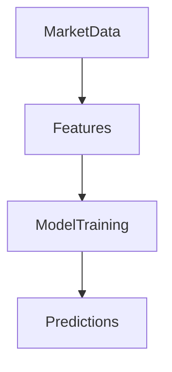
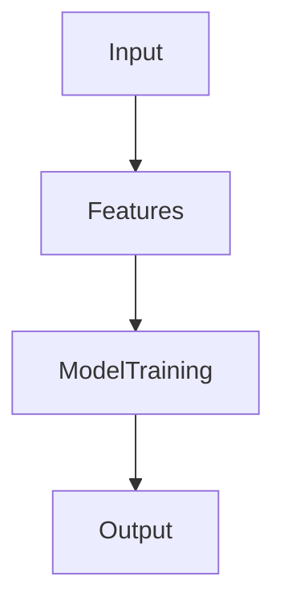
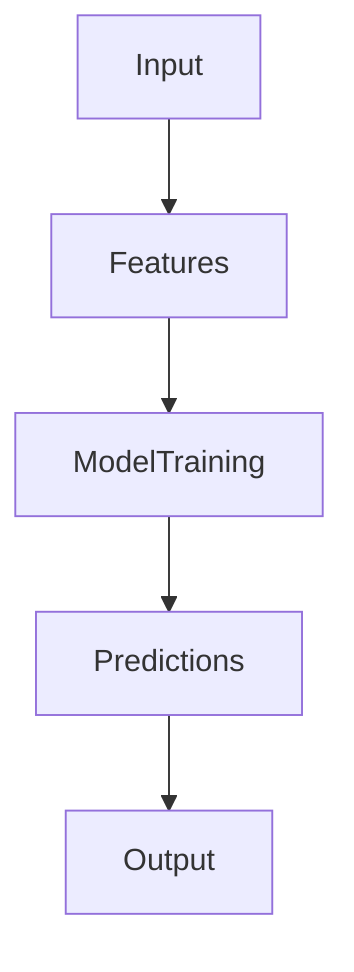
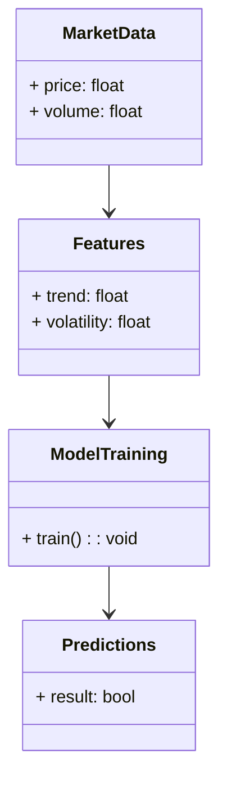
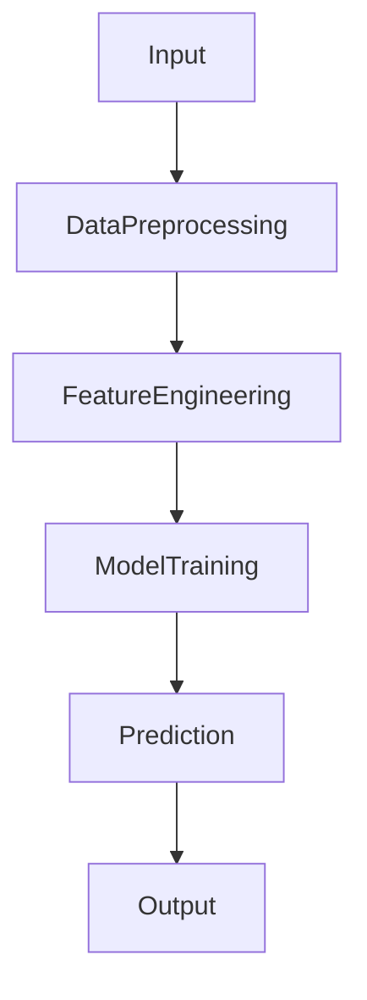

                 


# AI辅助识别市场结构性变化机会

## 关键词：人工智能，市场分析，结构变化，机器学习，数据处理，系统架构

## 摘要：
本文探讨了人工智能在识别市场结构性变化中的应用，分析了AI技术如何帮助市场分析师捕捉市场波动中的关键信号。通过详细讲解AI辅助识别的核心概念、算法原理、系统架构及实际案例，本文为读者提供了从理论到实践的全面指导，帮助他们在复杂的市场环境中做出更明智的决策。

---

# 1. 背景介绍

## 1.1 问题背景
市场的结构性变化指的是市场中某些关键要素的变化，如价格波动、趋势变化、供需关系等。这些变化往往预示着市场的机会或风险。然而，传统的方法难以捕捉这些变化，尤其是在数据量大、变化速度快的情况下。

## 1.2 问题描述
传统市场分析方法依赖于人工经验，难以及时捕捉复杂的市场变化。AI技术的引入，特别是机器学习算法，能够处理大量数据，发现潜在模式，从而帮助识别市场结构性变化。

## 1.3 问题解决
通过AI技术，可以建立自动化分析系统，实时监控市场数据，识别潜在的变化信号，并提供预警。

## 1.4 边界与外延
本文仅讨论AI在识别市场结构性变化中的应用，不涉及具体的投资策略。

---

# 2. 核心概念与联系

## 2.1 核心概念
- **数据**：市场数据，包括价格、成交量等。
- **模型**：用于分析数据的机器学习模型。
- **算法**：用于训练模型的算法。

## 2.2 概念属性对比
| 概念 | 属性 |
|------|------|
| 数据 | 来源、类型、特征 |
| 模型 | 类型、输入、输出 |
| 算法 | 步骤、复杂度、效果 |

## 2.3 ER实体关系图


---

# 3. 算法原理

## 3.1 线性回归
- **公式**：$$ y = \beta_0 + \beta_1x + \epsilon $$
- **流程图**：


## 3.2 分类算法
- **公式**：$$ L = -\frac{1}{m}\sum_{i=1}^{m} y_i \log(p_i) + (1-y_i)\log(1-p_i) $$
- **流程图**：


---

# 4. 系统分析与架构设计

## 4.1 领域模型


## 4.2 架构图


---

# 5. 项目实战

## 5.1 环境安装
- 安装Python和相关库：`pip install numpy pandas scikit-learn`

## 5.2 核心代码
```python
import numpy as np
from sklearn.linear_model import LinearRegression

# 示例数据
X = np.array([[1], [2], [3], [4]])
y = np.array([2, 4, 5, 6])

# 模型训练
model = LinearRegression()
model.fit(X, y)

# 预测
print(model.predict([[5]]))
```

## 5.3 结果分析
- 训练好的模型可以预测未来的价格变化。

---

# 6. 最佳实践

## 6.1 小结
本文详细介绍了AI在识别市场结构性变化中的应用，从理论到实践，帮助读者理解如何利用AI技术捕捉市场机会。

## 6.2 注意事项
- 数据质量至关重要。
- 模型需要定期调优。

---

# 7. 总结

## 7.1 展望
随着AI技术的不断进步，市场分析将更加智能化和自动化。

---

作者：AI天才研究院 & 禅与计算机程序设计艺术

