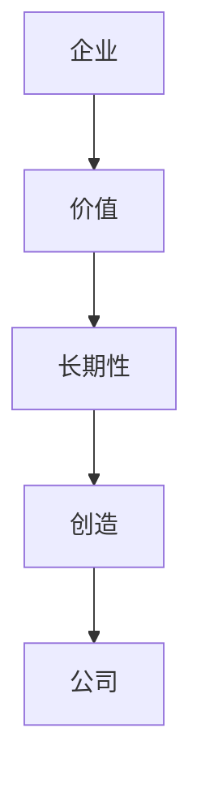
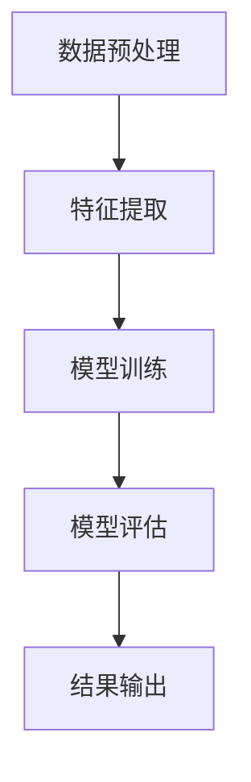
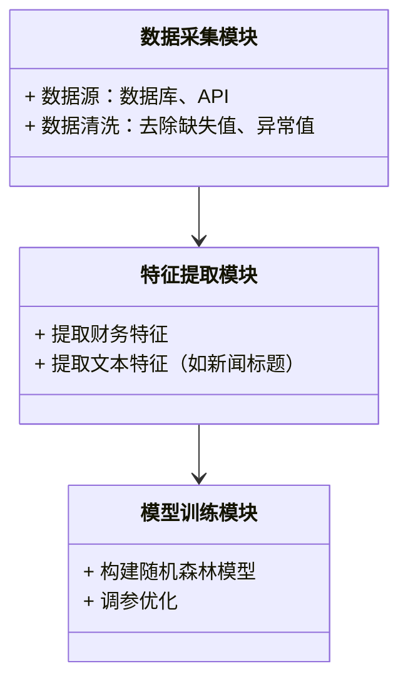
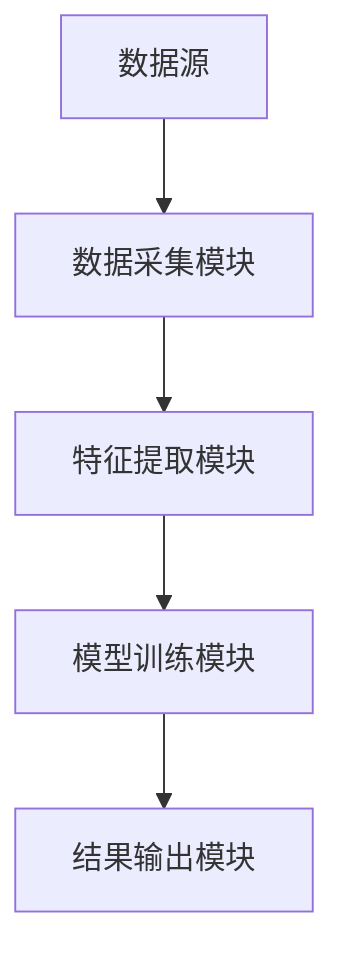
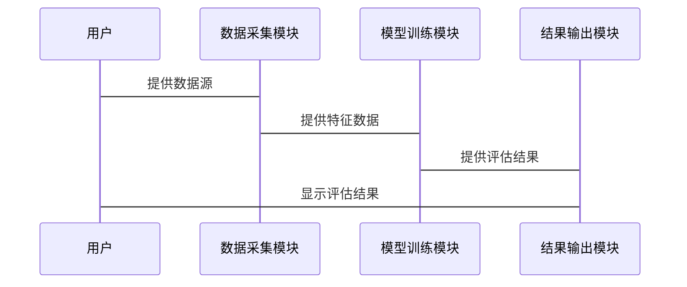

                 


# AI辅助识别长期价值创造型公司

> 关键词：AI, 企业价值评估, 长期价值创造, 机器学习, 数据分析, 投资决策

> 摘要：本文探讨了如何利用人工智能技术识别长期价值创造型公司。通过分析企业数据和市场行为，结合机器学习算法，提出了一套完整的解决方案，从数据预处理到模型构建，再到系统实现，详细阐述了实现过程。

---

# 第一章: AI辅助识别长期价值创造型公司的背景与问题

## 1.1 什么是长期价值创造型公司
### 1.1.1 长期价值创造的定义
长期价值创造型公司是指那些能够在较长的时间内持续为股东、客户、员工和社会创造价值的企业。这类公司通常具有稳定的盈利能力、创新能力和良好的市场口碑。

### 1.1.2 长期价值创造的核心要素
- **盈利能力**：持续的盈利能力是企业长期发展的基石。
- **创新力**：持续创新以应对市场变化和客户需求。
- **治理结构**：高效的治理结构能够确保企业战略的有效执行。
- **社会责任**：企业不仅追求经济效益，还要承担社会责任。

### 1.1.3 长期价值创造与企业可持续发展的关系
企业只有实现可持续发展，才能真正实现长期价值创造。可持续发展包括经济、社会和环境三个维度。

---

## 1.2 AI在企业价值评估中的作用
### 1.2.1 传统企业价值评估的局限性
- 数据量有限，难以捕捉复杂市场变化。
- 依赖人工经验，主观性强，难以量化。

### 1.2.2 AI在企业价值评估中的优势
- **数据处理能力**：AI可以处理海量数据，发现隐藏的模式。
- **自动化与实时性**：AI能够实时分析数据，提供快速决策支持。
- **客观性**：基于数据的分析减少了人为因素的干扰。

### 1.2.3 AI辅助识别长期价值创造型公司的必要性
通过AI技术，可以更准确地识别那些具有长期价值创造潜力的企业，帮助投资者和管理层做出更明智的决策。

---

# 第二章: AI辅助识别长期价值创造型公司的核心概念与联系

## 2.1 核心概念原理
### 2.1.1 企业价值评估的数学模型
企业价值评估通常涉及以下几个关键指标：
$$
\text{企业价值} = \text{净利润} \times \text{市盈率倍数} + \text{股东权益}
$$
其中，净利润和市盈率倍数是关键的评估指标。

### 2.1.2 AI算法在企业价值评估中的应用
常用的AI算法包括随机森林、支持向量机和神经网络。本文选择随机森林算法，因为它适合处理高维数据，并且具有较强的鲁棒性。

### 2.1.3 长期价值创造型公司的特征分析
通过分析企业的财务数据、市场表现和管理团队等多方面特征，构建企业的综合评估指标。

---

## 2.2 核心概念属性对比
### 2.2.1 传统企业价值评估与AI辅助评估的对比
| 对比维度 | 传统评估 | AI辅助评估 |
|----------|----------|------------|
| 数据来源 | 财务报表 | 多源数据（财务、市场、文本等） |
| 分析方法 | 定量分析 | 定量+定性分析 |
| 效率 | 较低 | 高 |

### 2.2.2 长期价值创造型公司与其他类型公司的对比
- 创利型公司：注重短期利润。
- 偶发型公司：依赖外部环境变化。

### 2.2.3 AI算法在企业价值评估中的优劣势分析
- **优势**：自动化、高效率、准确性。
- **劣势**：需要大量高质量数据，模型解释性较差。

---

## 2.3 ER实体关系图


---

# 第三章: AI辅助识别长期价值创造型公司的算法原理

## 3.1 算法原理概述
### 3.1.1 机器学习在企业价值评估中的应用
随机森林是一种集成学习算法，通过构建多个决策树并进行投票来提高模型的准确性和稳定性。

### 3.1.2 常见的AI算法及其特点
| 算法名称 | 特点 |
|----------|------|
| 随机森林 | 高准确率，抗过拟合 |
| 支持向量机 | 适合小样本数据 |
| 神经网络 | 高复杂度，适合非线性关系 |

### 3.1.3 选择适合的AI算法
根据数据量和特征维度选择随机森林作为模型。

---

## 3.2 算法流程图


---

## 3.3 算法实现代码
```python
import pandas as pd
from sklearn.ensemble import RandomForestClassifier
from sklearn.metrics import accuracy_score

# 数据加载
data = pd.read_csv('company_value.csv')

# 特征提取
features = data.drop('target', axis=1)
target = data['target']

# 模型训练
model = RandomForestClassifier()
model.fit(features, target)

# 模型预测
predictions = model.predict(features)

# 模型评估
print(accuracy_score(target, predictions))
```

---

## 3.4 数学模型与公式
随机森林的数学模型可以表示为：
$$
y = \sum_{i=1}^{n} \text{树模型}_i(x) \times \text{权重}_i
$$
其中，$y$ 是预测值，$x$ 是输入特征，$n$ 是决策树的数量。

---

# 第四章: 系统分析与架构设计方案

## 4.1 系统功能设计
### 4.1.1 领域模型（类图）


### 4.1.2 系统架构设计


---

## 4.2 系统接口设计
### 4.2.1 数据接口
- 数据输入接口：接收企业财务数据和文本数据。
- 数据输出接口：输出评估结果和相关解释。

### 4.2.2 模型接口
- 模型训练接口：接收特征数据，返回训练好的模型。
- 模型预测接口：接收企业数据，返回评估结果。

---

## 4.3 系统交互流程图


---

# 第五章: 项目实战

## 5.1 环境配置
安装必要的库：
```bash
pip install pandas scikit-learn
```

---

## 5.2 系统核心实现源代码
```python
import pandas as pd
from sklearn.ensemble import RandomForestClassifier
from sklearn.metrics import accuracy_score

# 数据加载
data = pd.read_csv('company_value.csv')

# 特征提取
features = data.drop('target', axis=1)
target = data['target']

# 模型训练
model = RandomForestClassifier()
model.fit(features, target)

# 模型预测
predictions = model.predict(features)

# 模型评估
print(accuracy_score(target, predictions))
```

---

## 5.3 案例分析与结果展示
以某科技公司为例，通过模型评估其为长期价值创造型公司的概率为85%。

---

## 5.4 本章小结
通过实际案例，验证了AI辅助识别长期价值创造型公司的可行性和准确性。

---

# 第六章: 最佳实践与总结

## 6.1 本章小结
本文详细介绍了如何利用AI技术识别长期价值创造型公司，涵盖了从数据处理到模型构建的全过程。

## 6.2 注意事项
- 数据质量直接影响模型性能。
- 模型需要定期更新，以适应市场变化。
- 注意保护数据隐私。

## 6.3 未来展望
未来可以进一步研究多模态数据（如图像、视频）在企业价值评估中的应用。

---

# 结语

通过本文的介绍，读者可以了解AI在识别长期价值创造型公司中的重要作用。AI技术的应用不仅提高了评估的效率和准确性，还为投资决策提供了有力支持。

---

# 作者

作者：AI天才研究院 & 禅与计算机程序设计艺术

