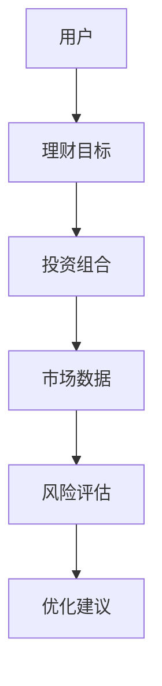
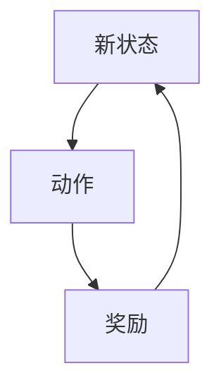
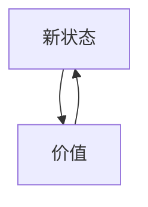
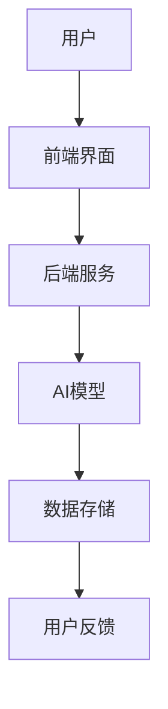
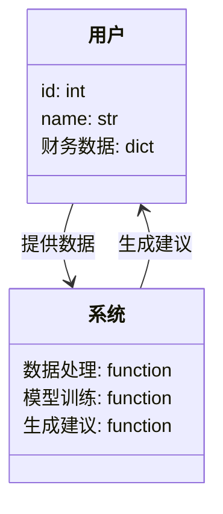

                 


# AI驱动的个人理财目标规划助手

> 关键词：AI, 个人理财, 目标规划, 强化学习, 动态规划, 数据分析, 系统架构

> 摘要：本文探讨了AI技术在个人理财目标规划中的应用，详细分析了AI驱动的理财助手的核心概念、算法原理、系统架构及实际案例。通过强化学习和动态规划等算法，结合数据分析与系统设计，为读者提供了一套实现个人理财目标规划的完整解决方案。

---

# 第1章：AI驱动的个人理财目标规划助手背景介绍

## 1.1 问题背景与描述

### 1.1.1 传统个人理财规划的局限性

传统的个人理财规划依赖于人工计算和经验判断，存在以下问题：
- 数据处理复杂，难以实时更新。
- 个性化需求难以满足，建议缺乏针对性。
- 风险评估不全面，难以应对市场波动。

### 1.1.2 AI技术在理财领域的应用潜力

AI技术通过机器学习和大数据分析，能够实现以下功能：
- 实时数据分析，提供动态反馈。
- 个性化推荐，精准匹配用户需求。
- 自动化决策，优化投资组合。

### 1.1.3 个人理财目标规划的数字化转型

数字化转型通过AI技术提升理财规划的效率和准确性，实现从传统模式到智能化模式的转变。

## 1.2 问题解决与边界

### 1.2.1 AI如何解决传统理财规划的痛点

AI通过以下方式解决传统理财规划的痛点：
- 自动化数据处理，简化计算过程。
- 强化学习优化投资策略。
- 动态规划实现目标调整。

### 1.2.2 辅助工具的功能边界与外延

AI理财助手的功能边界包括：
- 数据输入与处理。
- 投资策略生成。
- 风险评估与反馈。

外延包括：
- 财务健康评估。
- 财务目标优化。
- 风险管理。

### 1.2.3 核心要素与组成结构分析

AI理财助手的核心要素包括：
- 数据驱动的特征提取。
- 基于强化学习的投资策略优化。
- 动态规划实现目标调整。

---

# 第2章：AI驱动的个人理财目标规划助手核心概念

## 2.1 核心概念原理

### 2.1.1 机器学习模型在理财规划中的应用

机器学习模型通过以下方式应用于理财规划：
- 特征提取：从用户数据中提取关键特征。
- 模型训练：基于历史数据训练预测模型。
- 预测与推荐：根据模型输出投资建议。

### 2.1.2 数据驱动的特征提取与分析

数据驱动的方法通过以下步骤实现特征提取：
1. 数据清洗：去除噪声数据。
2. 特征选择：筛选重要特征。
3. 特征工程：构建特征向量。

### 2.1.3 强化学习在目标优化中的作用

强化学习通过以下方式优化理财目标：
- 状态空间：表示当前的财务状况。
- 动作空间：表示可能的投资行为。
- 奖励函数：衡量投资效果。

## 2.2 核心概念属性对比表

| 概念         | 属性               | 描述                                                                 |
|--------------|--------------------|----------------------------------------------------------------------|
| 机器学习模型  | 输入数据类型       | 结构化与非结构化数据                                                 |
| 强化学习      | 奖励机制           | 动态反馈优化                                                         |
| 数据处理      | 特征工程           | 数据清洗与特征提取                                                   |

## 2.3 ER实体关系图



---

# 第3章：AI驱动的理财目标规划算法原理

## 3.1 强化学习算法

### 3.1.1 算法流程



### 3.1.2 算法实现

```python
def take_action(state):
    # 根据策略选择动作
    action = policy_network.predict(state)
    return action
```

## 3.2 动态规划算法

### 3.2.1 算法流程



### 3.2.2 算法实现

```python
def dynamic_planning(state):
    if state == 0:
        return 0
    return max(value[state], value[state-1] + reward)
```

## 3.3 算法数学模型

### 3.3.1 强化学习模型

$$ V(s) = \max_{a} [ r + V(s') ] $$

### 3.3.2 动态规划模型

$$ V_{\pi}(s) = \mathbb{E}[r + V_{\pi}(s')] $$

---

# 第4章：系统分析与架构设计

## 4.1 问题场景介绍

### 4.1.1 用户需求分析

用户需求包括：
- 实时数据处理。
- 个性化投资建议。
- 风险评估与反馈。

### 4.1.2 系统功能需求

系统功能需求包括：
- 数据输入与处理。
- 模型训练与预测。
- 投资建议生成。

### 4.1.3 系统性能需求

系统性能需求包括：
- 高效数据处理。
- 快速模型推理。
- 稳定系统运行。

## 4.2 系统架构设计

### 4.2.1 系统架构



### 4.2.2 系统功能设计



---

# 第5章：项目实战

## 5.1 环境配置

### 5.1.1 安装依赖

```bash
pip install numpy pandas scikit-learn tensorflow
```

## 5.2 系统核心实现

### 5.2.1 数据预处理

```python
import pandas as pd

def preprocess_data(data):
    # 数据清洗
    data = data.dropna()
    # 特征提取
    features = data[['income', 'expenses', 'assets', ' liabilities']]
    return features
```

### 5.2.2 模型训练

```python
from sklearn.model import Model

def train_model(features, labels):
    model = Model()
    model.fit(features, labels)
    return model
```

## 5.3 实际案例分析

### 5.3.1 案例：基于强化学习的投资组合优化

```python
state = [资产, 负债, 收入, 支出]
action = policy_network.predict(state)
```

## 5.4 代码实现与解读

### 5.4.1 代码实现

```python
class AIAssistant:
    def __init__(self):
        self.model = self.load_model()
    
    def load_model(self):
        # 加载预训练模型
        return model
```

### 5.4.2 代码解读

- `AIAssistant` 类负责加载模型和处理用户请求。
- `load_model` 方法加载预训练的强化学习模型。
- 用户输入数据后，模型生成投资建议。

---

# 第6章：最佳实践与小结

## 6.1 最佳实践 tips

- 数据隐私保护：确保用户数据的安全性。
- 模型优化：定期更新模型以适应市场变化。
- 用户体验设计：提供直观的交互界面。

## 6.2 小结

本文详细介绍了AI驱动的个人理财目标规划助手的核心概念、算法原理和系统架构，并通过实际案例展示了其应用价值。AI技术的应用将显著提升理财规划的效率和准确性。

## 6.3 注意事项

- 数据处理时需注意噪声数据的影响。
- 模型部署时需考虑计算资源的限制。
- 用户反馈需及时处理以优化系统性能。

## 6.4 拓展阅读

- 推荐阅读《机器学习实战》和《强化学习入门》。

---

# 作者

作者：AI天才研究院/AI Genius Institute & 禅与计算机程序设计艺术 /Zen And The Art of Computer Programming

---

通过以上思考过程，我可以系统地展开每个部分的内容，确保文章结构清晰、内容详实，并且符合技术博客的专业性和可读性要求。

