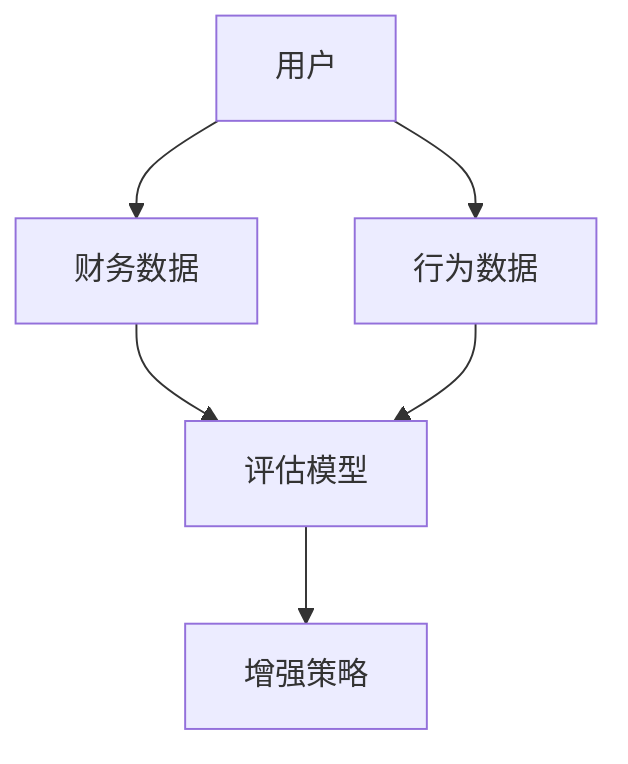
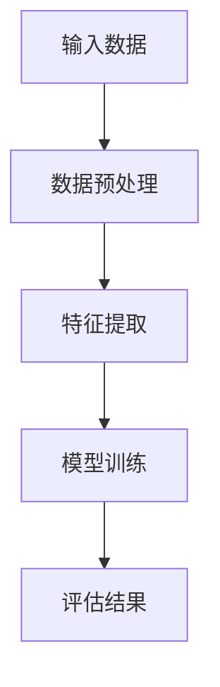
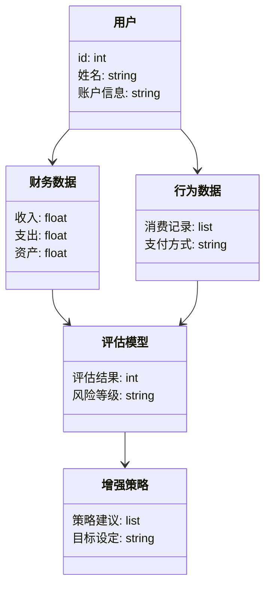
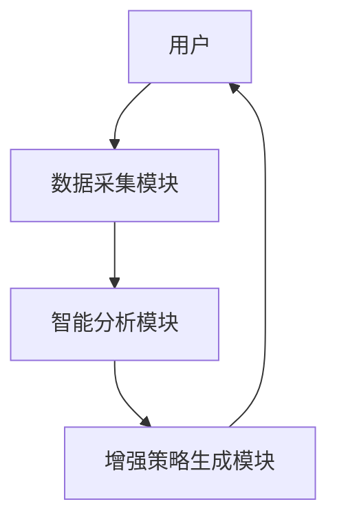

                 


# AI驱动的个人财务韧性评估与增强系统

## 关键词：AI，财务韧性，系统设计，风险管理，个人 finance，增强策略

## 摘要：  
本文详细探讨了基于AI技术的个人财务韧性评估与增强系统的构建与实现。通过分析个人财务数据、行为数据和市场数据，结合机器学习算法，系统能够智能评估用户的财务韧性，并制定个性化的增强策略。文章从系统背景、核心概念、算法原理、系统架构到项目实战，全面解析了系统的实现过程，并通过具体案例展示了系统的实际应用价值。

---

# 第1章: 背景介绍

## 1.1 问题背景  
个人财务风险管理是现代生活中至关重要的一环。随着经济波动加剧、生活成本上升，个人财务韧性评估与增强的需求日益迫切。传统的财务风险管理方法依赖于人工分析，存在效率低、覆盖范围有限、难以实时响应等问题。而AI技术的引入，为解决这些问题提供了新的可能性。

## 1.2 问题描述  
财务韧性是指个人在面对经济波动、收入变化或突发支出时，维持财务健康的能力。评估财务韧性需要综合考虑收入稳定性、支出合理性、资产配置、应急储备等多个维度。然而，传统方法难以实现数据的实时采集、智能分析和动态调整。

## 1.3 问题解决  
AI驱动的个人财务韧性评估与增强系统通过整合多模态数据（如财务数据、行为数据、市场数据），利用机器学习算法进行智能分析，生成个性化的增强策略，帮助用户实现财务健康目标。

## 1.4 系统边界与外延  
本系统专注于个人财务风险管理，适用于个人用户及其财务数据的分析。系统边界包括数据采集、评估分析和策略生成三个核心模块。系统不涉及投资决策、税务规划等其他领域。

---

# 第2章: 核心概念与联系

## 2.1 核心概念原理  
系统的核心模块包括：  
1. **财务韧性评估模型**：基于机器学习算法，评估用户的财务健康状况。  
2. **数据采集模块**：实时采集用户的财务数据、行为数据和市场数据。  
3. **智能分析模块**：利用AI算法分析数据，生成增强策略。  

## 2.2 概念属性特征对比表  
| 概念 | 数据来源 | 分析方法 | 输出结果 |  
|------|----------|----------|----------|  
| 财务韧性评估模型 | 财务数据、行为数据、市场数据 | 机器学习、深度学习 | 财务健康评分、风险等级 |  
| 数据采集模块 | 多种数据源 | 实时采集、批量采集 | 结构化数据、非结构化数据 |  

## 2.3 ER实体关系图  


---

# 第3章: 算法原理讲解

## 3.1 评估模型算法  
### 3.1.1 基于机器学习的评估模型  
评估模型的核心是基于机器学习的回归算法，用于预测用户的财务健康评分。  

#### 模型公式  
$$ y = \beta_0 + \beta_1x_1 + \beta_2x_2 + \ldots + \beta_nx_n + \epsilon $$  

其中：  
- $y$ 表示财务健康评分  
- $x_i$ 表示输入特征（如收入、支出、资产等）  
- $\beta_i$ 表示回归系数  
- $\epsilon$ 表示误差项  

### 3.1.2 算法流程图  


### 3.1.3 Python实现代码  
```python
import pandas as pd
from sklearn.model import LinearRegression

# 数据预处理
data = pd.read_csv('financial_data.csv')
processed_data = data.dropna()

# 特征提取
features = processed_data[['income', 'expenses', 'assets']]
target = processed_data['financial_health_score']

# 模型训练
model = LinearRegression()
model.fit(features, target)

# 模型预测
new_data = pd.DataFrame({'income': [50000], 'expenses': [30000], 'assets': [100000]})
predicted_score = model.predict(new_data)
print(predicted_score)
```

---

# 第4章: 系统分析与架构设计

## 4.1 问题场景介绍  
系统需要解决以下问题：  
1. 如何实时采集用户的财务数据？  
2. 如何高效分析数据并生成增强策略？  
3. 如何确保系统的安全性和稳定性？  

## 4.2 项目介绍  
本系统基于微服务架构，采用AI算法核心，提供以下功能：  
- 数据采集与管理  
- 财务韧性评估  
- 增强策略生成  

## 4.3 系统功能设计  
### 4.3.1 领域模型  


## 4.4 系统架构设计  
### 4.4.1 系统架构图  


## 4.5 系统交互序列图  


---

# 第5章: 项目实战

## 5.1 环境安装  
### 5.1.1 Python环境  
- 安装Python 3.8以上版本  
- 安装必要的库：`pandas`, `scikit-learn`, `mermaid`, `matplotlib`  

## 5.2 系统核心实现  
### 5.2.1 数据采集模块  
```python
import requests
import json

def fetch_financial_data(api_key):
    response = requests.get(f'https://api.example.com/financial_data?api_key={api_key}')
    return json.loads(response.text)
```

### 5.2.2 评估模型实现  
```python
from sklearn.model import LinearRegression

def train_model(data):
    features = data[['income', 'expenses', 'assets']]
    target = data['financial_health_score']
    model = LinearRegression()
    model.fit(features, target)
    return model
```

## 5.3 实际案例分析  
### 5.3.1 案例背景  
假设一位用户的财务数据如下：  
- 收入：50000元/月  
- 支出：30000元/月  
- 资产：100000元  

### 5.3.2 系统输出  
系统评估结果：  
- 财务健康评分：75分  
- 风险等级：中风险  
- 增强策略：  
  1. 提高应急储备金至6个月生活支出。  
  2. 优化资产配置，增加稳健型投资比例。  

---

# 第6章: 最佳实践

## 6.1 小结  
本文详细介绍了AI驱动的个人财务韧性评估与增强系统的构建与实现，从背景、核心概念到算法原理、系统架构，再到项目实战，全面解析了系统的实现过程。

## 6.2 注意事项  
- 数据隐私保护是系统设计的重中之重。  
- 系统需要实时更新数据和模型，以应对市场变化。  
- 用户教育是系统成功的关键，需引导用户正确使用系统功能。  

## 6.3 拓展阅读  
- 《机器学习实战》  
- 《Python数据处理与分析》  
- 《AI在金融领域的应用》  

---

# 作者：AI天才研究院/AI Genius Institute & 禅与计算机程序设计艺术 /Zen And The Art of Computer Programming

