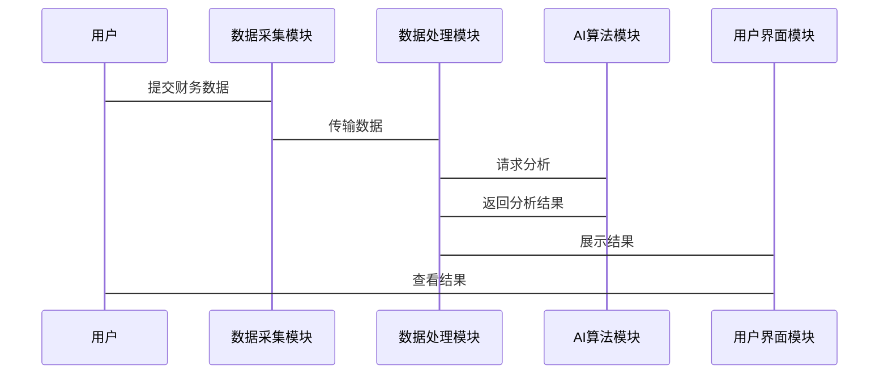

                 


# AI驱动的个人财富积累路径规划器

> 关键词：人工智能, 财富规划, 财务分析, 算法模型, 系统架构

> 摘要：本文深入探讨了AI技术在个人财富积累路径规划中的应用，从背景分析、核心算法、系统架构到项目实战，全面阐述了AI驱动财富规划器的实现过程。通过理论分析和实践案例，展示了如何利用AI技术优化个人财务决策，实现财富的可持续增长。

---

## 第一部分: AI驱动的个人财富积累路径规划器概述

### 第1章: AI驱动的财富规划背景与现状

#### 1.1 财富积累与个人发展的关系

##### 1.1.1 财富积累的核心问题

财富积累是个人实现财务自由、提高生活质量的重要手段。传统财富积累方式依赖于个人的金融知识、市场洞察力和执行力，但这种方式存在效率低下、决策风险高等问题。AI技术的引入为财富积累提供了新的解决方案，能够通过数据驱动和智能算法优化决策过程。

##### 1.1.2 个人财富积累的挑战与痛点

- **信息过载**：金融市场信息复杂，个人难以快速筛选和分析有效信息。
- **决策延迟**：传统决策依赖于手动分析，容易错失投资机会。
- **风险控制**：个人难以准确评估投资风险，容易造成重大损失。
- **个性化需求**：每个人的风险承受能力和财务目标不同，需要个性化的解决方案。

##### 1.1.3 AI技术在财富规划中的潜力

AI技术可以通过大数据分析、机器学习和自然语言处理，帮助个人快速获取信息、分析市场趋势、制定投资策略，并实时监控财务状况。AI的引入能够显著提高财富规划的效率和准确性，降低投资风险。

---

#### 1.2 AI技术的基本概念与发展趋势

##### 1.2.1 人工智能的基本定义

人工智能（AI）是指计算机系统模拟人类智能的能力，包括学习、推理、问题解决等。AI的核心技术包括机器学习、自然语言处理、计算机视觉等。

##### 1.2.2 AI技术的主要应用领域

- **金融领域**：AI广泛应用于股票交易、风险评估、信用评分等领域。
- **健康管理**：AI用于疾病预测、个性化治疗方案制定等。
- **教育领域**：AI辅助教学、个性化学习推荐等。

##### 1.2.3 AI在金融领域的应用现状

AI在金融领域的应用已经非常广泛，包括高频交易、智能投顾、风险管理等。AI技术能够处理海量数据，发现隐藏的模式，为投资者提供更精准的决策支持。

---

#### 1.3 个人财富规划的AI驱动范式

##### 1.3.1 AI驱动财富规划的核心理念

AI驱动的财富规划强调通过数据驱动和智能算法，为个人提供个性化的财务建议和投资策略。这种模式能够实时调整投资组合，优化资产配置，最大化收益并降低风险。

##### 1.3.2 从传统理财到AI理财的转变

传统理财依赖于人工分析和经验判断，而AI理财则是基于数据和算法的自动化决策。AI理财能够快速响应市场变化，提供实时的财务建议，帮助个人更好地管理财富。

##### 1.3.3 当前AI驱动财富规划的技术瓶颈

- **数据隐私问题**：个人财务数据的隐私保护是AI理财应用中的一个重要挑战。
- **模型解释性**：复杂的AI模型往往缺乏可解释性，影响用户对决策的信任。
- **市场波动影响**：AI模型的预测能力受到市场波动的限制，容易出现偏差。

---

## 第二部分: AI驱动的财富规划器核心概念与系统架构

### 第2章: AI驱动的财富规划器核心概念与系统架构

#### 2.1 核心概念与系统模块

##### 2.1.1 数据采集与处理模块

AI驱动的财富规划器需要收集大量的个人财务数据，包括收入、支出、资产配置、投资组合等。这些数据是模型分析的基础。

##### 2.1.2 AI算法分析模块

通过机器学习算法，对历史数据进行分析，识别市场趋势和投资机会。常用的算法包括线性回归、随机森林、神经网络等。

##### 2.1.3 个性化推荐模块

根据用户的财务目标和风险偏好，提供个性化的投资建议和资产配置方案。

##### 2.1.4 反馈与优化模块

根据市场变化和用户反馈，实时调整投资策略，优化资产配置。

##### 2.1.5 数据可视化模块

通过图表和报告的形式，向用户展示财务状况和投资建议，帮助用户更好地理解和执行。

---

#### 2.2 系统架构设计

##### 2.2.1 系统功能模块划分

- **数据采集模块**：负责收集用户的财务数据。
- **数据处理模块**：对数据进行清洗和预处理。
- **AI算法模块**：运行机器学习算法，生成投资建议。
- **用户界面模块**：展示结果和交互界面。

##### 2.2.2 系统数据流图


##### 2.2.3 系统交互流程图



---

## 第三部分: AI驱动的财富规划器算法原理与数学模型

### 第3章: AI驱动的财富规划算法原理

#### 3.1 数据预处理与特征工程

##### 3.1.1 数据清洗

数据清洗是确保数据质量的重要步骤，包括去除重复数据、处理缺失值、纠正异常值等。

##### 3.1.2 特征选择

通过特征选择，筛选出对投资收益影响最大的特征，例如历史收益率、波动率等。

##### 3.1.3 数据增强

通过数据增强技术，增加数据的多样性和代表性，提高模型的泛化能力。

---

#### 3.2 AI算法实现

##### 3.2.1 线性回归模型

线性回归是一种简单的回归模型，适用于线性关系的预测。


##### 3.2.2 随机森林模型

随机森林是一种基于决策树的集成学习算法，具有较强的鲁棒性和抗过拟合能力。


##### 3.2.3 神经网络模型

神经网络是一种强大的深度学习模型，适用于复杂的非线性关系。


---

#### 3.3 数学模型与公式

##### 3.3.1 线性回归模型公式

$$ y = \beta_0 + \beta_1x_1 + \beta_2x_2 + ... + \beta_nx_n $$

##### 3.3.2 神经网络模型公式

$$ f(x) = \sigma(wx + b) $$

其中，$\sigma$ 是激活函数，$w$ 是权重，$b$ 是偏置。

---

## 第四部分: 系统分析与架构设计方案

### 第4章: 系统分析与架构设计方案

#### 4.1 系统功能设计

##### 4.1.1 用户信息采集模块

负责采集用户的财务数据，包括收入、支出、资产等。

##### 4.1.2 财务数据分析模块

对采集的数据进行清洗、特征选择和数据增强。

##### 4.1.3 财富规划算法模块

运行机器学习算法，生成投资建议和资产配置方案。

##### 4.1.4 结果展示模块

以图表和报告的形式展示分析结果和投资建议。

---

#### 4.2 系统架构设计

##### 4.2.1 系统功能模块划分

- **用户界面模块**：负责与用户的交互。
- **数据采集模块**：负责数据的采集和预处理。
- **AI算法模块**：负责模型的训练和预测。
- **结果展示模块**：负责结果的可视化。

##### 4.2.2 系统架构图


---

## 第五部分: 项目实战

### 第5章: 项目实战

#### 5.1 环境安装

- **Python**：安装Python 3.8及以上版本。
- **库的安装**：使用pip安装所需的库，如pandas、numpy、scikit-learn、tensorflow等。

#### 5.2 核心代码实现

##### 5.2.1 数据采集与预处理

```python
import pandas as pd

# 数据采集
data = pd.read_csv('financial_data.csv')

# 数据清洗
data.dropna(inplace=True)
data = data[~data['收入'].isnull()]
```

##### 5.2.2 模型训练与预测

```python
from sklearn.model_selection import train_test_split
from sklearn.linear_model import LinearRegression

# 数据分割
X = data[['收入', '支出', '资产']]
y = data['净资产']

X_train, X_test, y_train, y_test = train_test_split(X, y, test_size=0.2, random_state=42)

# 模型训练
model = LinearRegression()
model.fit(X_train, y_train)

# 模型预测
y_pred = model.predict(X_test)
```

##### 5.2.3 结果展示

```python
import matplotlib.pyplot as plt

plt.scatter(y_test, y_pred)
plt.xlabel('真实值')
plt.ylabel('预测值')
plt.title('线性回归模型预测结果')
plt.show()
```

---

## 第六部分: 最佳实践与总结

### 第6章: 最佳实践与总结

#### 6.1 最佳实践

- **数据隐私保护**：在处理用户数据时，必须严格遵守数据隐私法规。
- **模型解释性**：选择可解释性较强的模型，增强用户信任。
- **持续优化**：定期更新模型，适应市场变化。

#### 6.2 小结

AI驱动的个人财富积累路径规划器通过结合大数据分析和智能算法，能够为用户提供个性化的财务建议和投资策略。随着技术的不断发展，AI在财富规划中的应用将更加广泛和深入。

#### 6.3 注意事项

- **数据质量**：确保数据的准确性和完整性。
- **模型选择**：根据具体需求选择合适的算法。
- **用户教育**：提高用户的金融素养，增强对AI决策的信任。

#### 6.4 拓展阅读

- 《机器学习实战》
- 《Python机器学习》
- 《深度学习》

---

## 结语

AI驱动的个人财富积累路径规划器是人工智能技术在金融领域的典型应用之一。通过本文的详细讲解，读者可以深入了解AI在财富规划中的核心算法和系统架构，并通过实际案例掌握项目的实现方法。希望本文能够为读者在AI驱动的财富管理领域提供有价值的参考和启发。

---

## 作者

作者：AI天才研究院/AI Genius Institute & 禅与计算机程序设计艺术 /Zen And The Art of Computer Programming

