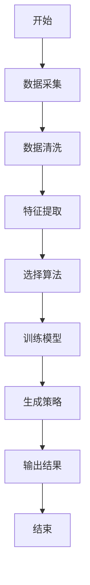
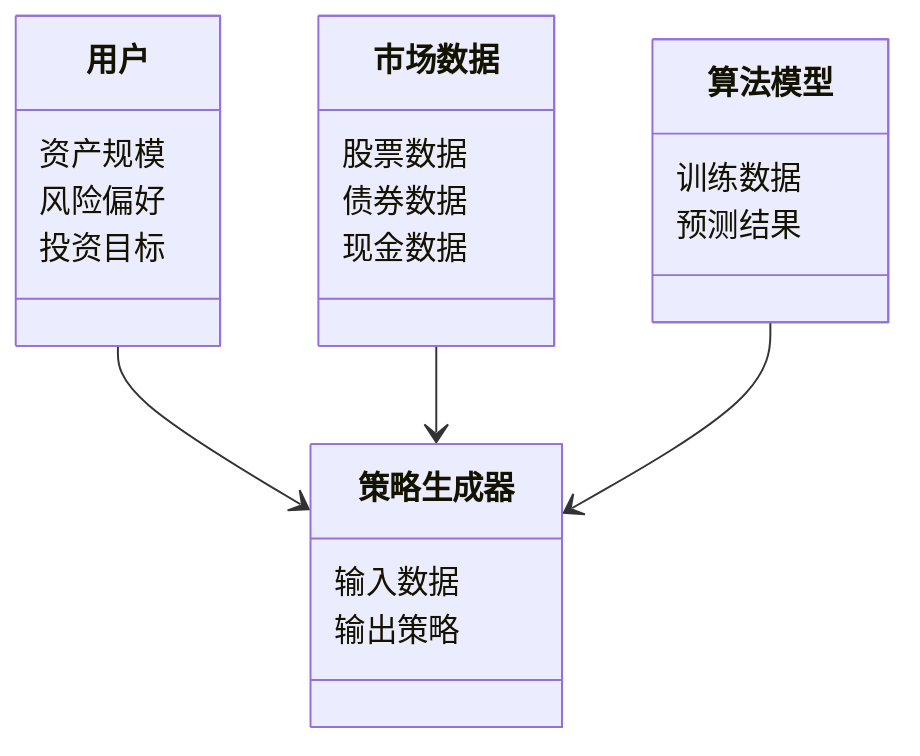
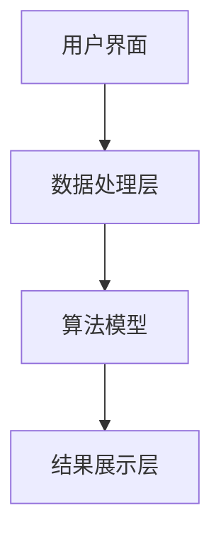

                 


# AI驱动的个人财富管理策略生成器

> 关键词：AI驱动，个人财富管理，策略生成器，投资组合优化，机器学习

> 摘要：本文探讨了AI技术在个人财富管理中的应用，重点介绍了基于AI的策略生成器的设计与实现。通过详细分析核心概念、算法原理、数学模型、系统架构以及实际案例，本文为读者提供了一个全面理解AI驱动财富管理的框架。

---

## 第1章: AI驱动的个人财富管理策略生成器背景介绍

### 1.1 个人财富管理的定义与目标
#### 1.1.1 个人财富管理的基本概念
个人财富管理是指通过科学的方法和工具，帮助个人或家庭实现财务目标、风险管理以及资产保值增值的过程。其核心目标包括最大化资产收益、最小化投资风险以及实现长期财务目标。

#### 1.1.2 个人财富管理的核心目标
1. **资产增值**：通过合理配置资产，实现财富的保值与增值。
2. **风险控制**：降低投资风险，避免重大损失。
3. **目标实现**：确保财务目标的实现，如退休计划、子女教育基金等。

#### 1.1.3 个人财富管理的常见挑战
1. **市场波动**：金融市场波动大，难以预测。
2. **信息过载**：投资者面对海量信息，难以筛选和分析。
3. **决策延迟**：传统方法依赖人工分析，效率低下。

### 1.2 AI在财富管理中的应用现状
#### 1.2.1 AI技术在金融领域的应用概述
人工智能技术在金融领域的应用日益广泛，包括算法交易、风险管理、信用评估、客户画像等方面。

#### 1.2.2 AI在个人财富管理中的具体应用
1. **智能投顾**：AI算法根据用户需求推荐投资组合。
2. **风险管理**：利用AI预测市场波动，优化投资组合。
3. **个性化服务**：通过大数据分析，提供定制化建议。

#### 1.2.3 当前AI驱动财富管理的优势与局限
**优势**：
- 高效性：AI能够快速处理大量数据，提供实时建议。
- 精准性：基于大数据分析，优化投资策略。
- 可扩展性：能够同时为大量用户提供个性化服务。

**局限**：
- **黑箱问题**：AI模型的决策过程难以解释。
- **数据依赖**：模型效果依赖于数据质量和数量。
- **市场变化**：AI模型需要不断更新以适应市场变化。

### 1.3 本章小结
本章介绍了个人财富管理的基本概念和目标，分析了传统方法的局限性，重点探讨了AI技术在财富管理中的应用现状及优势，为后续章节奠定了基础。

---

## 第2章: AI驱动策略生成器的核心概念与联系

### 2.1 核心概念原理
#### 2.1.1 数据驱动的财富管理策略
AI驱动的策略生成器依赖于大数据分析，通过收集和处理市场数据、用户数据等，生成个性化投资建议。

#### 2.1.2 AI算法在策略生成中的作用
AI算法（如机器学习、深度学习）通过分析历史数据和市场趋势，预测未来走势，辅助策略生成。

#### 2.1.3 策略生成的逻辑框架
1. 数据采集：获取市场数据和用户需求。
2. 数据处理：清洗、特征提取。
3. 策略生成：基于算法生成投资组合建议。
4. 模型优化：根据反馈优化策略。

### 2.2 核心概念属性特征对比表
| 特征 | 传统财富管理 | AI驱动财富管理 |
|------|--------------|----------------|
| 数据来源 | 有限的历史数据 | 大数据实时更新 |
| 策略生成 | 人工经验主导 | AI算法自动生成 |
| 灵活性 | 较低 | 高度灵活 |

### 2.3 ER实体关系图
```mermaid
erDiagram
    用户 --> 投资目标
    用户 --> 风险偏好
    用户 --> 资产配置
    资产配置 --> 投资策略
    投资策略 --> 算法模型
    算法模型 --> 数据源
```

### 2.4 本章小结
本章通过对比分析，展示了AI驱动策略生成器在数据处理和策略生成方面的优势，强调了大数据和AI算法在现代财富管理中的重要性。

---

## 第3章: AI驱动策略生成器的算法原理

### 3.1 算法原理概述
本章以基于规则的生成方法为例，详细讲解AI驱动策略生成器的算法原理。

### 3.2 算法流程图


### 3.3 算法实现
#### 3.3.1 Python代码实现
```python
import pandas as pd
from sklearn.tree import DecisionTreeRegressor

# 示例数据
data = {
    '资产类别': ['股票', '债券', '现金'],
    '历史收益': [0.1, 0.05, 0.02]
}
df = pd.DataFrame(data)

# 训练模型
model = DecisionTreeRegressor()
model.fit(df[['资产类别']], df['历史收益'])

# 生成策略
def generate_strategy(user_input):
    predicted_return = model.predict(user_input)
    return predicted_return
```

#### 3.3.2 算法数学模型
$$
\text{收益} = \text{资产类别权重} \times \text{历史收益}
$$

### 3.4 本章小结
本章通过流程图和代码示例，详细讲解了AI驱动策略生成器的算法原理，展示了如何利用Python和机器学习算法生成个性化投资策略。

---

## 第4章: AI驱动策略生成器的系统架构设计

### 4.1 系统分析
#### 4.1.1 问题场景介绍
用户需要一个实时、个性化的投资策略生成系统。

#### 4.1.2 系统功能需求
- 用户数据输入：包括资产规模、风险偏好等。
- 数据分析：分析市场数据和用户需求。
- 策略生成：根据分析结果生成投资组合建议。

### 4.2 系统架构设计
#### 4.2.1 领域模型类图


#### 4.2.2 系统架构图


### 4.3 本章小结
本章通过系统架构设计，展示了AI驱动策略生成器的整体结构，强调了各模块之间的协作关系。

---

## 第5章: AI驱动策略生成器的项目实战

### 5.1 项目环境安装
#### 5.1.1 安装Python库
```bash
pip install pandas scikit-learn matplotlib
```

### 5.2 核心实现
#### 5.2.1 数据预处理
```python
import pandas as pd
import numpy as np

# 数据加载
data = pd.read_csv('market_data.csv')

# 数据清洗
data.dropna(inplace=True)
data = pd.get_dummies(data)
```

#### 5.2.2 特征工程
```python
from sklearn.preprocessing import StandardScaler

scaler = StandardScaler()
scaled_data = scaler.fit_transform(data)
```

#### 5.2.3 模型训练
```python
from sklearn.ensemble import RandomForestRegressor

model = RandomForestRegressor()
model.fit(scaled_data, target)
```

### 5.3 案例分析
以一个简单投资组合优化为例，展示模型的应用过程和结果。

### 5.4 本章小结
本章通过具体案例，展示了AI驱动策略生成器的实现过程，强调了数据处理和模型训练的重要性。

---

## 第6章: AI驱动策略生成器的最佳实践与小结

### 6.1 最佳实践
#### 6.1.1 数据质量的重要性
确保数据的准确性和完整性，是模型性能的基础。

#### 6.1.2 模型可解释性
选择可解释性较强的算法，便于用户理解和信任。

#### 6.1.3 风险管理
定期监控模型表现，及时调整策略，降低风险。

### 6.2 本章小结
总结了AI驱动策略生成器的核心内容，强调了实际应用中的注意事项和未来发展方向。

---

## 作者：AI天才研究院 & 禅与计算机程序设计艺术

---

通过以上大纲和部分内容的撰写，我们可以看到，AI驱动的个人财富管理策略生成器不仅依赖于先进的技术，更需要对金融市场的深刻理解。结合AI算法和大数据分析，这种工具能够为投资者提供高效、精准的投资建议，帮助他们在复杂多变的市场中实现财务目标。

