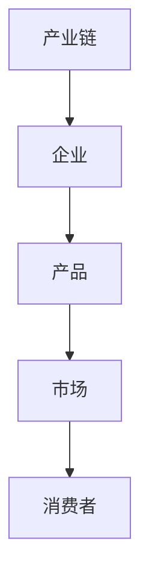
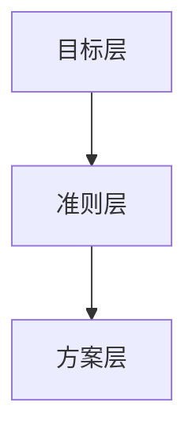
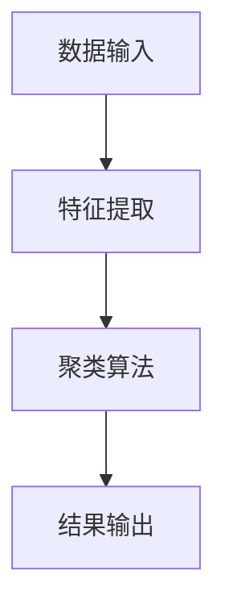
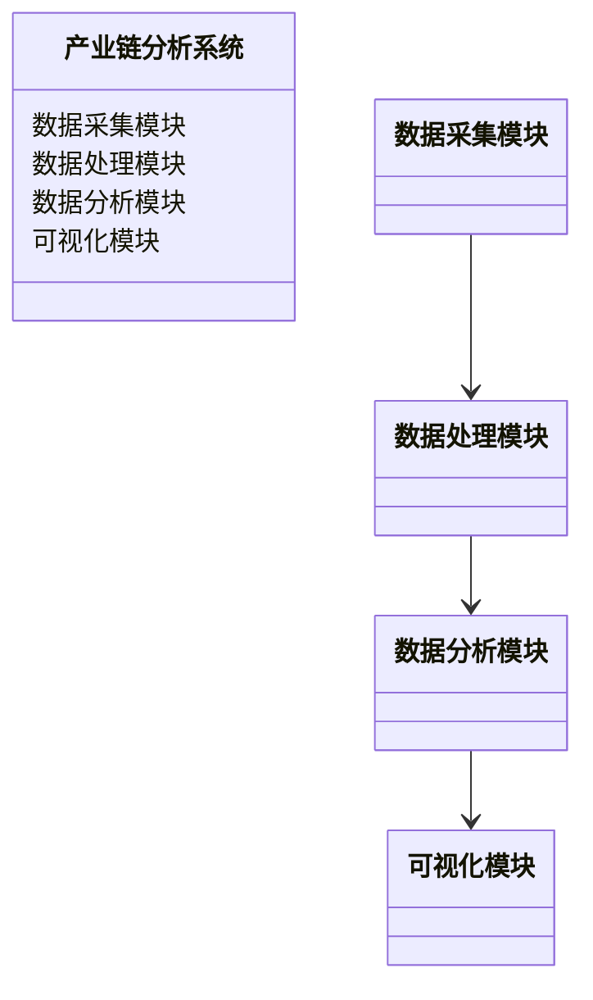
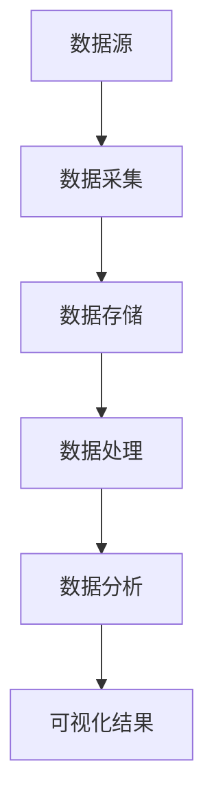
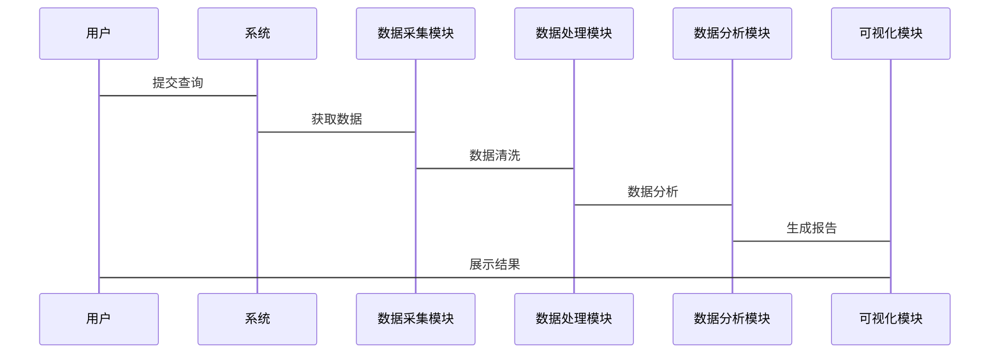

                 


# AI驱动的产业链分析：全面把握公司的市场地位

**关键词**：AI驱动、产业链分析、市场地位、企业分析、算法原理

**摘要**：本文将深入探讨如何利用人工智能技术驱动产业链分析，帮助企业全面把握其在市场中的地位。通过分析产业链的结构、市场地位评估指标以及AI算法的应用，本文将为企业提供一套系统的方法论，帮助企业更好地应对市场竞争，优化资源配置，实现可持续发展。

---

# 第1章: AI驱动的产业链分析概述

## 1.1 产业链分析的背景与意义

### 1.1.1 产业链分析的基本概念

产业链是指从原材料供应到产品最终交付给消费者的完整过程，涉及多个环节和参与者。产业链分析旨在研究这些环节之间的关系、价值分布以及各参与方的竞争力。

### 1.1.2 AI技术在产业链分析中的作用

人工智能技术的引入，使得产业链分析更加高效和精准。通过机器学习算法，企业可以快速识别市场趋势、竞争对手动态以及潜在风险，从而优化自身的业务策略。

### 1.1.3 企业市场地位的重要性

市场地位是企业在行业中的竞争力和影响力的重要指标。通过AI驱动的产业链分析，企业可以准确评估自身在市场中的位置，发现竞争优势和劣势，制定针对性的战略。

## 1.2 AI驱动的产业链分析问题描述

### 1.2.1 传统产业链分析的局限性

传统产业链分析依赖人工调研和经验判断，存在效率低、主观性强、数据量有限等问题。这些问题限制了分析的深度和广度。

### 1.2.2 数据驱动的分析需求

随着大数据技术的发展，企业需要利用海量数据进行分析，以获取更准确的市场洞察。AI技术能够处理和分析大量非结构化数据，为产业链分析提供新的可能性。

### 1.2.3 AI技术如何解决分析难题

AI技术通过自然语言处理、机器学习等方法，可以从非结构化数据中提取有用信息，帮助企业在复杂市场环境中快速做出决策。

## 1.3 AI驱动的产业链分析解决思路

### 1.3.1 数据采集与处理

AI驱动的产业链分析需要从多个数据源（如新闻、财报、行业报告等）获取数据，并进行清洗和预处理。

### 1.3.2 数据分析与建模

通过机器学习算法（如聚类分析、回归分析等）对数据进行建模，识别产业链中的关键节点和趋势。

### 1.3.3 结果可视化与决策支持

将分析结果可视化，并为企业提供决策支持，帮助其优化资源配置、制定竞争策略。

---

# 第2章: 产业链分析的核心概念

## 2.1 产业链结构分析

### 2.1.1 产业链的组成要素

产业链由供应商、生产者、分销商和消费者等多个角色组成，每个角色在产业链中承担不同的功能。

### 2.1.2 产业链的层级关系

产业链可以分为上游、中游和下游，每个层级的企业在价值创造过程中扮演不同的角色。

### 2.1.3 产业链的动态变化

产业链在市场环境中不断变化，企业需要实时监测这些变化，以保持竞争优势。

## 2.2 市场地位评估指标

### 2.2.1 市场份额

市场份额是企业在市场中的占有率，反映了企业的市场影响力。

### 2.2.2 竞争优势

竞争优势包括成本优势、技术优势、品牌优势等，是企业在市场中立足的关键。

### 2.2.3 行业影响力

行业影响力衡量企业在行业中的地位和话语权，通常通过企业参与行业标准制定、行业协会影响力等指标衡量。

## 2.3 产业链分析的关键维度

### 2.3.1 产品生命周期

产品生命周期包括引入期、成长期、成熟期和衰退期，企业在不同阶段的策略不同。

### 2.3.2 价值链分布

价值链分布分析企业在全球价值链中的位置，帮助识别成本和利润的关键点。

### 2.3.3 关键成功因素

关键成功因素是影响企业市场地位的关键因素，包括技术、资源、管理等。

## 2.4 核心概念属性对比表

```plaintext
| 概念       | 属性1 | 属性2 | 属性3 |
|------------|-------|-------|-------|
| 产业链结构 | 组成要素 | 层级关系 | 动态变化 |
| 市场地位   | 份额 | 优势 | 影响力 |
```

## 2.5 产业链分析的ER实体关系图



---

# 第3章: 产业链分析的算法原理

## 3.1 层次分析法（AHP）

### 3.1.1 算法概述

层次分析法是一种常用的决策分析方法，适用于多目标决策问题。它通过构建层次结构，将问题分解为多个因素，并通过专家评分确定各因素的权重。

### 3.1.2 算法实现



### 3.1.3 数学模型

层次分析法的权重计算公式如下：

$$
w_i = \frac{\sum_{j=1}^{n} a_{ij} \cdot w_j}{\sum_{j=1}^{n} a_{ij}}
$$

其中，\( w_i \) 是第 \( i \) 个因素的权重，\( a_{ij} \) 是第 \( i \) 个因素对第 \( j \) 个准则的重要性评分。

### 3.1.4 代码实现

```python
import numpy as np

def ahp_analysis(criteria_matrix):
    # 计算权重
    weights = []
    for i in range(len(criteria_matrix)):
        sum_row = sum(criteria_matrix[i])
        weight = [criteria_matrix[i][j] / sum_row for j in range(len(criteria_matrix[i]))]
        weights.append(weight)
    return weights

# 示例
criteria_matrix = [
    [3, 2, 1],
    [2, 3, 2],
    [1, 2, 3]
]
weights = ahp_analysis(criteria_matrix)
print("权重矩阵：", weights)
```

---

## 3.2 聚类分析

### 3.2.1 算法概述

聚类分析是一种无监督学习方法，用于将数据点划分为不同的簇，每个簇内的数据点具有相似性。

### 3.2.2 算法实现



### 3.2.3 数学模型

聚类分析常用的K-means算法公式如下：

$$
\text{distance}(x_i, x_j) = \sqrt{\sum_{k=1}^{n} (x_{ik} - x_{jk})^2}
$$

其中，\( x_i \) 和 \( x_j \) 是两个样本，\( k \) 是特征维度。

### 3.2.4 代码实现

```python
from sklearn.cluster import KMeans

# 示例数据
X = np.array([[1, 2], [1, 3], [2, 3], [4, 5], [4, 6], [5, 6]])

# 聚类分析
kmeans = KMeans(n_clusters=2)
kmeans.fit(X)
print("聚类中心：", kmeans.cluster_centers_)
print("标签：", kmeans.labels_)
```

---

# 第4章: 系统架构与设计

## 4.1 系统功能设计

### 4.1.1 领域模型



### 4.1.2 系统架构设计



### 4.1.3 接口设计

- 数据采集接口：从API获取市场数据。
- 数据处理接口：清洗和预处理数据。
- 数据分析接口：调用机器学习模型进行分析。
- 可视化接口：将结果展示给用户。

### 4.1.4 交互设计



---

# 第5章: 项目实战

## 5.1 智能家电行业分析案例

### 5.1.1 环境安装

安装所需的工具和库：

```bash
pip install numpy pandas scikit-learn matplotlib
```

### 5.1.2 核心代码实现

```python
import pandas as pd
from sklearn.cluster import KMeans

# 数据加载
data = pd.read_csv('market_data.csv')

# 数据预处理
data = data.dropna()

# 聚类分析
kmeans = KMeans(n_clusters=3)
kmeans.fit(data[['销售额', '利润']])

# 可视化结果
import matplotlib.pyplot as plt

plt.scatter(data['销售额'], data['利润'], c=kmeans.labels_)
plt.xlabel('销售额')
plt.ylabel('利润')
plt.show()
```

### 5.1.3 案例分析

通过对智能家电行业的数据分析，发现企业A在高端市场占据优势，而企业B在低端市场表现较好。企业A可以通过进一步提升技术创新能力，巩固其市场地位。

---

# 第6章: 最佳实践与总结

## 6.1 小结

AI驱动的产业链分析为企业提供了高效、精准的市场洞察工具，帮助企业全面把握市场地位，优化资源配置。

## 6.2 注意事项

- 数据质量是分析结果的关键，确保数据来源可靠。
- 模型选择要根据具体场景，避免盲目使用复杂算法。
- 结果可视化要简洁明了，便于决策者理解。

## 6.3 拓展阅读

- 《数据驱动的商业分析》
- 《机器学习实战》
- 《产业链分析方法论》

---

# 作者：AI天才研究院 & 禅与计算机程序设计艺术

---

以上是《AI驱动的产业链分析：全面把握公司的市场地位》的技术博客文章的完整目录大纲和部分正文内容。如需进一步补充或修改，请随时告知。

