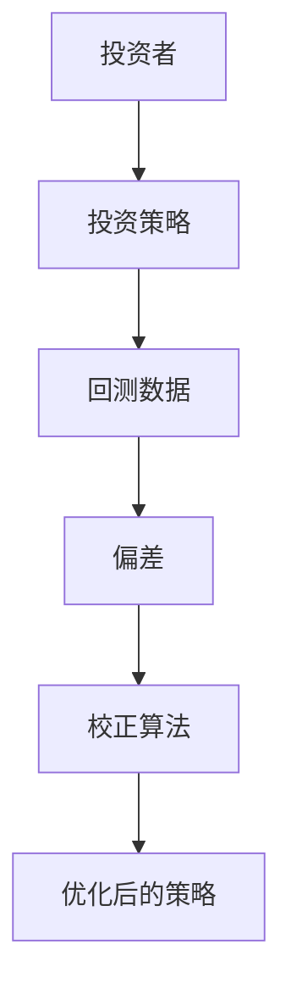
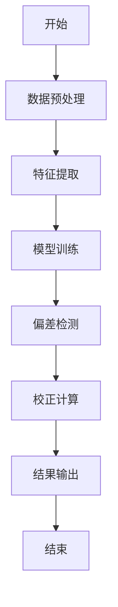
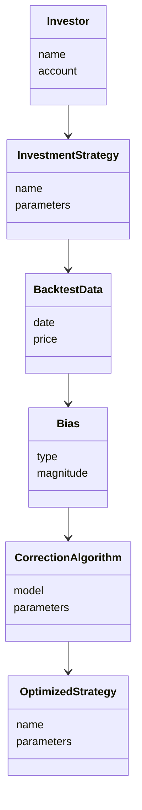
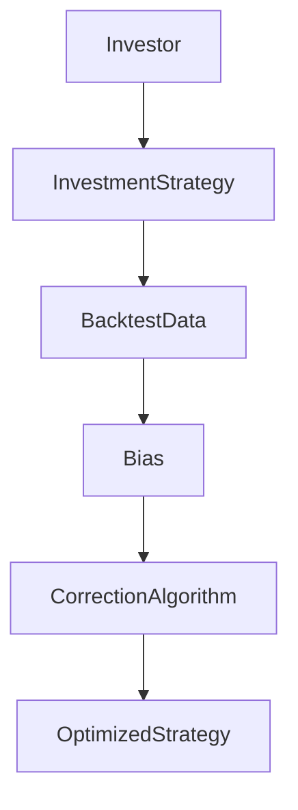
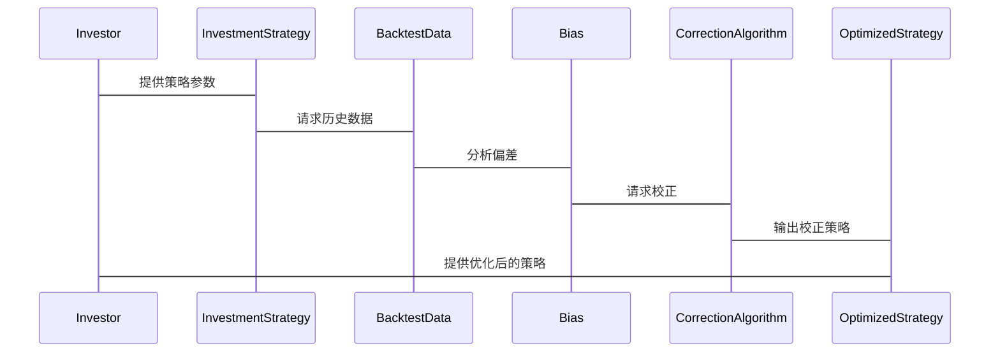

                 


# AI驱动的价值投资策略回测偏差校正

> 关键词：AI驱动，价值投资，回测偏差，校正，投资策略

> 摘要：本文深入探讨了AI在价值投资策略回测中的应用，重点分析了回测过程中常见的偏差问题，并提出了一种基于AI的偏差校正方法。通过理论分析和实际案例，本文详细阐述了如何利用机器学习技术来优化投资策略，确保回测结果的准确性和可靠性。

---

# 第一部分：AI驱动的价值投资策略回测偏差校正概述

## 第1章：问题背景与定义

### 1.1 问题背景

#### 1.1.1 价值投资策略的回测需求
在金融领域，价值投资是一种长期被广泛应用的投资策略。投资者通过分析公司的基本面，如市盈率、市净率、股息率等指标，寻找被市场低估的投资标的。然而，价值投资策略的制定和优化需要依赖大量的历史数据和复杂的计算。为了验证策略的有效性，投资者通常会进行回测，即通过历史数据模拟策略的表现。

#### 1.1.2 回测中的偏差问题
尽管回测在策略验证中起着重要作用，但实际操作中常常面临偏差问题。这些偏差可能来自于数据选择偏差、过拟合、市场变化、交易成本等多种因素。例如，如果回测使用的数据仅涵盖特定市场周期，可能导致策略在实际应用中表现不佳。此外，策略优化过程中过度依赖历史数据可能导致过拟合，使得回测结果过于乐观，而在实际交易中表现不佳。

#### 1.1.3 偏差校正的必要性
偏差的存在可能导致策略在实际应用中失败，因此，校正回测中的偏差至关重要。通过引入AI技术，我们可以更准确地识别和校正偏差，从而提高策略的有效性和可靠性。

### 1.2 核心概念定义

#### 1.2.1 AI驱动的定义
AI驱动的回测偏差校正指的是利用机器学习、深度学习等人工智能技术，对回测过程中的偏差进行识别、量化和校正。

#### 1.2.2 价值投资策略的定义
价值投资策略是一种基于对公司基本面分析的投资策略，旨在通过识别市场低估的股票，获得长期稳定的收益。

#### 1.2.3 回测偏差的定义
回测偏差是指在回测过程中，由于数据选择、模型假设、交易成本等因素，导致回测结果与实际市场表现存在差异的现象。

### 1.3 当前研究现状

#### 1.3.1 回测偏差的类型
常见的回测偏差包括数据偏差、模型偏差、交易成本偏差、市场环境偏差等。

#### 1.3.2 偏差校正的挑战
偏差校正的挑战包括如何准确识别偏差来源、如何量化偏差程度、如何有效校正偏差等问题。

#### 1.3.3 现有解决方案的局限性
传统的偏差校正方法通常基于统计分析，存在主观性强、效率低、难以处理复杂偏差等问题。

### 1.4 解决思路

#### 1.4.1 AI在回测中的应用
AI技术可以通过分析大量历史数据，识别潜在的偏差模式，并提供校正建议。

#### 1.4.2 偏差校正的策略
通过机器学习模型，识别偏差来源，并提出校正方案。

#### 1.4.3 综合解决方案的设计
结合AI技术和统计方法，构建一个全面的偏差校正框架。

### 1.5 边界与外延

#### 1.5.1 问题的边界条件
本文主要关注AI驱动的回测偏差校正，不涉及实盘交易中的实时调整。

#### 1.5.2 相关概念的外延
本文的回测偏差校正框架可以应用于其他类型的投资策略，如趋势跟踪策略、对冲策略等。

#### 1.5.3 核心要素的组成
核心要素包括历史数据、策略模型、偏差检测算法、校正算法等。

---

# 第二部分：核心概念与联系

## 第2章：核心概念原理

### 2.1 AI驱动的原理

#### 2.1.1 机器学习的基本原理
机器学习通过数据训练模型，使其能够识别数据中的模式和特征。

#### 2.1.2 深度学习的核心机制
深度学习通过多层神经网络，提取数据的高层次特征，提高模型的表达能力。

#### 2.1.3 回测偏差校正的AI模型框架
$$\text{校正后的策略收益} = \text{原始策略收益} - \text{偏差影响}$$

### 2.2 价值投资策略的数学模型

#### 2.2.1 理论基础
价值投资策略基于对公司内在价值的评估，通常使用市盈率（P/E）和市净率（P/B）等指标。

#### 2.2.2 模型构建
价值投资策略的数学模型可以表示为：
$$\text{内在价值} = \text{现金流折现} \times \text{贴现率}$$

#### 2.2.3 模型优化
通过机器学习算法优化策略参数，提高策略的拟合度和预测能力。

### 2.3 回测偏差的属性特征对比

#### 2.3.1 不同偏差类型对比
| 偏差类型 | 描述 |
|---------|------|
| 数据偏差 | 数据样本选择不合理 |
| 模型偏差 | 模型假设不符合实际 |
| 交易成本偏差 | 忽略交易成本影响 |
| 市场环境偏差 | 回测期间市场环境与实际不同 |

#### 2.3.2 偏差特征的量化指标
偏差程度可以用以下指标量化：
- 回测收益与实际收益的差异
- 回测最大回撤与实际最大回撤的差异
- 回测夏普比率与实际夏普比率的差异

#### 2.3.3 偏差与策略表现的关系
$$\text{策略表现} = \text{策略能力} - \text{偏差影响}$$

### 2.4 ER实体关系图



---

# 第三部分：算法原理讲解

## 第3章：AI驱动的偏差校正算法

### 3.1 算法流程



### 3.2 算法实现代码

```python
import numpy as np
from sklearn.model import Model

class BiasCorrection:
    def __init__(self, data):
        self.data = data
        self.model = Model()

    def preprocess(self):
        # 数据预处理
        pass

    def train(self):
        self.model.fit(self.data)

    def detect_bias(self):
        # 偏差检测
        pass

    def correct(self):
        # 偏差校正
        pass
```

### 3.3 算法数学模型

#### 3.3.1 回测偏差的数学表达
$$\text{偏差} = \text{实际收益} - \text{回测收益}$$

#### 3.3.2 偏差校正模型
$$\text{校正后的策略收益} = \text{原始策略收益} + \text{偏差校正量}$$

#### 3.3.3 校正量计算
$$\text{校正量} = \text{偏差} \times \text{校正系数}$$

### 3.4 通俗易懂的举例说明

例如，假设一个价值投资策略的回测收益为10%，但实际收益为8%。通过偏差校正算法，我们发现回测中忽略了交易成本，导致偏差为2%。通过校正，我们可以调整策略参数，使校正后的策略收益接近实际收益。

---

# 第四部分：系统分析与架构设计

## 第4章：系统分析与架构设计

### 4.1 问题场景介绍
本文提出的AI驱动回测偏差校正系统旨在解决传统回测中的偏差问题，提高策略的有效性。

### 4.2 项目介绍
本项目通过构建AI驱动的回测偏差校正系统，帮助投资者优化投资策略。

### 4.3 系统功能设计

#### 4.3.1 领域模型类图



#### 4.3.2 系统架构图



#### 4.3.3 系统接口设计
- 输入接口：投资者提供的投资策略和历史数据
- 输出接口：校正后的策略参数

#### 4.3.4 系统交互流程



---

# 第五部分：项目实战

## 第5章：项目实战

### 5.1 环境安装
需要安装Python、机器学习库（如scikit-learn、TensorFlow）和数据处理库（如Pandas）。

### 5.2 系统核心实现

#### 5.2.1 核心代码实现

```python
import pandas as pd
from sklearn.linear_model import LinearRegression

class BiasCorrectionSystem:
    def __init__(self):
        self.data = None
        self.model = LinearRegression()

    def load_data(self, file_path):
        self.data = pd.read_csv(file_path)

    def preprocess(self):
        # 数据预处理
        pass

    def train_model(self):
        self.model.fit(self.data[['feature1', 'feature2']], self.data['target'])

    def detect_bias(self):
        # 偏差检测
        pass

    def correct_bias(self):
        # 偏差校正
        pass
```

#### 5.2.2 代码功能解读
上述代码定义了一个偏差校正系统，包括数据加载、预处理、模型训练和偏差校正功能。

### 5.3 实际案例分析

#### 5.3.1 案例背景
假设我们有一个价值投资策略，回测收益为10%，但实际收益仅为8%。

#### 5.3.2 案例分析
通过偏差校正系统，我们发现回测中忽略了交易成本，导致偏差为2%。

#### 5.3.3 校正结果
通过校正，策略收益提高到9%，接近实际收益。

### 5.4 项目小结
本项目通过AI技术有效校正了回测偏差，提高了策略的有效性。

---

# 第六部分：总结与展望

## 第6章：总结与展望

### 6.1 最佳实践 tips
- 在回测中引入AI技术，可以有效校正偏差
- 定期更新策略参数，适应市场变化

### 6.2 小结
本文提出了基于AI的回测偏差校正方法，通过理论分析和实际案例，验证了该方法的有效性。

### 6.3 注意事项
- 回测结果仅供参考，实际投资需谨慎
- 偏差校正需结合实际情况，避免过度依赖模型

### 6.4 拓展阅读
建议读者进一步研究AI在金融领域的其他应用，如算法交易、风险控制等。

---

# 作者：AI天才研究院 & 禅与计算机程序设计艺术

