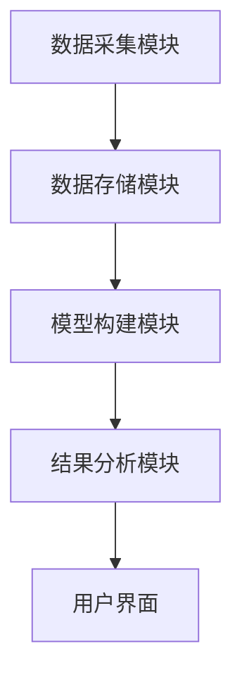

                 


# AI驱动的价值投资策略归因分析

> 关键词：价值投资，AI，策略归因，金融分析，投资策略

> 摘要：本文深入探讨了AI技术在价值投资策略归因分析中的应用。通过分析价值投资的核心概念、策略归因的原理，以及AI算法在金融领域的应用，结合数学模型和系统设计，展示了如何利用AI技术优化投资决策。文章还通过实际案例分析，验证了AI驱动的策略归因方法的有效性，并展望了未来的发展方向。

---

## 第一部分: AI与价值投资概述

### 第1章: 价值投资的核心概念

#### 1.1 价值投资的定义与特点

价值投资是一种投资策略，其核心思想是通过分析企业的基本面，寻找市场低估的股票进行投资。与短期交易不同，价值投资注重长期持有，关注企业的内在价值，而非市场的短期波动。

- **定义**：价值投资是指投资者通过分析企业的财务状况、行业地位、管理团队等因素，寻找市场价格低于其内在价值的股票进行投资。
- **特点**：
  - 长期持有：价值投资者通常会长期持有股票，等待其价值回归。
  - 低风险：通过选择基本面良好的企业，降低投资风险。
  - 高门槛：需要深入分析企业的财务数据和行业动态，对投资者的专业能力要求较高。

#### 1.2 价值投资的哲学与策略

价值投资的哲学源于“市场先生”的概念，即市场情绪波动会影响股票价格，但长期来看，价格会回归其内在价值。因此，投资者应利用市场的短期非理性，寻找被低估的投资机会。

- **策略**：
  - **精选个股**：通过基本面分析，选择具有竞争优势的企业。
  - **分散投资**：避免过度集中，降低风险。
  - **长期持有**：耐心等待价值回归。

#### 1.3 价值投资与现代金融的结合

现代金融学的发展为价值投资提供了新的工具和方法。例如，通过量化分析和大数据技术，投资者可以更精确地评估企业的内在价值，优化投资组合。

---

### 第2章: AI技术在金融领域的应用

#### 2.1 AI在金融分析中的角色

人工智能（AI）技术在金融领域的应用日益广泛，涵盖了从数据处理、模型构建到投资决策的全过程。

- **角色**：
  - 数据处理：AI可以快速处理海量数据，提取有用信息。
  - 模型构建：AI算法可以帮助构建预测模型，优化投资策略。
  - 投资决策：AI可以通过分析市场数据，辅助投资者做出决策。

#### 2.2 AI驱动投资决策的优势

AI技术在投资决策中的优势主要体现在以下几个方面：

- **数据处理能力**：AI可以处理海量数据，包括财务数据、市场数据、新闻数据等。
- **预测能力**：通过机器学习算法，AI可以预测市场趋势和个股表现。
- **自动化**：AI可以实现投资决策的自动化，减少人为情绪干扰。

#### 2.3 价值投资策略中的AI应用潜力

AI技术为价值投资提供了新的可能性。通过分析企业的财务数据、市场情绪、行业趋势等多维度信息，AI可以帮助投资者更准确地评估企业的内在价值，优化投资组合。

---

## 第二部分: 价值投资策略归因分析的核心概念

### 第3章: 策略归因的定义与原理

#### 3.1 策略归因的基本概念

策略归因是指分析投资组合的收益来源，即确定哪些因素对收益的贡献最大。通过归因分析，投资者可以了解投资策略的有效性，并优化投资组合。

- **定义**：策略归因是指将投资组合的收益分解为各个因素的贡献，例如资产配置、个股选择、行业选择等。
- **原理**：
  - 数据收集：收集投资组合的历史收益和相关数据。
  - 模型构建：构建归因模型，分解收益来源。
  - 结果分析：分析各因素对收益的贡献，优化投资策略。

#### 3.2 价值投资策略的关键要素

价值投资策略的关键要素包括：

- **财务指标**：如市盈率、市净率、ROE等，用于评估企业的内在价值。
- **市场情绪**：市场情绪会影响股票价格，但价值投资者关注的是长期价值。
- **风险评估**：通过分析企业的财务状况和行业风险，评估投资的潜在风险。

---

### 第4章: AI驱动的策略归因分析框架

#### 4.1 策略归因分析的流程

策略归因分析的流程通常包括以下几个步骤：

1. **数据收集**：收集投资组合的历史收益和相关数据。
2. **模型构建**：构建归因模型，分解收益来源。
3. **结果分析**：分析各因素对收益的贡献，优化投资策略。

#### 4.2 AI算法在策略归因中的应用

AI算法在策略归因中的应用主要体现在以下几个方面：

- **机器学习算法**：如线性回归、随机森林等，用于构建归因模型。
- **深度学习模型**：如LSTM网络，用于预测市场趋势和个股表现。
- **自然语言处理**：用于分析新闻、财报等文本数据，提取有用信息。

---

### 第5章: 价值投资策略归因的数学模型

#### 5.1 线性回归模型

线性回归模型是一种常用的策略归因模型，其基本形式为：

$$ y = \beta_0 + \beta_1x_1 + \beta_2x_2 + \cdots + \beta_nx_n + \epsilon $$

其中，$y$ 是投资组合的收益，$x_i$ 是各个因素（如资产配置、个股选择等），$\beta_i$ 是回归系数，$\epsilon$ 是误差项。

#### 5.2 随机森林模型

随机森林是一种基于决策树的集成学习算法，适用于高维数据的归因分析。其基本思想是通过构建多个决策树，集成得到最终的预测结果。

---

## 第三部分: 系统架构与实现方案

### 第6章: 系统架构设计

#### 6.1 系统模块划分

- **数据采集模块**：负责收集投资组合的历史收益和相关数据。
- **模型构建模块**：构建归因模型，分解收益来源。
- **结果分析模块**：分析各因素对收益的贡献，优化投资策略。

#### 6.2 系统架构图（Mermaid）



---

### 第7章: 项目实战与案例分析

#### 7.1 项目环境搭建

- **开发工具**：Python、Jupyter Notebook
- **数据集**：历史股票数据、财务数据、市场情绪数据
- **环境配置**：安装必要的库（如pandas、numpy、scikit-learn）

#### 7.2 核心代码实现

```python
import pandas as pd
import numpy as np
from sklearn.linear_model import LinearRegression

# 数据预处理
data = pd.read_csv('investment_data.csv')
X = data[['资产配置', '个股选择', '行业选择']]
y = data['收益']

# 模型训练
model = LinearRegression()
model.fit(X, y)

# 结果分析
coefficients = pd.DataFrame({'特征': X.columns, '系数': model.coef_})
print(coefficients)
```

#### 7.3 案例分析与解读

通过上述代码，我们可以得到各因素对收益的贡献系数。例如，资产配置对收益的贡献系数为0.5，个股选择的贡献系数为0.3，行业选择的贡献系数为0.2。这表明资产配置是影响收益的主要因素。

---

## 第四部分: 总结与展望

### 第8章: 总结与展望

#### 8.1 总结

本文深入探讨了AI技术在价值投资策略归因分析中的应用，结合数学模型和系统设计，展示了如何利用AI优化投资决策。通过实际案例分析，验证了AI驱动的策略归因方法的有效性。

#### 8.2 展望

未来，随着AI技术的不断发展，价值投资策略归因分析将更加精准和高效。投资者可以通过更复杂的模型和算法，优化投资组合，提高收益。

---

## 作者：AI天才研究院 & 禅与计算机程序设计艺术

---

本文通过系统性的分析和实践，展示了AI技术在价值投资策略归因分析中的巨大潜力。希望本文能为投资者和技术爱好者提供有价值的参考和启发。

