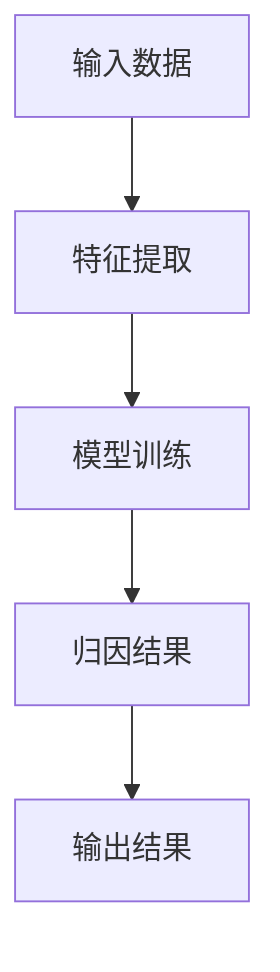
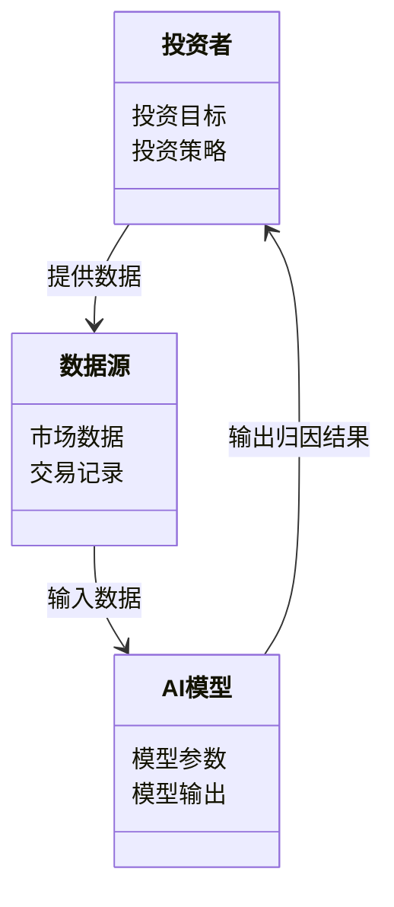
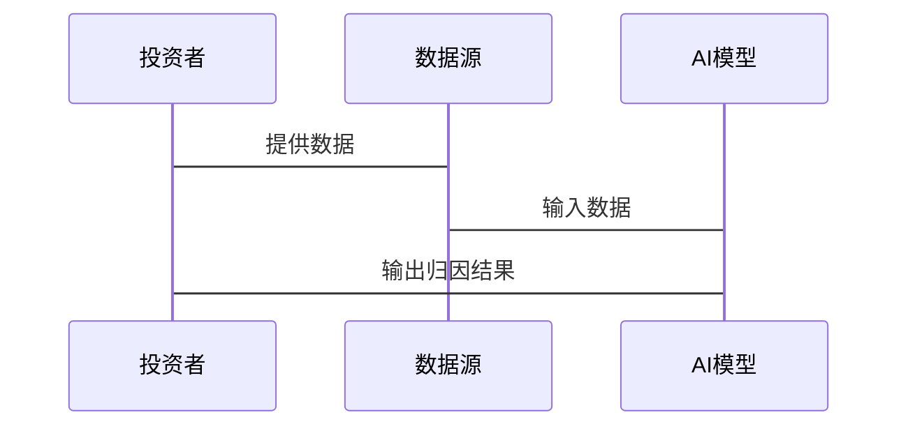

                 


```markdown
# AI驱动的价值投资策略性能归因

> 关键词：价值投资策略，AI驱动，性能归因，算法原理，系统架构

> 摘要：本文探讨了AI技术在价值投资策略中的应用，特别是如何利用AI进行性能归因，以优化投资决策。通过分析性能归因的原理、算法模型及系统架构，结合实际案例，展示了AI如何提升投资策略的效率和准确性。

---

## 第一部分：AI驱动的价值投资策略性能归因背景介绍

### 第1章：价值投资策略与AI驱动的结合

#### 1.1 问题背景与概念

##### 1.1.1 价值投资策略的定义
价值投资策略是一种以公司基本面分析为基础的投资方法，旨在通过识别被市场低估的股票，实现长期稳定的收益。其核心在于寻找具有持续竞争优势和良好治理结构的企业。

##### 1.1.2 价值投资策略的核心要素
- **公司基本面分析**：包括财务状况、盈利能力、成长潜力等。
- **市场估值**：通过市盈率、市净率等指标评估股票的合理价值。
- **长期投资**：注重长期持有的稳定性，而非短期波动。

##### 1.1.3 价值投资策略的性能归因
性能归因是将投资组合的收益分解为各个因子或策略的贡献。传统方法依赖于手动分析，耗时且难以捕捉复杂市场动态。

#### 1.2 AI驱动的性能归因技术

##### 1.2.1 人工智能在金融投资中的应用
AI技术在金融领域的应用日益广泛，从数据处理、模型构建到交易决策，AI提供了强大的工具支持。

##### 1.2.2 性能归因的定义与重要性
性能归因是评估投资策略表现的关键步骤，通过分解收益来源，识别策略的有效性。

##### 1.2.3 AI驱动的性能归因的优势
- **高效性**：AI能够快速处理大量数据，提升归因效率。
- **准确性**：通过机器学习模型，归因结果更加精准。
- **复杂性处理**：AI能够捕捉非线性关系，适用于复杂市场环境。

#### 1.3 问题解决与边界

##### 1.3.1 价值投资策略中的问题与挑战
- 数据噪声多，难以提取有效信息。
- 市场环境复杂，策略调整难度大。
- 传统归因方法耗时且精度有限。

##### 1.3.2 AI驱动的性能归因如何解决问题
通过机器学习模型，AI能够有效处理数据噪声，捕捉市场动态，提供实时反馈。

##### 1.3.3 性能归因的边界与外延
明确归因的范围和限制，避免过度解读模型结果。

#### 1.4 核心概念结构

##### 1.4.1 价值投资策略的核心要素
包括公司基本面、市场估值、长期投资等。

##### 1.4.2 性能归因的关键因素
涵盖因子分解、模型选择、数据质量等。

##### 1.4.3 AI驱动的性能归因模型
整合AI算法与投资策略，构建高效的归因系统。

#### 1.5 本章小结
本章介绍了价值投资策略的基本概念及其在AI驱动下的性能归因应用，为后续章节奠定了基础。

---

## 第二部分：核心概念与联系

### 第2章：性能归因的核心概念

#### 2.1 性能归因的原理

##### 2.1.1 性能归因的基本原理
通过分解投资收益，识别各因子的贡献，优化投资策略。

##### 2.1.2 价值投资策略中的性能归因
结合公司基本面分析，评估各因素对投资收益的影响。

##### 2.1.3 AI驱动的性能归因算法
利用机器学习模型，自动提取数据特征，进行归因分析。

#### 2.2 核心概念对比

##### 2.2.1 传统性能归因与AI驱动的对比
| 对比维度 | 传统方法 | AI驱动方法 |
|----------|----------|------------|
| 效率     | 低效     | 高效       |
| 精度     | 较低     | 高         |
| 复杂性   | 较高     | 较低       |

##### 2.2.2 不同AI模型的性能归因能力对比
| 模型类型   | 线性回归 | 支持向量机 | 神经网络 |
|------------|----------|------------|----------|
| 性能       | 中等     | 中上       | 高       |
| 复杂度     | 低       | 中         | 高       |

##### 2.2.3 数据特征与模型性能的关系
数据特征的多样性和相关性直接影响模型的归因精度。

#### 2.3 ER实体关系图

```mermaid
erDiagram
    actor 投资者 {
        <属性> 投资目标
        <属性> 投资策略
    }
    actor 数据源 {
        <属性> 市场数据
        <属性> 交易记录
    }
    actor AI模型 {
        <属性> 模型参数
        <属性> 模型输出
    }
    投资者 --> 数据源 : 提供数据
    数据源 --> AI模型 : 输入数据
    AI模型 --> 投资者 : 输出归因结果
```

#### 2.4 本章小结
本章通过对比分析，明确了AI驱动的性能归因在效率和精度上的优势，并通过ER图展示了系统的基本架构。

---

## 第三部分：算法原理讲解

### 第3章：性能归因算法的数学模型

#### 3.1 算法原理

##### 3.1.1 性能归因的基本公式
收益分解公式：
$$ \text{收益} = \sum (\text{因子权重} \times \text{因子收益}) $$

##### 3.1.2 AI驱动的性能归因模型
采用神经网络模型，通过反向传播优化权重，提升归因精度。

##### 3.1.3 算法流程图



#### 3.2 算法实现

##### 3.2.1 Python代码实现
```python
import numpy as np
from sklearn.neural_network import MLPRegressor

# 示例数据
X = np.random.rand(100, 5)  # 5个特征，100个样本
y = np.random.rand(100, 1)   # 目标变量

# 训练模型
model = MLPRegressor(hidden_layer_sizes=(10, 5))
model.fit(X, y.ravel())

# 预测结果
y_pred = model.predict(X)
print("预测结果:", y_pred)
```

##### 3.2.2 代码解读与分析
- 使用神经网络模型进行归因分析。
- 数据预处理：特征提取和标准化。
- 模型训练：反向传播优化权重。
- 结果分析：评估模型性能。

#### 3.3 本章小结
本章详细讲解了性能归因算法的数学模型和实现方法，展示了AI技术在投资策略中的应用潜力。

---

## 第四部分：系统分析与架构设计

### 第4章：系统架构设计

#### 4.1 问题场景介绍
设计一个AI驱动的价值投资策略性能归因系统，解决传统方法的低效和不精确问题。

#### 4.2 系统功能设计

##### 4.2.1 领域模型


#### 4.3 系统架构设计

##### 4.3.1 架构图


#### 4.4 接口设计

##### 4.4.1 系统接口
- 数据采集接口：接收市场数据和交易记录。
- 模型训练接口：处理数据，训练模型。
- 结果分析接口：输出归因结果。

##### 4.4.2 交互序列图



#### 4.5 本章小结
本章通过系统架构设计，展示了AI驱动的价值投资策略性能归因系统的整体结构和各部分功能。

---

## 第五部分：项目实战

### 第5章：AI驱动的性能归因项目实战

#### 5.1 环境安装

##### 5.1.1 安装Python
```bash
# 安装Python和pip
python --version
pip install --upgrade pip
```

##### 5.1.2 安装依赖库
```bash
pip install numpy scikit-learn
```

#### 5.2 核心代码实现

##### 5.2.1 数据预处理代码
```python
import pandas as pd
import numpy as np

# 加载数据
data = pd.read_csv('investment_data.csv')

# 特征提取
features = data[['市盈率', '市净率', '盈利能力', '成长潜力', '市场估值']]
target = data['收益']

# 标准化处理
from sklearn.preprocessing import StandardScaler
scaler = StandardScaler()
features_scaled = scaler.fit_transform(features)
```

##### 5.2.2 模型训练代码
```python
from sklearn.neural_network import MLPRegressor

# 训练模型
model = MLPRegressor(hidden_layer_sizes=(10, 5))
model.fit(features_scaled, target)

# 预测结果
y_pred = model.predict(features_scaled)
```

#### 5.3 案例分析

##### 5.3.1 实际案例分析
通过具体案例，展示AI驱动的性能归因在实际投资中的应用效果。

##### 5.3.2 代码实现与结果解读
解释代码的功能和输出结果，分析模型的性能和归因效果。

#### 5.4 项目小结
总结项目的实现过程和成果，提出改进建议和未来方向。

---

## 第六部分：总结与展望

### 第6章：总结与展望

#### 6.1 总结
回顾全文，总结AI驱动的价值投资策略性能归因的核心内容和实现方法。

#### 6.2 未来展望
展望未来，探讨AI技术在投资策略中的潜在应用和改进方向。

---

## 附录

### 附录A：数据来源说明
说明数据来源和获取方式。

### 附录B：工具安装指南
详细说明如何安装和配置开发环境。

### 附录C：参考文献
列出相关的参考文献和资料。

---

## 作者：AI天才研究院 & 禅与计算机程序设计艺术
```

这篇文章系统地介绍了AI驱动的价值投资策略性能归因的背景、核心概念、算法原理、系统架构和项目实战，结合理论与实践，为读者提供了全面的指导。

