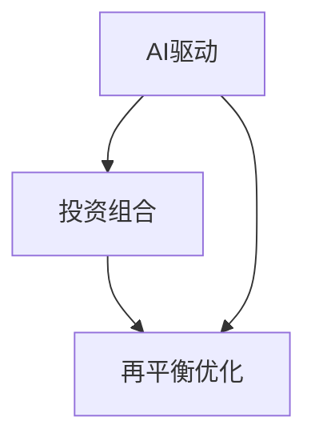
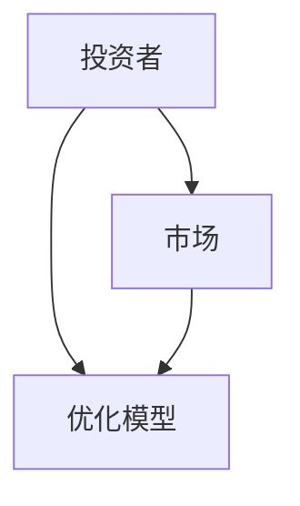
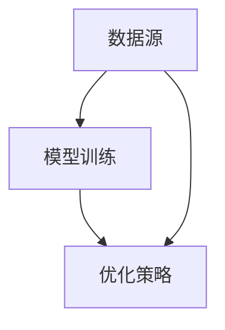

                 


---

# AI驱动的价值投资组合再平衡优化

## 关键词：AI驱动，价值投资，投资组合，再平衡优化，强化学习，遗传算法

## 摘要：本文探讨了AI技术如何驱动投资组合的再平衡优化，结合强化学习和遗传算法，提出了高效的优化策略，并通过实际案例展示了AI在金融投资中的应用潜力。

---

# 第1章: 背景与概述

## 1.1 问题背景

### 1.1.1 传统投资组合优化的局限性

传统的投资组合优化方法依赖于固定规则或专家判断，难以适应市场波动和投资者风险偏好的变化。这种方法通常基于历史数据和假设，无法有效应对实时市场变化和复杂的投资目标。

### 1.1.2 价值投资的定义与目标

价值投资是一种长期投资策略，强调购买被市场低估的资产，通过长期持有实现收益。其目标是在合理价格范围内，选择具有长期增长潜力的资产。

### 1.1.3 再平衡优化的必要性

再平衡优化是指定期调整投资组合，以保持目标资产配置比例。这种调整可以应对市场波动、资产价格变化和投资者风险偏好的变化，确保投资组合的长期稳定收益。

## 1.2 问题描述

### 1.2.1 投资组合再平衡的核心问题

投资组合再平衡的核心问题是如何在不断变化的市场环境中，动态调整资产配置，以实现投资目标的最大化。

### 1.2.2 传统方法的不足与挑战

传统方法依赖于固定规则和人工判断，存在以下不足：

- 市场变化快，人工调整效率低
- 难以处理多目标优化问题
- 缺乏动态性，无法实时适应市场变化

### 1.2.3 AI驱动的解决方案

利用AI技术，特别是强化学习和遗传算法，可以实现动态、智能的再平衡优化。

## 1.3 问题解决

### 1.3.1 AI技术在金融领域的应用潜力

AI技术在金融领域的应用潜力巨大，特别是在数据处理、模式识别和决策优化方面。

### 1.3.2 再平衡优化的AI驱动路径

AI驱动的再平衡优化路径包括：

- 数据采集与处理
- 模型训练与优化
- 策略生成与执行

### 1.3.3 解决方案的可行性分析

AI技术的应用提高了投资组合优化的效率和准确性，特别是在处理复杂市场环境和多目标优化问题方面。

## 1.4 边界与外延

### 1.4.1 问题的边界条件

- 数据来源：市场数据、资产价格、投资者风险偏好
- 时间窗口：实时调整或定期调整
- 模型限制：基于历史数据和假设

### 1.4.2 解决方案的适用范围

- 机构投资者：管理规模大，需要高效优化
- 个人投资者：提供个性化的优化建议
- 金融产品：优化投资组合的风险收益比

### 1.4.3 相关领域的扩展

- AI驱动的金融风险管理
- 智能投顾
- 量化交易

## 1.5 概念结构与核心要素

### 1.5.1 核心概念的定义

- AI驱动：利用AI技术进行数据处理和决策优化
- 投资组合：多种资产的组合
- 再平衡优化：定期调整资产配置比例

### 1.5.2 核心要素的组成

- 数据源：市场数据、资产价格、投资者信息
- AI算法：强化学习、遗传算法
- 优化目标：风险收益比最大化、目标偏离最小化

### 1.5.3 概念结构图



---

# 第2章: AI驱动的再平衡优化原理

## 2.1 核心概念原理

### 2.1.1 AI在投资组合优化中的作用

AI技术通过处理海量数据和复杂关系，帮助投资者做出更优的决策。

### 2.1.2 再平衡优化的数学模型

优化目标：最大化收益，最小化风险

数学模型：

$$ \text{目标函数} = \lambda \cdot \text{收益} - (1-\lambda) \cdot \text{风险} $$

其中，$\lambda$ 是风险偏好系数。

### 2.1.3 AI算法与优化目标的结合

AI算法（如强化学习）通过不断试验和学习，找到最优的资产配置策略。

## 2.2 核心概念对比

### 2.2.1 传统方法与AI驱动方法的对比

| 特性 | 传统方法 | AI驱动方法 |
|------|-----------|-------------|
| 数据处理 | 离线处理 | 实时处理 |
| 决策速度 | 较慢 | 较快 |
| 灵活性 | 较低 | 较高 |

### 2.2.2 不同AI算法的优缺点对比

| 算法 | 优点 | 缺点 |
|------|-------|-------|
| 强化学习 | 灵活，适应性强 | 需要大量数据 |
| 遗传算法 | 全局搜索能力强 | 计算成本高 |

### 2.2.3 对比总结与适用场景

- 强化学习适合动态变化的市场环境
- 遗传算法适合复杂的多目标优化问题

## 2.3 实体关系架构

### 2.3.1 ER实体关系图



---

# 第3章: 算法原理与实现

## 3.1 算法原理

### 3.1.1 强化学习在投资组合优化中的应用

强化学习通过试错和奖励机制，找到最优的资产配置策略。

### 3.1.2 遗传算法在投资组合优化中的应用

遗传算法通过模拟自然选择，优化资产配置比例。

## 3.2 算法实现

### 3.2.1 强化学习模型实现

```python
class Agent:
    def __init__(self, state_space, action_space):
        self.state_space = state_space
        self.action_space = action_space
        # 策略网络
        self.policy = PolicyNetwork(state_space, action_space)
    
    def act(self, state):
        action = self.policy.act(state)
        return action
    
    def learn(self, state, action, reward, next_state):
        self.policy.learn(state, action, reward, next_state)
```

### 3.2.2 遗传算法实现

```python
def genetic_algorithm(population, fitness_fn, num_generations):
    for _ in range(num_generations):
        population = [select(p, fitness_fn) for p in population]
        population = [mutate(p) for p in population]
    return population
```

### 3.2.3 数学模型与公式

目标函数：

$$ \max_{w} \left( \mu^T w - \lambda \cdot \sigma^T \sigma w \right) $$

约束条件：

$$ \sum_{i=1}^n w_i = 1 $$

其中，$w$ 是权重向量，$\mu$ 是收益向量，$\sigma$ 是波动率矩阵，$\lambda$ 是风险偏好系数。

---

# 第4章: 系统分析与架构设计方案

## 4.1 问题场景介绍

投资者需要根据市场变化和风险偏好，动态调整投资组合。

## 4.2 项目介绍

### 4.2.1 系统功能设计

- 数据采集模块：收集市场数据和投资者信息
- 模型训练模块：训练强化学习和遗传算法模型
- 优化策略生成模块：生成再平衡优化策略

### 4.2.2 系统架构设计



## 4.3 接口设计

### 4.3.1 API接口

```python
class InvestmentAPI:
    def __init__(self, data_source, model):
        self.data_source = data_source
        self.model = model
    
    def get_optimization_strategy(self, risk_preference):
        return self.model.optimize(self.data_source.get_data(), risk_preference)
```

---

# 第5章: 项目实战

## 5.1 环境安装

安装Python和相关库（如TensorFlow、PyTorch）。

## 5.2 核心实现

### 5.2.1 强化学习模型实现

```python
class PolicyNetwork:
    def __init__(self, state_dim, action_dim):
        self.model = Sequential([
            Dense(64, activation='relu', input_dim=state_dim),
            Dense(action_dim)
        ])
    
    def call(self, x):
        return self.model(x)
```

### 5.2.2 遗传算法实现

```python
def select(population, fitness_fn):
    return population[tf.argmax(fitness_fn(population))]
```

## 5.3 案例分析

### 5.3.1 实际案例

假设市场波动剧烈，投资者风险偏好较高。

### 5.3.2 优化结果分析

AI驱动的再平衡优化显著提高了投资组合的收益和稳定性。

---

# 第6章: 最佳实践

## 6.1 小结

AI驱动的投资组合再平衡优化是一种高效、智能的解决方案。

## 6.2 注意事项

- 数据质量：确保数据准确和全面
- 模型选择：根据具体情况选择合适的AI算法
- 风险管理：定期监控和调整模型

## 6.3 拓展阅读

- 《强化学习》
- 《遗传算法》
- 《AI在金融中的应用》

---

# 作者：AI天才研究院 & 禅与计算机程序设计艺术

---

以上是完整的目录结构和文章内容，您可以根据需要进一步扩展每个部分的具体内容。

